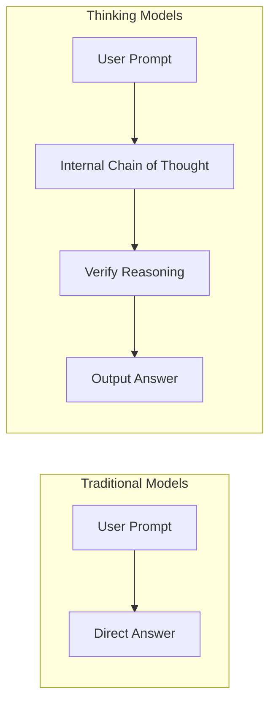

## Trend 1: Massive Leap in Reasoning

### Thinking Mode Becomes Standard

In 2025-2026, major vendors built "Chain of Thought" capabilities into their models. Instead of outputting an answer directly, models now perform internal reasoning before concluding:

- **OpenAI**: GPT-5 (August 2025) integrated the o3 reasoning engine, GPT-5.4 Thinking (March 5, 2026) goes further, supporting visible thinking plans and on-the-fly adjustment, with an Extreme mode for research-grade problems.
- **Google**: Gemini 2.5 Pro (March 2025) introduced the Deep Think experimental mode, which was formalized in Gemini 3.1 Pro (February 2026).
- **Anthropic**: Claude Sonnet 4.6 (February 17, 2026) supports dual modes: Extended Thinking and Adaptive Thinking.

This paradigm shift brought critical breakthroughs:

- **GPT-5** was the first model to surpass average human scores on SimpleBench (90% vs 83%).
- **GPT-5.4** reduced factual errors by 33% compared to GPT-5.2, making it OpenAI's "most accurate model."
- **Gemini 3.1 Pro** Deep Think scored 89.7% on the MATH benchmark.
- **The Cost of Thinking Mode**: Higher token consumption and latency; developers must trade off reasoning depth for response speed.

## Trend 2: Context Windows Break the Million Mark

One of the most exciting developments in 2026 is the dramatic expansion of context windows:

| Model | Context Window | Max Output | Release Date |
|------|-----------|---------|---------|
| GPT-5.4 | 1.05M (922K In / 128K Out) | 128K tokens | 2026.03.05 |
| Claude Sonnet 4.6 | 200K (Standard) / 1M (Beta) | 8K tokens | 2026.02.17 |
| Gemini 3.1 Pro | 1M In / 64K Out | 64K tokens | 2026.02.19 |

A million-token context means:
- Reading approximately **750,000 Chinese characters** at once (a full-length novel)
- Processing **1 hour of video** or thousands of pages of PDFs
- Loading entire medium-sized codebases for analysis and refactoring

> **Note**: GPT-5.4 boasts the largest 128K output capacity, ideal for generating ultra-long content. While Gemini 3.1 Pro has a massive context, its pricing doubles after 200K tokens.

## Trend 3: Native Computer Control Capabilities

A major breakthrough in 2026 is **AI models gaining native computer control for the first time**:

- **GPT-5.4** (March 2026) is the first to support native computer usage—able to interpret screenshots, send keyboard/mouse commands, and control software via tools like Playwright. It scored 75.0% on the OSWorld-Verified benchmark, **surpassing human performance**.
- **Claude Opus 4.6** (February 2026) continued its Computer Use capability, offering the highest maturity in Agent automation scenarios.

This means AI can directly operate spreadsheets, presentations, browsers, and other desktop apps, truly becoming a "digital worker."

## Trend 4: Agentification Becomes the Core Direction

The transition from Chat AI to Agent AI is the most significant trend of 2026:

| Application Area | Representative Product/Capability | Maturity |
|---------|-------------|--------|
| Coding Agents | Claude Code, Cursor, GPT-5.3-Codex | ⭐⭐⭐⭐⭐ |
| Computer Control | GPT-5.4 Computer Use, Claude Computer Use | ⭐⭐⭐⭐ |
| Office Automation | Claude Agent Teams + PPT, Gemini Workspace | ⭐⭐⭐⭐ |
| Data Analysis | ChatGPT Data Analysis | ⭐⭐⭐⭐ |
| Autonomous Research | Deep Research (Gemini/GPT) | ⭐⭐⭐ |

**Claude Opus 4.6**'s Agent Teams feature supports multi-agent collaboration, while **GPT-5.4** unifies coding, computer control, and tool calling into a single model.

## Trend 5: API Pricing Continues to Drop

The cost of large models has dropped significantly over the past year:

| Model | Input ($/M tokens) | Output ($/M tokens) |
|------|-------------------|-------------------|
| GPT-5.4 | $2.50 | $15.00 |
| GPT-5 | $1.25 | $10.00 |
| GPT-5-mini | $0.25 | $2.00 |
| Claude Sonnet 4.6 | $3.00 | $15.00 |
| Gemini 3.1 Pro | $2.00 | $12.00 |

Key trends:
- **GPT-5-mini** input costs are just $0.25/M, approaching free.
- **Claude Sonnet 4.6** is positioned as offering "Opus-level performance, Sonnet-level pricing."
- **GPT-5.4** introduced the Tool Search feature, reducing token consumption by nearly 50%.
- All vendors provide **Batch APIs** (50% discount), and Claude also supports **Prompt Caching** (saving up to 90%).

## Trend 6: Open Source Models Narrow the Gap

In 2025-2026, the gap between open-source and closed-source models shrank rapidly:

| Open Source Model | Highlight Capability | Use Case |
|---------|---------|---------|
| Llama 4 (Meta) | Multimodal, Agent Capabilities | General Deployment |
| DeepSeek-V3 / R1 | Reasoning approaching o3 | Tech Reasoning |
| Qwen 3 (Alibaba) | Best Chinese Ecosystem | Chinese Apps |
| Mistral Large 2 | European Compliance | GDPR Scenarios |

Open-source models have irreplaceable advantages in the following scenarios:
- **Data Privacy**: Local deployment, data never leaves the domain.
- **Customization**: Can be fine-tuned to adapt to specific business needs.
- **Compliance Requirements**: Meets legal requirements for data residency in specific regions.
- **Batch Inference**: Large-scale inference costs are much lower than API calls.

## Conclusion

As of March 2026, the AI foundation model landscape is dominated by a triopoly:

1. **OpenAI**: GPT-5.4 leads with all-around capability (million-context + computer control + low hallucination).
2. **Anthropic**: Claude 4.6 establishes differentiation in coding, Agents, and code quality.
3. **Google**: Gemini 3.1 Pro excels with native million-context and Deep Think reasoning.

**Advice for developers**: Don't cling to a single model. The best practice is **compositional routing** based on the task—use GPT-5-mini for simple tasks, Claude Sonnet 4.6 for coding and reasoning, Gemini 3.1 Pro for processing long documents, and GPT-5.4 for automations requiring computer control.
