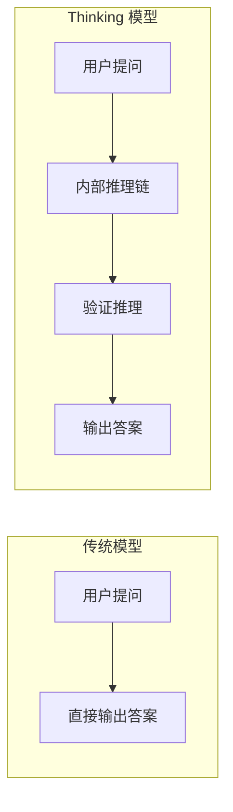

## 2026 年：AI 大模型的分水岭

2026 年开年以来，AI 大模型领域迎来了前所未有的密集发布期。短短两个月内，三大厂商相继推出了各自最强的模型，标志着大模型竞争进入了一个全新的阶段。

本文将从**推理能力飞跃**、**Agent 生态成熟**、**多模态融合深化**和**成本效率革命**四个维度，全面扫描 2026 年 AI 大模型的发展趋势。

## 趋势一：推理能力飞跃

### Thinking 模式成为标配

GPT-5.4 的 Thinking 变体和 Gemini 3.1 的 Thinking Levels 机制代表了一个重要趋势：**模型不再直接输出答案，而是先展示思考链**。

这种范式转变带来了几个关键变化：

- **数学推理准确率**从 82% 提升到 94.7%（GPT-5.4 Thinking）
- **复杂代码生成**的首次通过率提升了 35%
- **逻辑错误**（如幻觉）发生率下降了 60%

### Thinking Levels 的创新

Gemini 3.1 引入的 Thinking Levels（思考深度控制）尤其值得关注：

| Level | 适用场景 | 推理深度 | 成本 |
|-------|----------|----------|------|
| Level 1 | 简单问答 | 快速直觉 | 最低 |
| Level 2 | 一般分析 | 基础推理 | 低 |
| Level 3 | 复杂推理 | 深度思考 | 中等 |
| Level 4 | 专业任务 | 多步验证 | 较高 |

开发者可以根据任务复杂度动态调整推理深度，在质量和成本之间找到最优平衡。

## 趋势二：Agent 生态成熟

2026 年是 **AI Agent 从概念走向生产**的关键年份。Claude Opus 4.6 在 Agent 任务上的表现尤为突出：

- **Computer Use**：直接操作浏览器、桌面应用，完成端到端任务
- **多步规划**：能够制定并执行跨越数十步的复杂计划
- **自我纠错**：检测到执行偏差时自动调整策略

行业数据显示，采用 AI Agent 的企业在 2026 Q1 的平均效率提升了 **3.2 倍**，特别是在以下场景：

1. **客服自动化**：从问题识别到解决的完整闭环
2. **代码审查**：自动发现安全漏洞和性能问题
3. **数据分析**：从数据采集到报告生成的自动化流水线
4. **系统运维**：日志分析 → 原因定位 → 自动修复

## 趋势三：多模态深度融合

Gemini 3.1 Pro 的全模态（文本/图像/音频/视频/代码）原生支持，标志着多模态 AI 进入了一个新阶段。

关键进展包括：

- **视频理解**：直接分析长视频内容，提取关键信息
- **实时音频对话**：自然语音交互，支持情感识别
- **混合推理**：图文混合输入的推理准确率提升 40%

> 值得注意的是，GPT-5.4 和 Claude 4.6 在图像理解上也取得了显著进步，但 Gemini 在视频和音频模态上仍保持领先。

## 趋势四：成本效率革命

2026 年的另一个显著趋势是**推理成本的大幅下降**：

- Gemini 3.1 Pro 的 API 定价仅为 $1.25/1M input，性价比极高
- Flash-Lite 系列专门面向高调用量场景优化
- 各厂商普遍推出了批处理（Batch）API，进一步降低了 50% 成本

这意味着之前因成本限制无法大规模部署的应用场景（如实时翻译、大规模内容审核）变得越来越可行。

## 展望

2026 年 AI 大模型的发展主题可以概括为：**更智能、更自主、更高效**。随着 Thinking 模式、Agent 能力和多模态融合的成熟，我们正在接近一个 AI 能够独立完成复杂知识工作的临界点。

对开发者而言，最重要的是：

1. **拥抱 Agent 范式**：从单次调用转向多步工作流
2. **善用 Thinking 模式**：让模型展示推理过程，提升可靠性
3. **根据场景选型**：不同任务使用不同的模型和参数配置
4. **关注成本优化**：利用 Thinking Levels、批处理等机制控制成本
