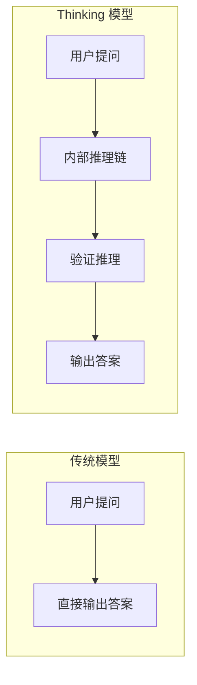

## 趋势一：推理能力大跃进

### Thinking 模式成为标配

2025-2026 年，各大厂商纷纷在模型中内置「思考链」能力，模型不再直接输出答案，而是先进行内部推理再给出结论：

- **OpenAI**：GPT-5（2025 年 8 月）内置 o3 推理引擎，GPT-5.4 Thinking（2026 年 3 月 5 日）更进一步，支持查看思考计划并可中途调整，还有 Extreme 模式用于科研级难题
- **Google**：Gemini 2.5 Pro（2025 年 3 月）引入 Deep Think 实验模式，Gemini 3.1 Pro（2026 年 2 月）正式化
- **Anthropic**：Claude Sonnet 4.6（2026 年 2 月 17 日）支持 Extended Thinking 和 Adaptive Thinking 双模式

这种范式转变带来了关键突破：

- **GPT-5** 是首个在 SimpleBench 上超越人类平均分的模型（90% vs 83%）
- **GPT-5.4** 事实错误比 GPT-5.2 减少 33%，是 OpenAI「最准确的模型」
- **Gemini 3.1 Pro** Deep Think 在 MATH 数学基准上达到 89.7%
- **Thinking 模式的代价**：更高的 token 消耗和延迟，开发者需在推理深度与响应速度间权衡

## 趋势二：上下文窗口突破百万级

2026 年最令人兴奋的进展之一是上下文窗口的急剧扩大：

| 模型 | 上下文窗口 | 最大输出 | 发布时间 |
|------|-----------|---------|---------|
| GPT-5.4 | 1.05M（922K 入 / 128K 出） | 128K tokens | 2026.03.05 |
| Claude Sonnet 4.6 | 200K（标准）/ 1M（Beta） | 8K tokens | 2026.02.17 |
| Gemini 3.1 Pro | 1M 入 / 64K 出 | 64K tokens | 2026.02.19 |

百万级上下文意味着：
- 可一次读入约 **75 万字**中文文本（一整本长篇小说）
- 可处理 **1 小时视频**或数千页 PDF
- 可加载整个中型代码库进行分析和重构

> **注意**：GPT-5.4 拥有最大的 128K 输出能力，适合生成超长内容。Gemini 3.1 Pro 虽然上下文大，但超过 200K tokens 后价格翻倍（$4/$18 vs $2/$12）。

## 趋势三：原生计算机操控能力

2026 年的一个重大突破是 **AI 模型首次获得原生计算机操控能力**：

- **GPT-5.4**（2026 年 3 月）首次支持原生计算机使用——可解读屏幕截图、发送键鼠命令、通过 Playwright 等工具控制软件。在 OSWorld-Verified 基准上得分 75.0%，**超越人类表现**
- **Claude Opus 4.6**（2026 年 2 月）延续 Computer Use 能力，在 Agent 自动化场景中成熟度最高

这意味着 AI 可以直接操作电子表格、演示文稿、浏览器等桌面应用，真正成为「数字员工」。

## 趋势四：Agent 化成为核心方向

从对话 AI 到 Agent AI 的转变是 2026 年最重要的趋势：

| 应用方向 | 代表产品/能力 | 成熟度 |
|---------|-------------|--------|
| 编码 Agent | Claude Code, Cursor, GPT-5.3-Codex | ⭐⭐⭐⭐⭐ |
| 计算机操控 | GPT-5.4 Computer Use, Claude Computer Use | ⭐⭐⭐⭐ |
| 办公自动化 | Claude Agent Teams + PPT, Gemini Workspace | ⭐⭐⭐⭐ |
| 数据分析 | ChatGPT Data Analysis | ⭐⭐⭐⭐ |
| 自主研究 | Deep Research (Gemini/GPT) | ⭐⭐⭐ |

**Claude Opus 4.6** 的 Agent Teams 功能支持多 Agent 协作，**GPT-5.4** 将编码、计算机操控、工具调用统一到一个模型中。

## 趋势五：API 定价持续走低

大模型的定价在过去一年大幅下降：

| 模型 | 输入 ($/M tokens) | 输出 ($/M tokens) |
|------|-------------------|-------------------|
| GPT-5.4 | $2.50 | $15.00 |
| GPT-5 | $1.25 | $10.00 |
| GPT-5-mini | $0.25 | $2.00 |
| Claude Sonnet 4.6 | $3.00 | $15.00 |
| Gemini 3.1 Pro | $2.00 | $12.00 |

关键趋势：
- **GPT-5-mini** 的输入成本仅 $0.25/M，已接近免费
- **Claude Sonnet 4.6** 被定位为「Opus 级性能、Sonnet 级价格」
- **GPT-5.4** 引入 Tool Search 功能，可减少近 50% 的 token 消耗
- 所有厂商均提供 **Batch API**（50% 折扣），Claude 还支持 **Prompt Caching**（最高省 90%）

## 趋势六：开源模型缩小差距

2025-2026 年，开源模型与闭源模型的差距在快速缩小：

| 开源模型 | 突出能力 | 适用场景 |
|---------|---------|---------|
| Llama 4 (Meta) | 多模态、Agent 能力 | 通用部署 |
| DeepSeek-V3 / R1 | 推理能力接近 o3 | 技术推理 |
| Qwen 3 (阿里) | 中文生态最完善 | 中文应用 |
| Mistral Large 2 | 欧洲合规优势 | GDPR 场景 |

开源模型在以下场景有不可替代的优势：
- **数据隐私**：本地部署，数据不出域
- **定制化**：可微调适配特定业务
- **合规要求**：满足特定地区的数据驻留法规
- **批量推理**：大规模推理成本远低于 API

## 总结

2026 年 3 月的 AI 大模型格局呈现三足鼎立：

1. **OpenAI**：GPT-5.4 以全能性（百万上下文 + 计算机操控 + 低幻觉）领跑
2. **Anthropic**：Claude 4.6 在编码、Agent 和代码质量上建立差异化
3. **Google**：Gemini 3.1 Pro 以原生百万上下文和 Deep Think 推理见长

**给开发者的建议**：不要死守一个模型。最优实践是根据任务**组合路由**——GPT-5-mini 跑简单任务、Claude Sonnet 4.6 做编码推理、Gemini 3.1 Pro 处理长文档、GPT-5.4 做需要计算机操控的自动化。
