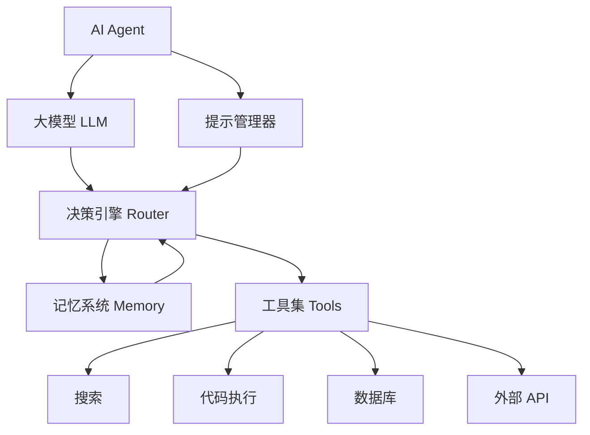

## 什么是 AI Agent？

AI Agent（智能代理）是能够**感知环境、自主决策、执行行动**的 AI 系统。与传统的单次 API 调用不同，Agent 可以：

- 🔄 **循环执行**：根据反馈不断调整行动
- 🛠️ **调用工具**：搜索网页、执行代码、操作数据库
- 📋 **规划任务**：将复杂目标分解为可执行的步骤
- 🧠 **记忆管理**：在长对话中维护上下文和状态

## 架构设计

一个完整的 AI Agent 系统通常包含以下核心组件：



## 实现步骤

### Step 1：安装依赖

```bash
pip install langchain langchain-anthropic tavily-python
```

### Step 2：定义工具

```python
from langchain.tools import tool
from datetime import datetime

@tool
def get_current_time() -> str:
    """获取当前时间"""
    return datetime.now().strftime("%Y-%m-%d %H:%M:%S")

@tool
def search_web(query: str) -> str:
    """搜索网页获取实时信息"""
    from tavily import TavilyClient
    client = TavilyClient()
    results = client.search(query, max_results=3)
    return "\n".join([r["content"] for r in results["results"]])

@tool
def execute_python(code: str) -> str:
    """执行 Python 代码并返回结果"""
    import subprocess
    result = subprocess.run(
        ["python", "-c", code],
        capture_output=True, text=True, timeout=10
    )
    return result.stdout or result.stderr
```

### Step 3：创建 Agent

```python
from langchain_anthropic import ChatAnthropic
from langchain.agents import create_tool_calling_agent, AgentExecutor
from langchain_core.prompts import ChatPromptTemplate

# 使用 Claude Sonnet 4.6 作为推理引擎
llm = ChatAnthropic(model="claude-sonnet-4-6-20260217")

# 定义系统提示
prompt = ChatPromptTemplate.from_messages([
    ("system", """你是一个智能助手，擅长使用工具解决问题。
    在回答用户问题前，先思考是否需要使用工具获取信息。
    如果需要多步操作，请逐步执行。"""),
    ("human", "{input}"),
    ("placeholder", "{agent_scratchpad}"),
])

# 组装 Agent
tools = [get_current_time, search_web, execute_python]
agent = create_tool_calling_agent(llm, tools, prompt)
executor = AgentExecutor(agent=agent, tools=tools, verbose=True)
```

### Step 4：运行 Agent

```python
# 简单查询
result = executor.invoke({
    "input": "帮我查一下今天 NVIDIA 的股价，然后计算过去一年的涨幅"
})
print(result["output"])
```

Agent 的执行流程大致如下：

1. **理解任务**：解析用户意图，判断需要搜索股价信息
2. **搜索数据**：调用 `search_web` 获取实时股价
3. **计算分析**：调用 `execute_python` 计算涨幅
4. **整理输出**：生成结构化的分析报告

## 模型选择建议

| 需求 | 推荐模型 | 原因 |
|------|----------|------|
| 复杂 Agent 任务 | Claude Opus 4.6 | 最强的 Agentic 能力和 Computer Use |
| 日常 Agent 开发 | Claude Sonnet 4.6 | 速度与智能的最佳平衡 |
| 需要深度推理的 Agent | GPT-5.4 Thinking | 推理链透明，便于调试 |
| 高调用量生产环境 | Gemini 3.1 Flash-Lite | 性价比最优 |

## 最佳实践

1. **工具描述要精确**：LLM 通过工具的 docstring 决定何时调用，描述越清晰越好
2. **限制工具数量**：单个 Agent 不超过 10 个工具，太多会降低选择准确率
3. **添加安全护栏**：对代码执行、数据库操作等敏感工具设置权限控制
4. **实现优雅降级**：工具调用失败时，Agent 应能识别并切换策略
5. **监控与日志**：记录每次工具调用的输入输出，便于调试和优化

## 进阶方向

- **Multi-Agent 协作**：多个 Agent 分工协作完成复杂任务
- **RAG 增强 Agent**：结合检索增强生成，让 Agent 访问企业知识库
- **Human-in-the-Loop**：关键决策点引入人工审核
- **持久化记忆**：跨会话的长期记忆管理
