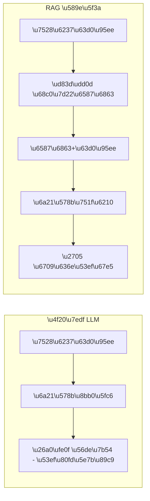
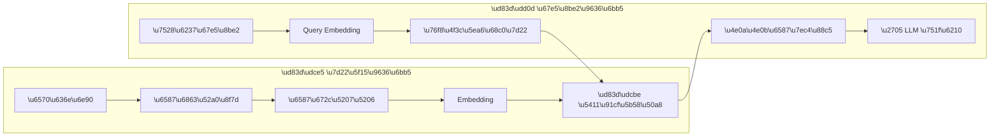

## 什么是 RAG？

RAG（Retrieval-Augmented Generation，检索增强生成）是一种通过**外部知识检索**来增强大模型输出质量的技术范式。简单来说：



在企业场景中，RAG 解决了大模型的两大核心痛点：
- **知识更新**：无需重新训练，只需更新知识库
- **幻觉控制**：回答基于真实文档，可溯源验证

## 系统架构

一个完整的 RAG 系统包含以下流水线：



### 核心组件详解

**1. 文档加载器**

支持多种格式的数据摄入：

```python
from langchain_community.document_loaders import (
    PyPDFLoader,
    UnstructuredMarkdownLoader,
    CSVLoader,
    WebBaseLoader
)

# 加载 PDF
loader = PyPDFLoader("company_report.pdf")
docs = loader.load()

# 加载网页
web_loader = WebBaseLoader("https://docs.example.com")
web_docs = web_loader.load()
```

**2. 文本切分策略**

切分策略直接影响检索质量，这是 RAG 中最容易被忽视但又最关键的环节：

| 策略 | 适用场景 | 特点 |
|------|----------|------|
| 固定长度切分 | 通用文本 | 简单快速，但可能切断语义 |
| 递归字符切分 | 结构化文档 | 按段落/句子边界切分 |
| 语义切分 | 技术文档 | 基于 Embedding 相似度分段 |
| 文档结构切分 | Markdown/HTML | 按标题层级切分 |

推荐配置：

```python
from langchain.text_splitter import RecursiveCharacterTextSplitter

splitter = RecursiveCharacterTextSplitter(
    chunk_size=512,       # 每段 512 tokens
    chunk_overlap=64,     # 重叠 64 tokens 保持上下文
    separators=["\n\n", "\n", "。", "；", " "],  # 中文友好分隔符
)
chunks = splitter.split_documents(docs)
```

> **Tips**: chunk_size 的选择需要与 Embedding 模型的最优输入长度匹配。OpenAI `text-embedding-3-large` 的最优长度约为 512 tokens。

**3. Embedding 模型选择**

2026 年主流 Embedding 模型对比：

| 模型 | 维度 | MTEB 得分 | 中文支持 | 成本 |
|------|------|-----------|----------|------|
| OpenAI text-embedding-3-large | 3072 | 64.6 | ✅ 良好 | $0.13/1M |
| Cohere embed-v4 | 1024 | 66.2 | ✅ 优秀 | $0.10/1M |
| BGE-M3 (开源) | 1024 | 63.8 | ✅ 最优 | 免费 |

对于中文场景，推荐使用 **BGE-M3** 或 **Cohere embed-v4**。

## 向量数据库选型

### Pinecone vs Weaviate 对比

| 特性 | Pinecone | Weaviate |
|------|----------|----------|
| 部署方式 | 云托管 | 自托管 / 云 |
| 扩展性 | 自动扩展 | 手动配置 |
| 混合搜索 | ✅ 关键字+向量 | ✅ BM25+向量 |
| 过滤查询 | ✅ 元数据过滤 | ✅ GraphQL |
| 免费额度 | 100K 向量 | 开源免费 |
| 最佳适用 | 快速原型 / SaaS | 企业级 / 自主可控 |

### 检索策略

```python
from langchain_community.vectorstores import Weaviate
import weaviate

# 连接向量数据库
client = weaviate.Client(url="http://localhost:8080")

# 创建检索器（混合搜索 = 向量 + BM25 关键词）
retriever = vectorstore.as_retriever(
    search_type="mmr",       # 最大边际相关性
    search_kwargs={
        "k": 5,              # 返回 5 个结果
        "fetch_k": 20,       # 候选集大小
        "lambda_mult": 0.7,  # 相关性 vs 多样性权重
    }
)
```

## 优化技巧

### 1. Query 改写

用户的原始查询往往不够精确，通过 LLM 改写可以提升检索命中率：

```python
# 多查询改写：将一个问题扩展为多个角度
query = "如何优化 RAG 系统？"
rewritten = [
    "RAG 检索质量优化方法",
    "提升向量搜索准确率的技术",
    "RAG 系统 chunking 策略最佳实践",
]
```

### 2. Re-ranking

检索出候选文档后，用 Cross-Encoder 重新排序：

```python
from langchain.retrievers import ContextualCompressionRetriever
from langchain.retrievers.document_compressors import CohereRerank

reranker = CohereRerank(model="rerank-v3.5", top_n=3)
compression_retriever = ContextualCompressionRetriever(
    base_compressor=reranker,
    base_retriever=retriever
)
```

### 3. 上下文组装

将检索到的文档片段结构化地注入提示：

```text
基于以下参考文档回答用户问题。如果文档中没有相关信息，请明确说明。

--- 参考文档 ---
[1] {chunk_1_content} (来源: report.pdf, 第3页)
[2] {chunk_2_content} (来源: docs.md, 章节2.1)
[3] {chunk_3_content} (来源: faq.html)
--- 文档结束 ---

用户问题：{user_query}
```

## 常见问题

- **检索不准**：优先检查切分策略和 Embedding 模型的匹配性
- **回答幻觉**：在提示中强调「仅基于提供的文档回答」
- **延迟过高**：考虑缓存热门查询的检索结果，使用 Flash-Lite 降低 LLM 延迟
- **成本过高**：对静态文档预计算 Embedding，仅对增量数据实时处理
