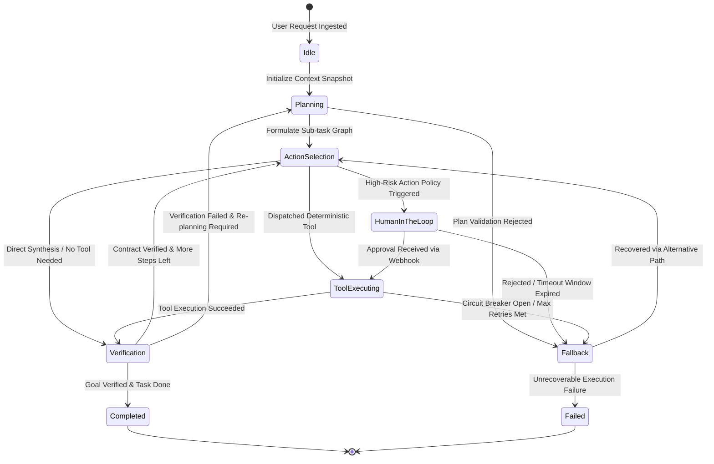

When software engineers first experiment with Large Language Model (LLM) agents, the textbook pattern feels enchantingly simple: write a system prompt defining available tools, provide the LLM with a `while (has_tool_call)` loop, execute whatever functions the model outputs, and feed the results back into the conversation history.

In small-scale demos or isolated queries, this straightforward **ReAct (Reasoning + Acting)** loop performs adequately. However, when deployed into serious enterprise production—navigating dozens of heterogeneous tools, flaky external APIs, ill-formed data payloads, and complex multi-branch business logic—an unconstrained ReAct loop almost inevitably collapses.

The fundamental architectural flaw lies in a profound category mistake: **Large Language Models are probabilistic next-token reasoners, not deterministic state controllers.** Delegating execution control flow, state transitions, and retry loops entirely to probabilistic sampling is the production equivalent of running an unmonitored infinite loop on live traffic.

As the flagship opener of **《The Production AI Agent Architect Handbook》**, this guide deconstructs why raw ReAct loops break at scale and demonstrates how to inject industrial-grade determinism, predictability, and resilience using **Finite State Machines (FSM)** and **Graph-based Control Flows**.

---

## 1. The Four Fatal Flaws of Raw ReAct Loops in Production

The classic ReAct framework interleaves model reasoning across three alternating phases: **Thought** $\rightarrow$ **Action** $\rightarrow$ **Observation**. The ubiquitous pseudo-code skeleton looks like this:

```python
messages = [SystemMessage, UserPrompt]

while not is_done:
    response = llm.chat(messages, tools=tools)
    if response.has_tool_calls():
        for call in response.tool_calls:
            result = execute_tool(call.name, call.args)
            messages.append(ToolMessage(call_id=call.id, content=result))
    else:
        is_done = True
        return response.content
```

While elegant in an academic sandbox, this naive loop triggers four catastrophic failure modes under production concurrency:

### 1. Infinite Tool Retry Storms
When a downstream service throws an error—such as an HTTP 400 Bad Request due to a schema mismatch—the LLM typically reflects: *"The arguments might be slightly malformed, let me try again."* Without deterministic circuit breakers, probabilistic sampling causes the model to regenerate essentially identical requests with superficial variations. Within 30 seconds, an agent can churn through 20 tool calls, burning through hundreds of dollars in API tokens before being forcibly terminated by an HTTP gateway timeout.

### 2. Context Snowball & Attention Dilution
Every invocation argument and raw tool response (often sprawling JSON or scraped HTML blobs) is appended indiscriminately to the `messages` array. As multi-step tasks reach 15 or 20 iterations, prompt volume easily surges beyond 100,000 tokens.
As documented in our guide to [Context Engineering in Practice](/en/articles/context-engineering-guide/), this causes extreme latency spikes and triggers the **"Lost in the Middle"** phenomenon. The LLM loses its attentional grip on the user's primary objectives, hallucinating random tool calls completely decoupled from the original goal.

### 3. Cascading Hallucinations & Dirty State Contamination
Without typed contract boundaries between steps, soft tool errors (e.g., an SQL query returning an empty set `[]` or unstructured error strings) are ingested directly into the reasoning loop. The model hallucinates plausible-looking placeholder records and feeds that corrupted state into downstream mutating operations—such as executing financial transactions or modifying customer accounts.

### 4. Lack of Deterministic Rollback & Escape Hatches
Traditional backend services rely on atomic transaction rollbacks and well-defined fallback handlers when unexpected states occur. In an unconstrained ReAct loop, because no formal transition graph exists, the agent cannot rewind to the last known safe checkpoint, nor can it cleanly hand off control to a human expert. It remains trapped in an erroneous trajectory until budget exhaustion.

---

## 2. From Freeform Loops to Graph Control: FSM Architecture

The remedy to these failure modes is strict **Separation of Concerns**:

> **The Large Language Model is the "Actor" (handling localized reasoning and unstructured extraction within a node), while the Finite State Machine is the "Director" (governing topological transitions, guards, and safety contracts).**

An LLM must never act as both actor and director. The macroscopic routing graph must be defined statically in deterministic code, restricting model agency to strictly bounded state envelopes.

### 1. Production State Decomposition

A robust enterprise agent decomposes execution into discrete, verifiable lifecycle states:



### 2. Key Elements of an Agentic State Machine

1. **Structured State Snapshot**:
   Instead of appending raw message blobs, production systems manage a strongly-typed `AgentState` object that cleanly isolates:
   - **Immutable Goal**: The original customer directive, locked against contextual drift.
   - **Plan Graph**: Verified step indexes, completed tasks, and pending milestones.
   - **Working Scratchpad**: Ephemeral variables and tool payloads needed only for the immediate step, purged after verification to safeguard the LLM's context window.
   - **Circuit Breaker Registry**: Real-time tracking of tool invocation frequencies, latencies, and failure counts.

2. **Transition Matrix & Guard Functions**:
   Every state boundary transition must be guarded by deterministic assertions:
   - For example: `ToolExecuting` is strictly barred from leaping back to `ActionSelection`. It must flow through `Verification`.
   - A transition fires only if `pydantic_schema_check(output) == True` and `circuit_breaker.is_open() == False`.

3. **Checkpoints & Time-Travel Debugging**:
   Every state transition is an immutable event. State snapshots are serialized and persisted into persistent backends (PostgreSQL, SQLite, or Redis). This unlocks two critical capabilities:
   - **True Human-in-the-Loop**: When high-stakes operations require human approval, worker threads can safely release resources. Once an approver signs off via a webhook, the execution engine rehydrates state instantly via `thread_id` and `checkpoint_id`.
   - **Deterministic Trajectory Replay**: If an agent fails on step 8, engineers can rewind state to step 7, adjust guiding prompts or mock data, and fork execution to reproduce edge cases cleanly. For observability best practices, see [Agent Observability & Debugging](/en/articles/agent-observability-debugging/).

---

## 3. Tool-Calling Defense & Circuit Breakers

In a deterministic architecture, tool invocation is treated not as a trivial `try...except` wrapper, but as a layered defensive perimeter:

```
                   ┌───────────────────────────────────────────────┐
                   │               LLM Tool Call                   │
                   └───────────────────────┬───────────────────────┘
                                           ▼
                   ┌───────────────────────────────────────────────┐
                   │  Layer 1: Deterministic Schema Validation    │
                   │  (Strict Pydantic V2 / JSON Schema Check)    │
                   └───────┬───────────────────────────────┬───────┘
                           │ Valid                         │ Invalid
                           ▼                               ▼
      ┌────────────────────────────────────┐     ┌─────────────────┐
      │  Layer 2: Circuit Breaker Check    │     │ Inject Schema   │
      │  (Inspect if target tool is OPEN)  │     │ Error Prompt    │
      └───────┬────────────────────┬───────┘     └────────┬────────┘
              │ Closed (Normal)    │ Open (Tripped)       │ (Self-Correct)
              ▼                    ▼                      ▼
      ┌───────────────┐    ┌─────────────────┐   ┌─────────────────┐
      │ Execute Tool  │    │ Route to        │   │ Retry in Current│
      │ Real API Call │    │ Fallback Tool   │   │ Node (Max 2)    │
      └───────┬───────┘    └─────────────────┘   └─────────────────┘
              │ Exception
              ▼
      ┌────────────────────────────────────┐
      │ Increment Failure Counter          │
      │ If failures >= 3 -> Open Circuit   │
      └────────────────────────────────────┘
```

### 1. Strict Schema Enforcement and Bounded Self-Correction
Models frequently commit trivial formatting errors: passing timestamps as raw strings, omitting required keys, or providing floating-point values formatted with dollar signs.
Forwarding invalid parameters to downstream production databases wastes backend compute and yields obscure error messages that further mislead the model.

**Architectural Best Practice**:
Deploy a strict Pydantic V2 schema validation layer ahead of API execution. When validation fails, **intercept the error locally within the runtime**. Feed a precise correction prompt (e.g., `"Field 'limit' must be an integer between 1 and 50, but received 'unlimited'. Please fix this parameter."`) directly to the decision node, capping local corrections at two retries before escalating.

### 2. Stateful Circuit Breakers
When an external tool suffers downstream degradation or network outages:
- **Closed**: Normal operations. Tool calls are dispatched without restriction.
- **Open**: The tool has failed repeatedly (e.g., 3 consecutive failures). The runtime intercepts further attempts immediately, bypassing the faulty service and directing the FSM to an alternative degraded workflow (e.g., switching from real-time database queries to read-only replica caches).
- **Half-Open**: Following a cooling window, a single probe invocation is permitted. A successful call resets the breaker to Closed; continued failure resets the backoff timer.

---

## 4. Production Implementation: A Resilient Python State Machine Engine

The following standalone Python 3.11+ implementation provides a production-grade agent state machine engine with Pydantic V2 schema validation, stateful circuit breakers, and deterministic fallback handling without heavy framework abstractions:

```python
"""
deterministic_agent_fsm.py
Production-grade deterministic agent FSM engine featuring circuit breakers,
strict Pydantic schema validation, and isolated working scratchpads.
"""

import logging
from enum import Enum
from typing import Any, Callable, Dict, List, Optional
from pydantic import BaseModel, Field, ValidationError

logging.basicConfig(level=logging.INFO, format="%(asctime)s [%(levelname)s] %(message)s")
logger = logging.getLogger("AgentFSM")


# ==========================================================
# 1. State and Data Model Definitions
# ==========================================================

class NodeState(str, Enum):
    IDLE = "IDLE"
    PLANNING = "PLANNING"
    ACTION_SELECT = "ACTION_SELECT"
    TOOL_EXECUTION = "TOOL_EXECUTION"
    VERIFICATION = "VERIFICATION"
    FALLBACK = "FALLBACK"
    TERMINAL_SUCCESS = "TERMINAL_SUCCESS"
    TERMINAL_FAILED = "TERMINAL_FAILED"


class SearchDatabaseArgs(BaseModel):
    query: str = Field(..., min_length=2, description="Target search query")
    limit: int = Field(default=5, ge=1, le=50, description="Max returned results (1-50)")


class ToolResult(BaseModel):
    success: bool
    data: Optional[Any] = None
    error_message: Optional[str] = None


class AgentMemory(BaseModel):
    user_goal: str
    current_step: int = 0
    max_steps: int = 10
    scratchpad: List[Dict[str, Any]] = Field(default_factory=list)
    final_output: Optional[str] = None
    circuit_failures: Dict[str, int] = Field(default_factory=dict)
    circuit_max_failures: int = 3


# ==========================================================
# 2. External Service Simulator with Injected Failures
# ==========================================================

class ExternalServiceSimulator:
    """Simulates an external database service to verify circuit breaker behaviors."""
    def __init__(self, failure_trigger_count: int = 3):
        self.call_count = 0
        self.failure_trigger_count = failure_trigger_count

    def search_database(self, query: str, limit: int) -> Dict[str, Any]:
        self.call_count += 1
        # Injects deliberate connection timeouts to trigger circuit tripping
        if self.call_count <= self.failure_trigger_count:
            raise ConnectionError(f"Database cluster timeout (Attempt {self.call_count})")
        return {"status": "ok", "items": [f"Result #{i} for '{query}'" for i in range(1, limit + 1)]}


# ==========================================================
# 3. Deterministic Finite State Machine Engine
# ==========================================================

class DeterministicAgentFSM:
    def __init__(self, user_goal: str, db_service: ExternalServiceSimulator):
        self.memory = AgentMemory(user_goal=user_goal)
        self.db_service = db_service
        self.current_state = NodeState.IDLE
        self.history: List[str] = []

    def transition_to(self, next_state: NodeState, reason: str = ""):
        msg = f"Transition: [{self.current_state.value}] -> [{next_state.value}]"
        if reason:
            msg += f" (Reason: {reason})"
        logger.info(msg)
        self.history.append(f"{self.current_state.value} -> {next_state.value}")
        self.current_state = next_state

    def is_circuit_open(self, tool_name: str) -> bool:
        failures = self.memory.circuit_failures.get(tool_name, 0)
        return failures >= self.memory.circuit_max_failures

    def record_tool_failure(self, tool_name: str):
        self.memory.circuit_failures[tool_name] = self.memory.circuit_failures.get(tool_name, 0) + 1
        logger.warning(f"Tool [{tool_name}] failure count: {self.memory.circuit_failures[tool_name]}/{self.memory.circuit_max_failures}")

    def reset_tool_failure(self, tool_name: str):
        if tool_name in self.memory.circuit_failures:
            self.memory.circuit_failures[tool_name] = 0

    # ---------------- Node Execution Handlers ----------------

    def step_idle(self):
        logger.info(f"Received goal: '{self.memory.user_goal}'")
        self.transition_to(NodeState.PLANNING, "Goal initialized")

    def step_planning(self):
        self.memory.current_step += 1
        logger.info("Decomposing goal into structured verifiable steps...")
        self.transition_to(NodeState.ACTION_SELECT, "Plan ready")

    def step_action_select(self):
        self.memory.current_step += 1
        if self.memory.current_step > self.memory.max_steps:
            self.transition_to(NodeState.FALLBACK, "Step budget exceeded")
            return

        # Verify circuit breaker condition
        if self.is_circuit_open("search_database"):
            logger.error("Circuit breaker is OPEN for 'search_database'. Execution intercepted.")
            self.transition_to(NodeState.FALLBACK, "Circuit breaker tripped")
            return

        # Emulate LLM tool dispatch with arguments
        mock_model_raw_args = {"query": "production_incident_report", "limit": 3}
        
        # Layer 1: Strict Pydantic schema validation
        try:
            validated_args = SearchDatabaseArgs(**mock_model_raw_args)
            self.memory.scratchpad.append({
                "action": "search_database",
                "args": validated_args.model_dump()
            })
            self.transition_to(NodeState.TOOL_EXECUTION, "Schema validation passed")
        except ValidationError as e:
            logger.error(f"Schema validation failed: {e.errors()}")
            self.transition_to(NodeState.PLANNING, "Schema repair requested")

    def step_tool_execution(self):
        last_action = self.memory.scratchpad[-1]
        tool_name = last_action["action"]
        args = last_action["args"]

        logger.info(f"Executing tool '{tool_name}' with args: {args}")
        try:
            raw_response = self.db_service.search_database(args["query"], args["limit"])
            self.reset_tool_failure(tool_name)
            last_action["result"] = ToolResult(success=True, data=raw_response)
            self.transition_to(NodeState.VERIFICATION, "Tool executed successfully")
        except Exception as err:
            logger.error(f"Execution error: {err}")
            self.record_tool_failure(tool_name)
            last_action["result"] = ToolResult(success=False, error_message=str(err))
            
            if self.is_circuit_open(tool_name):
                self.transition_to(NodeState.FALLBACK, f"Tool [{tool_name}] reached max failure threshold")
            else:
                self.transition_to(NodeState.ACTION_SELECT, "Retry with remaining budget")

    def step_verification(self):
        last_action = self.memory.scratchpad[-1]
        result: ToolResult = last_action.get("result")

        if result and result.success:
            logger.info("Verification passed: Structured data confirmed.")
            self.memory.final_output = f"Successfully fetched {len(result.data['items'])} items."
            self.transition_to(NodeState.TERMINAL_SUCCESS, "Goal completed")
        else:
            logger.warning("Verification failed: Data incomplete.")
            self.transition_to(NodeState.PLANNING, "Re-planning required")

    def step_fallback(self):
        logger.info("Entering FALLBACK node. Triggering graceful degradation...")
        self.memory.final_output = "Gracefully degraded: Returning cached incident summaries."
        self.transition_to(NodeState.TERMINAL_SUCCESS, "Recovered via Fallback degradation")

    # ---------------- FSM Execution Loop ----------------

    def run(self) -> str:
        handlers: Dict[NodeState, Callable[[], None]] = {
            NodeState.IDLE: self.step_idle,
            NodeState.PLANNING: self.step_planning,
            NodeState.ACTION_SELECT: self.step_action_select,
            NodeState.TOOL_EXECUTION: self.step_tool_execution,
            NodeState.VERIFICATION: self.step_verification,
            NodeState.FALLBACK: self.step_fallback,
        }

        while self.current_state not in (NodeState.TERMINAL_SUCCESS, NodeState.TERMINAL_FAILED):
            handler = handlers.get(self.current_state)
            if not handler:
                raise RuntimeError(f"Unhandled FSM state: {self.current_state}")
            handler()

        logger.info(f"FSM Terminated at [{self.current_state.value}]. Output: {self.memory.final_output}")
        return self.memory.final_output


if __name__ == "__main__":
    print("\n--- [Test Scenario: Flaky Service Tripping Circuit Breaker to Fallback] ---")
    failing_service = ExternalServiceSimulator(failure_trigger_count=3)
    agent = DeterministicAgentFSM(
        user_goal="Query latest production diagnosis report",
        db_service=failing_service
    )
    result = agent.run()
    
    print("\n--- Execution Trajectory Trace ---")
    for idx, transition in enumerate(agent.history, 1):
        print(f"Step {idx:02d}: {transition}")
```

### Execution Log Trace

Executing the script yields a clean, audited, and deterministic transition trace:

```text
2026-09-20 10:15:01 [INFO] Received goal: 'Query latest production diagnosis report'
2026-09-20 10:15:01 [INFO] Transition: [IDLE] -> [PLANNING] (Reason: Goal initialized)
2026-09-20 10:15:01 [INFO] Decomposing goal into structured verifiable steps...
2026-09-20 10:15:01 [INFO] Transition: [PLANNING] -> [ACTION_SELECT] (Reason: Plan ready)
2026-09-20 10:15:01 [INFO] Transition: [ACTION_SELECT] -> [TOOL_EXECUTION] (Reason: Schema validation passed)
2026-09-20 10:15:01 [INFO] Executing tool 'search_database' with args: {'query': 'production_incident_report', 'limit': 3}
2026-09-20 10:15:01 [ERROR] Execution error: Database cluster timeout (Attempt 1)
2026-09-20 10:15:01 [WARNING] Tool [search_database] failure count: 1/3
2026-09-20 10:15:01 [INFO] Transition: [TOOL_EXECUTION] -> [ACTION_SELECT] (Reason: Retry with remaining budget)
2026-09-20 10:15:01 [INFO] Transition: [ACTION_SELECT] -> [TOOL_EXECUTION] (Reason: Schema validation passed)
2026-09-20 10:15:01 [ERROR] Execution error: Database cluster timeout (Attempt 2)
2026-09-20 10:15:01 [WARNING] Tool [search_database] failure count: 2/3
2026-09-20 10:15:01 [INFO] Transition: [TOOL_EXECUTION] -> [ACTION_SELECT] (Reason: Retry with remaining budget)
2026-09-20 10:15:01 [INFO] Transition: [ACTION_SELECT] -> [TOOL_EXECUTION] (Reason: Schema validation passed)
2026-09-20 10:15:01 [ERROR] Execution error: Database cluster timeout (Attempt 3)
2026-09-20 10:15:01 [WARNING] Tool [search_database] failure count: 3/3
2026-09-20 10:15:01 [INFO] Transition: [TOOL_EXECUTION] -> [FALLBACK] (Reason: Tool [search_database] reached max failure threshold)
2026-09-20 10:15:01 [INFO] Entering FALLBACK node. Triggering graceful degradation...
2026-09-20 10:15:01 [INFO] Transition: [FALLBACK] -> [TERMINAL_SUCCESS] (Reason: Recovered via Fallback degradation)
```

In a standard ReAct loop without circuit breakers, the agent would continue churning through attempts until hitting gateway timeouts. In contrast, the FSM trips immediately upon hitting the failure threshold, routing execution safely to the `FALLBACK` degradation node.

---

## 5. Architectural Memory Isolation: Scratchpads vs Checkpointers

A critical error in enterprise agent design is appending every raw tool payload to a singular conversational history. In state machine architecture, memory must be stratified:

| Memory Tier | Stored Contents | Lifecycle | Context Window Impact |
| :--- | :--- | :--- | :--- |
| **Working Scratchpad** | Raw intermediate tool outputs, scraped HTML, unparsed JSON | Ephemeral (alive only during node execution; discarded or distilled upon transition) | Injected only into localized single-step LLM calls |
| **State Checkpointer** | Sub-task progress, verified plan graphs, entity state dictionaries | Persistent across task execution (persisted to PostgreSQL / Redis) | Distilled into compact summaries during re-planning |
| **Episodic Long-Term Memory** | Cross-session user preferences, learned historical workflows, corporate knowledge bases | Permanent storage across user sessions (Vector DBs / Knowledge Graphs) | Injected dynamically via Top-K semantic retrieval |

For deep dives into external retrieval and context hygiene, explore our practical guide on [Enterprise RAG in Practice](/en/articles/rag-in-practice/).

---

## 6. The Production AI Agent Architect Handbook Roadmap

Deterministic control flows form the **first essential pillar** of production-grade agent engineering. Once the deterministic skeleton is locked in, advanced reasoning capabilities can be deployed safely without jeopardizing business reliability.

Explore the complete curriculum across the 10 chapters of this handbook:

1. **[Part 1 (Current) · Agentic Loops & State Machine Design: From ReAct to Deterministic Control Flows](/en/articles/agent-loop-state-machine/)**  
   *Foundational state machine topologies, transition guards, and circuit breaker patterns.*
2. **[Part 2 · Building an AI Agent from Scratch: ReAct Loops & Architecture](/en/articles/build-ai-agent/)**  
   *Test-driven engineering for autonomous agent cores and tool orchestrators.*
3. **[Part 3 · 7 Production Runtime Practices for AI Agents](/en/articles/agent-runtime-practices/)**  
   *Production runtime patterns, timeout debouncing, and concurrency isolation.*
4. **[Part 4 · Deep Dive into Model Context Protocol (MCP): The USB-C for AI](/en/articles/mcp-guide/)**  
   *Anthropic's standardized protocol for custom tool servers and secure enterprise governance.*
5. **[Part 5 · Deep Dive into Skills: Giving AI Coding Agents a Specialized Brain](/en/articles/skills-guide/)**  
   *Progressive context loading mechanisms and modular coding agent architectures.*
6. **[Part 6 · Under the Hood of Browser-use: DOM Distillation & Vision Grounding](/en/articles/browser-use-agent-architecture/)**  
   *Crossing from API calls to visual web automation with 100k+ star architecture insights.*
7. **[Part 7 · Evolving Models at Runtime: From Basic Reflection to MCTS-based Test-Time Compute](/en/articles/agent-reflection-self-correction/)**  
   *Reflexion loops, iterative verification, and Monte Carlo Tree Search at inference time.*
8. **[Part 8 · 2026 AI Paradigm Shift: Distributed Agent Orchestration & Evals](/en/articles/agent-orchestration-evals/)**  
   *Multi-agent swarms, combating compounding error rates, and automated benchmark evals.*
9. **[Part 9 · Agent Observability & Debugging: From Black Box to White Box](/en/articles/agent-observability-debugging/)**  
   *OpenTelemetry, LangSmith, and trajectory replay for complete execution transparency.*
10. **[Part 10 · How Environment Scaling Reshapes Autonomous Agents: Sandboxing & RL](/en/articles/environment-scaling-agent-guide/)**  
    *Post-training environment exploration, zero-escape container sandboxing, and benchmark dominance.*

---

## Frequently Asked Questions (FAQ)

### Q1: Given that modern LLMs exhibit impressive autonomous reasoning, why constrain them with rigid state machines rather than using fully autonomous loops?
The reasoning capability of LLMs is mathematically rooted in probabilistic token sampling, which cannot provide **deterministic safety guarantees**. In production environments, tasks frequently perform mutating state modifications across enterprise backends (e.g., executing debit payments, writing cloud configs, or deleting records). If an LLM is granted unconstrained control over state flow, unexpected network jitter, boundary inputs, or prompt injection can trap the model in repetitive oscillations or bypass mandatory security verification steps. A Finite State Machine (FSM) establishes code-level immutable edges for business policies while delegating flexible semantic reasoning to nodes inside safe sandboxes.

### Q2: How does a state machine prevent context window explosion and attention decay across long-running multi-step workflows?
Through strict **separation between ephemeral scratchpads and persistent checkpointers**. In an FSM, large raw payloads produced by tool executions (such as 100KB database outputs or raw web pages) exist only within the current node's localized working scratchpad. Before transitioning to downstream nodes, a verification step condenses raw data into concise typed summaries or entity dictionaries stored in the state checkpointer. Detailed raw traces are offloaded directly to asynchronous telemetry collectors (e.g., Langfuse / OpenTelemetry), ensuring the active context window remains lean and constant throughout multi-step execution.

### Q3: How should Human-in-the-Loop (HITL) workflows be architected within an agent state machine without blocking backend workers?
Through **persistent checkpointer serialization coupled with asynchronous event webhooks**. When an FSM routes to a `HumanInTheLoop` node for high-risk approvals, the engine serializes the complete `AgentState` snapshot to a persistent store (e.g., PostgreSQL or Redis) tagged with a `session_id` and `checkpoint_id`. The active worker thread or coroutine immediately releases its resources back to the pool. When a human reviewer approves or rejects the action via Slack, enterprise messaging, or an admin portal, an incoming webhook retrieves the snapshot by `checkpoint_id`, restores the exact execution context on an available worker, and resumes execution seamlessly without state loss.
