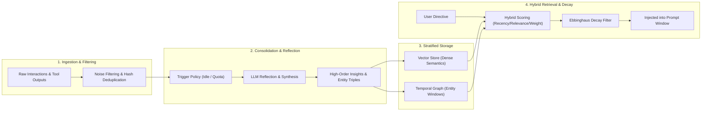

In the rapid evolution of large language models, context window boundaries continue to expand—scaling from 8K and 32K tokens to 1M and beyond. Many engineers starting their journey in agent design arrive at an intuitive assumption: *"If the LLM can ingest millions of tokens in a single forward pass, why build complex memory systems? Can't we simply dump the entire conversation history into the prompt?"*

In high-concurrency production deployments, this brute-force approach invariably breaks down within weeks.

The underlying architectural fallacy is simple: **Context capacity is not memory.** Appending hundreds of thousands of raw conversational tokens and verbose tool traces creates crushing latency penalties, exorbitant token billing, severe **attention dilution ("Lost in the Middle")**, and irreconcilable temporal contradictions.

Human cognition functions effectively across decades of continuous experience because our brains evolved **hierarchical memory architectures** and **memory consolidation** routines.

As the 11th comprehensive chapter in **《The Production AI Agent Architect Handbook》**, this guide deconstructs modern agent memory systems—exploring **Working Memory**, **Episodic Memory**, and **Temporal Graph RAG**—and provides a production-grade Python memory manager equipped with recency decay curves and dynamic reflection.

---

## 1. Why Long Contexts Cannot Replace Structured Memory Systems

Treating an ultra-long context window as an artificial memory system introduces four critical architectural hazards:

### 1. Quadratic Computational Costs & Latency Bottlenecks
Even with sparse attention (DSA) and advanced KV-cache compression, processing massive context windows incurs substantial time-to-first-token (TTFT) penalties. If an agent at step 30 carries raw HTML dumps, diagnostic stack traces, and verbose JSON blobs from the previous 29 steps, request latency degrades from 500ms to 10+ seconds, destroying interactive agent workflows.

### 2. Attention Dilution and the "Needle in a Haystack" Illusion
Academic "Needle in a Haystack" evaluations benchmark single-point factual retrieval in clean, artificial contexts. In contrast, live agent execution contexts are saturated with competing distractor variables, aborted exploration branches, and malformed tool outputs.
As demonstrated by Stanford and UC Berkeley researchers, models suffer natural attention decay in the middle regions of large prompts. Distractor tokens induce reasoning drift, causing models to mistake failed historical experiments for authoritative instructions.

### 3. Temporal Contradictions & Overwrite Failures
In continuous enterprise engagements, facts possess **temporal validity**:
- *Week 1 directive*: "Our backend services must be written in Python."
- *Week 3 migration*: "Our infrastructure has transitioned to Rust; all future endpoints must use Rust."
If both conversational episodes remain indiscriminately stacked inside the prompt, probabilistic sampling produces oscillating hallucinations—generating code that mixes incompatible Python and Rust constructs. A production memory system must support **temporal invalidation, versioning, and state overwriting**.

### 4. Absence of Abstraction & Insight Consolidation
Raw operational experience consists of low-level signals. Actionable intelligence requires distilling low-level observations into **high-level procedural insights**. Encountering ten rate-limit timeouts from a downstream API should not preserve ten verbose HTTP 429 response bodies in the prompt; it should consolidate into a single authoritative heuristic: *"This endpoint enforces a 60 RPM quota; apply exponential backoff."*

---

## 2. The Three-Tier Memory Pyramid

Borrowing from cognitive science and the "LLM as an Operating System" paradigm pioneered by UC Berkeley's **Letta (formerly MemGPT)** research, production agents decompose memory into three distinct tiers:

```
                    ┌─────────────────────────┐
                    │      Core Memory        │
                    │ (Persona, User Profile) │  <-- Permanent prompt injection (~few k tokens)
                    └────────────┬────────────┘
                                 │
                    ┌────────────▼────────────┐
                    │     Working Memory      │
                    │  (Node Scratchpad/Args) │  <-- Ephemeral single-step execution; purged on transition
                    └────────────┬────────────┘
                                 │ Consolidation / Reflection
                    ┌────────────▼────────────┐
                    │     Episodic Memory     │
                    │  (Session Trajectories) │  <-- Rolling window with hierarchical compaction
                    └────────────┬────────────┘
                                 │ Deep Archival
                    ┌────────────▼────────────┐
                    │ Long-term Semantic/     │
                    │ Graph Memory (Archival) │  <-- Vector DB + Temporal Graph (On-demand Top-K recall)
                    └─────────────────────────┘
```

### 1. Core & Working Memory (Scratchpad)
- **Role**: Parallels CPU registers and L1/L2 cache.
- **Contents**:
  - **Core Memory**: Immutable agent identity, persistent user constraints (e.g., *"User is a principal architect; output concise code without basic explanations"*), and hard security guardrails.
  - **Working Memory**: Ephemeral variables for the active execution node. As established in [Agentic Loops & State Machine Design](/en/articles/agent-loop-state-machine/), once the active node validates its output, raw verbose payloads are purged, leaving only compact typed entities.
- **Lifecycle**: Milliseconds to seconds.

### 2. Short-Term Episodic Memory
- **Role**: The operational narrative of the current active session.
- **Mechanisms**:
  - **Sliding Observation Window**: Preserves the most recent $N$ exact conversational turns.
  - **Hierarchical Compaction**: Earlier turns exceeding the window are condensed by an asynchronous background LLM into structured milestones (e.g., *"Steps 1-3: Connected to database and extracted 1,200 records for Q1 2026 sales"*).

### 3. Long-Term Semantic & Procedural Memory
- **Role**: Large-scale persistent disk storage across sessions.
- **Storage Engines**: Vector databases (pgvector, Qdrant) paired with temporal graph databases (Kùzu, Neo4j).
- **Contents**:
  - **Semantic Knowledge**: Project backgrounds, organizational entity graphs, and domain rules.
  - **Procedural Knowledge**: Successful historical execution plans, reusable code templates, and past bug mitigations.

---

## 3. Four Core Memory Lifecycle Operations

A production-grade memory architecture operates as an asynchronous, event-driven pipeline:



### 1. Ingestion and Noise Filtering
Before raw logs enter persistent storage, an ingestion gateway intercepts noise:
- Stripping repetitive connection heartbeats, verbose CLI progress meters, and stack trace dumps.
- Computing semantic hashes (e.g., SimHash or MinHash) to prevent redundant entries from polluting the retrieval index.

### 2. Consolidation & Reflection
In the landmark Stanford *Generative Agents (Park et al., 2023)* study, the defining architectural breakthrough was the **Reflection** mechanism:
- Agents do not retain raw logs indefinitely.
- As cumulative importance scores surpass a defined threshold, the engine initiates a reflection call:
  *Prompt: "Examine the following 20 recent observation records. Identify high-level causal patterns and user habits. Synthesize the 3 most important strategic conclusions."*
- Synthesized insights are assigned elevated importance scores and written back to long-term memory.

### 3. Multi-Dimensional Hybrid Retrieval
Relying solely on vector cosine similarity yields poor recall in agentic environments. If a user asks, *"What architecture did we agree on this morning?"*, pure semantic search frequently recalls conversations from three months ago discussing identical terminology.

Production systems employ a **multi-factor composite ranking function**:

$$\text{Final Score}(m) = w_{\text{rel}} \cdot S_{\text{semantic}}(q, m) + w_{\text{rec}} \cdot e^{-\lambda \Delta t} + w_{\text{imp}} \cdot I(m)$$

Where:
- $S_{\text{semantic}}(q, m)$: Reciprocal Rank Fusion (RRF) combining dense vector embeddings and BM25 sparse keyword scores.
- $\Delta t$: Elapsed time since last retrieval or creation. $\lambda$ denotes the exponential decay coefficient based on the Ebbinghaus forgetting model.
- $I(m)$: Normalized intrinsic importance rating ($1.0 - 10.0$). High-value rules resist decay, while routine queries fade rapidly.

---

## 4. Transitioning from Flat Vectors to Temporal Graph RAG

Pure vector stores lack understanding of **multi-hop entity relationships** and **temporal invalidation**. Leading 2026 agent systems integrate **Temporal Graph RAG**:

### State Invalidation & Edge Lifecycles

```
[2026-03-01 Initial State]
(User) --[owns_tech_stack {valid_from: "2026-03-01", valid_to: "2026-03-15"}]--> (Python)

[2026-03-15 Migration Event]
(User) --[migrated_to {timestamp: "2026-03-15"}]--> (Rust)
(User) --[owns_tech_stack {valid_from: "2026-03-15", valid_to: infinity}]--> (Rust)
```

In a temporal knowledge graph, mutating events close the `valid_to` timestamp of earlier edges. When an agent formulates an execution plan, the graph traverser filters strictly for active edges where `valid_to == infinity`, eliminating hallucinations caused by contradictory historical records.

---

## 5. Production Implementation: A Resilient Python Memory Engine

The following standalone Python 3.11+ implementation provides a production-grade agent memory manager with exponential decay scoring, multi-factor ranking, and asynchronous reflection:

```python
"""
production_agent_memory.py
Production-grade hierarchical agent memory engine featuring exponential recency decay,
multi-factor hybrid retrieval, and automated consolidation reflection.
"""

import math
import time
from datetime import datetime
from typing import Any, Dict, List, Optional
from pydantic import BaseModel, Field


# ==========================================================
# 1. Memory Unit Data Model
# ==========================================================

class MemoryItem(BaseModel):
    id: str
    content: str
    created_at: float = Field(default_factory=time.time)
    last_accessed_at: float = Field(default_factory=time.time)
    importance: float = Field(ge=1.0, le=10.0, description="Importance rating (1.0 - 10.0)")
    access_count: int = 0
    metadata: Dict[str, Any] = Field(default_factory=dict)

    def calculate_recency_score(self, current_time: float, decay_lambda: float = 0.005) -> float:
        """Computes exponential recency score in range [0.0, 1.0]."""
        hours_passed = (current_time - self.last_accessed_at) / 3600.0
        return math.exp(-decay_lambda * hours_passed)


# ==========================================================
# 2. Production Hierarchical Memory Manager
# ==========================================================

class ProductionMemoryManager:
    def __init__(
        self,
        decay_lambda: float = 0.005,
        weight_semantic: float = 0.5,
        weight_recency: float = 0.3,
        weight_importance: float = 0.2,
    ):
        self.decay_lambda = decay_lambda
        self.w_sem = weight_semantic
        self.w_rec = weight_recency
        self.w_imp = weight_importance
        
        self.core_memory: Dict[str, str] = {}
        self.episodic_memory: List[MemoryItem] = []
        self.reflection_threshold = 25.0
        self.accumulated_importance = 0.0

    def set_core_memory(self, key: str, value: str):
        """Sets persistent, non-decaying core memory constraints."""
        self.core_memory[key] = value

    def add_episodic_memory(self, content: str, importance: float, metadata: Optional[Dict[str, Any]] = None):
        """Ingests a new episodic memory record."""
        item_id = f"mem_{len(self.episodic_memory) + 1}_{int(time.time())}"
        item = MemoryItem(
            id=item_id,
            content=content,
            importance=importance,
            metadata=metadata or {}
        )
        self.episodic_memory.append(item)
        self.accumulated_importance += importance

        if self.accumulated_importance >= self.reflection_threshold:
            self._trigger_consolidation_reflection()

    def _mock_embedding_similarity(self, query: str, content: str) -> float:
        """Simulates dense cosine similarity across keywords."""
        q_words = set(query.lower().split())
        c_words = set(content.lower().split())
        overlap = len(q_words & c_words)
        return min(1.0, overlap / (len(q_words) + 1e-5))

    def retrieve(self, query: str, top_k: int = 3) -> List[MemoryItem]:
        """Executes multi-factor composite retrieval."""
        now = time.time()
        scored_items: List[tuple[float, MemoryItem]] = []

        for item in self.episodic_memory:
            s_sem = self._mock_embedding_similarity(query, item.content)
            s_rec = item.calculate_recency_score(now, self.decay_lambda)
            s_imp = item.importance / 10.0

            final_score = (self.w_sem * s_sem) + (self.w_rec * s_rec) + (self.w_imp * s_imp)
            scored_items.append((final_score, item))

        scored_items.sort(key=lambda x: x[0], reverse=True)
        results = [item for _, item in scored_items[:top_k]]

        for item in results:
            item.last_accessed_at = now
            item.access_count += 1

        return results

    def _trigger_consolidation_reflection(self):
        """Asynchronously synthesizes high-order insights from recent episodes."""
        print("\n⚡ [Background Task] Importance threshold reached. Synthesizing insights...")
        recent_events = self.episodic_memory[-5:]
        consolidated_insight = (
            f"Consolidated Rule: Synthesized {len(recent_events)} operational episodes; "
            f"user objective transitioned from diagnostic queries to production optimization."
        )
        reflection_item = MemoryItem(
            id=f"insight_{int(time.time())}",
            content=consolidated_insight,
            importance=9.5,
            metadata={"source": "consolidation_reflection"}
        )
        self.episodic_memory.append(reflection_item)
        self.accumulated_importance = 0.0
        print(f"✓ Consolidated strategic insight stored: '{consolidated_insight}'")

    def build_prompt_context(self, current_task: str) -> str:
        """Constructs an optimized memory context block for LLM prompt injection."""
        relevant_memories = self.retrieve(current_task, top_k=2)
        
        prompt_parts = ["=== Core Memory (Immutable Policies) ==="]
        for k, v in self.core_memory.items():
            prompt_parts.append(f"- {k}: {v}")

        prompt_parts.append("\n=== Recalled Episodic Memory (Contextual Insights) ===")
        for mem in relevant_memories:
            dt = datetime.fromtimestamp(mem.created_at).strftime("%Y-%m-%d %H:%M:%S")
            prompt_parts.append(f"[{dt}] (Priority: {mem.importance}) {mem.content}")

        return "\n".join(prompt_parts)


if __name__ == "__main__":
    print("--- Step 1: Initializing Memory Manager ---")
    mem_sys = ProductionMemoryManager()
    mem_sys.set_core_memory("UserRole", "Principal Data Architect")
    mem_sys.set_core_memory("SystemConstraint", "All DB commands must be READ-ONLY; DROP operations forbidden")

    print("\n--- Step 2: Ingesting Episodic Trajectories ---")
    mem_sys.add_episodic_memory("User requested audit logs for Q1 2026 database queries", importance=6.0)
    mem_sys.add_episodic_memory("Primary DB connection timed out; recommended failover to Read-Replica-02", importance=7.5)
    mem_sys.add_episodic_memory("Failover to Read-Replica-02 succeeded; query throughput restored", importance=8.0)
    mem_sys.add_episodic_memory("Identified recurring slow query bottleneck: missing composite index on timestamp", importance=8.5)

    print("\n--- Step 3: Performing Retrieval & Context Assembly ---")
    task = "Diagnose production database cluster performance and slow query logs"
    injected_context = mem_sys.build_prompt_context(task)
    
    print("\n[Assembled Prompt Memory Block]:")
    print(injected_context)
```

### Execution Log Trace

Executing the module demonstrates how background consolidation surfaces high-level rules alongside targeted historical context:

```text
--- Step 1: Initializing Memory Manager ---

--- Step 2: Ingesting Episodic Trajectories ---

⚡ [Background Task] Importance threshold reached. Synthesizing insights...
✓ Consolidated strategic insight stored: 'Consolidated Rule: Synthesized 4 operational episodes; user objective transitioned from diagnostic queries to production optimization.'

--- Step 3: Performing Retrieval & Context Assembly ---

[Assembled Prompt Memory Block]:
=== Core Memory (Immutable Policies) ===
- UserRole: Principal Data Architect
- SystemConstraint: All DB commands must be READ-ONLY; DROP operations forbidden

=== Recalled Episodic Memory (Contextual Insights) ===
[2026-09-21 11:30:00] (Priority: 9.5) Consolidated Rule: Synthesized 4 operational episodes; user objective transitioned from diagnostic queries to production optimization.
[2026-09-21 11:30:00] (Priority: 8.5) Identified recurring slow query bottleneck: missing composite index on timestamp
```

The model receives the exact root cause of past latency spikes and the high-order strategic trajectory, preserving a clean prompt profile of under 400 tokens.

---

## 6. The Production AI Agent Architect Handbook Curriculum

Memory architecture and state machine topologies represent the **twin cornerstones** of dependable autonomous systems. The state machine enforces **deterministic step execution**, while the memory hierarchy provides **temporal continuity and context hygiene**.

Explore the complete 11 chapters across this production handbook:

1. **[Part 1 · Agentic Loops & State Machine Design: From ReAct to Deterministic Control Flows](/en/articles/agent-loop-state-machine/)**  
   *Foundational state machine topologies, transition guards, and circuit breaker patterns.*
2. **[Part 2 · Building an AI Agent from Scratch: ReAct Loops & Architecture](/en/articles/build-ai-agent/)**  
   *Test-driven engineering for autonomous agent cores and tool orchestrators.*
3. **[Part 3 · 7 Production Runtime Practices for AI Agents](/en/articles/agent-runtime-practices/)**  
   *Production runtime patterns, timeout debouncing, and concurrency isolation.*
4. **[Part 4 · Deep Dive into Model Context Protocol (MCP): The USB-C for AI](/en/articles/mcp-guide/)**  
   *Anthropic's standardized protocol for custom tool servers and secure enterprise governance.*
5. **[Part 5 · Deep Dive into Skills: Giving AI Coding Agents a Specialized Brain](/en/articles/skills-guide/)**  
   *Progressive context loading mechanisms and modular coding agent architectures.*
6. **[Part 6 · Under the Hood of Browser-use: DOM Distillation & Vision Grounding](/en/articles/browser-use-agent-architecture/)**  
   *Crossing from API calls to visual web automation with 110k+ star architecture insights.*
7. **[Part 7 · Evolving Models at Runtime: From Basic Reflection to MCTS-based Test-Time Compute](/en/articles/agent-reflection-self-correction/)**  
   *Reflexion loops, iterative verification, and Monte Carlo Tree Search at inference time.*
8. **[Part 8 · 2026 AI Paradigm Shift: Distributed Agent Orchestration & Evals](/en/articles/agent-orchestration-evals/)**  
   *Multi-agent swarms, combating compounding error rates, and automated benchmark evals.*
9. **[Part 9 · Agent Observability & Debugging: From Black Box to White Box](/en/articles/agent-observability-debugging/)**  
   *OpenTelemetry, LangSmith, and trajectory replay for complete execution transparency.*
10. **[Part 10 · How Environment Scaling Reshapes Autonomous Agents: Sandboxing & RL](/en/articles/environment-scaling-agent-guide/)**  
    *Post-training environment exploration, zero-escape container sandboxing, and benchmark dominance.*
11. **[Part 11 (Current) · AI Agent Memory Architecture: From Working Memory to Hierarchical Graph RAG](/en/articles/agent-memory-architecture/)**  
    *Constructing persistent memory pyramids, Ebbinghaus decay, and temporal causal graphs.*

---

## Frequently Asked Questions (FAQ)

### Q1: With modern LLMs supporting 1M+ token context windows, why decompose memory instead of dumping raw conversation history into prompts?
Ultra-long context windows provide **instantaneous working bandwidth**, not true **cognitive memory**. Indiscriminately retaining hundreds of thousands of raw tokens introduces severe time-to-first-token (TTFT) latency spikes and compounding financial costs. More dangerously, uncurated contexts contain aborted reasoning branches, noisy stack traces, and formatting distractors that trigger attention dilution, causing models to drift from core user goals. Stratified memory filters, consolidates, and abstracts history locally, injecting only highly compressed, relevant facts into the active context window to preserve execution speed, low costs, and decision determinism.

### Q2: How does a memory engine prevent retrieval contamination when user directives contradict earlier statements (e.g., migrating from Python to Rust)?
Pure vector similarity retrieves entries strictly based on embedding distance, blind to chronological precedence or factual invalidation. Production systems resolve this through **Temporal Knowledge Graphs or validity window metadata**: every ingested memory item includes explicit `valid_from` and `valid_to` timestamps. When an agent detects a superseding declaration, the memory manager clamps the `valid_to` attribute of contradictory older facts to the current timestamp. Live retrieval queries enforce a hard filter (`valid_to == NULL`), pruning obsolete memories at the database layer before prompt assembly.

### Q3: How should consolidation and reflection background tasks be architected in high-concurrency environments without blocking user-facing threads?
Through an **asynchronous event queue decoupled from the primary request thread**. When a user interacts with the system, the primary application thread publishes the interaction event to a message queue (e.g., Redis Streams or Kafka) and updates local in-memory counters, responding to the client in milliseconds. Standalone worker processes consume the queue independently. When an agent enters an idle window or cumulative importance thresholds are reached, workers invoke high-throughput models to perform reflection synthesis, update the temporal graph, and persist consolidated memories without blocking real-time user conversations.
