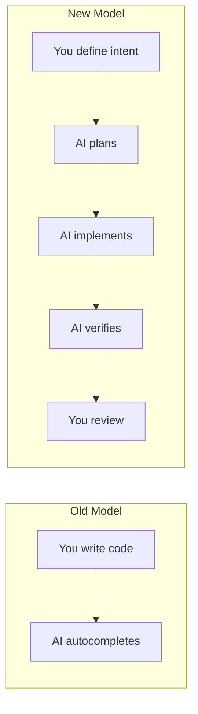
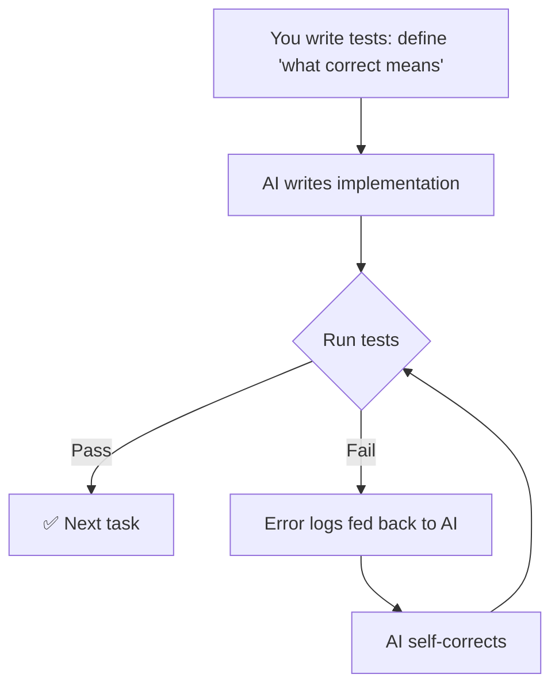
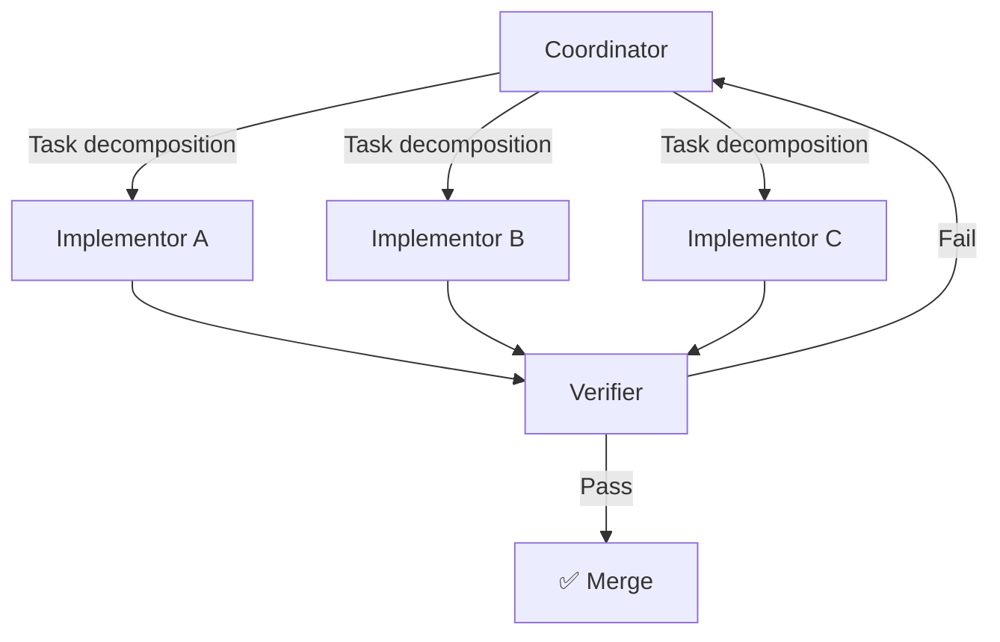
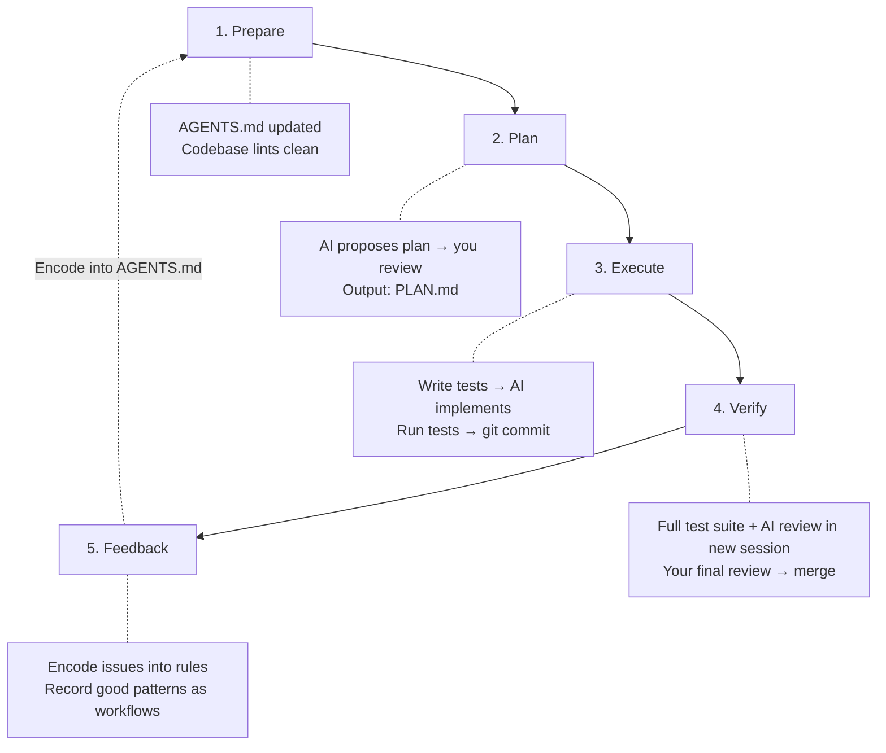

## Preface: You Might Be "Used by AI" Instead of "Using AI"

Have you ever experienced any of these?

- You ask AI to build a feature, it delivers 500 lines of code, and after 30 minutes of review you realize it used a framework your project explicitly forbids
- By turn 30 of the conversation, AI starts contradicting itself, overturning decisions it made earlier
- AI's code "looks correct," but crashes in production — because it didn't handle the null edge cases in your business logic
- You switched from Copilot to Cursor hoping for better results, but the same pitfalls persist

This isn't AI being incompetent, nor is it about picking the wrong tool — **your approach to wielding AI is wrong**.

In 2026, AI coding tools have evolved from "Tab completion" to autonomous [Agent systems](/articles/build-ai-agent) capable of planning, executing, and verifying on their own. Claude Code can run your test suites directly; GitHub Copilot Coding Agent auto-creates PRs from Issues; OpenAI Codex CLI executes commands in sandboxes. Tools are abundant — what's missing is **the methodology to use them correctly**.

This article answers one core question: **How can you make AI reliably and consistently produce production-grade code?**

```text
Structure:

Part 1: Mindset Shift ——— From Coder to Architecture Orchestrator
Part 2: Six Core Methods — Practical Playbook
Part 3: Five Anti-Patterns — Pitfall Guide
Part 4: Tool Landscape ——— 20+ Tool Selection Matrix
```

---

## Part 1: Mindset Shift — Your Role Has Changed



In 2026, a developer's role has shifted from "person who writes code line by line" to **"architect + coach."** When Andrej Karpathy coined "Vibe Coding" in 2025, saying *"I just see things, say things, run things, and copy-paste things,"* many misinterpreted this as "casually let AI write code." The opposite is true — experts spend 70% of their time on **defining constraints, reviewing plans, and encoding lessons learned**.

Your core value is no longer writing syntax, but four things:

1. **Define Intent** — Clearly describe "what to do" and "what NOT to do," giving AI a quantifiable success criterion
2. **Design Constraints** — Use rule files (`AGENTS.md`) and specifications to set boundaries for AI
3. **Verify Results** — Use tests, linters, and adversarial reviews to confirm AI output meets architecture standards
4. **Encode Lessons** — After every mistake, encode the fix into rule files so AI permanently learns

The behavioral gap between experts and beginners is stark:

| Beginner Approach | Expert Approach |
|-------------------|-----------------|
| "Build me a login system" | "Don't write code yet. Read the project structure first, then give me an implementation plan" |
| Ask AI to do everything at once | Break into atomic tasks, verify each before continuing |
| Accept AI's first suggestion | Ask AI for 2-3 options, analyze trade-offs, then choose |
| Merge code they don't understand | "Explain why this code is written this way" |
| Re-prompt when AI makes mistakes | Encode the error into project rule files so AI never repeats it |
| Use one endless chat for everything | Summarize after each sub-task, start fresh sessions |

---

## Part 2: Six Core Methods

### Method 1: Spec-Driven Development

**Core idea: Make AI understand "what" before it writes code. Changing a plan is always 10x cheaper than changing code.**

A complete Spec-Driven cycle has four phases:

```text
Phase 1: SPECIFY
│  "What to build, what NOT to build, what defines success"
│  → Output: SPEC.md
│
Phase 2: PLAN
│  AI proposes architecture in read-only mode; you review and refine
│  → Output: PLAN.md
│
Phase 3: TASKS
│  Decompose the plan into independently verifiable atomic tasks
│  → Output: TASKS.md
│
Phase 4: IMPLEMENT + VERIFY
   Execute tasks one by one → test → proceed only after passing
   → Output: Working code + tests
```

**Practical tips**:

- **Not every task needs a Spec**. Rule of thumb: if it's cross-session, high-risk, or multi-file, write a Spec; if it's a single function and low-risk, just do it
- **Use Plan Mode**: In Claude Code, say `"Don't write code yet, give me a plan"`; in Cursor, describe before starting the Agent
- **Keep documents alive**: Have AI update SPEC.md in real-time during implementation to keep plan and reality in sync

> Rule of thumb: If you find yourself repeatedly asking AI to "redo," you skipped the SPECIFY and PLAN phases. **Go back to the beginning and align on intent.**

---

### Method 2: Context Engineering

**Core idea: "Prompt Engineering" is outdated. The 2026 key skill is "Context Engineering" — not how to ask questions, but how to make the right information automatically appear at the right time.**

AI's output quality is a function of context quality: `Output = f(Context)`. What you feed it is what you get back.

#### The Three-Layer Context Architecture

```mermaid
graph TB
    subgraph Three-Layer Context
        L1["Always-On Layer"] --> |AGENTS.md / .cursorrules| Note1["Minimal base rules, auto-loaded every time"]
        L2["Auto-Attached Layer"] --> |.cursor/rules/*.mdc| Note2["Activated by file path"]
        L3["Session Layer"] --> |@ references in chat| Note3["Specific files for current task"]
    end
```

#### Project Rule Files — The "Job Description" for AI

This is the most critical infrastructure for mastering AI. Without it, even the best AI can only give you generic code that may violate project conventions.

| File | Purpose | Tools | Priority |
|------|---------|-------|----------|
| `AGENTS.md` | Universal "machine README" | All platforms (Cursor / Copilot / Claude Code...) | ⭐⭐⭐ Must create |
| `CLAUDE.md` | Claude-specific instructions | Claude Code | ⭐⭐ Recommended for Claude users |
| `.cursor/rules/*.mdc` | Layered rule system | Cursor | ⭐⭐ Recommended for Cursor users |
| `.github/copilot-instructions.md` | Copilot global instructions | GitHub Copilot | ⭐ |
| `.goosehints` | Goose instructions | Goose | ⭐ |

What does a good `AGENTS.md` look like? Here's an example from my Hugo tech blog:

```markdown
# Project: ifnodoraemon.github.io (Hugo Tech Blog)

## Tech Stack
- Hugo SSG + Vanilla JS + CSS
- Bilingual architecture: content/zh/ and content/en/

## Key Commands
- hugo server -D     # Local preview
- npm run build      # Production build

## Article Standards
- Chinese articles go in content/zh/articles/{slug}.md
- English articles go in content/en/articles/{slug}.en.md
- Frontmatter must include: title / slug / date / tag / tagClass / description
- tagClass options: tag-blue / tag-green / tag-violet / tag-emerald

## Writing Style
- Open with pain-point scenarios, never write "This article will introduce..."
- Deep technical analysis + directly copyable code
- Use mermaid diagrams and comparison tables

## Safety Boundaries
- ❌ Never modify the public/ directory (build output)
- ❌ Don't introduce new CSS frameworks
- ❌ Don't modify .github/workflows/ CI configs
```

> Note: This file is only 25 lines. Brevity is key — every useless instruction dilutes the truly important rules.

**Four Golden Rules**:

1. **Keep it under 200 lines** — LLMs suffer from the ["lost-in-the-middle"](https://arxiv.org/abs/2307.03172) effect: attention to information in the middle of context is lowest. Overly long rules get ignored
2. **Only write what AI can't infer** — Don't repeat what linters and type checkers already enforce. "Use TypeScript" is unnecessary; "API routes use kebab-case" is essential
3. **Iterate through friction** — AI keeps making the same mistake (e.g., always forgetting `tagClass` in Hugo frontmatter)? Immediately encode it into the rule file
4. **Provide benchmark file paths** — Instead of lengthy descriptions, "New articles should follow the format in `content/zh/articles/mcp-guide.md`" says it all

Cross-tool universality is `AGENTS.md`'s killer advantage. Whether you use Cursor, Copilot, Claude Code, or Aider, they all automatically read this file from the project root. Configure once, effective everywhere.

---

### Method 3: TDD + Agent Verification Loop

**Core idea: Use tests as AI's "brake system." Let tests tell AI if it's right, instead of relying on your eyeball review.**

This is the single most reliable AI coding pattern. Period. The reason is simple — AI excels at "given a quantifiable target, iterate until convergence."



**Why is this the most reliable pattern?**

- **Quantifiable success criteria**: Not "does it look good" (subjective), but "do tests pass" (objective fact)
- **Automatic guardrails**: When AI modifies code later, existing tests immediately catch regressions
- **Tests are documentation**: Tests are the best behavioral documentation

**Practical workflow**:

1. **You write red tests** (define expected behavior)
2. **AI writes green implementation** (make tests pass)
3. **AI refactors** (tests stay green)

**Real scenario**: Suppose you want to add an RSS generator to your blog. Don't say "build me an RSS feature" — write tests first:

```python
# test_rss.py — You write this
def test_rss_contains_latest_articles():
    feed = generate_rss(articles[:10])
    assert "<rss version" in feed
    assert articles[0].title in feed

def test_rss_escapes_html_in_description():
    article = Article(title="Test", description="<script>alert('xss')</script>")
    feed = generate_rss([article])
    assert "<script>" not in feed  # Must be escaped
```

Then tell AI: "Implement the `generate_rss` function to make all tests pass." AI receives an **executable specification**, not a vague natural language description.

In terminal Agents like Claude Code / Codex CLI / Aider, AI can directly run `pytest` and read error output, automatically entering the Red→Green→Refactor cycle until all tests pass.

---

### Method 4: Multi-Agent Orchestration (CIV Pattern)

**Core idea: Don't let one AI simultaneously be "architect," "coder," and "tester." Separate roles, separate responsibilities.**

The CIV (Coordinator-Implementor-Verifier) architecture divides AI workflows into three roles:



You don't need complex frameworks. In daily work, existing tools suffice:

| Role | Tool | Responsibility |
|------|------|----------------|
| **Coordinator** | Cursor Chat / Claude Code (Plan Mode) | Analyze requirements, design solutions, decompose tasks |
| **Implementor** | Cursor Agent / Codex CLI / Aider | Implement tasks one by one per the plan |
| **Verifier** | You + test suites + linter | Review code, run tests, confirm spec compliance |

**Advanced technique — Adversarial verification**:

After code is written, open a **new AI session** specifically to find bugs:

```text
"Assume you are a security auditor. Review the following code for all potential issues:
 1. Security vulnerabilities
 2. Edge cases
 3. Performance bottlenecks
 4. Inconsistencies with project architecture

[paste code]"
```

This "AI reviewing AI's code" pattern is far more effective than "write and merge."

---

### Method 5: Advanced Prompt Techniques

With tools and methodology established, a few key daily interaction techniques significantly boost AI output quality:

#### 5.1 Role Definition — RTF Pattern (Role-Task-Format)

```text
❌ Bad: "Write me an API"

✅ Good: "You are a senior Python backend engineer, expert in FastAPI and SQLAlchemy.
      Your task is to add CRUD APIs for the user preferences table.
      Follow the existing Repository Pattern (reference src/api/users.ts).
      Output format: First give a solution overview; I'll confirm before you write code."
```

The difference: Role constrains the knowledge domain, Task constrains scope, Format constrains output structure. All three are essential.

#### 5.2 Task Chaining — Refuse One-Shot Completion

```text
❌ Bad: "Build the entire authentication system"

✅ Good:
  Prompt 1: "Analyze the current project's auth dependencies and middleware structure"
  Prompt 2: "Based on the analysis, design a JWT authentication implementation plan"
  Prompt 3: "Implement the auth middleware (**write tests first**)"
  Prompt 4: "Implement the login API (**write tests first**)"
```

Each step can be independently verified, each step has a rollback point.

#### 5.3 Plan-First — The Three-Question Method

Before letting AI write code, require it to answer three questions:

```text
"Don't write code yet. Answer these three questions:
  1. Which files do you plan to modify?
  2. What specifically will you change in each file?
  3. What are the potential risks and edge cases?
  Wait for my confirmation before starting."
```

#### 5.4 Reflective Correction — Never Say "Try Something Else"

When AI makes a mistake, most people say "That's wrong, try another approach." This is the least effective feedback. The correct way:

```text
① Observe: "The unit test throws JSONDecodeError on line 42"
② Analyze: "It seems you didn't handle the case where input is a JSON string"
③ Instruct: "Please extend the parsing logic to support both dict and JSON string input formats"
```

The more precise your error feedback, the more accurate the fix. Vague feedback leads to vague fixes.

---

### Method 6: Session Hygiene & Context Management

**Core problem: Long sessions → stale information accumulates → AI gets confused → quality cliff-drops**

LLM context windows aren't "bigger is better." Even with [Gemini 3.1 Pro's 1M token context](/articles/ai-trends-2026), model attention to information in the middle of long contexts remains lowest. More importantly — every turn's history messages consume your effective context space. 30 turns × 2000 tokens average per turn ≈ 60K tokens of historical noise, leaving less and less room for truly important information.

**Solution: Session Segmentation**

```text
Session 1: Analyze requirements → produce SPEC.md → end
Session 2: Design solution based on SPEC.md → produce PLAN.md → end
Session 3: Implement tasks 1-3 based on PLAN.md → commit → end
Session 4: Implement tasks 4-6 based on PLAN.md → commit → end
```

**Key principles**:

- **Inject essential documents in each new session**: Have AI read SPEC + PLAN at the start — 2000 tokens of distilled docs can restore full context
- **Summarize periodically**: "Summarize what we've done so far and what's remaining," save as a file for the next session's input
- **The 30-turn rule**: Quality likely starts degrading after 30 turns in a single session. Switch to a new one
- **Intermediate artifacts are relay batons**: SPEC.md → PLAN.md → TASKS.md — each document is "state persistence" between sessions

---

## Part 3: Five Anti-Patterns — Pitfall Guide

| # | Anti-Pattern | Symptoms | Fix |
|---|-------------|----------|-----|
| 1 | **Kitchen Sink** | Dumping 20 files into context, AI gets more confused | Only provide the 2-3 files the current task needs |
| 2 | **One-Shot Everything** | "Build the entire feature," result is mediocre everywhere | Break into 5-10 atomic tasks, verify each |
| 3 | **No Guardrails** | AI introduces forbidden libraries or violates conventions | Explicitly list prohibitions and benchmark files in `AGENTS.md` |
| 4 | **Context Rot** | After 30+ turns, AI contradicts itself and forgets decisions | Segmented sessions + intermediate documents (SPEC/PLAN) |
| 5 | **Merge Without Verifying** | AI code "looks right," crashes in production on edge cases | TDD verification loop + adversarial code review |

**Why Anti-Pattern 1 happens**: LLMs aren't databases — the more files you feed it, the less attention each file gets. 200 lines of precise context outperforms 5000 lines of "full dump."

**Why Anti-Pattern 5 is the most dangerous**: AI-generated code has a "fatal attraction" — it's well-formatted, thoroughly commented, and looks more professional than what you'd write yourself. This "surface polish" lowers your guard, while bugs hide in edge cases you wouldn't think to check (empty arrays, race conditions, timezone issues...).

If you remember only one rule: **Never merge code you don't understand.** Even if AI says "this is best practice."

---

## Part 4: Tool Landscape Matrix

Methodology first, tools second. **Tools serve methodology, not the other way around.**

A key 2026 development is the widespread adoption of [MCP (Model Context Protocol)](/articles/mcp-guide) — the USB-C of AI tools, enabling different AI coding tools to connect to databases, GitHub, file systems, and other external resources through a unified protocol. MCP support has become an important factor in tool selection.

### AI-Native IDEs — Editors Rebuilt from the Ground Up for AI

| Tool | Core Strength | MCP | Pricing |
|------|--------------|-----|---------|
| **Cursor** | AI-first editor, deep codebase indexing, layered rule system (`.cursor/rules/*.mdc`) | ✅ | $20/mo |
| **Windsurf** | Cost-effective, Cascade multi-step task chains | ✅ | $15/mo |

### IDE Extensions — Adding AI to Your Familiar Editor

| Tool | Core Strength | Open Source |
|------|--------------|-------------|
| **GitHub Copilot** | Broadest ecosystem, Agent Mode + Coding Agent (cloud async) + MCP support | ❌ |
| **Cline** | Pioneer of human-in-the-loop autonomous Agents, rich MCP community | ✅ |
| **Roo Code** | Cline fork, role-based execution modes (Architect / Code / Debug) | ✅ |
| **Continue** | Fully open source, supports custom models | ✅ |
| **Augment Code** | Enterprise-grade semantic context engine, understands 100K+ file codebases | ❌ |
| **Amazon Q Developer** | Deep AWS ecosystem awareness (Lambda / CloudFormation / CDK) | ❌ |
| **Gemini Code Assist** | Google Cloud ecosystem integration | ❌ |
| **Tabnine** | Privacy-first, supports local models and enterprise custom security rules | ❌ |

### Terminal Agents (CLI) — The Fastest-Growing Category of 2025-2026

| Tool | Core Strength | Open Source | Install |
|------|--------------|-------------|---------|
| **Claude Code** | Frontier reasoning capabilities, the go-to for large-scale refactoring | ❌ | `npm i -g @anthropic-ai/claude-code` |
| **OpenAI Codex CLI** | Rust-built, works with ChatGPT subscription, sandbox execution | ✅ | `npm i -g @openai/codex` |
| **Gemini CLI** | Generous free tier, 1M token context, ReAct loop | ✅ | `npm i -g @google/gemini-cli` |
| **OpenCode** | Model-agnostic (supports 75+ LLMs), TUI interface, privacy-first | ✅ | `curl -fsSL https://opencode.ai/install \| bash` |
| **Aider** | Terminal pair-programming pioneer, auto Git commit per edit | ✅ | `pip install aider-chat` |
| **Goose** | Built by Block, extensible plugin system, autonomous task execution | ✅ | — |

### Autonomous / Cloud Platform Agents — Issue → PR Fully Automated

| Tool | Core Strength |
|------|--------------|
| **GitHub Copilot Coding Agent** | Based on GitHub Actions, auto-analyzes Issues, creates branches, writes code, opens PRs |
| **Devin** | Full-stack autonomous Agent, independently completes complex application development |
| **Bolt / Lovable** | Natural language → full-stack apps, ideal for rapid prototyping |
| **Augment Intent** | Multi-Agent orchestration, "living document" driven parallel development |

### Quick Selection Guide — One Line to Tell You What to Use

```text
Fastest start     → GitHub Copilot (broadest ecosystem)
Strongest reasoning → Claude Code (go-to for complex refactoring)
Completely free   → Gemini CLI (1M context + free tier)
Vendor-agnostic   → OpenCode (supports 75+ models)
Git automation    → Aider (auto commit per edit)
VS Code autonomous → Cline / Roo Code
Enterprise monorepos → Augment Code
Async background  → GitHub Copilot Coding Agent
```

> **2026 best practice: Don't use just one tool.** Professional developers typically use Cursor/Copilot for daily coding, Claude Code for complex reasoning and large-scale refactoring, Aider for Git integration tasks, and Gemini CLI for ultra-long context analysis. The key isn't which tool you pick — it's unifying them all with the same methodology (Spec → Plan → TDD → Verify).

---

## Complete Mastery Workflow — The Golden Path

Finally, weaving all six methods into a complete workflow:



The essence of this loop is the final step: **the feedback loop**. Every pitfall strengthens rule files; every success crystallizes into standard procedure. After dozens of iterations, your `AGENTS.md` becomes the entire team's "AI user manual" — when a new team member joins, AI immediately knows how to work on your project.

---

## Final Takeaways

Remember these four principles:

1. **"Plan before execute" is a 10x lever**. Having AI explain its approach before writing code increases success rates by an order of magnitude
2. **Tests are the ultimate mastery tool**. You write tests to define "what correct means," AI's job is to make them pass — this is what AI does best
3. **Rule files are permanent memory**. Every pitfall encoded into `AGENTS.md` makes your AI teammate understand your project better forever
4. **Sessions are disposable**. Don't fear starting new chats. After 30 turns, switch to a fresh session, inject essential docs, and restart — quality is always better than continuing a stale conversation

One final thought: **The ceiling of AI coding tools isn't model intelligence — it's your methodology for wielding them.** The six methods and five anti-patterns in this article are your complete roadmap from "being used by AI" to "using AI."
