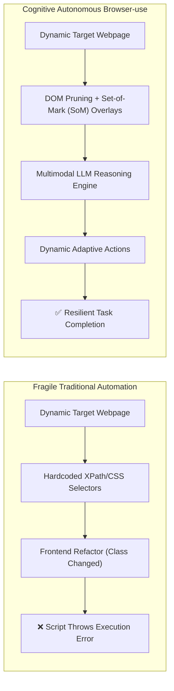
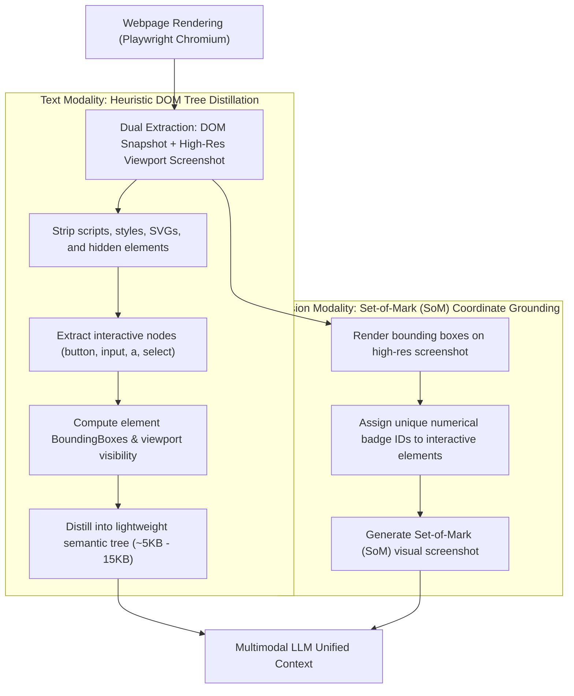

## Introduction: The Death of Fragile RPA and Selector-Based Automation

For more than a decade, web automation—spanning web scraping, QA regression testing, and Robotic Process Automation (RPA)—has been plagued by a fundamental failure mode: **brittle XPath and CSS selectors**.

Whenever frontend teams refactor component trees, re-nest a container `div`, or adopt utility-first CSS frameworks with randomized hash classes (e.g. `class="flex_a8f9z bg-blue_39kd"`), carefully maintained Playwright or Selenium scripts break without warning.

Entering 2026, this fragile paradigm has been replaced by autonomous web agents. Pioneered by projects like **[Browser-use](https://github.com/browser-use/browser-use)**, which quickly surpassed **100,000 stars on GitHub**, automation has shifted toward multimodal cognitive interaction. Instead of matching brittle DOM paths, the model navigates the web like a human: **perceiving rendered screenshots with its eyes, understanding interactive semantics with its brain, planning multi-step actions, and self-healing when encountering unexpected modals or bot challenges.**



This article deconstructs the architectural foundations of Browser-use, explaining how it mitigates token explosion, eliminates visual coordinate drift, evades bot detection, and executes multi-step enterprise workflows.

---

## I. Dual-Modal Perception Core: DOM Tree Distillation & Set-of-Mark Grounding

Passing raw modern Single Page Application (SPA) HTML directly into an LLM context window is disastrous: pages often span megabytes of minified code, consuming tens of thousands of tokens and diluting the model with extraneous `script`, `style`, and `svg` metadata.

Browser-use resolves this with an efficient **dual-modal perception pipeline**:



### 1. Heuristic DOM Tree Pruning
Browser-use injects a specialized traversal script into the browser runtime to prune non-essential DOM structures:
* **Visibility Filtering**: Evaluates computed styles (`display === 'none'`, `visibility === 'hidden'`, `opacity === '0'`) and discards nodes outside the active viewport.
* **Metadata Stripping**: Purges all `<script>`, `<style>`, `<link>`, and `<meta>` tags alongside SVG paths.
* **Semantic Flattening**: Collapses non-semantic wrapper `<div>` chains, preserving only nodes that contain meaningful text or interactive accessibility attributes (`aria-label`, `placeholder`, `role`, `href`).
* **Result**: Raw HTML trees shrinking from 2MB+ down to an information-dense representation of **1,500 to 3,000 tokens**. For strategies on managing runtime context budgets, review our [Context Engineering Guide](/en/articles/context-engineering-guide/).

### 2. Set-of-Mark (SoM) Visual Grounding
Predicting exact pixel coordinates (e.g. `click at x=1240, y=850`) often fails due to display scaling differences and viewport misalignments.

Browser-use implements **Set-of-Mark (SoM)** visual grounding:
1. The injected JavaScript retrieves the bounding box for every interactive candidate.
2. It paints an overlay of brightly colored bounding boxes containing **numerical badges (`[1]`, `[2]`, `[15]`)** directly onto the page.
3. It takes a clean screenshot of this annotated state.
4. **The Model's Action Space is Simplified**: The model does not calculate coordinates; it outputs high-level actions referencing IDs, such as `click_element(index=14)` or `input_text(index=3, text="admin@company.com")`. This increases action execution precision beyond 95%.

---

## II. Agent Cognitive Loop & State Machine Resilience

Enterprise web automation rarely involves single-shot actions; it demands workflows spanning 10 to 30 sequential steps. Browser-use manages this via an **Observe-Reason-Plan-Act-Verify (O-P-A-V)** state machine:

```text
┌─────────────────────────────────────────────────────────────┐
│                 Browser-use Cognitive Loop                  │
└─────────────────────────────────────────────────────────────┘
                             │
                             ▼
 1. Observe   ───► Prune DOM and capture SoM-annotated screenshot
                             │
                             ▼
 2. Reason    ───► Evaluate user goal vs. current interactive state
                             │
                             ▼
 3. Plan      ───► Select atomic action: Click / Type / Scroll / Tab
                             │
                             ▼
 4. Act       ───► Dispatch simulated input via Playwright CDP
                             │
                             ▼
 5. Verify    ───► Wait for network idle & DOM mutation; verify state
                             │
                             ├─► [Success] Proceed to next observation loop
                             └─► [Failure] Trigger self-healing retry or fallback
```

### 1. Dynamic Viewport Exploration and Scrolling
When information resides below the fold or inside nested containers, the agent utilizes dedicated scroll primitives:
* `scroll_down(amount=500)`: Scrolls the viewport and re-evaluates the fresh SoM layout.
* Maintains a lightweight historical trajectory of scrolled coordinates to avoid cycling endlessly between page extremes. For details on self-correction loops, see our guide on [Agent Reflection and Self-Correction](/en/articles/agent-reflection-self-correction/).

### 2. State Stagnation Detection & Self-Healing
If an agent attempts three consecutive clicks on an element without altering DOM topology or visual layout, the built-in watchdog triggers recovery:
* Forces a clean page reload;
* Injects contextual feedback prompting the model: *"Previous click failed to trigger a state mutation. Inspect whether a blocking modal overlay exists or if scrolling is required."*

---

## III. Production Hardening: Anti-Bot Evasion & Authentication

Moving Browser-use into unattended 24/7 enterprise production environments requires handling real-world web defenses:

### 1. WAF & Fingerprint Detection Evasion
Standard Headless Chrome exposes obvious automation artifacts (`navigator.webdriver = true`, missing WebGL vendor strings, static screen dimensions), leading to immediate blocks by Cloudflare or DataDome.

**Production Hardening Checklist**:
* Deploy `playwright-stealth` to scrub known automation properties;
* Randomize User-Agent headers, viewport dimensions, and hardware concurrency metrics;
* Add randomized micro-jitters to typing events and simulate human-like Bezier mouse curves.

### 2. CAPTCHAs & Two-Factor Authentication (Human-in-the-Loop)
Attempting to fully automate adversarial 3D rotation or visual puzzle CAPTCHAs in production introduces fragility.

**Best Practice**: **Human-in-the-Loop Handover**.
When an agent detects a blocking challenge, it suspends its automated loop and issues a real-time notification (via Webhook, Slack, or Teams). A human operator opens a remote visual debug session via the Chrome DevTools Protocol (CDP), resolves the challenge within 30 seconds, and signals the agent to resume execution.

---

## IV. Hands-on Implementation: Building an Autonomous Financial Research Agent

Here is a complete, runnable script configuring Browser-use with multimodal models to execute a multi-step financial report download workflow.

### 1. Environment Installation
```bash
pip install browser-use playwright langchain-openai
playwright install chromium
```

### 2. Complete Python Implementation

```python
import os
import asyncio
from browser_use import Agent, Browser, BrowserConfig
from browser_use.browser.context import BrowserContextConfig
from langchain_openai import ChatOpenAI

# 1. Configure the multimodal vision backbone
# For production, utilize models with strong spatial grounding (GPT-4o, Claude 3.7 Sonnet, or Qwen2.5-VL)
llm = ChatOpenAI(
    model="gpt-4o",
    temperature=0.0,
    api_key=os.getenv("OPENAI_API_KEY")
)

# 2. Production browser resilience configuration
browser_config = BrowserConfig(
    headless=False,            # Set to True for unattended production deployment
    disable_security=True,     # Disregard self-signed intranet SSL certificates
    extra_chromium_args=[
        "--disable-blink-features=AutomationControlled",  # Scrub webdriver automation flag
        "--no-sandbox",
        "--window-size=1920,1080"
    ]
)

# 3. Session isolation and recording configuration
context_config = BrowserContextConfig(
    viewport={"width": 1920, "height": 1080},
    save_recording_path="./recordings",  # Record video artifacts for auditing and triage
    locale="en-US"
)

async def run_enterprise_workflow():
    browser = Browser(config=browser_config)
    context = await browser.new_context(config=context_config)

    # 4. Define high-level business objective
    task_prompt = """
    1. Navigate to https://example-finance-portal.com/login
    2. If a login form is displayed, enter 'finance_bot' as username, 'Secr3t_Pass!' as password, and click Submit
    3. Once logged in, locate and click 'Financial Reconciliation' in the sidebar
    4. Set the date range filter to '2026 Q2', then click 'Export Summary CSV'
    5. Wait for the download to complete and confirm that a success modal appears
    """

    # 5. Initialize the Browser-use Agent
    agent = Agent(
        task=task_prompt,
        llm=llm,
        browser_context=context,
        use_vision=True,                # Enable Set-of-Mark visual grounding
        max_failures=3,                 # Maximum retry attempts per step
        max_actions_per_step=4          # Allow compound actions per turn to reduce latency
    )

    print("🚀 Launching enterprise autonomous Browser-use agent...")
    history = await agent.run(max_steps=25)

    print("\n✅ Execution Summary:")
    print(history.final_result())

    await context.close()
    await browser.close()

if __name__ == "__main__":
    asyncio.run(run_enterprise_workflow())
```

*By eliminating hardcoded selectors, the agent remains functional even when frontend teams update layout classes. For debugging and session logging, review our [Agent Observability and Debugging Guide](/en/articles/agent-observability-debugging/).*

---

## V. Enterprise Architecture & Cost Trade-offs

Autonomous web agents do not completely supplant direct API calls. Production systems should adopt a **layered automation hierarchy**:

| Automation Layer | Ideal Workload | Execution Latency | Cost per Step | Reliability |
|:---|:---|:---|:---|:---|
| **Direct REST/GraphQL APIs** | Standardized, documented internal endpoints | Sub-100ms | Free | High (Schema Contract) |
| **Deterministic Playwright Scripts** | High-volume, static regression smoke tests | Sub-second | Free | Medium (Breaks on UI updates) |
| **Browser-use Vision Agents** | Legacy systems without APIs, anti-bot sites, exploratory workflows | ~3s per step | $0.01 - $0.05 per step (Token-based) | High (Adaptive self-healing) |

---

## Frequently Asked Questions (FAQ)

### Q1: Does capturing screenshots on every step cause token costs to explode?
No. Browser-use automatically compresses and resizes screenshots (typically capping resolution at 1280px width), keeping per-image consumption within a few hundred tokens. Combined with distilled DOM pruning, the average per-step cost remains between **800 and 2,500 tokens**. For high-volume private workflows, hosting open-weight models (such as Qwen2.5-VL-72B via [vLLM Serving](/en/articles/vllm-serving-guide/)) reduces per-token marginal costs to near zero.

### Q2: How does the agent track state across multi-tab popups?
Browser-use maintains an integrated tab manager. When a click triggers `window.open` or a popup, Playwright catches the `context.on('page')` event and injects the active tab list (`available_tabs: [Tab 0: Home, Tab 1: Checkout]`) into the prompt state. The model issues `switch_tab(tab_id=1)` commands while maintaining unified execution history in the primary controller.

### Q3: Can Browser-use run in headless containerized cloud environments?
Yes. In production Kubernetes clusters, the standard deployment pattern packages the agent inside a lightweight Linux container utilizing **Xvfb (X Virtual Framebuffer)** to emulate a display. This enables headless execution while preserving full screenshot and Set-of-Mark visual grounding capabilities.
