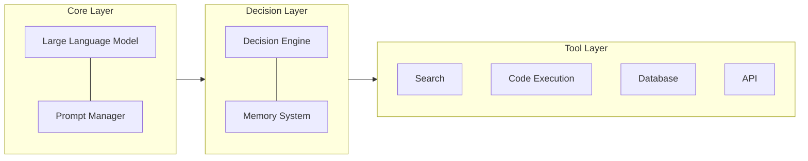

## What is an AI Agent?

An AI Agent is an AI system capable of **perceiving its environment, making autonomous decisions, and executing actions**. Unlike traditional single API calls, an Agent can:

- 🔄 **Loop execution**: Continuously adjust actions based on feedback
- 🛠️ **Tool calling**: Search the web, execute code, operate databases
- 📋 **Task planning**: Break down complex goals into actionable steps
- 🧠 **Memory management**: Maintain context and state over long conversations

## Architecture Design

A complete AI Agent system typically includes the following core components:



## Implementation Steps

### Step 1: Install Dependencies

```bash
pip install langchain langchain-anthropic tavily-python
```

### Step 2: Define Tools

```python
from langchain.tools import tool
from datetime import datetime

@tool
def get_current_time() -> str:
    """Get the current time"""
    return datetime.now().strftime("%Y-%m-%d %H:%M:%S")

@tool
def search_web(query: str) -> str:
    """Search the web to get real-time information"""
    from tavily import TavilyClient
    client = TavilyClient()
    results = client.search(query, max_results=3)
    return "\n".join([r["content"] for r in results["results"]])

@tool
def execute_python(code: str) -> str:
    """Execute Python code and return the result"""
    import subprocess
    result = subprocess.run(
        ["python", "-c", code],
        capture_output=True, text=True, timeout=10
    )
    return result.stdout or result.stderr
```

### Step 3: Building a State Machine with LangGraph (StateGraph)

Production-grade Agents in 2026 have completely abandoned black-box `AgentExecutor` abstractions. Instead, the paradigm has shifted to directed graphs centered around **State Machines**. This architecture provides extreme controllability and enforces strict data flow (State Schema).

```python
from typing import TypedDict, Annotated
from langgraph.graph import StateGraph, END
from langgraph.prebuilt import ToolNode
from langchain_core.messages import AnyMessage, add_messages
from langchain_anthropic import ChatAnthropic

# 1. Strictly define the Agent's global state (State Schema)
class AgentState(TypedDict):
    messages: Annotated[list[AnyMessage], add_messages]
    current_task: str

# 2. Node Logic: The Model Reasoning Node
def call_model(state: AgentState):
    llm = ChatAnthropic(model="claude-sonnet-4-6-20260217")
    llm_with_tools = llm.bind_tools(tools)
    response = llm_with_tools.invoke(state["messages"])
    return {"messages": [response]}

# 3. Build the Directed Graph
workflow = StateGraph(AgentState)
workflow.add_node("agent", call_model)
workflow.add_node("tools", ToolNode(tools)) # Built-in tool execution node

# 4. Define Routing and Edges
workflow.set_entry_point("agent")
# If the model's response includes tool_calls, route to tools; otherwise, END
workflow.add_conditional_edges("agent", lambda x: "tools" if x["messages"][-1].tool_calls else END)
workflow.add_edge("tools", "agent")

# 5. Compile into an Executable Application
app = workflow.compile()
```

### Step 4: Execution and Tracing
With the graph architecture, we can precisely trace every state transition step:
```python
inputs = {"messages": [("user", "Help me find the latest release date for foundation models.")]}
for event in app.stream(inputs, stream_mode="values"):
    message = event["messages"][-1]
    message.pretty_print() # Clearly inspect every step of Thought -> Action -> Observation
```

## Model Selection Recommendations

| Requirements | Recommended Model | Reason |
|------|----------|------|
| Complex Agent tasks | Claude Opus 4.6 | The strongest Agentic capabilities and Computer Use |
| Daily Agent development | Claude Sonnet 4.6 | The best balance between speed and intelligence |
| Agents requiring deep reasoning | GPT-5.4 Thinking | Transparent thought chains, easier to debug |
| High-volume production environments | Gemini 3.1 Flash-Lite | Best cost-effectiveness |

## Best Practices

1. **Make tool descriptions precise**: LLMs decide when to call tools via their docstrings, the clearer the better.
2. **Limit the number of tools**: Keep it under 10 tools per Agent; too many will decrease selection accuracy.
3. **Add safety guardrails**: Set explicit permissions and controls for sensitive tools like code execution or database operations.
4. **Implement graceful degradation**: When tool calls fail, the Agent should be able to identify the failure and switch strategies.
5. **Monitoring and logging**: Record the input and output of every tool call to facilitate debugging and optimization.

## Enterprise-Grade Agent Architecture (Phase 2 Deep Dive)

In real-world production environments, an Agent might encounter API limits, database locks, or asynchronous jobs that take hours to complete. A naive synchronous architecture will instantly collapse. Here are the most hardcore industry practices:

### 1. Cross-Session Persistence & Interruption Recovery (Redis Checkpointer)

To ensure an Agent remembers a user's context even after server restarts, or to pause execution pending human approval (Human-in-the-loop) before high-risk operations (like transferring funds), a Checkpointer is strictly mandatory. The high-concurrency standard for 2026 is using **RedisSaver**, achieving sub-millisecond state serialization.

```python
from langgraph.checkpoint.redis import RedisSaver
import redis

# Establish the underlying Redis connection pool
redis_conn = redis.Redis(host='localhost', port=6379, db=0)

# Compile the Graph with Persistence
with RedisSaver(redis_conn) as checkpointer:
    app = workflow.compile(
        checkpointer=checkpointer,
        interrupt_before=["tools"] # Implement hard interruption before calling tools to wait for approval
    )
    
    # Use thread_id to differentiate user sessions, ensuring absolute concurrency state isolation
    config = {"configurable": {"thread_id": "user_10086_task_v2"}}
    
    # The Agent will automatically suspend before the 'tools' node; state is safely stored in Redis
    for event in app.stream(inputs, config=config):
        print(event)
```

### 2. Async Event-Driven Orchestration for Long-Running Tasks (Temporal)

Because standard HTTP requests usually timeout after 60 seconds, a synchronous blocking architecture will inevitably crash if your Agent needs to run in the background to scrape 100 webpages and generate a comprehensive financial report. The industry (e.g., OpenAI's Codex architecture) has shifted heavily towards using **Temporal** as the underlying durable workflow orchestration engine.

**High-Concurrency Disaster Recovery Architecture:**
1. **API Gateway Dispatcher**: Receives the user request and does not block execution; instead, it immediately returns a UUID ticket (`Job_ID`).
2. **Temporal Worker Queue Listener**: A fleet of background workers listens to the queue, spawning a dedicated LangGraph thread upon receiving the job.
3. **Sleep and Automatic Polling**: When the Agent must wait for an external webpage script to render, it calls `await asyncio.sleep(300)`. Temporal physically serializes the entire in-memory state of the Agent into disk storage as a Checkpoint and releases CPU wait resources (100% Crash-safe).
4. **Bidirectional State Webhooks**: Once the task finishes, the final answer is precisely pushed back to the frontend browser via Webhooks or WebSockets.

### 3. Sandboxed Physical Isolation for Multi-modal & Multi-Agents
For a `Coder Agent` with code execution capabilities (like the `execute_python` tool from Step 2), it is utterly irresponsible to run its generated code directly on the host machine—this is highly susceptible to Prompt Injection attacks leading to catastrophic `rm -rf` scenarios. The only enterprise-grade solution is routing execution via gRPC to completely physically isolated, lightweight MicroVMs (like AWS Firecracker VMs or heavily restricted Docker sidecars) for sandbox execution. Even if an Agent "jailbreaks" and generates malicious commands, it will merely destroy a disposable sandbox with a nanosecond lifecycle, guaranteeing the absolute safety of the host application.

## Conclusion
In 2026, building excellent AI Agents has long surpassed the infantile phase of "writing two lines of prompt and blindly calling an API." To actually deploy large language models to enterprise production lines and withstand millions of malicious requests and traffic spikes, it has evolved into a hyper-dimensional backend discipline merging **exact state-machine topological design, centralized distributed scheduling, microsecond-level cache control, and OS-level sandbox defense**.
