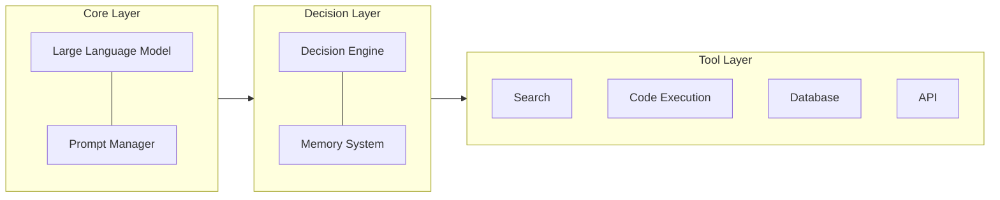

## What is an AI Agent?

An AI Agent is an AI system capable of **perceiving its environment, making autonomous decisions, and executing actions**. Unlike traditional single API calls, an Agent can:

- 🔄 **Loop execution**: Continuously adjust actions based on feedback
- 🛠️ **Tool calling**: Search the web, execute code, operate databases
- 📋 **Task planning**: Break down complex goals into actionable steps
- 🧠 **Memory management**: Maintain context and state over long conversations

## Architecture Design

A complete AI Agent system typically includes the following core components:



## Implementation Steps

### Step 1: Install Dependencies

```bash
pip install langchain langchain-anthropic tavily-python
```

### Step 2: Define Tools

```python
from langchain.tools import tool
from datetime import datetime

@tool
def get_current_time() -> str:
    """Get the current time"""
    return datetime.now().strftime("%Y-%m-%d %H:%M:%S")

@tool
def search_web(query: str) -> str:
    """Search the web to get real-time information"""
    from tavily import TavilyClient
    client = TavilyClient()
    results = client.search(query, max_results=3)
    return "\n".join([r["content"] for r in results["results"]])

@tool
def execute_python(code: str) -> str:
    """Execute Python code and return the result"""
    import subprocess
    result = subprocess.run(
        ["python", "-c", code],
        capture_output=True, text=True, timeout=10
    )
    return result.stdout or result.stderr
```

### Step 3: Create the Agent

```python
from langchain_anthropic import ChatAnthropic
from langchain.agents import create_tool_calling_agent, AgentExecutor
from langchain_core.prompts import ChatPromptTemplate

# Use Claude Sonnet 4.6 as the reasoning engine
llm = ChatAnthropic(model="claude-sonnet-4-6-20260217")

# Define the system prompt
prompt = ChatPromptTemplate.from_messages([
    ("system", """You are an intelligent assistant skilled in using tools to solve problems.
    Before answering a user's question, always consider if you need to use tools to gather information.
    If multiple steps are required, execute them sequentially."""),
    ("human", "{input}"),
    ("placeholder", "{agent_scratchpad}"),
])

# Assemble the Agent
tools = [get_current_time, search_web, execute_python]
agent = create_tool_calling_agent(llm, tools, prompt)
executor = AgentExecutor(agent=agent, tools=tools, verbose=True)
```

### Step 4: Run the Agent

```python
# Simple query
result = executor.invoke({
    "input": "Help me check NVIDIA's stock price today, and then calculate its growth over the past year."
})
print(result["output"])
```

The Agent's execution flow is roughly as follows:

1. **Understand objective**: Parse user intent, determine the need to search for stock information
2. **Search data**: Call `search_web` to get real-time stock prices
3. **Calculate and analyze**: Call `execute_python` to calculate the growth rate
4. **Organize output**: Generate a structured analytical report

## Model Selection Recommendations

| Requirements | Recommended Model | Reason |
|------|----------|------|
| Complex Agent tasks | Claude Opus 4.6 | The strongest Agentic capabilities and Computer Use |
| Daily Agent development | Claude Sonnet 4.6 | The best balance between speed and intelligence |
| Agents requiring deep reasoning | GPT-5.4 Thinking | Transparent thought chains, easier to debug |
| High-volume production environments | Gemini 3.1 Flash-Lite | Best cost-effectiveness |

## Best Practices

1. **Make tool descriptions precise**: LLMs decide when to call tools via their docstrings, the clearer the better.
2. **Limit the number of tools**: Keep it under 10 tools per Agent; too many will decrease selection accuracy.
3. **Add safety guardrails**: Set explicit permissions and controls for sensitive tools like code execution or database operations.
4. **Implement graceful degradation**: When tool calls fail, the Agent should be able to identify the failure and switch strategies.
5. **Monitoring and logging**: Record the input and output of every tool call to facilitate debugging and optimization.

## Advanced Directions

- **Multi-Agent Collaboration**: Multiple Agents working together to complete complex tasks.
- **RAG-Enhanced Agents**: Combining retrieval-augmented generation to let Agents securely access enterprise data.
- **Human-in-the-Loop**: Introducing manual review at critical decision points.
- **Persistent Memory**: Long-term, cross-session memory management capabilities.
