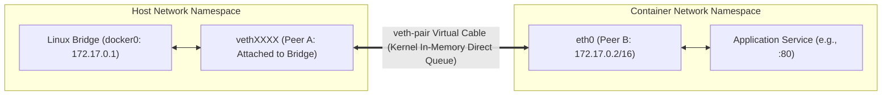
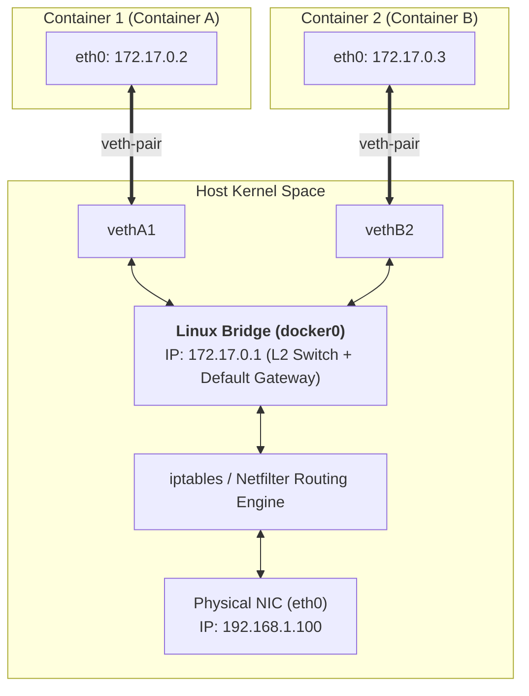
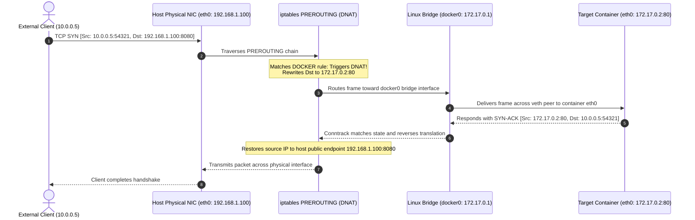
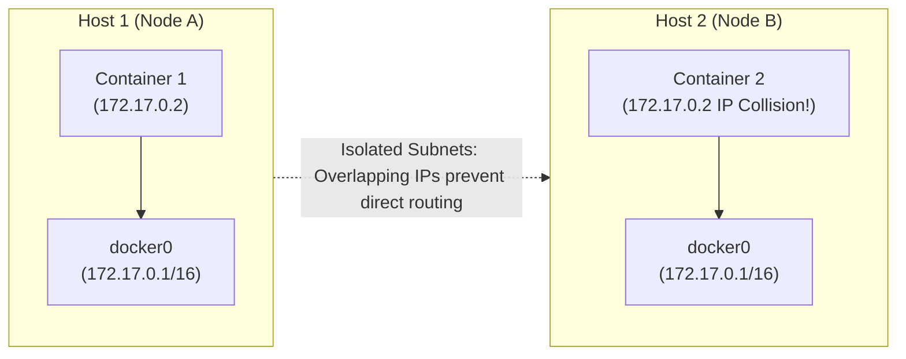

## Introduction: The "Isolated Island" of Network Namespaces

In Chapter 1 of this series, [Docker Internals from First Principles: Linux Namespaces, cgroups v2, and OverlayFS Union Mounts Deep Dive](/en/articles/docker-internals-namespace-cgroups-overlayfs/), we explored how the Linux kernel uses `CLONE_NEWNET` to build an absolute network boundary around a process.

When a process enters a fresh **Network Namespace**, it is initialized with an entirely isolated and initially empty network stack:
- Private network interface tables (containing only an unconfigured, `DOWN` loopback `lo` interface);
- An empty IP routing table (`ip route` outputs nothing);
- Independent port listening namespaces (a server listening on port `80` inside the container remains invisible to the host's port `80`);
- Private firewall filter sets (`iptables` and `nftables`).

If kernel development stopped here, a container would remain an **unreachable information island**—incapable of accepting inbound client HTTP traffic or querying remote database services.

How do the Linux kernel and Docker safely forward packets across this namespace boundary?

As the second chapter in **"From Docker to Kubernetes: Cloud-Native Container & Cluster Orchestration Handbook"**, this article analyzes container packet transmission from Layer 2 frame switching to Layer 4 address translation, covering **veth-pair**, **Linux Bridge (`docker0`)**, **iptables NAT**, and the cross-host scaling problem.

---

## 1. Virtual Cables Piercing Namespace Boundaries: The veth-pair Mechanism

In physical networking, the simplest method to interconnect two bare-metal servers is connecting them with a twisted-pair copper cable.

Within the Linux network subsystem, the software primitive fulfilling this function is the **veth (Virtual Ethernet Pair)** driver.



### 1.1 First Principles of the veth-pair Driver

veth devices are allocated strictly in pairs as bidirectional peer pipes:
- When a network packet buffer (`sk_buff`) is transmitted through one interface (e.g., `vethA`);
- The Linux kernel intercepts the frame, skips physical NIC driver layers, and **injects it directly into the receive queue of its peer (`vethB`)**;
- To `vethB`, the packet appears exactly as an incoming Ethernet frame arriving from a physical cable.

### 1.2 Hands-On Experiment: Manual Networking without Docker

To demonstrate veth-pair operations directly, we can manually construct an isolated container network using standard Linux iproute2 utilities:

```bash
# 1. Create a dedicated network namespace named "ns1"
ip netns add ns1

# 2. Allocate an interconnected veth pair: veth-host and veth-container
ip link add veth-host type veth peer name veth-container

# 3. Attach the veth-container interface into the ns1 namespace
ip link set veth-container netns ns1

# 4. Rename the interface to eth0 inside ns1, configure its IP, and bring it up
ip netns exec ns1 ip link set veth-container name eth0
ip netns exec ns1 ip addr add 192.168.100.2/24 dev eth0
ip netns exec ns1 ip link set eth0 up
ip netns exec ns1 ip link set lo up

# 5. Assign an IP to veth-host on the host and enable the link
ip addr add 192.168.100.1/24 dev veth-host
ip link set veth-host up

# 6. Ping the namespace from the host to verify packet transmission
ping -c 2 192.168.100.2
```

This sequence provides full end-to-end IP connectivity. These commands replicate the foundational network provisioning executed behind the scenes during container initialization.

---

## 2. The In-Kernel Layer 2 Switch: Linux Bridge (docker0)

A single veth-pair solves one-to-one communication between a container and its host. However, when a host manages 20 or 50 active containers, mesh connectivity using dedicated veth pairs scale at $O(N^2)$, resulting in unmanageable configuration complexity.

In physical data centers, host-to-host connectivity is aggregated via **Ethernet switches**. In the Linux kernel, this Layer 2 switching logic is implemented as a **Linux Bridge**, instantiated in Docker environments as **`docker0`**.

### 2.1 Layer 2 Forwarding and MAC Learning

When the Docker daemon starts, it instantiates the `docker0` bridge on the host and assigns it an RFC 1918 private subnet (typically `172.17.0.1/16`).

When a container is started via `docker run`:
1. Docker creates a new `veth-pair`;
2. Peer B is moved into the container namespace, renamed `eth0`, and assigned a private IP (e.g., `172.17.0.2`) alongside a virtual MAC address;
3. Peer A (e.g., `vethXXXX`) remains in the host namespace and **attaches directly to `docker0` as a virtual switch port**.



### 2.2 Intra-Host Packet Lifecycles: ARP and Switching

When **Container A (`172.17.0.2`)** targets **Container B (`172.17.0.3`)**, packet forwarding follows standard IEEE 802.1D switching rules:
1. **Route Resolution**: Container A inspects its routing table, identifies `172.17.0.3` as on-link within `172.17.0.0/16`, and transmits directly via Layer 2;
2. **ARP Broadcast**: Container A sends an ARP broadcast requesting the hardware MAC address of `172.17.0.3`;
3. **Bridge Flooding**: The ARP request traverses its veth link into `docker0`. The bridge floods the frame across all attached ports;
4. **MAC Learning**: Container B responds with its virtual MAC. The bridge logs Container B's MAC and port association into its Forwarding Database (FDB);
5. **Unicast Delivery**: Subsequent TCP/IP frames reaching `docker0` are switched directly into Container B's veth port.

**Key Technical Insight**: Intra-host inter-container communication across a standard Docker bridge remains entirely within local memory queues. **Packets never traverse the host's physical network interface or require Network Address Translation (NAT).**

---

## 3. Ingress and Egress: iptables SNAT and DNAT Packet Tracing

Communicating across physical networks introduces two structural routing challenges:
- **Egress (Container-to-Internet)**: Containers possess private RFC 1918 IPs (e.g., `172.17.0.2`). Public Internet gateways reject these addresses as unroutable;
- **Ingress (Internet-to-Container)**: Remote clients only know the host's physical public IP. They cannot directly target an internal container IP like `172.17.0.2:80`.

The Linux kernel resolves these routing barriers using **Netfilter and iptables**.

### 3.1 Egress Forwarding: The POSTROUTING Chain and MASQUERADE (SNAT)

When a container sends packets to an external destination (e.g., `8.8.8.8`), the packet leaves `docker0`, enters the host's IP stack, and routes toward physical interface `eth0`.

Before the packet leaves the physical interface, Netfilter hooks it within the `POSTROUTING` chain:

```bash
# Inspect the Docker SNAT rule in the iptables nat table
sudo iptables -t nat -S POSTROUTING
# Rule output:
# -A POSTROUTING -s 172.17.0.0/16 ! -o docker0 -j MASQUERADE
```

This rule functions as follows:
- **Matches packets originating from `172.17.0.0/16` leaving on an interface other than `docker0`**;
- **Executes a `MASQUERADE` target (Source NAT / SNAT)**;
- The kernel replaces the source IP (`172.17.0.2`) **with the host's physical IP (e.g., `192.168.1.100`)**, binding it to an ephemeral outbound port;
- Remote responses target the host IP directly. Netfilter's `conntrack` subsystem then translates the destination back to the container's private address.

### 3.2 Ingress Forwarding: The PREROUTING Chain and DNAT Port Mapping

When a container publishes a port using `-p 8080:80`, external requests to `http://<host-ip>:8080` are handled through **Destination NAT (DNAT)**:

```bash
# Inspect Docker DNAT rules
sudo iptables -t nat -S DOCKER
# Output rule:
# -A DOCKER ! -i docker0 -p tcp -m tcp --dport 8080 -j DNAT --to-destination 172.17.0.2:80
```



This inline address translation allows external clients to connect cleanly to containerized services behind private namespaces.

---

## 4. Container Network Drivers Compared

Docker provides multiple built-in network drivers designed for different deployment architectures:

| Network Driver | Namespace Isolation | Overhead | Reachability Scope | Best Use Cases |
| :--- | :--- | :--- | :--- | :--- |
| **Bridge (Default)** | Isolated Network Namespace | Moderate (Layer 2 bridge forwarding + iptables NAT) | Local host and bridge peers; external access requires port mappings | Standard microservices, web apps, isolated local multi-tier setups |
| **Host** | **Shares host Network Namespace directly** | **Near-zero (Bypasses bridge and NAT; bare-metal performance)** | Binds host IP and ports directly | High-throughput, latency-critical services (e.g., vLLM inference runtimes, video streaming) |
| **None** | Isolated namespace with only loopback `lo` | None | Fully air-gapped; no external connectivity | Secure offline processing, isolated token execution, air-gapped sandboxes |
| **Container** | **Reuses the namespace of an existing container** | Near-zero (`localhost` cross-process IPC) | Shares IP, interfaces, and port allocation with target container | **The foundational primitive behind multi-container Kubernetes Pods (Sidecars)** |
| **Macvlan** | Dedicated namespace bound directly to sub-interfaces on physical NIC | **Near-zero (Direct L2 forwarding, no NAT)** | Direct L2 subnet IP; reachable directly across physical switches | Legacy virtualization migrations, telecommunications appliances |
| **Overlay** | Virtual multi-host L2 network | Moderate (VXLAN 50-byte packet encapsulation overhead) | Flat, routable addressing across distributed host clusters | **Core engine for Docker Swarm and classic multi-node clusters** |

> [!NOTE]
> **The Kubernetes Pod Networking Mechanism**: In Kubernetes, containers within a Pod communicate via `localhost` and share an IP because the cluster runtime initializes a lightweight **Pause container** first. Subsequent application containers attach directly to its Network Namespace using `--net=container:pause`.

---

## 5. Moving from Single-Host to Multi-Node Clusters

While Linux bridges and iptables handle single-host traffic effectively, distributed enterprise architectures run across tens or hundreds of machines, exposing fundamental limitations:



1. **Subnet Collisions**: By default, each independent host instantiates an isolated `docker0` bridge on `172.17.0.0/16`. Containers on different hosts frequently receive identical IP assignments (e.g., `172.17.0.2`), preventing direct cross-host routing;
2. **Port Allocation Bottlenecks**: Relying on host-mapped ports (`-p`) creates port exhaustion across large fleets and complicates external service discovery.

To resolve these challenges, multi-node orchestrators introduce **Overlay Networks**, establishing virtual Layer 2 fabrics across disparate Layer 3 physical networks.

In Chapter 3, we explore **[Lightweight Cluster Orchestration: Docker SwarmKit Internals, Raft Consensus, and Ingress Routing Mesh](/en/articles/docker-swarm-architecture-raft-routing-mesh/)**, examining how VXLAN encapsulation and Raft consensus enable multi-host networking.

---

## Frequently Asked Questions (FAQ)

### Q1: Why does bridge-mode networking with iptables NAT experience latency spikes under high-throughput API workloads?
This bottleneck stems from **Linux Netfilter connection tracking (`conntrack`) table limits and lock contention**:
Every NAT-translated flow creates an entry in the kernel's conntrack table. Under heavy connection rates, this table can exhaust its allocation, logging `nf_conntrack: table full, dropping packet` and dropping inbound traffic. Furthermore, updating connection state hashes creates spinlock contention across multi-core processors.
**Mitigation**: For high-throughput services, use `--net=host` to bypass Netfilter translation entirely, scale `net.netfilter.nf_conntrack_max`, or migrate to modern eBPF-based socket routing.

### Q2: Why can containers on the default bridge network ping each other via IP, but not by container name?
This behavior is an intentional security design in Docker:
The default global `bridge` (`docker0`) **disables automatic container name resolution** to prevent unwanted inter-container service discovery by default.
To enable name-based service resolution, provision a **user-defined bridge network** using `docker network create my-net`. User-defined bridges automatically launch an embedded DNS resolver at `127.0.0.11:53` inside every attached container, providing zero-configuration discovery.

### Q3: Why is Macvlan rarely used in public cloud environments despite its near-bare-metal network performance?
While Macvlan delivers low latency by binding virtual MAC addresses directly to physical switch ports, it faces practical operational limitations:
1. **Switch MAC Table Exhaustion**: Physical top-of-rack switches have finite CAM table capacity. Running hundreds of Macvlan containers on a host can saturate switch tables;
2. **Cloud VPC Anti-Spoofing Protections**: Hypervisors in clouds like AWS and Google Cloud drop traffic from unassigned MAC addresses to prevent MAC spoofing, breaking Macvlan traffic;
3. **Host-to-Container Hairpinning Limits**: By default, the host cannot reach its own child Macvlan containers directly through its primary physical IP, requiring auxiliary macvlan bridge sub-interfaces.
