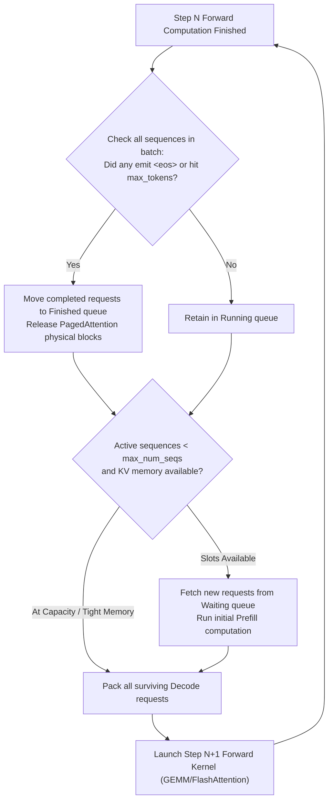
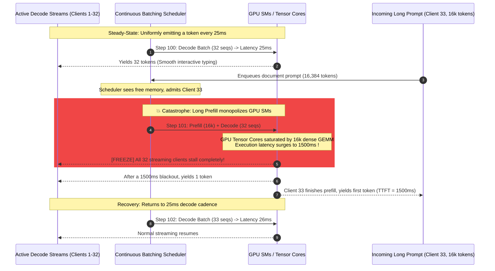
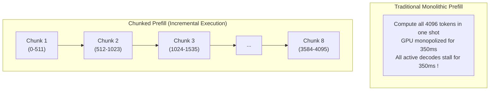
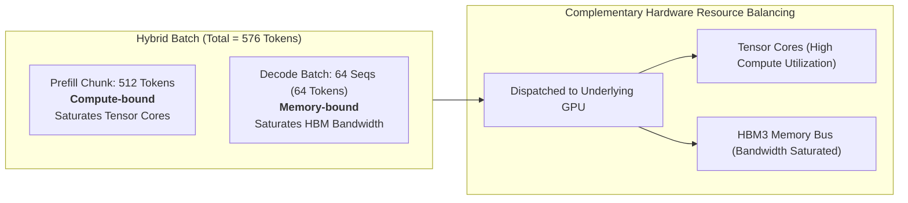
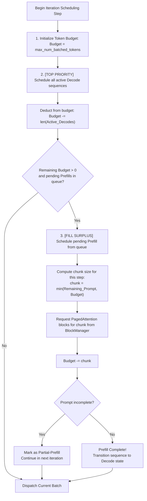

## Introduction: Beyond the Memory Wall, the Scheduling Wall Rises

In the first two chapters of this series, we laid down the physical and architectural foundations of LLM inference systems:
1. In [Roofline Model and Prefill vs Decode Physical Divergence](/en/articles/inference-roofline-prefill-decode/), we quantified why Prefill is **compute-bound** while Decode is heavily **memory-bandwidth bound**, formulating the iron rule that increasing batch size is the only way to rescue Decode hardware utilization;
2. In [PagedAttention and Virtual Memory Management](/en/articles/pagedattention-memory-virtualization/), we demonstrated how paged memory pools and dynamic block indirection eliminated internal and external fragmentation, compressing memory waste from 80% down to under 4% and clearing the physical ceiling for large batch sizes.

However, when engineering teams confidently scale up concurrency in production clusters, they run headfirst into a secondary, equally frustrating obstacle: **the Scheduling Wall**.

On operational monitoring dashboards, engineers frequently observe an alarming anomaly:
- **Erratic GPU utilization**: Average compute utilization hovers comfortably at 50%~60%, yet Time Per Output Token (TPOT) exhibits **abysmal, catastrophic latency spikes (P99 tail latency surging into seconds)**;
- **Choppy, stuttering streaming output**: The interactive typewriter effect experienced by end users is far from smooth. While streaming at a brisk 40 tokens per second, the generation **suddenly freezes without warning for 1 to 2 seconds**, before abruptly discharging a burst of text like an opened floodgate.

The culprit behind this tail-latency chaos is one of the most notorious phantoms in multi-turn, long-context serving: **Head-of-Line Blocking (HoL Blocking)**.

To conquer head-of-line blocking, LLM scheduling architectures have undergone a tectonic paradigm shift over the past several years: **from rigid, classical Static Batching inherited from the CNN/BERT era, to Orca's breakthrough Iteration-Level Continuous Batching, and finally to Chunked Prefill championed by Sarathi-Serve and vLLM**.

This chapter explores the scheduler internals across these milestones, unpacking the state-machine transitions, the physics of compute/memory "piggybacking", and the subtle engineering challenges of heterogeneous attention kernels.

---

## 1. The Classical Era: Static Batching and Straggler Inefficiencies

During the initial surge of LLMs in 2022, serving frameworks universally inherited **Static Batching (Request-level Batching)** from conventional computer vision and discriminative NLP workloads.

### 1.1 How Static Batching Works

```mermaid
gantt
    title Static Batching Bottleneck: Straggler Problem and Resource Wastage
    dateFormat X
    axisFormat %s
    section Request 1 (40 toks)
    Prefill (20)       :active, p1, 0, 5
    Decode (20)        :crit, d1, 5, 25
    Pad Idle Waiting   :done, w1, 25, 100
    section Request 2 (10 toks)
    Prefill (5)        :active, p2, 0, 3
    Decode (5)         :crit, d2, 3, 8
    Pad Idle Waiting   :done, w2, 8, 100
    section Request 3 (100 toks)
    Prefill (10)       :active, p3, 0, 4
    Decode (90)        :crit, d3, 4, 94
    Freed              :done, w3, 94, 100
    section Request 4 (Straggler)
    Prefill (15)       :active, p4, 0, 5
    Decode (95)        :crit, d4, 5, 100
    section Newly Arrived
    Request 5 (Blocked) :milestone, m1, 10, 10
    Waiting in queue until static batch finishes... :done, q1, 10, 100
```

In static batching, the scheduler maintains an incoming request queue. Once enough requests arrive to form a target batch size (e.g., $B=4$) or a maximum wait timeout expires, the system bundles the requests into a single tensor shape. **This batch is locked into GPU execution for its entire lifecycle until every single sequence in the batch emits the `<eos>` termination token.**



### 1.2 The Twin Flaws of Static Batching

This rigid design leads to catastrophic computational waste under autoregressive workloads:

1. **Padding Bubbles (Straggler Overhead)**:
   The sequence generation length in generative LLMs is fundamentally unpredictable. If Request 2 completes after producing only 5 tokens, while Request 4 in the same batch runs for 95 tokens, Request 2 must continue to be padded with dummy `<pad>` tokens across the remaining 90 iterations.
   
   For a batch of $B$ sequences where request $i$ takes $L_i$ steps, the actual compute utilization is:
   $$\eta_{\text{compute}} = \frac{\sum_{i=1}^B L_i}{B \times \max_{1 \le i \le B}(L_i)}$$
   When request lengths vary significantly, $\eta_{\text{compute}}$ frequently plunges below 20%. **More than 80% of forward-pass FLOPs are wasted computing meaningless padding tokens.**

2. **Head-of-Line Queue Delay**:
   Throughout the tens of seconds required for a static batch to finish, the GPU is completely locked down. Even if dozens of short, interactive requests arrive in the queue, they must wait indefinitely until the slowest straggler in the active batch terminates.

---

## 2. The Orca Revolution: Iteration-Level Continuous Batching

In 2022, researchers from Microsoft Research and Seoul National University presented a seminal paper at OSDI: *Orca: A Distributed Serving System for Transformer-Based Generative Models*. Orca introduced what is now the foundational execution spine of modern LLM engines: **Iteration-Level Scheduling**, commonly referred to as **Continuous Batching (or Cellular / Dynamic Batching)**.

### 2.1 The Paradigm Shift: Scheduling at the Step Boundary

Orca's core thesis was profound: **Autoregressive transformer inference is not a monolithic forward pass, but a series of discrete, incremental step iterations. Therefore, the atomic granularity of scheduling must be the single forward step, rather than the lifetime of a request.**

At every step boundary between consecutive autoregressive token generations, the scheduler re-evaluates and dynamically reshapes the active batch:
- **Immediate Retirement**: Whenever a sequence emits `<eos>` or reaches its maximum token limit, it is evicted immediately at the end of that step, freeing its slot and memory pages;
- **Dynamic Insertion**: If the scheduler detects available capacity (free slots and sufficient KV memory), it instantly admits new pending requests from the waiting queue into the very next iteration.



### 2.2 Operational Comparison: Annihilating the Padding Bubble

Under continuous batching, individual sequence lifecycles are fully decoupled. Short requests complete and depart immediately, allowing new requests to fill the void, keeping GPU slots saturated:

| Scheduling Metric | Static Batching (Request-Level) | Orca Continuous Batching (Iteration-Level) |
| :--- | :--- | :--- |
| **Scheduling Granularity** | Request lifecycle (entire generation) | Single forward step iteration |
| **Padding Bubble Overhead** | Severe (bounded by longest sequence, 50%~80% waste) | Near-zero (sequences depart immediately upon completion) |
| **GPU Utilization Profile** | Sawtooth degradation over time | Sustained high utilization with dynamically filled slots |
| **System Throughput** | Baseline (1.0x) | **Dramatic 3x to 10x throughput surge** |
| **Queue Latency for New Requests**| Dreadful (must wait for full batch completion) | **Outstanding (admitted on the very next iteration step)** |

Orca set the gold standard for vLLM, Hugging Face TGI, TensorRT-LLM, and SGLang. Yet, just as the industry celebrated the death of padding waste, the arrival of long-context models unleashed a devastating new problem.

---

## 3. The Fatal Flaw: Long Prefills and Head-of-Line (HoL) Blocking

Continuous batching operates smoothly under an implicit, foundational assumption: **each iteration step executes in roughly uniform, predictable, and brief wall-clock time.**

In real-world production systems handling variable document sizes, codebases, and retrieval-augmented generation (RAG), this assumption breaks down completely.

### 3.1 The Compute Disparity Between Prefill and Decode

As established in our [Roofline Model analysis](/en/articles/inference-roofline-prefill-decode/), the compute requirements for Prefill and Decode are separated by orders of magnitude:
- **Decode Step Latency**: In a 70B parameter model (e.g., LLaMA-3-70B running on an 8x A100/H100 node), generating a single token per sequence across a batch of 32 requests takes approximately **$15\text{ms} \sim 35\text{ms}$**. This delivers a responsive, pleasant 30 to 60 tokens/second streaming experience;
- **Long Prefill Step Latency**: When a single request arrives carrying a 16,384-token prompt, the system must process all 16k tokens in an attention-heavy forward pass. On an 8x H100 node running a 70B model, executing this single prefill takes **$800\text{ms} \sim 2500\text{ms}$**!

### 3.2 The Physical Reality of Head-of-Line Blocking

When a continuous batching scheduler decides to admit a long-prompt request into the active batch, the entire GPU pipeline freezes for ongoing decodes:



During this pause, 32 users who were enjoying steady 25ms output streams experience a **1.5-second freeze on their screens**:
- **For active users**: TPOT instantly surges from 25ms to 1500ms, creating a vicious vertical spike on P99 and P99.9 latency graphs;
- **For newly arriving users**: Short requests stuck behind a queue of long prefills suffer massive queue delays before emitting their first token.

This is the central bottleneck in modern LLM serving: **monolithic prefill bursts monopolize shared execution pipelines, inducing catastrophic head-of-line blocking on latency-sensitive decode streams.**

---

## 4. The Sarathi-Serve Breakthrough: Chunked Prefill and Decode Piggybacking

To eradicate head-of-line blocking, researchers from Microsoft Research and IIT Delhi published a landmark paper at OSDI 2024: *Taming Throughput-Latency Tradeoff in LLM Serving with Sarathi-Serve*. Sarathi-Serve introduced **Chunked Prefill** and **Decode-Maximal Batching**.

This architecture was promptly integrated into **vLLM** (where it serves as the default engine design in vLLM V1) and **SGLang**.

### 4.1 The Core Concept: Slicing the Prefill

If executing 16,384 prompt tokens at once takes 1500ms, **why must the prompt be computed all at once in a single forward pass?**

Chunked Prefill enforces a simple, powerful rule: **impose a strict upper bound on the number of prompt tokens processed per step (Chunk Size $C$, typically 512 or 1024). When a long prompt arrives, the scheduler splits it into equal-sized chunks, processing them incrementally across consecutive forward steps.**

For a prompt with $L = 4096$ tokens and a chunk budget of $C = 512$:
- It is no longer a single, blocking 350ms monolith;
- It is sliced into $(4096 / 512) = 8$ manageable chunks;
- The scheduler executes **only 512 prompt tokens per step**, continuously appending the intermediate KV cache entries into PagedAttention physical blocks across 8 iterations.



### 4.2 Decode Piggybacking on Compute Surplus

If prefill chunks still require computation, how does slicing them improve overall serving throughput?

The answer lies in the **Roofline Model arithmetic intensity headroom** we derived in Chapter 1:

- **Decode Underutilization**: During autoregressive decoding, even at a batch size of $B=64$, operational intensity lingers around $10 \sim 30\text{ FLOPs/Byte}$, far below an H100 GPU's ridge point ($I_{\text{ridge}} \approx 150\text{ FLOPs/Byte}$). **Tensor Cores spend the majority of their cycles idling while waiting for HBM to deliver weights and KV caches**;
- **Prefill Chunk Compute Saturation**: A 512-token GEMM possesses an arithmetic intensity that comfortably surpasses the ridge point, driving Tensor Cores to peak compute saturation;
- **Piggybacking**: In each forward step, the scheduler packs **one 512-token Prefill Chunk together with all active Decode sequences (e.g., 64 tokens)** into a single, unified execution batch!



This hybrid scheduling produces three massive systems advantages:
1. **Zero-Cost Decode Piggybacking**: Because the 512-token prefill chunk already activates the streaming multiprocessors (SMs) for compute-intensive GEMMs, processing 64 decode tokens concurrently incurs virtually negligible additional latency (e.g., increasing step latency marginally from 35ms to 40ms);
2. **Elimination of Latency Cliff**: Step execution time is strictly capped by the chunk size budget $C=512$. A 1500ms freeze becomes physically impossible. Active streaming clients continue outputting tokens on a stable $\sim 35\text{ms}$ cadence, **flattening P99 TPOT spikes by 80%~95%**;
3. **Enhanced Global Throughput**: Concurrently utilizing both compute units and memory bandwidth maximizes overall Model FLOPs Utilization (MFU).

---

## 5. Engineering Deep Dive: Token Budget Schedulers and Unified Kernels

While Chunked Prefill is conceptually elegant, deploying it inside high-performance inference engines like vLLM and SGLang presents intricate low-level challenges.

### 5.1 The Token Budget State Machine in vLLM

In a chunked-prefill-enabled scheduler, the primary scheduling constraint is no longer the sequence count, but the **Token Budget**.

In vLLM, this is governed by `max_num_batched_tokens` (the maximum cumulative tokens permitted in a single iteration step, e.g., 2048):



> **The Golden Rule: Decode Strict Priority**.
> The scheduler always prioritizes ongoing decode requests to prevent streaming stutter. Only the leftover token capacity (`Budget - num_decodes`) is allocated to incoming prefill chunks.

### 5.2 The Unified Attention Kernel Challenge

When a single batch mixes both a Prefill Chunk (e.g., 512 tokens) and multiple Decode sequences (e.g., 64 tokens, each with length 1), the underlying neural network layers encounter conflicting tensor shapes:

In linear projection and FFN layers:
- Prefill input tensor: $X_{\text{prefill}} \in \mathbb{R}^{512 \times D}$
- Decode input tensor: $X_{\text{decode}} \in \mathbb{R}^{64 \times D}$

Flattening these yields a standard dense input matrix $X_{\text{batched}} \in \mathbb{R}^{576 \times D}$. Linear GEMMs can execute this contiguous shape at maximum throughput via standard CUBLAS or CUTLASS kernels.

**However, Self-Attention reveals a sharp algorithmic contradiction:**
1. **Prefill Chunk Attention**: Demands causal self-attention across the 512 new tokens, combined with cross-attention against **all historical KV blocks already stored in PagedAttention memory from earlier chunks**;
2. **Decode Attention**: The query length is exactly 1 ($Q \in \mathbb{R}^{1 \times D}$). Attention is purely a vector-matrix dot product querying the sequence's entire historical KV cache.

**How can an engine execute both attention patterns inside a single GPU kernel without incurring launch overhead?**
- **Legacy Dual-Stream Approach**: Schedulers launched two parallel CUDA streams—one running `FlashAttention` for prefill and another running `PagedAttention` for decode. However, concurrent streams sharing SM resources cause severe L2 cache contention and thread-block serialization;
- **Modern Unified Kernels (e.g., FlashInfer / vLLM V1 Hybrid Attention)**: State-of-the-art engines dispatch a unified hybrid attention kernel. Thread blocks inspect token metadata to dynamically determine whether a warp is evaluating a prefill chunk or a single decode query, executing both within a single fused kernel launch and eliminating multi-stream synchronization overhead.

---

## 6. Production Tuning and Trade-Off Analysis

Configuring Chunked Prefill in production requires balancing latency SLAs against raw system throughput.

### 6.1 Recommended vLLM Production Configuration

```bash
# Recommended production command for LLaMA-3-70B-Instruct on 8x H100
vllm serve meta-llama/Meta-Llama-3-70B-Instruct \
    --tensor-parallel-size 8 \
    --enable-chunked-prefill \
    --max-num-batched-tokens 2048 \
    --max-num-seqs 256 \
    --gpu-memory-utilization 0.90 \
    --block-size 16
```

Key parameter guidelines:

1. **`--enable-chunked-prefill`**:
   Enables chunked prefill scheduling. In vLLM V1, this is integrated natively into the core engine;
2. **`--max-num-batched-tokens` (The Primary Knob)**:
   The maximum token budget processed per forward step.
   - **Set too small (e.g., 512)**: Prefills are sliced too finely. Tensor Cores fail to achieve saturation arithmetic intensity, slightly increasing total Time to First Token (TTFT) and lowering overall cluster throughput;
   - **Set too large (e.g., 8192)**: Step execution times expand back toward 150ms~300ms, compromising the stability of P99 TPOT;
   - **Sweet Spot**: On A100/H100 hardware running 70B models, **setting this value between 2048 and 4096** achieves an optimal Pareto frontier, maintaining $\sim 40\text{ms}$ TPOT while keeping TTFT low;
3. **`--max-num-seqs`**:
   Caps the maximum concurrent active sequences. Must be tuned alongside physical KV memory capacity to prevent excessive preemption.

### 6.2 Architectural Trade-Offs to Keep in Mind

Chunked Prefill introduces two engineering trade-offs that architects must account for:

1. **Marginal TTFT Inflation**:
   A 4096-token prompt that could theoretically complete in 350ms monolithic execution may take $380\text{ms} \sim 420\text{ms}$ when sliced across 8 steps alongside decode traffic. This minor increase in first-token latency is universally considered a worthwhile trade to protect dozens of concurrent streaming sessions from freezing;
2. **Intermediate KV Block Allocation Overhead**:
   Because long prompts are processed in stages, intermediate key-value states must be promptly flushed into physical PagedAttention blocks at each step boundary, placing higher demands on the BlockManager metadata lifecycle.

---

## 7. Comprehensive Taxonomy: Static vs Continuous vs Chunked Batching

| Evaluation Dimension | Static Batching | Orca Continuous Batching | Chunked Prefill (vLLM / Sarathi) |
| :--- | :--- | :--- | :--- |
| **Pioneering Reference** | Traditional Deep Learning | OSDI 2022 (Orca) | OSDI 2024 (Sarathi-Serve) |
| **Scheduling Granularity** | Request lifecycle (monolithic batch)| Iteration forward step | Token budget dynamic chunk |
| **Padding Bubble Waste** | Severe (bounded by longest sequence) | Zero padding waste | Zero padding waste |
| **Long Prompt Impact** | Stalls entire batch for minutes | **Severe Head-of-Line Blocking**<br/>Stalls active decodes for seconds | **Completely Eliminates HoL Blocking**<br/>Smooth, bounded iteration steps |
| **TPOT (P99 Tail Latency)** | Irregular, high variance | **Frequent 10x-50x spikes** | **Rock solid (consistently 20-40ms)**|
| **TTFT (Time to First Token)**| Unpredictable queue delays | Fast (starts on next iteration) | Slightly higher compute time, but lower queue delay |
| **GPU Hardware Efficiency** | Very low (MFU &lt; 20%) | Medium (MFU 30%-45%) | **High (MFU 50%-65%, compute/memory overlap)** |
| **Kernel Implementation** | Dense static GEMMs | Variable-length Ragged GEMMs | Unified Hybrid Attention Kernels |

---

## Frequently Asked Questions (FAQ)

### Q1: Since Chunked Prefill slightly increases overall prefill wall-clock time, are there production scenarios where it should be disabled?

Yes. Chunked Prefill should generally be disabled for **Offline Batch Processing** workloads. Examples include large-scale offline document extraction, offline embedding generation, or asynchronous evaluation benchmarks.

In offline pipelines, there are no live human users observing interactive typewriter streams. The system is indifferent to TPOT jitter or streaming responsiveness; the sole objective is maximizing **total throughput (Tokens per Second per Dollar)**. Monolithic prefills maximize GEMM matrix dimensions without paying chunk slicing and state-machine overhead.

Conversely, for any **online, interactive streaming service (chatbots, code completion, agent loops)**, Chunked Prefill is an essential, mandatory configuration.

### Q2: With Chunked Prefill enabled, why might requests still suffer from preemption (recomputation or swapping)?

Chunked Prefill manages **compute scheduling**, but it does not expand the **physical capacity of GPU memory**.

Under sustained, heavy traffic spikes, physical KV cache blocks managed by PagedAttention can still become completely exhausted. When no free blocks remain, the engine must trigger **preemption**:
1. **Recomputation (Drop & Recompute)**: The scheduler aborts one or more active decode sequences, frees their KV blocks back to the pool, and moves them back to the Waiting queue. Once memory pressure subsides, these requests restart from prefill;
2. **Swapping**: The scheduler evicts the victim's KV blocks across PCIe to host CPU RAM (swap out) and restores them when GPU memory frees up (swap in).

To avoid frequent preemption, operators must avoid setting `--max-num-seqs` excessively high and maintain a safe memory watermark (e.g., `--gpu-memory-utilization 0.90`).

### Q3: If Chunked Prefill successfully overlaps compute and memory, why is the industry pursuing Prefill-Decode Disaggregation (P/D Disaggregation)?

Chunked Prefill resolves the prefill/decode conflict **within a single physical node**, but it still forces both phases to share the same physical GPUs, HBM buses, and SM clusters:
1. **Hardware Mismatch**: Prefill demands peak FP16/FP8 FLOPs (e.g., compute-dense accelerators like H100 SXM), whereas Decode primarily demands massive HBM bandwidth and capacity (e.g., H200 or lower-cost, high-capacity memory nodes). Co-locating them forces all nodes to purchase expensive, top-tier compute cards;
2. **Inter-Node Interference**: In massive enterprise clusters, separating prefill and decode across dedicated node pools (connected by high-speed RDMA networks for KV cache transfer, such as in Mooncake or vLLM V1 Disaggregated Serving) achieves true hardware specialization and isolation.

In an upcoming chapter of this series, we will explore **Mooncake and Prefill-Decode Disaggregation Systems**, examining how distributed systems engineers decouple LLM inference across data center fabrics.
