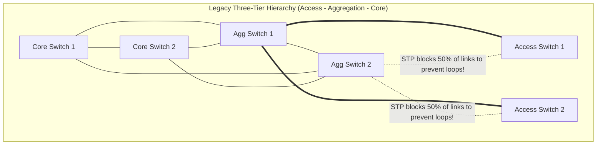
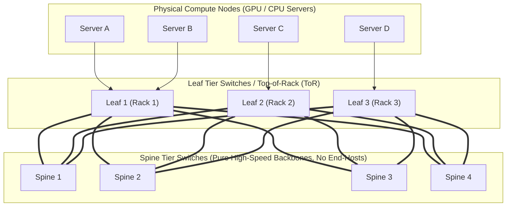
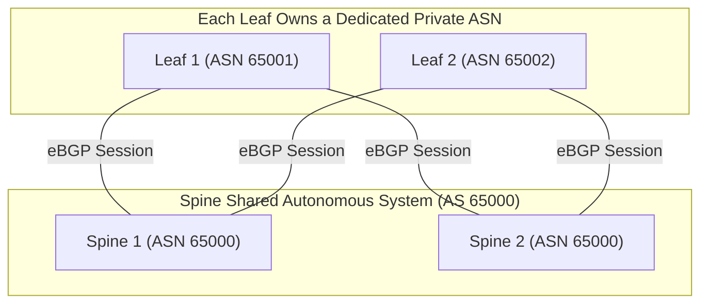
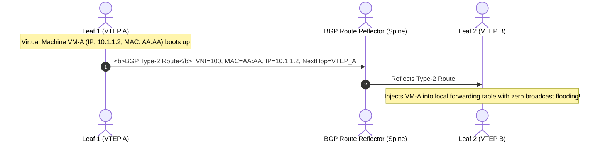

## Introduction: From North-South Enterprise Traffic to East-West AI Computation Torrents

In Chapter 7 of our masterclass, [Linux Kernel Networking Subsystem in Depth: From NIC Drivers, NAPI, and Ring Buffers to eBPF XDP Wire-Speed Forwarding](/en/articles/linux-kernel-networking-napi-ring-buffer-skbuff-xdp/), we explored how a host operating system optimizes packet paths and leverages eBPF for microsecond forwarding.

However, when thousands of servers are racked into modern cloud facilities and 10,000-GPU AI compute clusters, the physical network challenges scale exponentially.

In the traditional enterprise IT era, data center traffic was predominantly **North-South (client-to-server)**. Physical topologies were structured around the classic three-tier hierarchy: Access, Aggregation, and Core.

To prevent Layer-2 broadcast loops, switches ran **STP (Spanning Tree Protocol)**, deliberately blocking half of all physical links:
- **50% stranded bandwidth**: Half of all costly optical links remained idle as passive standbys;
- **Severe oversubscription bottlenecks**: As rack densities increased, upstream bandwidth between aggregation and core tiers suffered from severe oversubscription ratios (10:1 or 20:1);
- **Unpredictable East-West latency**: When Server A communicated with Server B in the same facility, packets had to climb all the way to the core switches and descend back, enduring multiple hops of queueing delays.

With the rise of cloud computing, microservices, distributed object stores, and the explosion of **10,000-GPU distributed AI training clusters in 2026**, **East-West traffic (server-to-server)** now accounts for over 80% of all data center packets!

Traditional three-tier STP networks collapsed under this load. To deliver predictable, high-bandwidth, ultra-low-latency connectivity between any pair of hosts, modern data center fabrics underwent a ground-up revolution.

---

## 1. Architectural Paradigm Shift: Traditional 3-Tier Networks vs Modern 2-Tier Leaf-Spine

Understanding modern hyperscale fabrics requires understanding what they replaced: the legacy three-tier network.



### 1.1 Three Fatal Flaws of Traditional Three-Tier Networks
1. **STP Link Waste**: To prevent Layer-2 broadcast loops, Spanning Tree Protocol (STP) disables half of all physical uplink connections. Half of the expensive optical cabling sits idle in blocking state, cutting bandwidth utilization to 50%;
2. **Severe Oversubscription**: 48 servers connect to an Access switch (48 Gbps aggregate), but the uplinks to Aggregation switches often total only 2 to 4 Gbps—an **oversubscription ratio of 12:1 to 24:1**! When multiple servers burst concurrently, aggregation buffers quickly overflow;
3. **East-West Latency Jitter**: Inter-rack server communication requires 4 switch hops (Access $\to$ Agg $\to$ Core $\to$ Agg $\to$ Access), amplifying queueing jitter across multiple tiers.

---

## 2. Clos Switching Theory and Modern Leaf-Spine Topologies

The mathematical foundation of modern data center networking was established in 1953 by Bell Labs mathematician Charles Clos in his seminal paper on multi-stage telephone switches—the **Clos Network**. Modern fabrics implement this as a **2-Tier Leaf-Spine architecture**:

### 1.1 2-Tier Leaf-Spine (Folded Clos Architecture)



#### Topological Rules
1. **Full Mesh Interconnection**: Every Leaf switch connects directly to every Spine switch;
2. **Horizontal Tier Isolation**: No Spine-to-Spine links, and no Leaf-to-Leaf links;
3. **Deterministic Latency**: For Server A in Rack 1 to communicate with Server D in Rack 3, **the packet traversal path is strictly fixed at 3 switch hops (Leaf 1 $\to$ any Spine $\to$ Leaf 3)**, completely eliminating hop-count jitter.

### 1.2 Non-blocking Fabrics and Oversubscription Ratio Mathematics

The standard metric for potential network congestion is the **Oversubscription Ratio ($R$)**:

$$R = \frac{\text{Total Downlink Bandwidth Facing Servers}}{\text{Total Uplink Bandwidth Facing Spines}}$$

Consider a 64-port 400 Gbps Leaf switch:
- Downlinks: 32 ports connected to servers at 400 Gbps each = $32 \times 400\text{ Gbps} = 12.8\text{ Tbps}$;
- Uplinks: 32 ports connected to 32 Spine switches at 400 Gbps each = $32 \times 400\text{ Gbps} = 12.8\text{ Tbps}$.

The resulting oversubscription ratio is:

$$R = \frac{12.8\text{ Tbps}}{12.8\text{ Tbps}} = 1:1$$

- **1:1 Non-blocking Fabric**: Even if all servers in the rack transmit full wire-speed traffic simultaneously to external nodes, zero uplink contention occurs! For mission-critical AI training fabrics, a 1:1 ratio is mandatory;
- **Hyperscale 3-Tier Clos Fabrics**: When server counts exceed the port capacity of a 2-tier design (scaling from thousands to tens of thousands of hosts), data centers deploy Pod-based architectures with **Super-Spine switches**, forming a 5-stage (3-Tier Folded) Clos network.

---

## 2. Underlay Routing: eBGP and ECMP Hash Polarization

With physical cabling in place, how do we distribute traffic evenly across all Spine switches without loops? Modern hyperscalers employ **Layer 3 routing down to the Top-of-Rack (ToR) switch**.

RFC 7938 (authored by engineers from Facebook/Meta and Arista) defined the industry standard for hyperscale Underlays: **eBGP (external BGP)**.



### 2.1 Why eBGP Over OSPF/IS-IS?
1. **Minimal Blast Radius**: OSPF and IS-IS are Link-State protocols using Dijkstra's algorithm. A single flapping optical link triggers fabric-wide LSA floods and shortest-path (SPF) recalculations, risking CPU exhaustion. eBGP is a Path-Vector protocol with built-in route damping and step-by-step filtering;
2. **Loop Prevention via AS_PATH**: BGP nodes discard any route advertisement containing their own ASN, eliminating routing loops natively.

### 2.2 ECMP and Hash Polarization

When forwarding packets toward a remote subnet, a Leaf switch sees multiple equal-cost paths across the Spines. Switch ASICs compute a hash over the packet's **5-tuple (Source IP, Destination IP, Protocol, Source Port, Destination Port)**:

$$\text{Egress Port} = \text{Hash}(\text{SrcIP, DstIP, Protocol, SrcPort, DstPort}) \pmod N$$

#### The Hazard: Hash Polarization
If Leaf switches and Spine switches execute the **identical, unperturbed polynomial hash function**:
- The Leaf switch splits odd-hashed flows to Spine 1 and even-hashed flows to Spine 2;
- When packets reach the Spine, the Spine evaluates the same hash function on the same 5-tuple, causing flows to **concentrate onto the same downstream egress port**, while parallel links sit starved!
- **Engineering Solution**: Modern switch ASICs introduce unique, tier-specific **Hash Seeds (salts)** and support **Dynamic Load Balancing (DLB)**, which monitors queue depths at microsecond granularity to steer sub-flows (Flowlets) away from congested links.

---

## 3. Overlay Virtualization: EVPN-VXLAN in Depth

While the physical Underlay provides high-speed Layer 3 transport, multi-tenant cloud environments and Kubernetes container fabrics require seamless **Layer 2 network abstractions across physical nodes**.

### 3.1 VXLAN: MAC-in-UDP Encapsulation

VXLAN (RFC 7348) encapsulates guest Layer-2 Ethernet frames inside standard physical UDP datagrams:

```text
VXLAN Packet Encapsulation Hierarchy:
+-------------------------------------------------------------------------+
| Outer Ethernet Header (Outer MAC): Egress NIC MAC -> Next-Hop MAC      | 14B
+-------------------------------------------------------------------------+
| Outer IP Header       (Outer IP) : VTEP_A IP -> VTEP_B IP (L3 Underlay) | 20B
+-------------------------------------------------------------------------+
| Outer UDP Header      (Outer UDP): SrcPort(5-Tuple Hash) -> DstPort 4789| 8B
+-------------------------------------------------------------------------+
| VXLAN Header          (Flags + 24-bit VNI, 16 Million Tenants)          | 8B
+-------------------------------------------------------------------------+
| Inner Ethernet Header (Inner MAC): VM_A MAC -> VM_B MAC                | 14B
+-------------------------------------------------------------------------+
| Inner Payload         (Inner IP/TCP/Payload): Original Guest Packet     | ~1460B
+-------------------------------------------------------------------------+
```

1. **Shattering the 4096 VLAN Limit**: VXLAN provides a **24-bit VNI (VXLAN Network Identifier)**, scaling to over $16.7\text{ million}$ isolated virtual tenant networks;
2. **ECMP Load Balancing via Outer UDP Source Port**: The VTEP hashes the inner 5-tuple into the outer UDP source port. Intermediate Underlay Spine/Leaf switches do not need to understand VXLAN; standard ECMP distributes encapsulated packets across all spine links;
3. **Mandatory Jumbo Frames**: The outer headers introduce $14 + 20 + 8 + 8 = 50$ bytes of encapsulation overhead. To prevent 1500-byte guest frames from fragmenting, **Underlay physical switch ports must be configured with an MTU of 9000 or 9216 bytes!**

### 3.2 The Control Plane Solution: MP-BGP EVPN

Early VXLAN relied on flood-and-learn multicast to discover MAC addresses, frequently flooding the physical fabric with broadcast ARP storms.

**EVPN (RFC 7432 / RFC 8365)** employs MP-BGP as an out-of-band control plane. VTEPs exchange host MAC and IP reachability via structured BGP Network Layer Reachability Information (NLRI):



- **Type-2 Route (MAC/IP Advertisement Route)**: Advertises host MAC and IP bindings, eliminating multicast ARP flooding;
- **Type-3 Route (Inclusive Multicast Ethernet Tag Route)**: Dynamically establishes head-end replication tunnels between VTEPs for unavoidable BUM (Broadcast, Unknown Unicast, Multicast) traffic;
- **Type-5 Route (IP Prefix Route)**: Carries subnet prefixes for inter-subnet and cross-VPC Layer-3 routing.

---

## 4. Hands-On: Configuring Native VXLAN on Linux

To establish a point-to-point VXLAN tunnel between two Linux hosts (Host A: `192.168.10.1`, Host B: `192.168.10.2`):

```bash
# 1. On Host A: Create VXLAN device (VNI 100, physical interface eth0, port 4789)
ip link add vxlan100 type vxlan \
    id 100 \
    dev eth0 \
    local 192.168.10.1 \
    remote 192.168.10.2 \
    dstport 4789

# 2. Assign virtual private IP and bring the interface up
ip addr add 10.100.0.1/24 dev vxlan100
ip link set vxlan100 up

# 3. On Host B: Configure reciprocal endpoint
ip link add vxlan100 type vxlan \
    id 100 \
    dev eth0 \
    local 192.168.10.2 \
    remote 192.168.10.1 \
    dstport 4789
ip addr add 10.100.0.2/24 dev vxlan100
ip link set vxlan100 up

# 4. Verify end-to-end Layer-2 reachability across physical Layer-3
ping 10.100.0.2
```

---

## 5. Summary and Next Steps

By combining Clos topologies, eBGP Underlay routing, ECMP load balancing, and EVPN-VXLAN virtualization, modern hyperscale data centers decouple physical infrastructure from logical multi-tenant services.

However, even with 400 Gbps / 800 Gbps Leaf-Spine bandwidth, **traditional Ethernet networking encounters severe bottlenecks when supporting large-scale AI distributed training**:
- **CPU Overhead and Context Switching**: At 400 Gbps, TCP kernel interrupts and memory copies consume over 80% of CPU cores;
- **Strict Microsecond Latency Demands**: In distributed training with 10,000 GPUs, All-Reduce operations synchronize across every node. Millisecond TCP jitter leaves billions of dollars of GPU hardware sitting idle;
- What is **RDMA (Remote Direct Memory Access)**? How do **Kernel Bypass and Zero-Copy** bring end-to-end latency below 1 microsecond?
- How does **RoCEv2** create "Lossless Ethernet" using Priority Flow Control (PFC) and ECN/DCQCN without requiring specialized InfiniBand switches?

In Chapter 9 of our masterclass, we explore high-performance AI networking: **[RDMA High-Performance Networking Foundations: Kernel Bypass, Zero-Copy, Queue Pairs, and Lossless RoCEv2 (PFC/ECN) Architecture](/en/articles/rdma-kernel-bypass-zero-copy-queue-pair-rocev2-lossless/)**!

---

## Frequently Asked Questions (FAQ)

### Q1: Why do hyperscale data center Underlays favor eBGP over OSPF or IS-IS?
**Key factors: Blast radius isolation, fine-grained traffic policy control, and SPF calculation overhead.**
1. **Flap dampening**: OSPF and IS-IS are Link-State protocols. In massive Clos fabrics with tens of thousands of links, a single flapping transceiver triggers fabric-wide Link State Advertisement (LSA) flooding and shortest-path tree (SPF) recalculations, risking control-plane CPU collapse. eBGP operates on Path-Vector principles with hop-by-hop dampening and scoped route propagation;
2. **Operational control**: Allocating a unique private Autonomous System Number (ASN) to each Top-of-Rack Leaf switch allows engineers to enforce deterministic traffic engineering, route tagging via BGP Communities, and graceful maintenance drains (e.g., prepending ASNs to redirect traffic with zero packet loss).

### Q2: What causes ECMP "Hash Polarization" in multi-tier Clos networks, and how do modern switch ASICs resolve it?
**Definition**: Hash polarization occurs when switches across multiple tiers (Leaf, Spine, Super-Spine) run the identical mathematical hash algorithm over the same packet 5-tuple. Flows assigned to a specific spine link in Tier 1 produce identical hash outputs in Tier 2, concentrating traffic onto a single downstream egress port while parallel links sit idle.
**ASIC-Level Solutions**:
1. **Unique Hash Seeds**: Each switch tier incorporates a unique polynomial seed/salt, ensuring hash distributions differ between tiers;
2. **Dynamic Load Balancing (DLB)**: Modern ASICs (e.g., Broadcom Tomahawk 4/5) replace static per-packet hashing with flowlet-level load balancing. The hardware monitors queue egress depths in real time, automatically routing sub-flows (Flowlets) to less congested paths.

### Q3: In EVPN-VXLAN design, what is the difference between Symmetric IRB and Asymmetric IRB for inter-subnet routing?
**The distinction lies in whether both source and destination VTEPs must configure the destination Layer-2 VNI.**
- **Asymmetric IRB**: The source VTEP routes the packet into the destination's Layer-2 VNI and encapsulates it. The destination VTEP simply bridges the packet locally. **Drawback**: Every VTEP must configure every Layer-2 VNI and learn all tenant MAC/ARP entries across the entire data center, quickly exhausting switch hardware forwarding tables (TCAM);
- **Symmetric IRB**: Employs a dedicated **Layer-3 VNI (Tenant VRF)** for inter-subnet transit. The ingress VTEP routes the packet into the L3 VNI tunnel. The egress VTEP unpacks the packet and routes it into the local subnet. **Advantage**: VTEPs only need to maintain local subnets and the shared transit L3 VNI, reducing forwarding table footprint by an order of magnitude. This is the industry-standard architecture for modern cloud networks.
