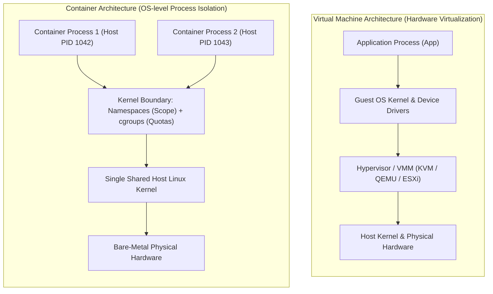
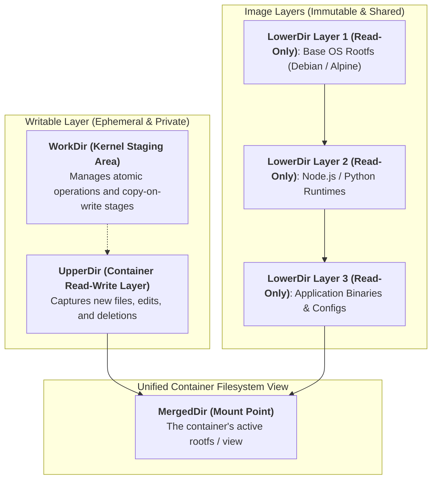
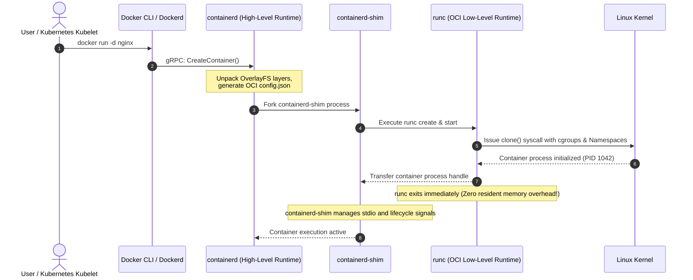

## Introduction: Shattering the "Containers are Lightweight VMs" Illusion

In contemporary cloud-native computing, developers frequently encounter a comforting analogy when first learning container technology: **"A container is simply a lightweight virtual machine."**

Pedagogically, this metaphor offers a quick mental hook for application packaging and portability. However, from a systems architecture standpoint, **the idea that containers are miniature VMs is a fundamental cognitive illusion**.



Under the hood of the Linux kernel:
- **Virtual Machines (VMs)**: Possess dedicated, independent Guest OS kernels. They execute within hardware-assisted virtualized environments managed by hypervisors (such as KVM/QEMU). Even when completely idle, a VM must boot a complete kernel, manage virtual page tables, and handle guest-to-host system call trapping, resulting in hundreds of megabytes of memory baseline overhead and multi-second boot cycles.
- **Containers**: **There is no distinct hardware or kernel entity known as a "container".** Every container running in Docker is strictly an **ordinary Linux process scheduled directly by the host operating system kernel**. An Nginx instance initiated via `docker run` appears as a conventional task inside the host's `ps -ef` tree, receiving CPU time slices from the exact same scheduler and executing over the shared system call table.

Containers construct the illusion of an isolated mini-operating system through three kernel primitives:
1. **Namespaces**: Limit what the process can *see* (isolating PID trees, network stacks, and mount points);
2. **cgroups (Control Groups)**: Limit what the process can *consume* (capping CPU, RAM, and block I/O throughput);
3. **rootfs & OverlayFS (Union File Systems)**: Provide a clean filesystem view (mounting layered immutable image trees with Copy-on-Write semantics).

As the inaugural chapter of **"From Docker to Kubernetes: Cloud-Native Container & Cluster Orchestration Handbook"**, this article bypasses marketing abstractions to investigate the first principles of container runtime mechanics inside the Linux kernel.

---

## 1. Process Scope Isolation: Linux Namespaces and the Minimal Container in C

The fundamental problem solved by Linux Namespaces is: **How can an ordinary process be tricked into believing it controls the entire operating system?**

In vanilla Linux systems, global resources—such as process ID trees, network interfaces, mount tables, and user IDs—are system-wide singletons. Namespaces allow the kernel to partition these global resources into distinct logical instances. When a thread queries system state from within a namespace, the kernel returns only the objects registered to that specific partition.

### 1.1 The Six Core Linux Namespaces

| Namespace | Linux Kernel Origin | Isolated Physical System Resource | Concrete Container Behavior |
| :--- | :--- | :--- | :--- |
| **PID (Process ID)** | Linux 2.6.24 | Process identifier tree | The container root process always runs as PID `1` and cannot see host processes. |
| **Mount (mnt)** | Linux 2.4.19 | Filesystem mount tables | Provides a private `/` root filesystem isolated from host directories. |
| **Network (net)** | Linux 2.6.29 | Network stacks, interfaces, routes, ports | Grants dedicated virtual interfaces (`eth0`), IP addresses, and private routing tables. |
| **UTS (UNIX Timesharing)**| Linux 2.6.19 | Hostname and domain name | Allows containers to assign their own hostnames without mutating the host's configuration. |
| **IPC (Inter-Process)**| Linux 2.6.19 | IPC primitives (POSIX/SysV message queues) | Prevents cross-container snooping via shared memory segments or semaphores. |
| **User** | Linux 3.8 | User and Group IDs (UID/GID) | Maps the container's internal `root` user (UID 0) to an unprivileged user on the host. |

### 1.2 First Principles: Building a Container with 30 Lines of C

Docker relies on no proprietary kernel extensions. Underneath, every container lifecycle is governed by three fundamental syscalls:
- `clone()`: Spawns a child process while accepting `CLONE_NEW*` flags to allocate new namespaces;
- `unshare()`: Detaches an existing process from its current namespace into a newly created namespace;
- `setns()`: Attaches an existing process into a target namespace (the foundational mechanic behind `docker exec`).

The following minimal C program demonstrates raw container creation:

```c
#define _GNU_SOURCE
#include <sched.h>
#include <stdio.h>
#include <stdlib.h>
#include <sys/wait.h>
#include <unistd.h>

#define STACK_SIZE (1024 * 1024)
static char child_stack[STACK_SIZE];

// The container's internal entrypoint
int container_main(void* arg) {
    printf("[Inside Container] Internal PID: %d\n", getpid());
    sethostname("isolated-container-node", 23);
    
    // Replace current process image with an interactive shell
    char* const args[] = {"/bin/sh", NULL};
    execv("/bin/sh", args);
    return 0;
}

int main() {
    printf("[Host System] Allocating isolated namespaces for child process...\n");

    // Kernel syscall flags isolating PID, UTS, Mount, Net, and IPC
    int flags = CLONE_NEWPID | CLONE_NEWUTS | CLONE_NEWNS | CLONE_NEWNET | CLONE_NEWIPC | SIGCHLD;
    
    pid_t child_pid = clone(container_main, child_stack + STACK_SIZE, flags, NULL);
    if (child_pid < 0) {
        perror("clone failed");
        exit(1);
    }

    printf("[Host System] Container process spawned. Real Host PID: %d\n", child_pid);
    waitpid(child_pid, NULL, 0);
    printf("[Host System] Container process terminated.\n");
    return 0;
}
```

When compiled and executed:
- On the host, running `ps aux | grep sh` indicates that this shell instance is assigned a real PID like `18423`;
- Inside the spawned shell, running `echo $$` confirms that its perceived PID is **exactly 1**!

**This is the core essence of container isolation**: during process initialization, the kernel points the `nsproxy` pointer within the task's `task_struct` to a distinct array of newly allocated namespace descriptors.

On the host machine, you can inspect the active namespaces of any running container process by checking `/proc/<PID>/ns/`:

```bash
# Inspect namespace inodes associated with container PID 18423
ls -l /proc/18423/ns/
# Sample output:
# lrwxrwxrwx 1 root root 0 net -> 'net:[4026532489]'
# lrwxrwxrwx 1 root root 0 pid -> 'pid:[4026532492]'
# lrwxrwxrwx 1 root root 0 mnt -> 'mnt:[4026532490]'
```

---

## 2. Resource Quotas: The Evolution from cgroups v1 to Unified cgroups v2

While namespaces conceal visibility across processes, they do not restrict physical hardware usage. If an unconstrained container process triggers an infinite CPU loop or leaks memory via unbounded heap allocation, it will starve the host and trigger systemic kernel collapse.

To enforce hard physical boundaries, the Linux kernel provides **cgroups (Control Groups)**.

### 2.1 The Kernel Subsystem Hook Mechanics

cgroups are implemented not as external daemons, but as **hooks directly embedded within the kernel's process scheduler (such as the Completely Fair Scheduler, CFS) and memory allocators**:
- **CPU Quotas**: Implemented by tracking CFS runtime credits. If a container is restricted to 1 CPU core, the CFS scheduler assigns it a maximum quota of $100\text{ms}$ execution time within each $100\text{ms}$ scheduling period. Once exhausted, the scheduler throttles the container's threads by descheduling them until the next replenishment window;
- **Memory Limits**: Implemented via counter checks in kernel page frame allocations (`alloc_pages()`). When a cgroup's aggregate physical memory usage reaches its configured threshold, the kernel triggers synchronous memory reclamation. If memory pressure remains critical, the kernel invokes the **OOM Killer** to terminate offending processes with `SIGKILL`, safeguarding the remaining host infrastructure.

### 2.2 The Structural Flaws of cgroups v1

Early container deployments historically relied on cgroups v1, which instituted a **multi-hierarchy tree** design:

```text
cgroups v1 Fragmented Hierarchy:
/sys/fs/cgroup/
  ├── cpu/docker/<container_id>/      <-- Independent CPU tree
  ├── memory/docker/<container_id>/   <-- Independent Memory tree
  └── blkio/docker/<container_id>/    <-- Independent Block I/O tree
```

In production environments, this design caused significant failures:
1. **Incoherent Page Cache Accounting and I/O Deadlocks**: Dirty page writebacks involve both memory pages and block storage I/O. Because `memory` and `blkio` lived in disjoint hierarchies, the kernel could not match asynchronous writeback traffic to its originating cgroup, rendering **container write I/O rate limits non-functional**;
2. **Thread Fragmentation**: Threads within the same process could be arbitrarily mapped to different cgroup branches, creating unpredictable scheduling hierarchies.

### 2.3 cgroups v2 Unified Hierarchy: The Modern Production Standard

To resolve these architectural flaws, Linux kernel version 4.5 introduced **cgroups v2**, which has become the mandatory production baseline across contemporary distributions and Kubernetes clusters:

```text
cgroups v2 Unified Single-Root Hierarchy:
/sys/fs/cgroup/
  └── docker/
      └── <container_id>/
          ├── cgroup.controllers   # Active controllers: "cpu memory io pids"
          ├── cgroup.procs         # Thread/Process membership
          ├── cpu.max              # CPU bandwidth quota: "200000 100000" (2 cores)
          ├── memory.max           # Hard memory ceiling: "2147483648" (2GB)
          ├── memory.high          # Soft memory warning limit (proactive page reclaim)
          ├── io.max               # Block I/O rate limiting (IOPS & bandwidth)
          └── pids.max             # Fork-bomb prevention (process count ceiling)
```

cgroups v2 introduces coherent cross-subsystem accounting:
- **`memory.high` vs. `memory.max` Tiered Buffers**: When consumption surpasses `memory.high`, the kernel proactively schedules background page reclaim while throttling thread allocation rates. Processes are terminated only if memory consumption exceeds `memory.max`. This smooths out transient memory spikes and reduces unexpected container restarts by over 30%.

---

## 3. Storage Layering: OverlayFS Union Mounts and Image Layering

With process scope and resource quotas secured, another question arises: **Where does the container's isolated root filesystem (`rootfs`) come from?**

Copying a 2GB OS image sequentially for every container spawn would quickly exhaust disk capacity and degrade provisioning speeds. Docker solves this by leveraging **Union File Systems**, with the in-kernel **OverlayFS (`overlay2`)** serving as the enterprise standard.

### 3.1 The OverlayFS Four-Directory Architecture

OverlayFS merges multiple discrete directories on a physical storage block, presenting them to user-space as a consolidated unified mount point:



The four directories perform distinct tasks:
1. **LowerDir (Read-Only Image Layers)**: Immutable layers forming the container image. When spawning 100 containers from the same image on a single host, all 100 instances share the identical physical `LowerDir` blocks on disk;
2. **UpperDir (Container Read-Write Layer)**: A private, writable directory allocated per container upon creation. All runtime mutations are isolated to this layer;
3. **WorkDir (Internal Staging Layer)**: An internal scratchpad used by the kernel to guarantee atomic copy-on-write transitions across layers;
4. **MergedDir (Active Union Mount)**: The unified directory tree presented to the container process. The runtime binds this path as `/` via `pivot_root`.

### 3.2 Dynamic I/O Patterns: Copy-on-Write (CoW) and Whiteout Deletions

Filesystem operations under OverlayFS adhere to specific kernel rules:

#### 1. Read Operations
- If the requested path exists in `UpperDir` (already modified by the container), the kernel serves it immediately;
- Otherwise, the kernel traverses descending `LowerDir` branches until the path is resolved;
- Page Cache entries for lower read-only layers are efficiently shared across concurrent containers.

#### 2. Write Operations (Copy-on-Write, CoW)
- When a process modifies an existing file from an immutable base layer (e.g., `/etc/nginx/nginx.conf`), the kernel initiates a **Copy-on-Write (CoW)**:
  1. The target file is copied in its entirety from `LowerDir` up into `UpperDir`;
  2. The process applies writes directly to the newly created copy in `UpperDir`;
  3. The underlying layer in `LowerDir` remains unmodified.

> [!WARNING]
> **Performance Gotcha**: Modifying a large file (e.g., a 10GB database file) for the first time triggers a synchronous copy operation across layers, introducing acute disk I/O latency. High-throughput workloads should always bypass OverlayFS using **Docker Volumes** mounted directly from native host storage.

#### 3. Deletion Operations (Whiteout Devices)
If an application deletes a file that resides within a read-only `LowerDir`, the file cannot be physically removed from storage. OverlayFS masks it using a **Whiteout file**:
- The kernel creates a character device file with major/minor numbers `(0,0)` sharing the deleted file's name inside `UpperDir`;
- When `MergedDir` scans directory entries, it ignores any underlying files matching the Whiteout token, presenting the path as removed.

---

## 4. Modern Container Runtime Standards: OCI, containerd, and runc

Understanding Namespaces, cgroups, and OverlayFS clarifies the decoupling of modern container runtimes.

Historically, Docker operated as a monolithic daemon (`dockerd`). If the daemon encountered an unhandled exception and crashed, all child containers stopped running. The cloud-native community addressed this by establishing the **Open Container Initiative (OCI)** standard, decomposing the runtime architecture into modular layers:



Key architectural components include:
1. **High-Level Runtime (`containerd`)**:
   Coordinates image transport, layer decompression, OverlayFS snapshots, CNI network invocations, and container state management;
2. **Low-Level Runtime (`runc`)**:
   The reference implementation of the OCI Runtime Specification. `runc` reads the declarative `config.json`, invokes the required Linux syscalls to instantiate namespaces and cgroups, **and exits immediately after handing process ownership over**;
3. **Daemonless Supervision (`containerd-shim`)**:
   A lightweight shim daemon maintained per container that acts as the container process's parent. **This breaks the coupling between active containers and management daemons**—upgrades or restarts to `dockerd` or `containerd` leave running applications completely uninterrupted.

---

## 5. Summary and Series Trajectory

The first principles of container infrastructure establish that:
- **Containers are standard host processes**, not hardware-virtualized environments;
- **Namespaces isolate process scope**, providing independent PID, network, and mount boundaries;
- **cgroups v2 establish resource ceilings**, managing CPU time, soft memory limits, and I/O rates;
- **OverlayFS provisions layered root filesystems**, unlocking sub-second container spin-up and deduplication.

With process and storage mechanics defined, the next operational hurdle for systems architects is network connectivity: **How do isolated network namespaces transmit packets to external hosts, other local containers, and physical networks?**

In Chapter 2, we dissect **[Container Networking Deep Dive: veth-pair, Linux Bridge, iptables NAT, and Cross-Host Topology](/en/articles/container-networking-veth-bridge-iptables/)**, following packet trajectories through kernel network queues with `ip route` and `iptables`.

---

## Frequently Asked Questions (FAQ)

### Q1: Why do `top` and `free -m` run inside a container display the host's total CPU count and RAM?
This occurs because utilities like `top`, `htop`, and `free` read directly from the host's virtual `/proc` filesystem (specifically `/proc/meminfo` and `/proc/stat`). These files reflect global kernel states and are **not automatically filtered by container cgroups boundaries**.
If a container is capped at 2GB of RAM on a 128GB host, unconfigured runtimes (such as legacy Java or Node.js versions) may size their heap memory around 128GB, triggering an abrupt kernel OOM kill.
Production solutions include:
1. **Modern Runtime Flags**: Use container-aware runtimes (e.g., Java 11+ via `-XX:+UseContainerSupport`);
2. **Mounting LXCFS**: Use LXCFS via FUSE to override `/proc/meminfo` and `/proc/stat` with views calculated from the container's cgroups limits.

### Q2: Why is the `--privileged` flag strictly forbidden in production container deployments?
Enabling `--privileged` removes virtually all Linux kernel security controls:
1. The container bypasses the device cgroup whitelist, gaining direct read/write access to host hardware (e.g., `/dev/sda`);
2. The internal `root` user receives unmasked Linux Capabilities, including `CAP_SYS_ADMIN`;
3. The process can mount host storage paths and load kernel modules, **opening direct vectors for container escape**.
Production architectures should enforce the principle of least privilege: avoid privileged containers, use `--cap-add` only for specific needed capabilities (e.g., `CAP_NET_ADMIN` for network instrumentation), and apply read-only root filesystems (`--read-only`).

### Q3: If an immutable image layer incurs physical corruption on disk, are all running containers affected?
Yes. Because running containers share immutable `LowerDir` storage layers by reference (e.g., under `/var/lib/docker/overlay2/<layer_id>`), underlying physical disk corruption affects all containers reading those blocks.
However, because all writes are redirected to private `UpperDir` instances via Copy-on-Write, a corrupted or misbehaving container **can never contaminate the underlying immutable image layers**. One container's writes cannot corrupt another instance sharing the same base image.
