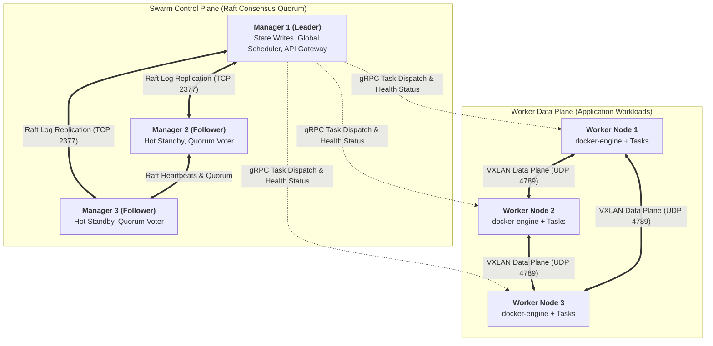
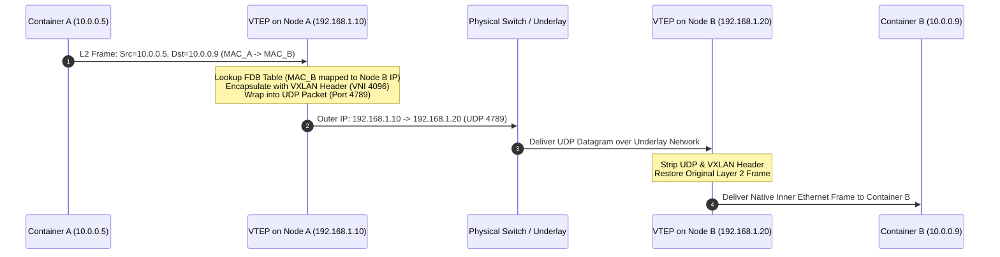
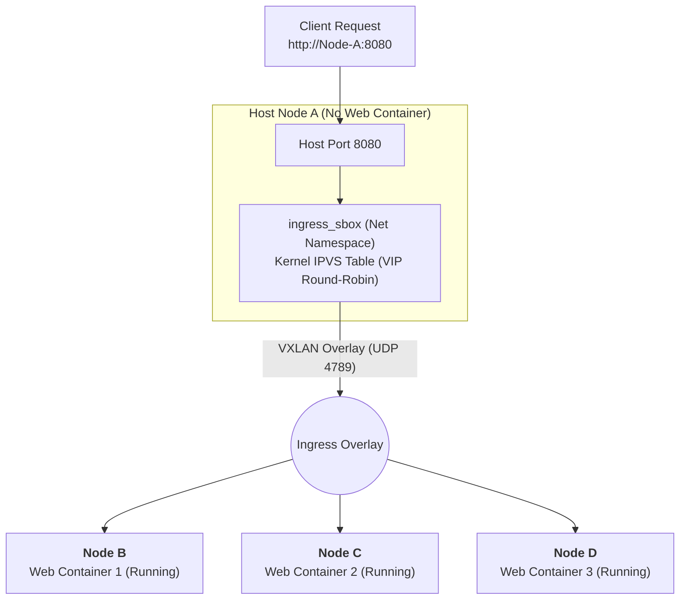

## Introduction: Why Do We Need Lightweight Cluster Orchestration?

Over the past decade, cloud computing witnessed a ferocious container orchestration war. Ultimately, Kubernetes—with its gargantuan ecosystem and modular declarative architecture—triumphed, establishing itself as the indisputable de facto enterprise standard.

However, in serious production engineering, architects frequently confront an inconvenient reality: **The unmatched power of Kubernetes comes at the expense of an extraordinarily steep learning curve, significant operational overhead, and heavy control plane resource footprints**:
- Setting up and operating a production-grade, highly available Kubernetes cluster demands dedicated etcd planning, intricate CNI/CSI debugging, TLS certificate rotation, Ingress controller management, and navigating hundreds of boilerplate YAML manifests;
- For small-to-medium clusters (3 to 30 nodes), edge IoT topologies, internal staging pipelines, or agile teams seeking rapid product velocity, **Kubernetes often proves to be textbook architectural over-engineering**.

Between single-host Docker and behemoth Kubernetes lies an elegant, battle-tested sweet spot: **Docker Swarm (SwarmKit)**.

With a single command—`docker swarm init`—without installing third-party key-value databases or external plugins, Docker transforms instantly into a production-ready distributed cluster equipped with **declarative scheduling, self-healing failover, zero-downtime rolling updates, decentralized DNS service discovery, and cross-host layer-4 load balancing**!

As the third installment of **From Docker to Kubernetes: Cloud-Native Container & Cluster Orchestration Handbook**, this guide transcends single-host mechanics to deconstruct SwarmKit internals: its **embedded Raft consensus engine**, **cross-node VXLAN overlay networks**, and the kernel-level **Ingress Routing Mesh**.

---

## 1. SwarmKit Core Topology: Manager vs. Worker Architecture

The underlying engine powering Docker Swarm is **SwarmKit**. It cleanly partitions physical or virtual machines into two primary roles: **Manager Nodes** and **Worker Nodes**.



### 1.1 Node Roles and the Declarative Lifecycle

1. **Manager Nodes**:
   - Serve administrative API requests, maintaining the cluster's global **Desired State**;
   - Execute internal scheduler algorithms, breaking high-level *Services* into atomic execution units (*Tasks / Containers*) and dispatching them to eligible Workers;
   - Replicate state machine logs across Manager nodes via an **embedded Raft algorithm**, **completely removing the dependency on an external etcd cluster**!
2. **Worker Nodes**:
   - Serve as pure computational execution workers. They run the standard Docker Engine, accepting tasks dispatched by the Leader Manager and spawning containers;
   - Report container execution telemetry and heartbeat pings back to Managers over mutual-TLS (mTLS) gRPC connections. If a Worker stops heartbeating, the Manager automatically reschedules its assigned containers onto surviving healthy nodes.

### 1.2 Why Production Clusters Require 3 or 5 Manager Nodes

Swarm control planes strictly adhere to **majority quorum rules**. For a cluster with $N$ manager nodes, the maximum number of tolerated failed manager nodes $F$ is mathematically defined as:

$$F = \left\lfloor \frac{N - 1}{2} \right\rfloor$$

- With **3 Managers**, the quorum threshold is 2 ($\lfloor (3-1)/2 \rfloor = 1$). The cluster survives 1 simultaneous manager failure without losing write availability;
- With **5 Managers**, the quorum threshold is 3 ($\lfloor (5-1)/2 \rfloor = 2$). The cluster survives 2 simultaneous failures;
- **Even numbers are an anti-pattern**: Running 4 managers still yields a fault tolerance of 1 ($\lfloor (4-1)/2 \rfloor = 1$), but incurs higher log replication latency and increases the probability of split-brain stall.

---

## 2. Zero External Dependencies: Embedded Raft Consensus Engine

In Kubernetes operations, few components introduce as much administrative toil as provisioning, backing up, defragmenting, and tuning external `etcd` clusters.

Docker Swarm took a radically different philosophical approach: **"Batteries Included"**. SwarmKit natively embeds a full Go-based **Raft consensus state machine** within the Docker daemon itself:

```text
SwarmKit In-Memory State Machine Pipeline:
Admin Command: docker service scale web=5
       │
       ▼
 1. Leader Manager receives API Request (TCP 2377 / Mutual TLS)
       │
       ▼
 2. Propose Log Entry & Replicate to Follower Managers (TCP 2377)
       │
       ├──► Manager 2 confirms write
       └──► Manager 3 confirms write
       │
       ▼ (Quorum Reached: 3/3 acknowledgments)
 3. Commit Entry to In-Memory Store & Persist WAL to Disk (/var/lib/docker/swarm/raft)
       │
       ▼
 4. Internal Orchestrator diffs Desired State (5) vs Observed State (3)
       │
       ▼
 5. Scheduler allocates 2 new Tasks to eligible Worker Nodes via gRPC
```

### Key Advantages of SwarmKit's Raft Implementation:
1. **Zero External Plumbing**: Zero dedicated etcd clusters or Consul agents to deploy, monitor, or manage.
2. **Native Cryptographic Auto-Locking**: Swarm supports native data-at-rest encryption (`docker swarm update --autolock=true`). The encryption keys protecting Raft WAL logs and TLS certificates are decoupled, requiring a unlock key during daemon reboots to prevent compromised disk theft.
3. **Automatic Internal PKI & mTLS**: SwarmKit incorporates an integrated Certificate Authority (CA). When a new worker or manager joins the swarm via join-token, node certificates are automatically issued and rotated without manual intervention.

---

## 3. Cross-Host Overlay Networking: VXLAN Decapsulation Mechanics

In [Container Networking Deep Dive: veth-pair, Linux Bridge, iptables NAT, and Cross-Host Topologies](/en/articles/container-networking-veth-bridge-iptables/), we mastered single-host networking with Linux Bridges and veth-pairs.

How does Docker Swarm enable containers on Node A (e.g., `10.0.0.5`) to communicate transparently with containers on Node B (e.g., `10.0.0.9`) across distinct underlying physical subnets? The answer is **VXLAN (Virtual Extensible LAN, RFC 7348)**:



### 3.1 Packet Encapsulation Structure
When Container A sends an IP packet to Container B, the Linux kernel network stack wraps the original payload inside an outer transport envelope:

```text
┌────────────────────────────────────────────────────────────────────────┐
│                        Outer Ethernet Header                          │
├───────────────────┬───────────────────┬────────────────────────────────┤
│ Outer IP Header   │ Outer UDP Header  │          VXLAN Header          │
│ Src: 192.168.1.10 │ Dst Port: 4789    │ VNI: 4096 (Virtual Network ID) │
│ Dst: 192.168.1.20 │                   │ 8 Bytes Flags & ID             │
├───────────────────┴───────────────────┴────────────────────────────────┤
│                        Inner Ethernet Header                          │
├────────────────────────────────────────────────────────────────────────┤
│ Inner IP Header (Src: 10.0.0.5, Dst: 10.0.0.9)                         │
├────────────────────────────────────────────────────────────────────────┤
│ Application Payload (HTTP / gRPC)                                      │
└────────────────────────────────────────────────────────────────────────┘
```

By adding a standard 50-byte header overhead (Outer IP + UDP + VXLAN), Docker Swarm projects a flat, multi-tenant virtual Layer 2 broadcast network over arbitrary Layer 3 physical topology.

---

## 4. Ingress Routing Mesh: Kernel-Level IPVS Load Balancing

One of Swarm's most user-friendly features is the **Ingress Routing Mesh**. 

When an engineer exposes a service port across the cluster via:
```bash
docker service create --name web --publish published=8080,target=80 --replicas=3 nginx
```

**Every single node in the entire Swarm cluster opens port 8080**, regardless of whether that node is currently running an instance of the `nginx` container:



### 4.1 Kernel Implementation: Dedicated Network Namespaces & IPVS
Swarm achieves this without user-space proxy overhead (such as Nginx or Envoy):
1. Swarm instantiates a hidden dedicated network namespace on each node named **`ingress_sbox`**;
2. When ingress traffic hits port `8080` on the physical interface, host `iptables` rules divert the stream into `ingress_sbox`;
3. Inside `ingress_sbox`, the kernel's high-speed **IPVS (IP Virtual Server)** engine balances requests across healthy container Virtual IPs (VIPs) using round-robin scheduling;
4. Internal DNS (`127.0.0.11`) resolves service names directly to the cluster-wide Virtual IP, enabling zero-configuration microservice discovery.

---

## 5. Architectural Showdown: Docker Swarm vs. Kubernetes

How should enterprise engineering teams evaluate Docker Swarm versus Kubernetes?

| Dimension | Docker Swarm (SwarmKit) | Kubernetes (K8s) |
| :--- | :--- | :--- |
| **Architectural Philosophy** | **Minimalist, Batteries-Included, Convention over Configuration** | **Infinite Extensibility, Decoupled, Universal Object Model** |
| **Setup & Learning Curve** | **Extremely Low** (1 command cluster initialization) | **Very High** (Requires mastering 30+ core API primitives and custom plugins) |
| **Control Plane Footprint** | **Minimal** (Lightweight daemon, runs smoothly on 1GB RAM nodes) | **Heavy** (Demands 2-3 dedicated master nodes with 4-8GB RAM for etcd) |
| **Extensibility & Customization**| Limited (Docker daemon plugins, no arbitrary CRD support) | **Unmatched** (CRD, Operators, Dynamic Webhooks, Custom Schedulers) |
| **Autoscaling Capabilities** | Manual scaling or custom scripts | **Enterprise-grade Automation** (HPA, VPA, Event-driven KEDA) |
| **Stateful Workload Storage** | Basic Host Volume mounting | **Mature Standard** (CSI, Dynamic PV/PVC provisioning, StatefulSets) |
| **AI Workloads & GPU Scheduling**| Basic GPU passthrough; lacks fine-grained NUMA topology | **Dominant** (NVIDIA GPU Operator, MIG slicing, DRA topology awareness) |
| **Optimal Cluster Scale** | 3 to 50 nodes, small-to-medium teams, edge IoT, internal staging | 50 to 10,000+ nodes, massive microservices, hyperscale AI GPU clusters |

---

## 6. Summary and Transition

Docker Swarm exemplifies William of Ockham's timeless principle: *"Entities should not be multiplied beyond necessity"*:
- With minimal conceptual primitives (Services, Tasks, Stacks), it solves 80% of standard web microservice challenges;
- Embedded Raft and VXLAN furnish small teams with instant high availability and automated failover in minutes.

However, when enterprise scale grows from dozens of nodes to hundreds, when stateless services give way to distributed databases with strict topological requirements, and when hundreds of high-value NVIDIA GPUs require NUMA-aware bin-packing, Swarm hits its architectural boundaries.

In our next chapter, **[Kubernetes Control Plane Deep Dive: Declarative APIs, etcd Consensus, Scheduler, and Controller Reconciliation Loops](/en/articles/k8s-control-plane-declarative-reconciliation/)**, we step into the premier temple of cloud-native computing to unpack how Kubernetes governs global infrastructure through declarative control theory.

---

## Frequently Asked Questions (FAQ)

### Q1: What critical network firewall ports must be open between nodes in a production Docker Swarm cluster?
Nodes in a Swarm cluster require the following firewall rules:
1. **TCP Port 2377**: Swarm cluster management communication (used for Raft log consensus replication among Managers and Worker registration);
2. **TCP & UDP Port 7946**: Inter-node Gossip protocol for node discovery and health status heartbeats;
3. **UDP Port 4789**: Overlay network VXLAN data plane encapsulation (**UDP 4789 must be open; otherwise, cross-host container traffic will fail completely!**);
4. **IP Protocol 50 (ESP)**: Required only if IPSec overlay encryption (`--opt encrypted`) is enabled.

### Q2: Why does the original client IP address appear as an internal 10.255.x.x IP when accessing services through the Ingress Routing Mesh, and how can we preserve it?
This occurs because Swarm's Ingress Routing Mesh performs Source Network Address Translation (SNAT) when proxying incoming packets across hosts, replacing the original client IP with the internal ingress VIP to ensure response packets route symmetrically back.
**Workarounds**:
1. Use **Host Port Publishing** by configuring `mode=host` (e.g., `--publish published=80,target=80,mode=host`). This bypasses the routing mesh and binds the port directly to the host interface running the container, preserving the original client IP;
2. Place a Layer 7 reverse proxy (such as Traefik or Nginx) in front of the cluster to capture the real client IP in the `X-Forwarded-For` HTTP header.

### Q3: How does a Docker Swarm cluster behave during a network partition (Split-Brain scenario)?
Swarm's embedded Raft consensus guarantees strong consistency and prevents split-brain state mutations:
If a 5-Manager cluster is partitioned into a minority partition (2 nodes) and a majority partition (3 nodes):
- **Majority Partition (3 nodes)**: Satisfies quorum ($\ge 3$), retains leader authority, and continues accepting write, scheduling, and scaling commands normally;
- **Minority Partition (2 nodes)**: Cannot form a quorum. All manager nodes in this partition immediately transition to read-only mode and reject state-modifying requests;
- **Data Plane Continuity**: Existing containers on healthy worker nodes in both partitions continue executing their workloads uninterrupted. Once physical network connectivity is restored, minority nodes synchronize the latest Raft log entries and rejoin the cluster.
