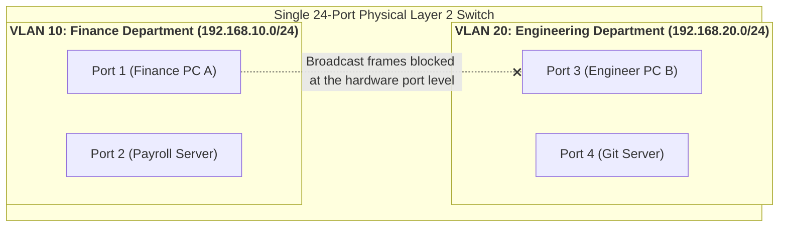
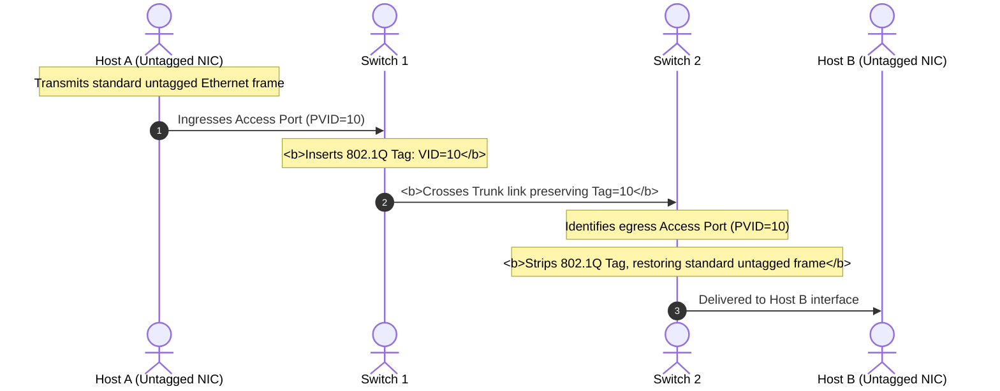
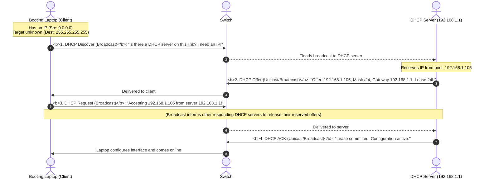
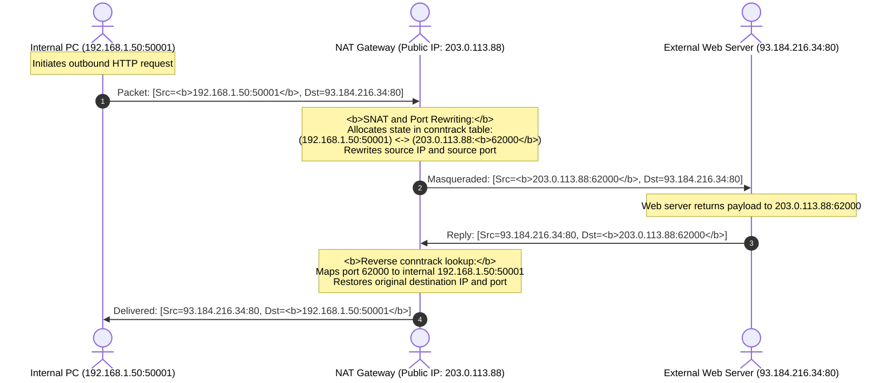

## Introduction: When a Facility Houses Hundreds of Employees Across Multiple Departments

In the previous chapters, we derived Layer 2 MAC switching and Layer 3 IP subnetting from physical principles.

However, as an organization scales to 500 employees across Finance, Engineering, and Human Resources, **enterprise network management encounters practical challenges**:
- **Security isolation breaks down**: If finance servers and workstations share an unsegmented switch with general office devices, packet sniffers can inspect sensitive payroll data;
- **Broadcast storms disrupt the fabric**: If a compromised machine floods the network with ARP requests, broadcast processing consumes CPU cycles on all 500 connected hosts;
- **Manual IP configuration becomes unmanageable**: Manually assigning static IPs, subnet masks, gateways, and DNS resolvers to every visiting laptop is error-prone and unsustainable;
- **Public IPv4 addresses are scarce**: An Internet Service Provider typically assigns a single public IPv4 address to an enterprise. How can 500 hosts share this address simultaneously?

To resolve these challenges, modern enterprise networks rely on three core protocols: **VLANs (Virtual Local Area Networks)**, **DHCP (Dynamic Host Configuration Protocol)**, and **NAT (Network Address Translation)**.

---

## 1. VLAN First Principles: Segmenting the Broadcast Domain

A **VLAN (Virtual Local Area Network)** partitions a physical switch into multiple isolated virtual switches at the hardware ASIC level, avoiding the need to purchase separate physical hardware:



- **Broadcast Isolation**: Broadcast frames (such as ARP requests) originating within VLAN 10 **are physically filtered by switch silicon from egressing onto VLAN 20 ports**, containing broadcast storms;
- **Security Boundaries**: Separate VLANs remain isolated at Layer 2, preventing unauthorized cross-department packet capture.

---

## 2. 802.1Q Tagging Mechanics and Access vs Trunk Ports

Endpoint network cards typically process standard, untagged Ethernet frames. How do switches identify which VLAN a frame belongs to?

They use the standard **IEEE 802.1Q frame tagging specification**.

### 2.1 The 802.1Q Tag Structure

The 802.1Q standard inserts a **4-byte (32-bit) VLAN Tag** between the Source MAC and EtherType fields of a standard Ethernet frame:

```
Standard Ethernet Frame with 802.1Q Tag Inserted:
+-----------+-----------+-------------------------+-----------+---------------+---------+
| Dest MAC  | Source MAC| 802.1Q Tag Header       | EtherType | Payload Data  | FCS     |
| (6 Bytes) | (6 Bytes) | 4 Bytes (32 Bits)       | (2 Bytes) | (46 - 1500B)  | (CRC,4B)|
+-----------+-----------+-------------------------+-----------+---------------+---------+
                        |                         |
                        v                         v
       +------------------+-------+-----+------------------+
       | TPID             | PCP   | DEI | VID (VLAN ID)    |
       | 16 Bits (0x8100) | 3Bits | 1Bit| 12 Bits (1-4094) |
       +------------------+-------+-----+------------------+
```

1. **TPID (Tag Protocol Identifier, 16 bits)**: Set to `0x8100`, indicating an 802.1Q-tagged frame follows;
2. **PCP (Priority Code Point, 3 bits)**: Provides 8 priority levels (0–7) for Class of Service (QoS) traffic prioritization (e.g., prioritizing VoIP or video over bulk downloads);
3. **VID (VLAN Identifier, 12 bits)**:
   $2^{12} = 4096$. Values `0` and `4095` are reserved, leaving **valid VLAN IDs from $1$ to $4094$**.

### 2.2 Switch Port Types: Access vs Trunk

Switches connect to both end-user devices and upstream network equipment, relying on two distinct port modes:

```
+-------------------------------------------------------------------------------+
| Access Port (Endpoint Links): Connects to PCs, printers, and standard servers |
|   - Characteristics: Assigned to a single VLAN (e.g., PVID=10)                |
|   - Ingress: Adds a VLAN tag matching the port's PVID to incoming frames      |
|   - Egress: Strips the 802.1Q tag, delivering standard frames to end hosts    |
+-------------------------------------------------------------------------------+
| Trunk Port (Backbone Links): Connects switches to switches or routers         |
|   - Characteristics: Transports multiplexed traffic from multiple VLANs       |
|   - Ingress/Egress: Preserves 802.1Q tags to retain VLAN identity across hops |
+-------------------------------------------------------------------------------+
```



### 2.3 Inter-VLAN Routing: Router-on-a-Stick vs Layer 3 Switches (SVI)
When hosts in Engineering (VLAN 10) need to reach an internal API in Finance (VLAN 20), traffic must be routed:
- **Router-on-a-Stick**: Connects the switch's trunk port to a physical router interface configured with virtual sub-interfaces (e.g., `eth0.10`, `eth0.20`), using the router to perform inter-subnet routing;
- **Layer 3 Switch (Switch Virtual Interface, SVI)**: The standard enterprise design. The switch uses onboard routing ASICs to terminate VLANs on internal **Switch Virtual Interfaces (SVIs, e.g., `interface Vlan 10`)**, routing between VLANs at wire speed across the internal backplane without sending packets through an external router.

---

## 3. DHCP: The 4-Step DORA Protocol

When an employee plugs a laptop into a wall jack, the operating system obtains an IP address, subnet mask, gateway, and DNS servers within seconds using **DHCP (Dynamic Host Configuration Protocol)** (running over UDP: server port 67, client port 68):



- **Lease Renewal Timers**:
  - **T1 Timer (50% of lease)**: The client attempts a unicast DHCP Request directly to the issuing server to extend the lease;
  - **T2 Timer (87.5% of lease)**: If the issuing server fails to respond, the client broadcasts a DHCP Request to any reachable DHCP server; if the lease reaches 100% without renewal, the interface releases the IP and falls back to an APIPA address (`169.254.x.x`).

---

## 4. Network Address Translation (NAT): Multiplexing a Public IP

### 4.1 The Core Challenge: Private IPs Are Non-Routable
As covered in Chapter 2, RFC 1918 private IPv4 addresses (`10.0.0.0/8`, `172.16.0.0/12`, `192.168.0.0/16`) are filtered by public Internet routers.

If an enterprise has a single public IP (e.g., `203.0.113.88`), how can 500 private hosts access external web services concurrently?

**The Solution: NAPT (Network Address Port Translation / PAT)!**



### 4.2 SNAT vs DNAT (Port Forwarding)

- **SNAT (Source NAT)**:
  - **Direction**: Internal hosts initiating outbound traffic to the Internet;
  - **Operation**: Rewrites the **source IP and source port** on egress, masking internal addresses behind the gateway's public IP;
- **DNAT (Destination NAT / Port Forwarding)**:
  - **Direction**: External clients accessing internal servers (e.g., exposing an internal web server);
  - **Operation**: Rewrites the **destination IP and destination port** on ingress. For example, incoming requests to `203.0.113.88:8080` are rewritten and forwarded to internal host `192.168.1.200:80`.

---

## 5. Linux Networking and Inspection Commands

Managing VLANs, connection tracking, and NAT rules on Linux:

```bash
# 1. Create an 802.1Q tagged interface on physical adapter eth0 (VLAN ID 10)
ip link add link eth0 name eth0.10 type vlan id 10
ip addr add 192.168.10.1/24 dev eth0.10
ip link set eth0.10 up

# 2. Inspect active Netfilter NAT tables
iptables -t nat -L -n -v

# 3. Standard masquerade rule for outbound traffic
# iptables -t nat -A POSTROUTING -s 192.168.0.0/16 -o eth0 -j MASQUERADE

# 4. Inspect active connection states in the kernel conntrack table
conntrack -L -p tcp
# Sample output:
# tcp 6 431999 ESTABLISHED src=192.168.1.50 dst=93.184.216.34 sport=50001 dport=80 \
#                          src=93.184.216.34 dst=203.0.113.88 sport=80 dport=62000 [ASSURED]
```

---

## 6. Summary and Next Steps

VLANs, DHCP, and NAT provide the operational backbone for enterprise networks:
- **VLANs and 802.1Q Tagging** isolate broadcast domains and segment departments using 4-byte headers across Access and Trunk ports;
- **DHCP** automates host addressing through the 4-step DORA handshake;
- **NAT / PAT** tracks session state in kernel `conntrack` tables, allowing thousands of internal hosts to multiplex through a shared public IP.

With Layer 2 and Layer 3 configured, how do applications resolve services and exchange data?
- When you type `www.google.com` into a browser, how does the global **DNS hierarchy** resolve human-readable domains into routable IP addresses?
- Once a packet reaches a server hosting multiple applications, how do **Ports and Operating System Sockets** direct the payload to the correct process?
- Why do real-time voice and video streams choose **UDP**, while web browsers and databases rely on **TCP**?

In Chapter 4 of our masterclass, we explore the boundary between transport and applications: **[Application & Transport Layer Bridges: DNS Resolution, Sockets, Ports, and UDP vs TCP Foundations](/en/articles/transport-bridge-dns-sockets-ports-udp-vs-tcp/)**!

---

## Frequently Asked Questions (FAQ)

### Q1: If two PCs on the same switch share the same subnet (e.g., `192.168.1.10/24` and `192.168.1.20/24`) but are assigned to different VLANs (VLAN 10 and VLAN 20), can they communicate?
**No. Traffic is dropped at Layer 2 inside the switch ASIC.**
Because both PCs reside on `192.168.1.0/24`, PC A issues an ARP broadcast looking for PC B's MAC address.
When the broadcast enters PC A's switch port (an Access port assigned to VLAN 10), the switch tags the frame with `VID=10`.
The switch's forwarding logic strictly prevents frames tagged with `VID=10` from exiting ports that do not belong to VLAN 10. PC B's port (assigned to VLAN 20) never receives the frame. Because the ARP request is never delivered, PC A never resolves PC B's MAC address, preventing communication.

### Q2: Why does Router-on-a-Stick introduce bandwidth bottlenecks, and how do Layer 3 switches resolve this?
- **Router-on-a-Stick Bottleneck**: All inter-VLAN traffic must traverse a single physical trunk link to the router, be processed by the router's CPU, and return across the same link to the switch. This halves usable bandwidth on the link and risks CPU saturation under heavy traffic;
- **Layer 3 Switch Resolution**: Layer 3 switches incorporate routing logic directly into internal switching ASICs. Inter-VLAN traffic is routed via on-chip **Switch Virtual Interfaces (SVIs)** across the internal backplane at full hardware wire speed, removing the external router bottleneck entirely.

### Q3: Why can't two private hosts behind different home NAT routers establish direct P2P connections by default, and how does "NAT Traversal (Hole Punching)" solve this?
**Root Cause: Stateful NAT drop policies on unsolicited inbound traffic.**
Unless an internal host initiates an outbound session, the router's `conntrack` table contains no matching entry for external IP addresses. When a remote peer sends unsolicited packets to your public IP, your router drops them as potential attacks.
**Hole Punching Mechanics**: Both peers communicate with a public STUN server to discover their respective `<Public IP: Mapped Port>` bindings. Both peers then simultaneously transmit UDP probe packets toward each other's mapped public endpoints. These outgoing packets create outbound session entries in their respective local NAT `conntrack` tables. Subsequent incoming packets from the peer match these established session entries and are forwarded through, establishing direct P2P communication.
