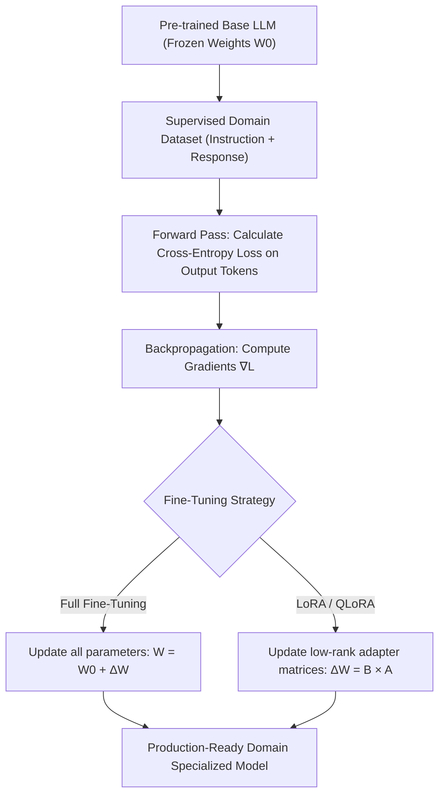

## Why Do We Need Fine-Tuning?

Although general-purpose large language models like GPT-5.4 and Claude 4.6 are incredibly capable, they still have limitations in specific scenarios:

- **Lack of domain knowledge**: Specialized terminology and logic in medical, legal, or financial fields.
- **Mismatched output styles**: Requiring specific language styles, formatting, or industry standards.
- **Performance-cost trade-offs**: Replacing large model API calls with smaller, fine-tuned models to reduce costs by 80%+.

> **When to fine-tune vs. when to use prompt engineering?**
> 
> If your requirements can be solved by adjusting prompts and providing Few-Shot examples, prioritize prompt engineering.
> Only consider fine-tuning when prompt engineering fails to achieve the required accuracy or consistency.

## How Does LLM Fine-Tuning Work? (Under the Hood)

To understand **how LLM fine-tuning works**, we must look beyond prompt engineering and examine how neural network weights adapt during supervised training:



### 1. The Autoregressive Training Objective
During Supervised Fine-Tuning (SFT), the model is optimized using causal language modeling loss over completion tokens. Given an input sequence $x = (x_1, \dots, x_N)$, prompt instruction tokens are masked out with label `-100`, ensuring the loss is computed solely on the model's generated response:

$$\mathcal{L}_{SFT}(\theta) = - \sum_{t=k}^{N} \log P_\theta(x_t \mid x_{<t})$$

Through backpropagation, gradients $\nabla_\theta \mathcal{L}$ update the active parameter matrices so that target formats, domain logic, and tone become statistically ingrained in the model's output distribution.

### 2. Full Fine-Tuning vs PEFT (The LoRA Mechanism)
- **Full Parameter Fine-Tuning**: Updates every weight matrix $W \in \mathbb{R}^{d \times k}$. For a 70B parameter model, storing weights, optimizer states (AdamW tracks first and second moments), and activation gradients requires over 1,100GB of VRAM across multiple GPUs.
- **LoRA (Low-Rank Adaptation)**: Exploits the fact that parameter updates $\Delta W$ have a low "intrinsic dimension." LoRA freezes the original weights $W_0$ and decomposes $\Delta W$ into two trainable low-rank matrices:
  $$W_{new} = W_0 + \Delta W = W_0 + \frac{\alpha}{r} (B \times A)$$
  where $A \in \mathbb{R}^{r \times k}$ is initialized with Gaussian noise and $B \in \mathbb{R}^{d \times r}$ with zeros, with rank $r \ll \min(d, k)$ (typically $r \in [16, 64]$). Only $A$ and $B$ receive gradient updates, reducing trainable parameters by >99%.
- **QLoRA (Quantized LoRA)**: Compresses the base weights $W_0$ to 4-bit NormalFloat (NF4) while dequantizing on-the-fly to BF16 during forward and backward passes. This slashes base model VRAM usage from ~140GB down to ~39GB, allowing developers to fine-tune 70B models on a single workstation GPU.

## Enterprise LLM Fine-Tuning Use Cases

Choosing between Prompt Engineering, RAG, and Fine-Tuning requires identifying the highest-ROI **LLM fine-tuning use cases**:

| Use Case Category | Practical Enterprise Scenario | Why Prompting / RAG Fails Alone | Recommended Strategy |
|:---|:---|:---|:---|
| **1. Strict Structured Output & Schema Enforcement** | Emitting deterministic JSON, SQL, or custom DSL formats without syntax faults. | Few-shot prompting burns valuable context tokens and occasionally drifts into conversational filler. | LoRA SFT on 1,000~2,000 clean schema pairs |
| **2. Vertical Industry Lexicon & Domain Tone** | Drafting medical clinical notes, legal contracts, or financial audit summaries adhering to internal corporate tone. | Frontier general models default to generic styles and ignore negative constraints over long sessions. | LoRA / QLoRA with curated domain corpus |
| **3. Reasoning & Knowledge Distillation** | Transferring reasoning trajectories from 400B+ teacher models to lightweight 8B or 14B student models. | Smaller models lack multi-step reasoning capabilities out of the box without targeted distillation. | SFT + DPO on synthetic teacher reasoning trajectories |
| **4. Air-Gapped Data Sovereignty & Cost Slicing** | Running self-hosted models in strict banking or healthcare environments to replace high-volume cloud API bills. | Public cloud APIs violate data localization compliance laws; proprietary models cannot be run offline. | QLoRA base + [vLLM Serving](/en/articles/vllm-serving-guide/) |
| **5. Sub-50ms Agent Tool Calling** | High-throughput routing agents executing instant API tool dispatches. | Agent systems incur unacceptable latency when prepending thousands of instruction tokens every turn. | Lightweight SFT on 3B~8B open models |

## Comparison of Three Fine-Tuning Approaches

| Approach | Trainable Parameters | VRAM Requirement | Training Speed | Suitable Scenarios |
|------|-----------|----------|----------|----------|
| Full Fine-tuning | 100% | Extremely High (80GB+) | Slow | Sufficient resources, extreme performance needed |
| LoRA | 0.1%~1% | Medium (16GB) | Fast | General recommended approach |
| QLoRA | 0.1%~1% | Low (8GB) | Relatively Fast | Consumer-grade GPUs |

### VRAM Assassins: QLoRA & Gradient Checkpointing

In enterprise on-premise deployments, the biggest bottleneck is always the **VRAM Wall**.

Even running 16-bit LoRA fine-tuning on a traditional 70B model (like Llama-3-70B) will easily devour 150GB+ of VRAM (because you must store model weights, activations, gradients, and optimizer states).

**Extreme Memory Compression Strategies (Running 70B on a single node):**
1. **QLoRA (4-bit NormalFloat Compression)**: Load the foundational base model in 4-bit quantization. This immediately slashes the static VRAM footprint of a 70B model from ~140GB down to approximately **39GB**. For deep dives into quantization algorithms and practical tradeoffs, check out our [LLM Quantization Hands-On Guide](/en/articles/quantization-hands-on-guide/).
2. **Gradient Checkpointing**: The other half of the VRAM assassin is the forward-pass Activations. By enabling this, you trade **compute time for storage space**—discarding intermediate activations and recomputing them during backpropagation. This can slash activation VRAM usage by up to 70%.

**The Trade-off**: QLoRA + Gradient Checkpointing results in roughly a 25%-40% slowdown in overall training time. However, in the GPU-constrained landscape of 2026, this is the golden compromise.

## Complete Fine-Tuning Workflow

### Step 1: Prepare the Dataset

Example data format (JSONL):

```json
{"messages": [
  {"role": "system", "content": "You are a professional medical Q&A assistant."},
  {"role": "user", "content": "What is hypertension?"},
  {"role": "assistant", "content": "Hypertension is a chronic medical condition in which the blood pressure in the arteries is persistently elevated..."}
]}
```

Data Quality Guidelines:
- **Quantity**: 1000-5000 high-quality examples are usually sufficient.
- **Diversity**: Cover various situations within the target scenario.
- **Consistency**: Maintain a unified annotation style and format.
- **Cleaning**: Remove duplicates, contradictions, and low-quality samples.

### Step 2: Configure LoRA Training

```python
from peft import LoraConfig, get_peft_model
from transformers import AutoModelForCausalLM, AutoTokenizer

# Load the base model
model = AutoModelForCausalLM.from_pretrained(
    "meta-llama/Llama-4-Scout-17B-16E-Instruct",
    torch_dtype=torch.bfloat16,
    device_map="auto",
)

# LoRA configuration
lora_config = LoraConfig(
    r=16,                    # rank: 8~64, larger means stronger but slower
    lora_alpha=32,           # scaling factor, usually set to 2 * r
    target_modules=[         # layers to inject LoRA into
        "q_proj", "k_proj", "v_proj", "o_proj",
        "gate_proj", "up_proj", "down_proj",
    ],
    lora_dropout=0.05,
    bias="none",
    task_type="CAUSAL_LM",
)

# Apply LoRA
model = get_peft_model(model, lora_config)
model.print_trainable_parameters()
# → trainable params: 13.6M || all params: 109B || 0.012% (when targeting core attention projection layers)
```

### Step 3: Large-Scale Multi-GPU Training (DeepSpeed ZeRO)

Single-GPU QLoRA is only suitable for small-scale validation. Once you move to production Full Fine-Tuning or SFT over 10 billion tokens, you must leverage multi-node GPU clusters, making **DeepSpeed ZeRO (Zero Redundancy Optimizer)** your only viable option:

- **ZeRO-1**: Partitions only the optimizer states (each GPU stores only 1/N).
- **ZeRO-2**: Partitions both optimizer states + gradients. Ideal for 8x A100 single-node training with virtually no speed degradation.
- **ZeRO-3**: Partitions optimizer states, gradients, **and the model parameters themselves**. Necessary for extreme cross-node training of models with billions/trillions of parameters, but will result in catastrophic slowdowns if the RDMA network is subpar due to hyper-frequent communication overhead.

```json

{
    "fp16": { "enabled": false },
    "bf16": { "enabled": true },
    "zero_optimization": {
        "stage": 2, 
        "allgather_partitions": true,
        "allgather_bucket_size": 2e8,
        "overlap_comm": true, 
        "reduce_scatter": true,
        "reduce_bucket_size": 2e8
    },
    "gradient_accumulation_steps": 1,
    "gradient_clipping": 1.0 
}
```

Training Launch Command:
```bash
# Mandatory in production: --gradient_checkpointing True
accelerate launch \
    --config_file accelerate_deepspeed_config.yaml \
    train.py \
    --gradient_checkpointing True \
    --learning_rate 2e-5
```

### Step 4: Evaluation and Deployment

```python
# Merge LoRA weights into the base model
merged_model = model.merge_and_unload()
merged_model.save_pretrained("./merged_model")
```

### Step 5: Model Alignment (DPO Phase)
After traditional Supervised Fine-Tuning (SFT), enterprise workflows typically add **Direct Preference Optimization (DPO)** to improve model safety or adjust tone preferences:
```python
from trl import DPOTrainer

dpo_trainer = DPOTrainer(
    model,
    ref_model=None, # PEFT handles reference automatically
    args=training_args,
    beta=0.1,
    train_dataset=preference_dataset, # Dataset with prompt, chosen, rejected
    tokenizer=tokenizer,
)
dpo_trainer.train()
```

### Step 6: Production-Grade Deployment (vLLM / TGI)
In enterprise environments, we avoid HuggingFace `pipeline` and instead use high-performance inference engines that support **Continuous Batching** and **PagedAttention** to deploy the merged model:

```bash
# Deploy with vLLM, enabling an OpenAI-compatible API
python -m vllm.entrypoints.openai.api_server \
    --model /path/to/merged_model \
    --tensor-parallel-size 2 \
    --max-model-len 8192 \
    --port 8000
```

## The Engineering Philosophy of Core Hyperparameters

In 2026, ML alchemy has transitioned from "voodoo parameter tweaking" to quantifiable formulas. Please remember the following enterprise-grade baselines:

| Parameter | Industrial Standard | Physical Meaning & Destructive Power |
|------|----------|------------------|
| `rank (r)` | 16 ~ 128 | `r` is not "the bigger the better." For simple tone matching, `r=16` is ample. For complex logical reasoning or vertical domain knowledge injection, `r` must be pushed to 128. Setting it excessively large triggers severe overfitting. |
| `lora_alpha` | `2 × r` | This is an incredibly dangerous multiplier. It acts as the scaling factor when LoRA weights are added back to the base model. If you double `r` from 16 to 32, you **must** correspondingly double `alpha` to 64; otherwise, your effective learning rate is silently halved. |
| `learning_rate`| 1e-4 ~ 5e-5| LoRA requires an LR roughly 10x higher than full-parameter fine-tuning (usually `2e-4` is a safe bet). If you observe violent, jagged oscillations in the loss curve, lower the LR. If the loss remains completely flat after hours of training, immediately check if you forgot to unfreeze the weights. |
| `warmup_ratio` | 0.05 ~ 0.1 | Absolute rule: Never set this to 0. When training begins, the model state is chaotic; instantly slamming it with the maximum LR causes irreversible weight destruction (Loss explodes to NaN). Gradual ramp-up is mandatory. |
| `dropout` | 0.05 ~ 0.1 | When your high-quality dataset is severely limited (e.g., only 500 premium Q&A pairs), bump the Dropout up to `0.15`. This is your absolute last line of defense against overfitting in low-resource environments. |

## Common Pitfalls

1. **Overfitting**: Extremely easy to overfit with less than 500 samples. Solution: add dropout, reduce epochs, add regularization.
2. **Catastrophic Forgetting**: The model loses its general capabilities after fine-tuning. Solution: mix in 5-10% general data.
3. **Data Leakage**: Overlap between evaluation and training sets. Solution: strictly partition datasets.
4. **Format Inconsistency**: Training chat template differs from inference. Solution: use the tokenizer's `apply_chat_template`.
5. **Eyeball Evaluation**: This is the most common enterprise anti-pattern. Solution: Use `lm-eval-harness` for objective benchmarks, and use GPT-5.4 as a judge (LLM-as-a-Judge) for subjective evaluation to quantify win rates before and after fine-tuning (see our [Comprehensive LLM Evaluation Guide](/en/articles/llm-evaluation-guide/)).

## Commercial API Fine-Tuning

If you don't want to manage GPU infrastructure, you can use commercial API fine-tuning services:

| Service | Supported Models | Min Samples | Features |
|------|----------|-----------|------|
| OpenAI Fine-tuning | GPT-5-mini, GPT-5, GPT-5.4 | 10 | Easiest; supports SFT and DPO |
| Anthropic Fine-tuning | Claude 3 Haiku (via Bedrock) | 32 | Managed through Amazon Bedrock |
| Google Vertex AI | Gemini 3.x series | 100 | Deeply integrated with Google Cloud |

---

## Frequently Asked Questions (FAQ)

### Q1: How does LLM fine-tuning work in simple terms?
LLM fine-tuning works by exposing a pre-trained base model to paired input-output examples, calculating loss specifically over response tokens, and updating neural network weights (or lightweight adapter matrices in LoRA) via backpropagation. This bakes desired formatting, reasoning habits, and domain tone directly into the model's weights rather than relying on brittle prompts.

### Q2: What are the primary LLM fine-tuning use cases for companies?
The most proven enterprise use cases include: enforcing strict structured JSON/code schemas without prompt bloat, distilling reasoning from expensive frontier models into efficient 8B edge models, aligning models with vertical domain requirements (medical, legal, financial), and building secure air-gapped on-premises models to protect proprietary data.

### Q3: How should I choose between Full Fine-Tuning and LoRA?
LoRA is the recommended industry default as it slashes VRAM and computational demands by 80%+ while preserving the base model's core intelligence. For severe VRAM constraints, deploy QLoRA as detailed in our [LLM Quantization Hands-On Guide](/en/articles/quantization-hands-on-guide/). Full Fine-Tuning should only be reserved for foundational pre-training or profound domain shifts.

### Q4: How much training data is needed for fine-tuning?
Data quality and consistency vastly outweigh sheer volume. Preparing 500 to 2,000 clean, rigorously validated instruction pairs is typically enough to achieve superior consistency. Ingesting large volumes of low-quality data risks catastrophic forgetting and degradation of general reasoning.
