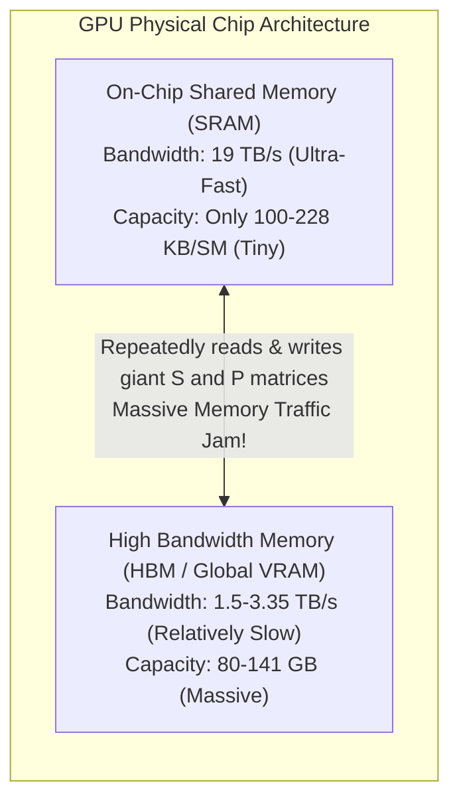
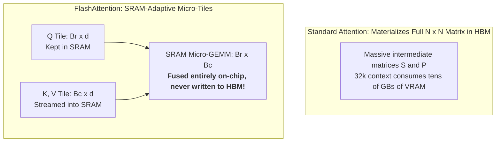
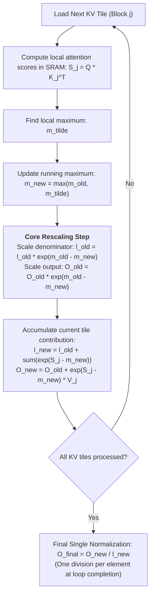
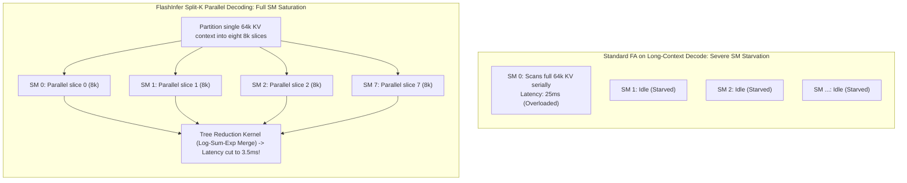

## Introduction: The Memory Traffic Crisis of Self-Attention

In the previous chapters of this series, we examined the macroscopic architecture and scheduling dynamics of inference engines:
- In [Roofline Model and Prefill vs Decode Physical Divergence](/en/articles/inference-roofline-prefill-decode/), we established the first-principles law separating **compute-bound** prefill from **memory-bandwidth bound** decode;
- In [PagedAttention and Virtual Memory Management](/en/articles/pagedattention-memory-virtualization/) and [Prefix Caching with RadixAttention](/en/articles/prefix-caching-radix-attention-internals/), we mastered the elimination of memory fragmentation and prefix-level context reuse.

Yet, no matter how sophisticated schedulers or cache managers become, every autoregressive step ultimately executes as low-level **GPU CUDA Kernels**.

Among all operators in an LLM, none is more computationally intensive, memory-hungry, or mathematically unique than Transformer's core engine: **Self-Attention**.

### 1.1 The Memory Bandwidth Trap of Standard Attention

The mathematical definition of scaled dot-product attention is remarkably succinct:
$$S = Q K^T \in \mathbb{R}^{N \times N}$$
$$P = \text{Softmax}(S) \in \mathbb{R}^{N \times N}$$
$$O = P V \in \mathbb{R}^{N \times d}$$

where $N$ denotes sequence length and $d$ represents the head dimension (typically 64 or 128).

In classical deep learning frameworks (such as vanilla PyTorch), executing this straightforward equation on physical GPU hardware leads to severe IO bottlenecks:

Under standard operator execution:
1. **Step 1 ($S = QK^T$)**: $Q$ and $K$ are loaded from HBM into SRAM to compute scores, and the intermediate $N \times N$ matrix $S$ is **written back to HBM**;
2. **Step 2 ($P = \text{Softmax}(S)$)**: The entire $N \times N$ matrix $S$ is read back into SRAM from HBM to compute normalized probabilities, and the resulting $N \times N$ matrix $P$ is **written back to HBM**;
3. **Step 3 ($O = PV$)**: $P$ and $V$ are re-read from HBM into SRAM to compute the weighted output $O$, which is written back to HBM.

When the sequence length reaches $N = 32,768$ (32k context), storing the intermediate $N \times N$ FP16 matrix for just a single attention head requires **2 GB of VRAM**. Across 32 heads in a modern model, a single Transformer layer generates **64 GB** of transient matrices.

The HBM bus cannot sustain this volume of round-trip traffic. GPU compute units spend over 80% of their operational cycles idling while waiting for memory transfers, causing **Model FLOPs Utilization (MFU) to plunge to 10%~20%**.

**The core architectural imperative is clear: the $N \times N$ intermediate matrices must never be materialized into global HBM! Computation, Softmax normalization, and reduction must be fused and executed entirely within tiny, on-chip SRAM.**

This realization sparked one of the most consequential algorithmic revolutions in modern systems engineering.

---

## 1. FlashAttention-1: Tiling and Online Softmax

In 2022, Tri Dao and colleagues from Stanford published a landmark paper at NeurIPS: *FlashAttention: Fast and Memory-Efficient Exact Attention with IO-Awareness*. FlashAttention introduced three foundational principles: **IO-awareness, SRAM tiling, and online dynamic softmax**.

### 1.1 Tiling: Operating Within SRAM Capacity Constraints

Because on-chip SRAM is extremely constrained (e.g., only 192 KB of Shared Memory per SM on an NVIDIA A100), an $N \times N$ matrix cannot fit. FlashAttention addresses this through **Tiling**:
- Divide Query ($Q$) into tiles of size $B_r \times d$;
- Divide Key ($K$) and Value ($V$) into tiles of size $B_c \times d$;
- Load only one pair of tiles from HBM into SRAM at a time, performing localized GEMM operations without spilling intermediate states.

### 1.2 The Mathematical Challenge: Global Softmax Dependencies

While tiling matrix multiplication is straightforward, Attention includes an intervening non-linear operator: **Softmax**:
$$P_{ij} = \frac{e^{S_{ij} - m_i}}{\sum_{k=1}^N e^{S_{ik} - m_i}} \quad \text{where } m_i = \max_{1 \le k \le N}(S_{ik})$$

Standard Softmax requires scanning an entire row to identify the global row maximum $m_i$ for numerical stability, followed by a second pass to compute the denominator sum $l_i = \sum_k e^{S_{ik} - m_i}$.

**When processing in tiles, a given tile has visibility only over its local maximum $\tilde{m}$ and local sum $\tilde{l}$. How can the algorithm compute an exact, mathematically identical global Softmax incrementally without prior knowledge of future tiles?**

### 1.3 The Derivation of Online Softmax

FlashAttention adopted the online softmax formulation originally described by Milakov and Gimelshein (2018), turning it into a **Dynamic Rescaling State Machine**.

Suppose the algorithm has processed up to tile $j$:
- Let $m^{(j-1)}$ and $l^{(j-1)}$ denote the running maximum and denominator sum accumulated across the first $j-1$ tiles;
- Let $\tilde{m}^{(j)}$ and $\tilde{l}^{(j)}$ denote the local maximum and local sum computed within the current tile $j$.

The updated global row maximum is:
$$m^{(j)} = \max\left(m^{(j-1)}, \tilde{m}^{(j)}\right)$$

Because the baseline maximum has shifted, all previously accumulated exponential terms must be re-scaled by $e^{m^{(j-1)} - m^{(j)}}$. The denominator sum updates as:
$$l^{(j)} = e^{m^{(j-1)} - m^{(j)}} \cdot l^{(j-1)} + e^{\tilde{m}^{(j)} - m^{(j)}} \cdot \tilde{l}^{(j)}$$

Similarly, the running unnormalized output accumulator $O$ is dynamically scaled by the same factor:
$$O^{(j)} = \text{diag}\left(e^{m^{(j-1)} - m^{(j)}}\right) \cdot O^{(j-1)} + e^{\tilde{m}^{(j)} - m^{(j)}} \cdot P^{(j)} V^{(j)}$$

With this formulation, FlashAttention **completely eliminated HBM writes for intermediate matrices $S$ and $P$**. Total memory traffic plummeted from $O(N^2)$ to $O(N^2 d / M)$, delivering a 2x-4x wall-clock speedup on A100 GPUs while reducing memory footprint to $O(N)$.

---

## 2. FlashAttention-2: Loop Inversion and Zero Warp Communication

While FlashAttention-1 proved transformative, it achieved only 30%~50% of the theoretical peak FLOPs on an A100. In 2023, Tri Dao introduced **FlashAttention-2**, redesigning kernel scheduling and execution pipelines.

### 2.1 Loop Inversion: Pinning Output to Registers

A key performance limitation in FlashAttention-1 stemmed from its loop ordering:
- **FA-1 Outer Loop**: Iterated over Key/Value tiles, while the inner loop iterated over Query tiles;
- Different outer iterations repeatedly contended to update the same Query's accumulator $O$. To avoid race conditions, partial outputs were frequently written back to shared memory or coordinated via atomic operations.

**FlashAttention-2 inverted the loop hierarchy**:
- **Outer Loop**: Iterates over Query tiles;
- **Inner Loop**: Iterates over Key/Value tiles.

This structural inversion delivered immediate hardware benefits: **Each Thread Block owns its assigned Query tile exclusively, allowing the running output accumulator $O$ to remain pinned inside ultra-fast GPU register files throughout the entire inner loop!** Registers are written back to global memory only once, after all Key/Value blocks have been fully scanned.

### 2.2 Eliminating Non-Matmul FLOP Overhead

GPU Tensor Cores are optimized for dense matrix multiplication (GEMM). Non-matmul operations (such as floating-point division and exponentiation) execute on separate Special Function Units (SFUs) with significantly lower throughput.

FlashAttention-1 evaluated division operations at every tile iteration. FlashAttention-2 deferred normalization entirely: **The inner loop performs pure addition and multiplication. Only after the entire sequence is scanned does the kernel execute a single vectorized division across the output registers**, substantially increasing Tensor Core occupancy.

### 2.3 Warp Partitioning: Eradicating Shared Memory Barriers

In CUDA thread hierarchies, each Thread Block is divided into 32-thread Warps.
- In FA-1, all warps cooperated across both $Q$ and $K, V$ blocks, requiring repeated synchronization barriers (`__syncthreads()`) through Shared Memory;
- FA-2 redesigned warp partitioning: **All warps in a block share the same $Q$ tile, but each warp is assigned independent, non-overlapping slices of the $K, V$ tiles**. This design eliminated inter-warp synchronization within the inner loop, achieving barrier-free parallel execution.

These optimizations elevated FlashAttention-2's compute efficiency to **up to 73% of theoretical peak FLOPs (~225 TFLOPS on A100)**.

---

## 3. FlashAttention-3: Harnessing the Hopper Architecture

In 2024, with NVIDIA's Hopper architecture (H100/H200) dominating large-scale AI infrastructure, Tri Dao and collaborators released **FlashAttention-3**, engineered specifically to exploit Hopper's architectural advancements.

Hopper introduced major hardware innovations compared to Ampere, and FA-3 was designed from the ground up around these features:

```mermaid
graph TD
    subgraph AmpereA100["Ampere (A100) Architecture"]
        HBM1["HBM"] -->|"Routed through general-purpose registers<br/>Consumes heavy register budget"| Regs["SM Registers"]
        Regs -->|"Spilled/written to Shared Memory"| SMEM1["SRAM"]
        SMEM1 -->|"Synchronous MMA instructions"| TC1["Tensor Cores"]
    end

    subgraph HopperH100["Hopper (H100) + FlashAttention-3"]
        HBM2["HBM"] ==>|"<b>TMA Hardware Async Copy</b><br/>Bypasses registers entirely, 0 SM ALU cost!"| SMEM2["SRAM"]
        SMEM2 ==>|"<b>WGMMA (Warpgroup Async GEMM)</b><br/>Streams directly from SRAM to Tensor Cores"| TC2["Tensor Cores"]
    end
```

### 3.1 Hardware Innovation 1: TMA (Tensor Memory Accelerator)

On earlier architectures like Ampere, copying data from HBM to SRAM required significant compute resources:
- Streaming Multiprocessors (SMs) issued explicit `LDG` instructions;
- Data traversed general-purpose registers before writing into Shared Memory;
- This consumed substantial register allocation (often causing register spilling to local memory) and used ALU instruction issue cycles.

**Hopper TMA is an autonomous hardware DMA engine**:
- The SM issues a single multi-dimensional tensor transfer descriptor;
- TMA transfers tensor tiles from HBM directly into Shared Memory in the background;
- **The transfer consumes zero register file space and zero SM instruction issue slots.**

### 3.2 Hardware Innovation 2: WGMMA (Warp-Group Matrix Multiply-Accumulate)

On Ampere, Tensor Core operations were driven at the single-warp level via `mma.sync`, requiring inputs to reside in private warp registers.

Hopper introduced **Warp-Group GEMM (WGMMA)**:
- Four warps coalesce into a 128-thread "Warpgroup";
- WGMMA instructions read operand matrices **directly from Shared Memory**, eliminating register staging;
- WGMMA executes asynchronously in hardware: while Tensor Cores process matrix multiplications, the SM ALU can concurrently compute Softmax exponentials.

### 3.3 Warp Specialization: Producer-Consumer Asynchronous Pipelining

Because data movement (TMA) and compute (WGMMA) run asynchronously in hardware, FlashAttention-3 abandoned symmetric thread execution in favor of **Producer-Consumer Warp Specialization**:

- **Producer Warps (1 Warp)**:
  Executes no math operations. Its sole responsibility is issuing TMA transfer descriptors for upcoming tiles and managing hardware transaction barriers (`mbarrier`);
- **Consumer Warps (3+ Warps)**:
  Awaits `mbarrier` notifications, continuously issuing WGMMA instructions and computing softmax exponentials.

Through ping-pong double buffering, while consumers calculate tile $K$, the producer loads tile $K+1$ via TMA. **Memory latency is hidden behind active compute cycles.**

Incorporating FP8 low-precision support with block quantization, FlashAttention-3 achieves sustained performance of **700 to 800 TFLOPS on an H100 SXM5**, reaching 75%~85% of physical hardware limits.

---

## 4. FlashInfer: Purpose-Built Kernels for LLM Serving

This brings us to a fundamental architectural question:

> **"If FlashAttention-3 pushes Hopper GPUs to theoretical limits, why do production serving engines like vLLM and SGLang rely heavily on [FlashInfer](https://github.com/flashinfer-ai/flashinfer)?"**

The answer lies in the fundamental difference between **Training** and **Inference Serving**: **FlashAttention was primarily designed for training and dense prefill; in real-world online inference, its design encounters structural mismatches.**

### 4.1 Structural Mismatches of Standard FlashAttention in Serving

1. **Mismatch 1: Paged KV Cache Indirection**:
   As detailed in Chapter 2 and Chapter 4, modern inference systems manage KV caches as non-contiguous blocks using PagedAttention and RadixAttention.
   FlashAttention natively expects **compact, physically contiguous tensors**. To process paged memory, an engine must either copy non-contiguous pages into a contiguous staging buffer (incurring high latency) or introduce indirect pointer lookups inside the kernel, breaking FA's memory alignment optimizations;

2. **Mismatch 2: The GEMV Bottleneck During Decode ($L_q = 1$)**:
   During autoregressive token generation, the query length is always exactly one ($L_q = 1$).
   Attention degenerates from dense GEMM into memory-bound vector-matrix multiplication (GEMV). FlashAttention parallelizes computation primarily across the Query sequence dimension. When $L_q = 1$, parallelization collapses to the Batch and Head dimensions.
   
   **If an engine processes a small batch (e.g., Batch=4, Heads=32), only $4 \times 32 = 128$ Thread Blocks can be scheduled. On an H100 GPU with 132 SMs, each SM receives roughly one block. If a request carries a 64k context, a single SM must scan all 64k tokens serially, taking tens of milliseconds while all other SMs sit idle!**

### 4.2 FlashInfer's Architectural Solutions

Developed by the LMSYS and MLC teams, **FlashInfer** was engineered specifically for production LLM serving:

1. **Native Paged KV Cache Architecture**:
   FlashInfer treats block-table indirection as a first-class citizen. Its memory load instructions resolve physical page indices directly within the inner loop, eliminating buffer copy overhead;
2. **Split-K Parallel Decoding**:
   To solve the single-SM bottleneck in long-context decode, FlashInfer incorporates **Split-K Attention**:
   - The key/value dimension ($K$) of a single long context is partitioned into multiple sub-segments across different SMs;
   - Each SM computes a partial output vector along with local Log-Sum-Exp normalization scalars in parallel;
   - A lightweight reduction kernel merges these partial results in a second step;
   - **For long contexts, Split-K accelerates decode token latency by 3x to 8x!**
3. **Unified Hybrid Batching**:
   FlashInfer provides unified dispatchers (`BatchPrefillWithPagedKVCache` and `BatchDecodeWithPagedKVCache`) that seamlessly handle variable lengths, Grouped-Query Attention (GQA), and mixed batches, eliminating the need for multiple conflicting CUDA streams.

---

## 5. Architectural Comparison Matrix

| Dimension | Vanilla PyTorch | FlashAttention-1 | FlashAttention-2 | FlashAttention-3 | FlashInfer (Serving Optimized) |
| :--- | :--- | :--- | :--- | :--- | :--- |
| **Release Year** | Baseline | 2022 (NeurIPS) | 2023 | 2024 | 2024 (LMSYS) |
| **HBM Traffic** | $O(N^2)$ (Severe) | $O(N^2 d / M)$ | $O(N^2 d / M)$ | $O(N^2 d / M)$ | $O(N^2 d / M)$ |
| **Core Innovation** | None | Tiling + Online Softmax | Loop Inversion + Register Pin | TMA Async + WGMMA | Split-K Decode + Native Paged KV |
| **Hardware Target** | Any | Volta / Ampere | Ampere / Hopper | Hopper (H100/H200) Only | Ampere / Hopper / Ada |
| **Intermediate Matrix**| Materialized in HBM | On-chip SRAM | On-chip Registers/SRAM | Hardware TMA Pipelines | On-chip Registers/SRAM |
| **Long Context Decode**| Out-of-Memory | Poor (Low Occupancy) | Poor (Single-SM Bound) | Moderate (Compute Saturated) | **Outstanding (Multi-SM Split-K)** |
| **Paged KV Cache** | Requires Copy | Patch-based | Patch-based | Requires Wrapper | **Native First-Class Support** |
| **Primary Domain** | Reference Implementations| Foundational Fusion | Training & Dense Prefill | High-Throughput H100 Training | **High-Concurrency Production Serving** |

---

## Frequently Asked Questions (FAQ)

### Q1: Why does FlashAttention recompute attention matrices during the backward pass instead of saving them during forward execution? Doesn't this increase total FLOPs?

**Yes, recomputation does increase total FLOPs, but it represents an optimal trade-off in modern GPU architectures: trading extra compute for reduced memory bandwidth.**

On modern accelerators like the A100 and H100, compute throughput has scaled far faster than memory bandwidth (FLOPs increased by tens of times, while memory bandwidth grew by only a few times).
- Storing the full $N \times N$ attention matrix during the forward pass requires writing hundreds of gigabytes into slow HBM, and reading it all back during backpropagation. The latency of these memory transfers far exceeds the time required to perform the matrix multiplication again;
- FlashAttention re-reads only the small $Q, K, V$ vectors from HBM during backward execution and recomputes the tile on-chip in SRAM. Even though arithmetic operations increase by ~30%, eliminating massive HBM round trips **makes the overall backward pass more than 2x faster**.

### Q2: Given that FlashAttention-3 achieves exceptional TFLOPS benchmarks on H100 GPUs, why do serving frameworks frequently prefer FlashInfer for token generation?

Because **benchmark evaluation conditions diverge sharply from real-world online inference workloads**:
- FlashAttention-3's benchmark scores (700+ TFLOPS) are measured on **large, dense prefill matrices (e.g., $L_q = 4096, L_k = 4096$)** where Tensor Cores remain fully saturated;
- In production serving, engines spend the vast majority of time in **autoregressive decode ($L_q = 1$)**, where the bottleneck is not Tensor Core speed, but low concurrency per sequence causing SM underutilization;
- FlashInfer is engineered around inference-specific access patterns: native indirection for Paged KV caches, variable-length hybrid batching, and **Split-K multi-SM parallel decoding**. In real-world serving benchmarks, FlashInfer consistently delivers lower P99 TPOT tail latency and higher concurrent capacity.

### Q3: Why do some inference engines encounter numerical overflow (yielding NaN) or precision drift in ultra-long contexts (64k+)? How does Online Softmax prevent this?

In floating-point math, $e^x$ overflows quickly. Under FP16 precision, the maximum representable value is approximately $65,504$. If an unnormalized attention score $S_{ij} = q_i \cdot k_j / \sqrt{d}$ exceeds $11$, $e^{11} \approx 59,874$, putting the calculation at immediate risk of **overflow (producing `+inf` and subsequent `NaN`)**.

Standard implementations avoid this by subtracting the global row maximum: $S_{ij} - \max(S)$. This bounds the exponent to $e^0 = 1$, keeping values within the safe $(0, 1]$ interval.

In tiled **Online Softmax**, where the maximum is updated incrementally, the kernel must apply a dynamic exponential correction factor at each step:
$$l^{(j)} = e^{m^{(j-1)} - m^{(j)}} \cdot l^{(j-1)} + \sum e^{S_k^{(j)} - m^{(j)}}$$
Because $m^{(j)} \ge m^{(j-1)}$, the exponent difference satisfies $m^{(j-1)} - m^{(j)} \le 0$. Consequently, the scaling multiplier $e^{m^{(j-1)} - m^{(j)}} \in (0, 1]$ **only attenuates previous sums and can never cause numerical overflow**. If a custom kernel fails to enforce this subtractive rescaling strictly, scaling up context length will cause immediate numeric instability.
