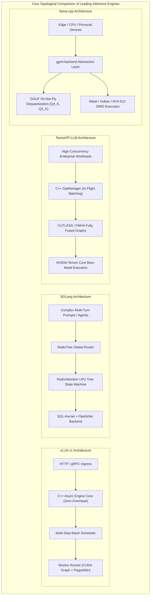
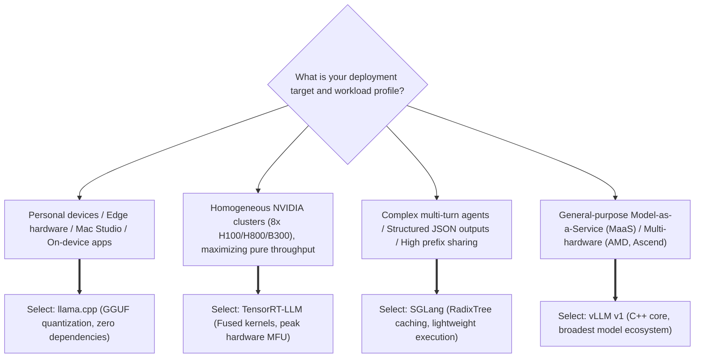

## Introduction: From Toy Scripts to Enterprise-Grade Serving Runtimes

In the early days of the generative AI boom in 2023, most developers initiated LLM inference on a single GPU using a simple Python loop:

```python
# The Naive PyTorch Autoregressive Loop
for _ in range(max_new_tokens):
    outputs = model(input_ids)
    next_token = torch.argmax(outputs.logits[:, -1, :], dim=-1)
    input_ids = torch.cat([input_ids, next_token.unsqueeze(-1)], dim=-1)
```

While clean and educational, running raw PyTorch loops in high-concurrency production deployments proves disastrous:
1. **Static Memory Allocations Waste $60\% \sim 80\%$ of GPU Memory**: Memory fragmentation prevents handling concurrent user requests;
2. **Padding Inefficiencies**: Uneven request lengths waste substantial compute cycles processing meaningless padding tokens;
3. **Severe Python GIL and Scheduling Latency**: In autoregressive generation where single-step GPU kernel execution completes in milliseconds, Python interpretation overhead starves the GPU, leaving Tensor Cores idle;
4. **Memory Bandwidth Choke**: Independent kernel invocations bounce tensors between High Bandwidth Memory (HBM) and SRAM, plunging Model FLOPs Utilization (MFU) below $15\%$.

To extract maximum performance from modern accelerators, open-source communities and hardware vendors engineered four industry-standard inference engines:
- **vLLM (UC Berkeley / LMSYS)**: The pioneer that standardized modern inference via PagedAttention memory virtualization, now fundamentally overhauled with its **vLLM v1** C++ engine core;
- **SGLang (LMSYS / Stanford)**: Tailored for multi-turn agentic interactions, pioneering **RadixAttention tree-based caching** with low-overhead execution loops;
- **TensorRT-LLM (NVIDIA)**: NVIDIA's high-performance powerhouse, deeply fusing CUTLASS and FlashAttention kernels with static engine graphs for peak hardware throughput;
- **llama.cpp (Georgi Gerganov)**: The minimalist Swiss Army knife built in pure zero-dependency C/C++, introducing the GGUF container standard and dominating edge and on-device computing.

In this ninth chapter of the **Production LLM Inference Engines** series, we bypass public benchmarks to dissect the architectural internals, scheduler execution loops, and underlying design philosophies of these four runtimes, concluding with an enterprise decision matrix.

---

## 1. Architectural Philosophy and Top-Level Topology

To evaluate these runtimes fairly, one must first recognize their contrasting **first-principle objectives**:



| Dimension | vLLM v1 | SGLang | TensorRT-LLM | llama.cpp |
| :--- | :--- | :--- | :--- | :--- |
| **Primary Goal** | High-throughput, universally extensible standard ecosystem | Multi-turn agent loops, structured decoding, and prefix reuse | Peak hardware throughput and energy efficiency on NVIDIA silicon | Zero-dependency, ultra-quantized portability across edge devices |
| **Language Stack** | C++ core scheduler + Python ecosystem extensions | Python scheduler + C++/CUDA kernels (SGL-Kernel) | Pure C++ engine runtime + Python build-time declarations | Pure C/C++ (Zero external library dependencies) |
| **Memory Architecture**| PagedAttention virtual block memory pool | RadixAttention tree-structured prefix caching pool | Static pre-allocated flat memory + In-Flight Paged KV | Memory-mapped (`mmap`) unified memory with split tensors |
| **Target Hardware** | NVIDIA GPU, AMD ROCm, Intel Gaudi, Ascend NPU | NVIDIA GPU, AMD ROCm | NVIDIA Silicon Exclusively (Hopper, Blackwell, Ada) | Apple Silicon, x86 CPU, ARM Mobile, embedded SoCs |

---

## 2. vLLM v1: Escaping the Python Bottleneck with C++ Core Engines

### 2.1 The Latency Penalty of the v0 Architecture

In early vLLM v0 iterations, despite revolutionary memory improvements via PagedAttention, the scheduler operated within Python's Global Interpreter Lock (GIL). 

On modern accelerators (e.g., H100/H800), a single autoregressive decoding step executes in **$1.5 \sim 3 \text{ ms}$**. However, the Python scheduling loop consumed **$2 \sim 4 \text{ ms}$** of CPU time per step updating sequence metadata, checking block allocations, and dispatching tensors. The GPU continually stalled waiting for the CPU scheduler, bottlenecking Model FLOPs Utilization (MFU).

### 2.2 Deep Dive into v1: Zero-Overhead C++ Schedulers and Multi-Step Execution

The **vLLM v1** redesign migrated the core scheduler and request lifecycle managers into a high-performance C++ async engine, introducing **Multi-Step Scheduling**.

In traditional step-by-step engines, CPU and GPU synchronize after every single generated token:
```
Traditional Step-by-Step Execution:
[CPU: Schedule Step 1] -> [GPU: Kernel Launch] -> [CPU Wait & Sync] -> [CPU: Schedule Step 2] ...
```

In vLLM v1, the scheduler pre-checks memory capacity and dispatches execution plans for the next $N$ steps (e.g., $N=8$ or $16$) in a single batch:

```cpp
// vLLM v1 Core Scheduling Decision Logic (Scheduler::schedule)
SchedulerOutputs Scheduler::schedule() {
    // 1. Prioritize active decoding sequences in the Running Queue
    std::vector<SequenceGroup*> running_batch;
    for (auto& seq_group : running_queue_) {
        // Pre-allocate blocks for the next num_steps iterations
        if (block_allocator_->can_allocate_multi_steps(seq_group, num_steps_)) {
            block_allocator_->allocate_for_multi_steps(seq_group, num_steps_);
            running_batch.push_back(seq_group);
        } else {
            // Memory pressure threshold reached: trigger preemptive swap-out
            preempt(seq_group);
        }
    }

    // 2. Consume remaining token budget with pending prefill requests
    std::vector<SequenceGroup*> prefill_batch;
    size_t remaining_token_budget = max_num_batched_tokens_ - get_num_tokens(running_batch);
    while (!waiting_queue_.empty() && remaining_token_budget > 0) {
        auto next_req = waiting_queue_.front();
        if (can_prefill(next_req, remaining_token_budget)) {
            prefill_batch.push_back(next_req);
            remaining_token_budget -= next_req->get_prompt_len();
            waiting_queue_.pop_front();
        } else {
            break;
        }
    }

    return SchedulerOutputs(running_batch, prefill_batch, num_steps_);
}
```

By executing multiple iterations directly on the GPU within persistent CUDA Graph streams, CPU scheduling overhead is amortized across $N$ steps. **This delivers a $30\% \sim 50\%$ throughput increase under low-batch conditions.**

---

## 3. SGLang: Tree-Structured Prefix State Machines for Fast Agent Loops

Where vLLM excels as a general-purpose serving platform, **SGLang** specializes in multi-turn agent workflows, extensive few-shot prompts, and structured output generation.

### 3.1 RadixAttention Codebase Internals

As explored conceptually in [Chapter 04 on Prefix Caching and RadixAttention](/en/articles/prefix-caching-radix-attention-internals/), SGLang models KV Cache memory as a dynamic Radix Tree:

```python
# SGLang RadixTree Core Matching and Eviction Logic
class RadixTree:
    def __init__(self):
        self.root = TreeNode(key_tokens=[])
        self.eviction_lru = DoublyLinkedList()

    def match_prefix(self, token_ids: List[int]) -> Tuple[List[int], TreeNode]:
        """
        Locates the longest shared prefix in O(K) time complexity, where K is prefix depth
        """
        curr = self.root
        matched_blocks = []
        idx = 0
        while idx < len(token_ids):
            child = curr.find_child(token_ids[idx])
            if child is None:
                break
            matched_len = child.match_prefix(token_ids[idx:])
            matched_blocks.extend(child.get_block_ids(matched_len))
            idx += matched_len
            if matched_len < len(child.key_tokens):
                # Partial match identified: split tree node
                break
            curr = child
            
        # Update LRU cache recency
        self.eviction_lru.touch(curr)
        return matched_blocks, curr
```

### 3.2 Tight Integration with SGL-Kernel and FlashInfer

SGLang pairs this tree data structure directly with optimized custom kernels:
- **In-Kernel Constrained Sampling**: For structured JSON generation, SGLang tracks grammar state machines directly within C++ logit processors, avoiding costly host-device transfers of full vocabulary tensors;
- **Zero-Copy Branching**: In tree search applications (MCTS or multi-agent voting), child branches share memory block references with ancestors using reference counting, performing Copy-on-Write only when tokens diverge.

---

## 4. TensorRT-LLM: Extreme Kernel Fusion on NVIDIA Silicon

For deployments exclusively targeting modern NVIDIA data center hardware (e.g., 8x H100/H800/B300 servers with NVSwitch fabrics), **TensorRT-LLM** provides unparalleled compute efficiency.

### 4.1 In-Flight Batching (IFB) and Pre-Compiled Computation Graphs

Rather than relying on dynamic graph generation, TensorRT-LLM compiles model architectures into static `.engine` binaries tailored to specific GPU models and tensor-parallel widths:
- A pure C++ `GptManager` controls **In-Flight Batching (IFB)**, decoupling layer execution into concurrent CUDA streams to hide inter-GPU communication latency;
- Memory allocation maps onto pre-computed flat arenas, virtually eliminating runtime allocation jitter.

### 4.2 Extreme Kernel Fusion Pipelines

TensorRT-LLM achieves peak throughput by eliminating intermediate memory reads and writes:

```
Standard Transformer Layer Execution:
[RMSNorm] --(Write HBM)--> [QKV GEMM] --(Write HBM)--> [RoPE] --(Write HBM)--> [FlashAttention] ...

TensorRT-LLM Deeply Fused Pipeline:
┌────────────────────────────────────────────────────────────────────────┐
│ Fused RMSNorm + QKV Projection + RoPE (Executed in L1/SRAM registers)  │
└───────────────────────────────────┬────────────────────────────────────┘
                                    ▼
┌────────────────────────────────────────────────────────────────────────┐
│ Fused Paged-KV Attention + Output Projection Linear Kernel             │
└───────────────────────────────────┬────────────────────────────────────┘
                                    ▼
┌────────────────────────────────────────────────────────────────────────┐
│ Fused SwiGLU MLP (Gate + Up Projection + Activation fully integrated)  │
└────────────────────────────────────────────────────────────────────────┘
```

By leveraging NVIDIA CUTLASS, **RMSNorm, QKV GEMM, and RoPE positional encoding** execute within a single fused kernel. Intermediate activations remain entirely within streaming multiprocessor (SM) register files and shared memory, bypassing HBM entirely.

*Trade-off*: Modifying non-standard architectures requires authoring custom C++ TensorRT plugins and re-running extended compilation pipelines.

---

## 5. llama.cpp: The Minimalist Swiss Army Knife for Edge Runtimes

While enterprise engines focus on multi-GPU server clusters, **llama.cpp** takes a completely different path: **enabling large language models to run efficiently on commodity CPUs, mobile devices, and consumer laptops.**

### 5.1 Pure C/C++ Architecture with Zero External Dependencies

Authored by Georgi Gerganov, llama.cpp requires no PyTorch, no CUDA runtime, and no external package managers:
- The core tensor library, `ggml`, maps computations directly to hardware SIMD vector intrinsics;
- It utilizes AVX-512 and AVX2 on x86 CPUs;
- On Apple Silicon, it invokes Metal Performance Shaders (MPS), achieving direct zero-copy memory reads via unified memory architectures (UMA);
- On mobile and embedded platforms, it supports Vulkan, OpenCL, and ARM NEON.

### 5.2 The GGUF Format and Non-Uniform k-Quants

llama.cpp standardized the universal **GGUF container format**, packaging model weights, tokenizers, hyperparameter configs, and quantization metadata into a single self-contained binary.

Furthermore, its custom **k-quants block-quantization algorithms** enable aggressive compression:

```
llama.cpp k-quants Precision Hierarchy:
┌───────────────────────────────────────────────────────────────┐
│ Q4_K_M: 4.5-bit attention layers with 4-bit feed-forward grids│
│ Q3_K_S: 3-bit compression reducing memory footprint by ~75%   │
│ Q2_K  : 2-bit quantization running 70B models on 24GB GPUs    │
└───────────────────────────────────────────────────────────────┘
```

Weights are dequantized on-the-fly during matrix-vector multiplications using fast lookup tables, enabling multi-billion parameter models to execute smoothly on personal workstations.

---

## 6. Enterprise Production Decision Matrix: Which Engine to Choose?

When deploying production infrastructure, system architects must select runtimes aligned with operational realities:



### Comprehensive Technical Evaluation Matrix (1 to 5 Stars)

| Evaluation Criterion | vLLM v1 | SGLang | TensorRT-LLM | llama.cpp |
| :--- | :---: | :---: | :---: | :---: |
| **Peak Throughput Capacity** | ⭐️⭐️⭐️⭐️☆ | ⭐️⭐️⭐️⭐️☆ | ⭐️⭐️⭐️⭐️⭐️ (Industry Peak) | ⭐️⭐️☆☆☆ |
| **Time to First Token (TTFT)** | ⭐️⭐️⭐️⭐️☆ | ⭐️⭐️⭐️⭐️⭐️ (Superb Prefix Reuse) | ⭐️⭐️⭐️⭐️☆ | ⭐️⭐️⭐️☆☆ |
| **Agent / Multi-Turn Suitability** | ⭐️⭐️⭐️☆☆ | ⭐️⭐️⭐️⭐️⭐️ (Optimal Choice) | ⭐️⭐️☆☆☆ | ⭐️⭐️⭐️☆☆ |
| **Model Ecosystem Coverage** | ⭐️⭐️⭐️⭐️⭐️ (Fastest Community Adoption) | ⭐️⭐️⭐️⭐️☆ | ⭐️⭐️☆☆☆ (Official Ports Only) | ⭐️⭐️⭐️⭐️☆ |
| **Heterogeneous Silicon (AMD/Intel/ARM)** | ⭐️⭐️⭐️⭐️⭐️ (Widest Accelerator Support) | ⭐️⭐️⭐️☆☆ | ⭐️☆☆☆☆ (Strictly NVIDIA) | ⭐️⭐️⭐️⭐️⭐️ (Runs Anywhere) |
| **Custom Extensibility & DevOps Overhead** | ⭐️⭐️⭐️⭐️☆ (Well Documented) | ⭐️⭐️⭐️⭐️☆ (Lightweight Codebase) | ⭐️☆☆☆☆ (Steep Compilation Curve) | ⭐️⭐️⭐️⭐️⭐️ (Clone & Compile) |

---

## Summary and Series Finale Outlook

From vLLM v1's C++ zero-overhead scheduler to SGLang's dynamic Radix Trees, TensorRT-LLM's fused kernel pipelines, and llama.cpp's edge minimalism, modern inference runtimes represent specialized trade-offs across the compute landscape.

With our examination of kernel architectures, batching schedulers, and runtime engines complete, we arrive at the frontier of serving systems. In the **tenth and final chapter of this series**, we investigate: **The Future of LLM Inference: Test-Time Compute, Reasoning Scheduling, and Tiered Cluster Storage**, exploring how long reasoning chains (16k~128k generated thinking tokens) will redefine memory hierarchies and speculative decoding schedulers.

---

## Frequently Asked Questions (FAQ)

### Q1: Why do enterprise Model-as-a-Service (MaaS) platforms often deploy both vLLM and SGLang concurrently?
Deploying both represents a practical division of labor based on workload characteristics:
- **vLLM v1 serves as the universal gateway**: It powers general single-turn Q&A, document summarization, code generation, and long-tail open-source models, leveraging its extensive community model support and cross-hardware compatibility (e.g., AMD ROCm, Ascend NPUs);
- **SGLang powers multi-turn agent platforms**: For agentic workflows sharing massive system prompts (frequently thousands of tokens containing tool definitions and rules), RadixAttention achieves $90\%+$ prefix cache hits, significantly reducing latency and compute costs.

### Q2: If TensorRT-LLM delivers such high throughput, why has it not completely eclipsed alternative runtimes?
TensorRT-LLM achieves peak performance through significant operational trade-offs:
1. **Prolonged Compilation Overhead**: Building optimized engines requires compiling ahead of time for specific GPU architectures, tensor-parallel widths, and maximum batch sizes. Recompiling across varied hardware topologies can take hours;
2. **Debugging Complexity**: The core runtime is embedded within low-level C++ drivers, making runtime debugging challenging when non-standard inputs cause failures;
3. **Lagging Support for Novel Architectures**: When academic or open-source labs introduce novel attention mechanisms (e.g., DeepSeek MLA or KDA), community engines like vLLM and SGLang frequently ship Triton implementations within days, whereas TensorRT-LLM requires engineering custom C++ plugins.

### Q3: How does llama.cpp's Unified Memory zero-copy differ from discrete data center GPU HBM?
On Apple Silicon devices (e.g., Mac Studio with M-series chips), the CPU and GPU share a unified pool of high-bandwidth LPDDR memory (achieving 400~800 GB/s bandwidth).
In standard PC or data center servers, model weights must be copied from host system RAM across the PCIe bus into discrete GPU HBM before computation can begin. Under unified memory architectures, llama.cpp uses operating system `mmap()` calls to allow the GPU to read weights directly from memory in place. This eliminates weight transfer overhead and allows running models whose parameter sizes exceed traditional single-GPU VRAM limits (e.g., running 70B models in 128GB unified RAM), though raw double-precision and half-precision compute density remains lower than dedicated data center Tensor Cores.
