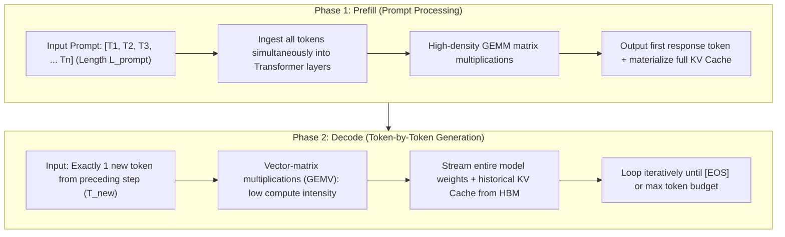
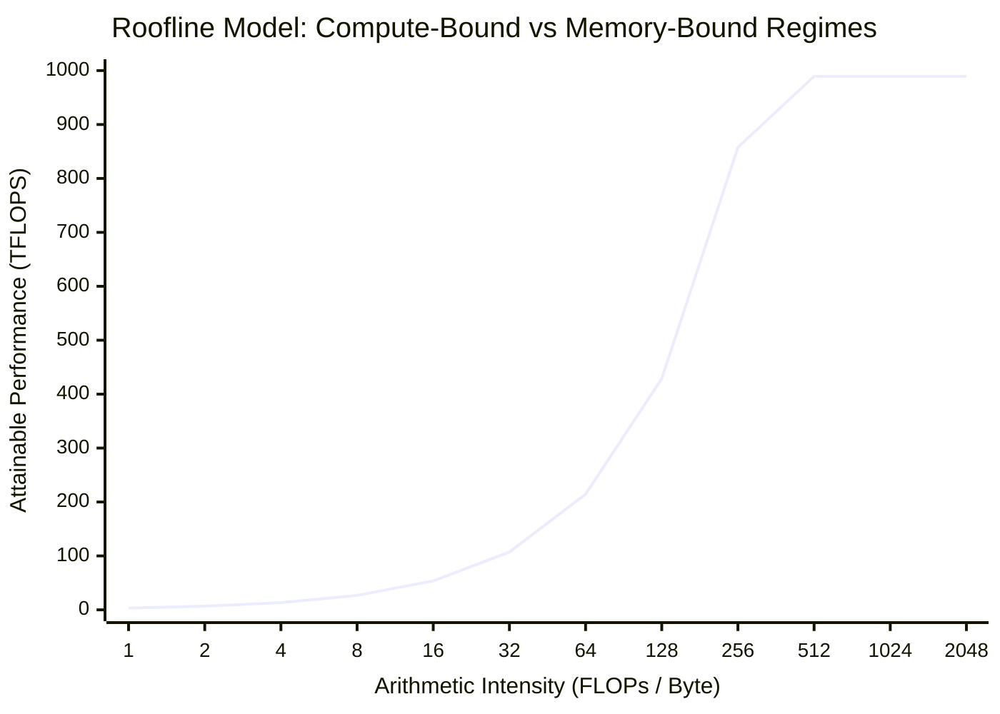
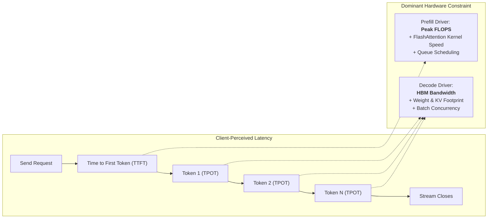
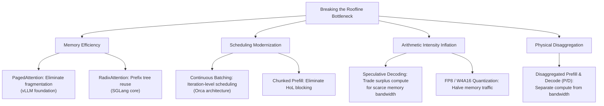

## Introduction: The Dormant Tensor Cores of `model.generate()`

When software engineers first transition from machine learning modeling to high-performance inference systems, the textbook entry point in PyTorch and Hugging Face looks deceptively straightforward:

```python
import torch
from transformers import AutoModelForCausalLM, AutoTokenizer

tokenizer = AutoTokenizer.from_pretrained("meta-llama/Llama-3.1-8B-Instruct")
model = AutoModelForCausalLM.from_pretrained(
    "meta-llama/Llama-3.1-8B-Instruct", 
    torch_dtype=torch.bfloat16, 
    device_map="cuda"
)

input_ids = tokenizer("Explain quantum computing in 200 words:", return_tensors="pt").input_ids.cuda()
# Trigger the autoregressive generation loop
output = model.generate(input_ids, max_new_tokens=128)
```

While clean and idiomatic, profiling this execution loop with **Nsight Systems (`nsys`)** or **PyTorch Profiler** on production hardware reveals a striking paradox:

```
[GPU Profiling Snapshot on NVIDIA H100 SXM5 (80GB)]
--------------------------------------------------------------------------------
Phase 1: Prompt Processing (Prefill)  -> Duration: ~12.4 ms | Tensor Core: 82.4%
Phase 2: Token 001 Generation (Decode)-> Duration: ~16.1 ms | Tensor Core:  2.1%
Phase 2: Token 002 Generation (Decode)-> Duration: ~16.2 ms | Tensor Core:  2.0%
...
Phase 2: Token 128 Generation (Decode)-> Duration: ~17.5 ms | Tensor Core:  1.9%
--------------------------------------------------------------------------------
Average Tensor Core Utilization across entire Generation: 3.4%
HBM Memory Bandwidth Utilization: 88.6%
```

**Eighty gigabytes of blazing-fast HBM3 memory are fully occupied, a 700-watt server chassis hums at full load, yet the GPU's most expensive physical asset — 989 TFLOPS of BF16 Tensor Core compute — sits starved and idle for over 95% of the total generation duration.**

Why does this compute collapse occur? Why does even the most powerful enterprise accelerator struggle to output more than a few dozen tokens per second for a single client stream?

As the opening chapter of the **《Production LLM Inference Engines: Evolution, Architecture, and Future》** series, this article breaks down the foundational hardware bounds governing transformer inference: the **Roofline Model**, the physics of **Arithmetic Intensity**, and the irreconcilable split between **Prefill** and **Decode**.

---

## 1. The Two Physical States of Autoregressive Generation

The stark compute divergence of a Decoder-only Transformer stems from its **autoregressive, causal dependency**. 

Every request is physically divided into two distinct execution regimes:



### 1. Prefill Phase (Prompt Ingestion)
* **Compute Characteristics**: The input prompt consists of $L_{\text{prompt}}$ tokens available simultaneously. Because all token representations are known upfront, attention scores and linear projections can be evaluated as dense, highly structured matrix-matrix multiplications (GEMM).
* **Data Flow**: Model weights $W \in \mathbb{R}^{d_{\text{in}} \times d_{\text{out}}}$ are read once from HBM and reused across thousands of parallel tokens in the prompt.
* **Hardware Bottleneck**: **Compute-bound**. The workload saturates GPU Tensor Cores, and total execution time scales with the arithmetic throughput (TFLOPS) of the chip.

### 2. Decode Phase (Autoregressive Generation)
* **Compute Characteristics**: The model generates strictly **one token** per forward pass. Because token $t$ depends conditionally on token $t-1$ ($P(x_t \mid x_{<t})$), time cannot be parallelized across steps.
* **Data Flow**: To project just a single token representation, the GPU must stream tens of gigabytes of model weights from High Bandwidth Memory (HBM) into on-chip SRAM **for every single step**. The operation degenerates from GEMM into memory-starved vector-matrix multiplication (GEMV).
* **Hardware Bottleneck**: **Memory-bandwidth bound**. Compute execution units spend most clock cycles stalled, waiting for weights and historical KV caches to traverse the memory bus.

---

## 2. Deriving the Roofline Model for Modern Accelerators

In computer architecture, the **Roofline Model** defines the theoretical performance envelope of an algorithm on a specific hardware platform:



The mathematical formulation is defined as:

$$\text{Attainable Performance (P)} = \min\left(P_{\text{peak}}, \; I \times B_{\text{mem}}\right)$$

Where:
* $P_{\text{peak}}$: Theoretical peak compute performance ($\text{FLOPs/s}$).
* $B_{\text{mem}}$: Physical memory bandwidth ($\text{Bytes/s}$).
* $I$: **Arithmetic Intensity** (or operational intensity), representing the number of floating-point operations executed per byte transferred from device memory ($\text{FLOPs/Byte}$):
  $$I = \frac{\text{Total Operations (FLOPs)}}{\text{Total Memory Traffic (Bytes)}}$$

### The Ridge Point: The Hardware Dividing Line

The intersection between the memory-bound slope and the compute-bound ceiling is known as the **Ridge Point ($I_{\text{ridge}}$)**:

$$I_{\text{ridge}} = \frac{P_{\text{peak}}}{B_{\text{mem}}}$$

* If an algorithm's arithmetic intensity satisfies $I \ge I_{\text{ridge}}$, it operates in the flat **compute-bound** regime. The hardware's compute cores can be fully utilized.
* If $I < I_{\text{ridge}}$, the workload is trapped in the slanted **memory-bandwidth bound** regime. Attainable throughput is bounded by memory bus speed, regardless of peak TFLOPS.

The table below catalogs official physical specifications and ridge points across modern enterprise accelerators under **BF16/FP16 dense tensor operations**:

| Accelerator | Architecture | Memory Capacity & Type | Bandwidth ($B_{\text{mem}}$) | Dense Peak Compute ($P_{\text{peak}}$, BF16) | Ridge Point ($I_{\text{ridge}}$) |
| :--- | :--- | :--- | :--- | :--- | :--- |
| **NVIDIA A100** | Ampere (SXM4) | 80 GB HBM2e | **2,039 GB/s** (~2.04 TB/s) | **312.0 TFLOPS** | **~153.0 FLOPs/Byte** |
| **NVIDIA H100** | Hopper (SXM5) | 80 GB HBM3 | **3,350 GB/s** (~3.35 TB/s) | **989.4 TFLOPS** | **~295.3 FLOPs/Byte** |
| **NVIDIA H200** | Hopper (SXM5) | 141 GB HBM3e | **4,800 GB/s** (~4.80 TB/s) | **989.4 TFLOPS** | **~206.1 FLOPs/Byte** |
| **NVIDIA B200** | Blackwell | 192 GB HBM3e | **8,000 GB/s** (~8.00 TB/s) | **2,250.0 TFLOPS** | **~281.3 FLOPs/Byte** |

> [!IMPORTANT]
> **Key Architectural Takeaway**: Compute density ($P_{\text{peak}}$) has grown significantly faster (3.1x to 7.2x) than memory bandwidth ($B_{\text{mem}}$, 1.6x to 3.9x) across successive GPU architectures. 
> As a result, the **Ridge Point $I_{\text{ridge}}$ has shifted further to the right** (from 153 to nearly 300 FLOPs/Byte). Accelerators have become far more sensitive to memory stalls; without massive operational intensity, high-end silicon remains largely unexercised.

---

## 3. Mathematical Derivation: Why Decode Traps the Hardware

Consider a transformer model containing $P$ parameters. In 16-bit precision (BF16 or FP16), each parameter occupies 2 bytes. Let $B$ represent the batch size and $L$ represent the sequence length being processed.

### 1. Arithmetic Intensity of Linear Projections

Linear layers (MLP / FFN expansions and Attention QKV projections) comprise the vast majority of model parameters. A standard matrix multiply requires 2 floating-point operations per parameter (one multiply, one add).

For an execution batch containing $B \times L$ tokens:
* **Floating-Point Operations**: $\text{FLOPs} = 2 \times P \times B \times L$
* **Weight Memory Traffic**: Streaming the weight matrices from HBM requires $\text{Bytes}_{\text{weights}} = 2 \times P$

Evaluating arithmetic intensity for the linear projection yields:

$$I_{\text{weights}} = \frac{2 \times P \times B \times L}{2 \times P} = B \times L \quad (\text{FLOPs/Byte})$$

This formulation yields a fundamental law: **the arithmetic intensity of linear projections is numerically equal to the number of tokens processed simultaneously ($B \times L$)!**

#### Case A: The Prefill Regime
During prefill, $L = L_{\text{prompt}}$. Even for a single user query ($B = 1$) with a standard context prompt of $L_{\text{prompt}} = 2048$:

$$I_{\text{prefill}} = 1 \times 2048 = 2048 \text{ FLOPs/Byte}$$

Comparing this against the H100 ridge point ($I_{\text{ridge}} = 295.3 \text{ FLOPs/Byte}$):
$$I_{\text{prefill}} \; (2048) \gg I_{\text{ridge}} \; (295.3)$$

Prefill intensity exceeds the hardware threshold by **nearly 7x**. It lands securely on the compute-bound flat roofline. Tensor Cores execute at peak efficiency, and execution time depends purely on floating-point throughput.

#### Case B: The Decode Regime
In the autoregressive decode loop, the model emits exactly one token per sequence ($L = 1$). The equation collapses to:

$$I_{\text{decode}} = B \times 1 = B \text{ FLOPs/Byte}$$

For an interactive developer session or private inference endpoint serving one client ($B = 1$):

$$I_{\text{decode}} = 1 \text{ FLOPs/Byte} \lll 295.3 \text{ FLOPs/Byte}$$

Evaluating attainable performance on an H100:

$$P_{\text{attainable}} = I_{\text{decode}} \times B_{\text{mem}} = 1 \text{ FLOPs/Byte} \times 3,350 \text{ GB/s} = 3.35 \text{ TFLOPS}$$

$$\text{Compute Efficiency} = \frac{3.35 \text{ TFLOPS}}{989.4 \text{ TFLOPS}} \approx \mathbf{0.34\%}$$

**This provides mathematical proof for why profilers capture near-zero Tensor Core utilization during generation. At batch size 1, 99.66% of the compute hardware is physically stalled.**

Even if an enterprise server pools traffic to achieve a concurrency of $B = 32$, an arithmetic intensity of ${3}2 \text{ FLOPs/Byte}$ remains far below the 295.3 FLOPs/Byte threshold, leaving the system deeply memory-bandwidth bound.

---

### 2. The Compounding Penalty: KV Cache Bandwidth Overhead

The derivation above only accounted for model weights. In practice, the autoregressive decode loop must also load the **Key-Value (KV) Cache** for all preceding tokens.

To generate token $t$, the single query vector (${1} \times d_{\text{head}}$) must perform dot-product attention against all historical key and value vectors ($L_{\text{ctx}} \times d_{\text{head}}$) across all layers:

$$\text{Bytes}_{\text{KV\_read}} = 2 \times 2 \times n_{\text{layers}} \times n_{\text{kv\_heads}} \times d_{\text{head}} \times L_{\text{ctx}} \times B$$
*(The first factor of 2 accounts for Keys and Values; the second factor of 2 represents 16-bit storage).*

Evaluating operational intensity for the attention step:
* **Attention Compute**: ${4} \times n_{\text{layers}} \times n_{\text{heads}} \times d_{\text{head}} \times L_{\text{ctx}} \times B$ FLOPs
* **Attention Arithmetic Intensity**:
  $$I_{\text{KV}} = \frac{4 \times n_{\text{layers}} \times n_{\text{heads}} \times d_{\text{head}} \times L_{\text{ctx}} \times B}{4 \times n_{\text{layers}} \times n_{\text{kv\_heads}} \times d_{\text{head}} \times L_{\text{ctx}} \times B} = \frac{n_{\text{heads}}}{n_{\text{kv\_heads}}}$$

**This mathematical result illustrates an engineering bottleneck:**
* Under standard **Multi-Head Attention (MHA)** where $n_{\text{heads}} = n_{\text{kv\_heads}}$, the operational intensity of reading the KV Cache is **strictly ${1} \text{ FLOP/Byte}$**, regardless of batch size or sequence length.
* Under **Grouped-Query Attention (GQA)** (e.g., Llama-3 with an 8:1 head ratio), arithmetic intensity rises only to ${8} \text{ FLOPs/Byte}$.
* As context length expands ($L_{\text{ctx}} \ge 32\text{K}$), memory traffic consumed by the KV Cache surpasses the bandwidth required to stream the model weights themselves (see our analysis on [Kimi KDA and DeepSeek MLA Memory Wall Architectures](/en/articles/kimi-kda-deepseek-mla-architecture/)).

---

## 4. Metric Divergence: The Inherent Tension Between TTFT and TPOT

This physical hardware split creates an inevitable conflict in production Service Level Agreements (SLAs):



### 1. Time to First Token (TTFT)
The duration between request dispatch and the receipt of the first generated token, corresponding to the prefill phase:

$$\text{TTFT} \approx \frac{2 \cdot P \cdot L_{\text{prompt}}}{\text{Achieved FLOPS}} + T_{\text{queue}}$$

* **Key Drivers**: **Peak GPU FLOPS**, prompt token count, and kernel parallelism.
* **User Perception**: High TTFT makes the application feel unresponsive or frozen.

### 2. Time Per Output Token (TPOT / ITL)
The incremental latency between successive streaming tokens during generation:

$$\text{TPOT} \approx \frac{\text{Bytes}_{\text{Weights}} + \text{Bytes}_{\text{KV\_Cache}}(L_{\text{ctx}})}{\text{Achieved Memory Bandwidth}} \times \frac{1}{B}$$

* **Key Drivers**: **HBM Memory Bandwidth**, quantization precision, and KV cache compaction.
* **User Perception**: Dictates reading fluency. Standard reading speed requires 10–20 tokens/sec (TPOT of 50ms–100ms). Latency exceeding 150ms creates noticeable stuttering.

### 3. The Production Dilemma

Because Prefill and Decode are governed by orthogonal hardware limits, optimization strategies frequently interfere with one another:

| Optimization Goal | Implementation Method | Impact on TTFT | Impact on TPOT | Cluster Throughput |
| :--- | :--- | :--- | :--- | :--- |
| **Ultra-Low Latency (SLA-First)** | Maintain minimal batch size, execute prefill immediately | **Optimal (< 100ms)** | **Optimal (fastest single-token generation)** | **Poor (computational units idle 95% of time)** |
| **Maximized Throughput (Cost-First)** | Amass large batches, run continuous batching | **Degraded (requests queue for batch alignment)** | **Degraded (memory bandwidth shared across requests)** | **Optimal (Tokens/sec per GPU maximized)** |

Furthermore, co-locating long prompt prefills and streaming decodes on the same GPU introduces **Head-of-Line (HoL) Blocking**: an incoming 16K prefill will monopolize the Tensor Cores for hundreds of milliseconds, interrupting active decodes and introducing severe streaming jitter.

---

## 5. Architectural Implications: Why Modern Inference Engines Exist

Raw PyTorch execution loops cannot handle production scale. To escape the Roofline trap, system engineers developed modern inference runtimes around five structural optimizations:



1. **Memory Virtualization**: Since decode is bandwidth- and capacity-constrained, eliminating memory waste is critical. **[PagedAttention](/en/articles/sglang-vs-vllm-architecture/)** applies virtual memory concepts to eliminate the internal fragmentation of static buffer pre-allocation.
2. **Prefix Tree Caching**: Multi-turn agents and structured prompts reuse common prefixes. **RadixAttention** enables instant KV cache reuse without redundant prefills.
3. **Chunked Scheduling**: **Chunked Prefill** slices massive prompts into smaller chunks, interleaving them smoothly with decode steps to prevent HoL blocking.
4. **Algorithmic Intensity Boosts**: **[EAGLE-3 Speculative Decoding](/en/articles/speculative-decoding-eagle-guide/)** leverages idle Tensor Cores during decode to predict multiple tokens per memory load, trading surplus compute for scarce memory bandwidth.
5. **Physical Disaggregation**: Architectures like DistServe and Mooncake decouple prefill and decode entirely, routing prefill to compute-heavy clusters and decode to bandwidth-optimized nodes across low-latency RDMA networks.

In the chapters that follow, we will walk through each of these systems layers to trace how modern inference engines break the physical constraints of hardware.

---

## Frequently Asked Questions (FAQ)

### Q1: If decode is memory-bandwidth bound, why not increase batch size indefinitely to saturate the compute units?
While scaling batch size theoretically pushes arithmetic intensity past the hardware ridge point ($B \ge 295$ on an H100), production workloads face two practical barriers:
1. **Out-of-Memory (OOM) Ceilings**: As concurrency reaches hundreds of concurrent streams, the aggregate KV Cache scales linearly with sequence length. An 80GB HBM buffer exhausts its capacity before reaching the batch size needed to saturate compute.
2. **Degraded Per-User Latency (TPOT)**: Physical memory bandwidth is finite. Increasing batch size from 1 to 256 improves aggregate system throughput (Tokens/sec), but per-request memory bandwidth is divided among streams. Per-token generation latency degrades from 20ms to hundreds of milliseconds, violating interactive user latency targets.

### Q2: Why does FP8 quantization impact Prefill and Decode through entirely different physical mechanisms on Hopper and Blackwell?
The speedup mechanisms operate along separate hardware paths:
* **For Prefill**: Acceleration is driven by **higher Tensor Core compute throughput** (FP8 dense math reaches 1,978.9 TFLOPS on H100, exactly 2x that of BF16). Dense GEMMs execute in roughly half the clock cycles.
* **For Decode**: Acceleration is driven by **halving memory bus traffic**. Decode performance is bound by the rate at which weights and KV caches can be fetched from HBM. FP8 halves the byte footprint of the weights; across a fixed memory bandwidth, data transfer time drops by approximately 50%, directly reducing TPOT.
For comprehensive benchmarks, consult our [Quantization Precision Guide](/en/articles/quantization-precision-guide/) and [Practical Quantization Guide](/en/articles/quantization-hands-on-guide/).

### Q3: Why does FlashAttention-3 produce dramatic speedups for Prefill but only marginal improvements for Decode?
**FlashAttention's primary innovation is tiling the attention computation to keep intermediate activations ($S, P$) in fast on-chip SRAM, avoiding $O(N^2)$ reads and writes to slow HBM.**

* In **Prefill**, sequence length $N$ is large, resulting in massive $N \times N$ attention matrices. Eliminating quadratic HBM round-trips yields speedups of 2x to 4x.
* In **Decode**, the query sequence length is strictly ${1}$. The operation is a vector-matrix multiply (${1} \times N$) rather than an $N \times N$ matrix product. The primary cost is streaming the historical KV cache from HBM. Because FlashAttention cannot bypass the physical need to load historical keys and values into SRAM, its relative latency reduction during single-token decode is inherently smaller than in prefill.
