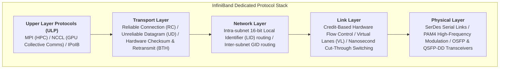
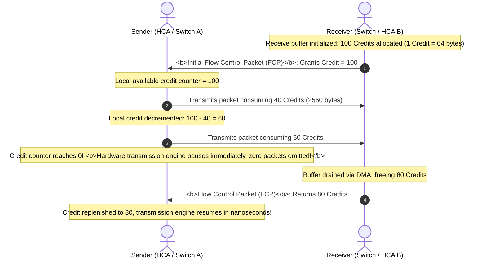
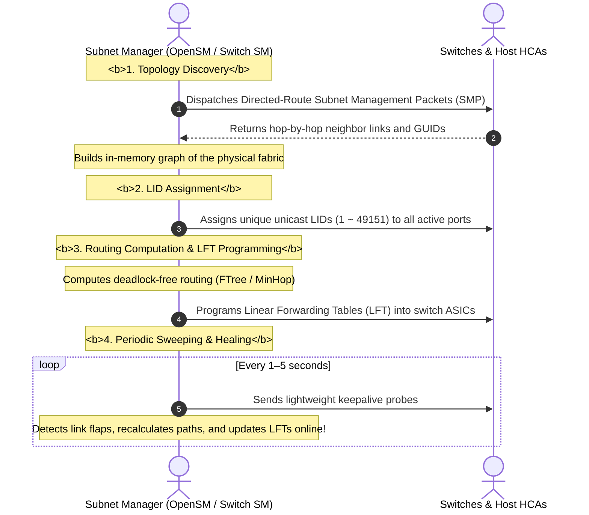

## Introduction: The Dedicated Arteries of Supercomputing — Native InfiniBand

In Chapter 9 of our series, [RDMA High-Performance Networking Foundations: Kernel Bypass, Zero-Copy, Queue Pairs, and Lossless RoCEv2 Architecture](/en/articles/rdma-kernel-bypass-zero-copy-queue-pair-rocev2-lossless/), we examined the trade-offs involved in retrofitting Ethernet for RDMA—relying on reactive PFC pause frames and DCQCN congestion tuning to manufacture a pseudo-lossless environment.

However, high-performance computing pursued a radically different path: **abandon backward compatibility with legacy Ethernet and design a purpose-built network for supercomputing and large-scale AI from scratch—InfiniBand (IB)**.

Founded in 1999 by the InfiniBand Trade Association (IBTA), InfiniBand has evolved over two decades. In the 2026 era of generative AI and 10,000-GPU compute clusters, InfiniBand remains the gold standard thanks to its **hardware-level zero-drop guarantees, sub-100ns cut-through switching, and centralized fabric topology orchestration**.

This article examines InfiniBand's core architecture from first principles: from **physical-layer modulation and link speed scaling** to **credit-based flow control, cut-through switching**, and the centralized **Subnet Manager**.

---

## 1. InfiniBand Layered Architecture and Physical Signaling Evolution

InfiniBand replaces the legacy Ethernet protocol stack with a streamlined four-layer hierarchy:



### 1.1 Physical Link Speed Roadmap: From SDR to 2026 XDR 800G

InfiniBand links typically aggregate 4 physical serial lanes (4x width). As SerDes and optical transceiver technologies advanced, per-lane signaling rates increased dramatically:

| Generation | Acronym | Per-Lane Raw Rate | 4x Aggregate Bandwidth | Modulation / Encoding | Benchmark Switch Silicon | Production Era |
| :--- | :--- | :--- | :--- | :--- | :--- | :--- |
| Single Data Rate | **SDR** | 2.5 Gbps | 10 Gbps | 8b/10b NRZ | Early HPC Switches | 2001 |
| Double Data Rate | **DDR** | 5.0 Gbps | 20 Gbps | 8b/10b NRZ | Early Mellanox Silicon | 2005 |
| Quad Data Rate | **QDR** | 10.0 Gbps | 40 Gbps | 8b/10b NRZ | IS5000 Series | 2008 |
| Fourteen Data Rate | **FDR** | 14.0625 Gbps | 56 Gbps | 64b/66b NRZ | SwitchX-2 | 2011 |
| Enhanced Data Rate | **EDR** | 25.78125 Gbps | 100 Gbps | 64b/66b NRZ | Switch-IB / ConnectX-4 | 2014 |
| High Data Rate | **HDR** | 50 Gbps | 200 Gbps | **PAM4** Modulation | Quantum-1 (QM8700) | 2018 |
| Next Data Rate | **NDR** | 100 Gbps | **400 Gbps** | 100G PAM4 | **Quantum-2 (QM9700)** | 2022–2024 (Mainstream) |
| eXtreme Data Rate | **XDR** | 200 Gbps | **800 Gbps** | 200G PAM4 | **Quantum-X800 (Q3400)** | **2026 (Flagship AI Superclusters)** |

- **PAM4 Pulse Amplitude Modulation**: Starting with HDR, InfiniBand shifted from traditional two-level NRZ signaling to PAM4 (four voltage levels). Each clock cycle transmits 2 bits of data (00, 01, 10, 11), doubling effective bandwidth without doubling physical baud rates;
- **2026 Industry Frontier**: Modern AI supercomputer nodes (such as DGX/HGX systems) house 8 dedicated ConnectX-8 HCAs connected to Quantum-X800 switches, driving aggregate bidirectional network throughput to **1600 Gbps (800G full-duplex)** per host!

---

## 2. Link Layer First Principles: Credit-Based Flow Control & Cut-Through Switching

Standard Ethernet follows a best-effort queueing model, dropping packets when switch buffers overflow; RoCEv2 mitigates this with reactive PFC backpressure.

InfiniBand prevents buffer overflow at the physical link layer: **a sender transmits only when it knows the receiver has available buffer space.**

### 2.1 Credit-Based Hardware Flow Control Model



#### Core Principles
- **Guaranteed Zero Packet Drops**: Every frame unit (Flit) must be debited against an available credit balance before it leaves the transmitter. If the receiver's buffer fills, the sender pauses transmission in hardware;
- **Zero Deadlock Hazard**: Flow control operates purely hop-by-hop at the physical link layer based on dedicated receive buffer accounting, without relying on complex multi-hop queue backpressure. This eliminates the cascading deadlock and storm conditions common to Ethernet PFC.

### 2.2 Cut-Through Switching: Sub-100 Nanosecond Forwarding

Traditional Ethernet switches predominantly operate in **Store-and-Forward mode**: the switch must buffer the entire 1500-byte or 9000-byte packet in internal SRAM, verify the frame CRC, and only then consult forwarding tables, introducing microseconds of per-hop latency.

InfiniBand switches enforce **Cut-Through Switching**:

```text
InfiniBand Packet Header:
+------------------------------------+--------------------------+-----------------------+
| Local Route Header (LRH)           | Base Transport Hdr (BTH) | Payload Data ...      |
| Only 8 Bytes: Holds Dest LID (16b) | Holds QP & Opcode        | Payload               |
+------------------------------------+--------------------------+-----------------------+
     ^
     | Switch reads first 8 bytes (LRH)
     | Resolves egress port in ~30 nanoseconds!
```

- As soon as the switch ASIC receives the first 8 bytes (LRH) and parses the **Destination LID (DLID)**, the crossbar switch directs the packet header to the output port **while the trailing bytes are still arriving on the physical fiber!**
- **Latency Advantage**: Switch forwarding latency drops below **100 nanoseconds (ns)**—roughly one-twentieth the latency of traditional Ethernet switches.

---

## 3. The Control Engine: Centralized Subnet Manager (OpenSM)

InfiniBand avoids distributed broadcast discovery. The entire InfiniBand fabric is governed by a centralized, authoritative control entity: the **Subnet Manager (SM, open-source reference: OpenSM)**.

### 3.1 Identifiers: GUID, LID, and LMC

```text
InfiniBand Identification Hierarchy:
+--------------------------------------------------------------------------+
| Global Unique Identifier (Node GUID / Port GUID): 64-bit burned into ROM |
+--------------------------------------------------------------------------+
                                    |
                                    v (Dynamically mapped by Subnet Manager during init)
+--------------------------------------------------------------------------+
| Local Identifier (LID): 16-bit unicast routing address (Range: 1 ~ 49151)|
+--------------------------------------------------------------------------+
```

1. **GUID (Global Unique Identifier, 64-bit)**:
   A globally unique hardware identifier burned into the NIC and switch ASIC during manufacturing (similar to a MAC address);
2. **LID (Local Identifier, 16-bit)**:
   The routing address within the local subnet. Switches use LIDs for hardware Linear Forwarding Table (LFT) lookups. **LIDs are not fixed in hardware—they are dynamically assigned by the SM during fabric discovery;**
3. **LMC (LID Mask Count)**:
   Allows the SM to allocate $2^{LMC}$ consecutive LIDs to a single physical port. For example, with $LMC = 3$, a single port receives 8 distinct LIDs. Applications can route across different spine switches using distinct LIDs, **achieving hardware-level multipath load balancing without complex overlay routing!**

### 3.2 The Subnet Manager Lifecycle



### 3.3 High Availability: Master and Standby SM
In production clusters, multiple SM instances run concurrently (e.g., hosted on dedicated management nodes or director switches):
- Instances arbitrate via priority settings (`priority`) to elect a single active **Master SM**;
- Remaining instances operate as **Standby SMs**, continuously synchronizing topology state. If the Master SM fails, a Standby SM takes over within milliseconds without disrupting active data plane traffic.

---

## 4. Production InfiniBand Diagnostic Commands

Inspecting InfiniBand status on Linux nodes equipped with NVIDIA/Mellanox HCAs:

```bash
# 1. Check local HCA port status, link speed (EDR/HDR/NDR), and assigned LID
ibstat

# Key field inspection:
# State: Active                <- Port activated by the SM
# Physical state: LinkUp       <- Physical optical link healthy
# Rate: 400 Gb/s (4X NDR)      <- Operating at 400G NDR wire rate
# Base lid: 42                 <- Locally assigned LID
# LMC: 0                       <- LID Mask Count

# 2. Identify the active Subnet Manager (SM) in the fabric
sminfo

# 3. Discover fabric-wide topology (switches and host HCAs)
ibnetdiscover -C mlx5_0 -P 1

# 4. Query physical link error counters (identify dirty fibers or failing transceivers)
perfquery -C mlx5_0 -P 1
```

---

## 5. Summary and Next Steps

InfiniBand's purpose-built architecture delivers key advantages for high-performance computing:
- **Physical Layer**: Evolves from HDR and NDR to 2026's XDR 800G, leveraging PAM4 modulation to deliver Terabit-class bandwidth;
- **Link Layer**: Enforces zero drops via hardware credit-based flow control and reduces forwarding delays to sub-100ns via cut-through switching;
- **Control Plane**: Uses a centralized Subnet Manager to eliminate broadcast storms and maintain an optimized global topology.

However, once individual switches and links are understood, **how do you cable thousands of 8-GPU servers (such as DGX H100/H200/B200) into an interconnected fabric supporting 10,000+ accelerators?**
- What is a true **Fat-Tree** topology, and how are oversubscription ratios calculated?
- Why is an 8-GPU **Rail-Optimized** topology necessary to eliminate cross-rail contention in multi-node training?
- Why do InfiniBand fabrics rely on **FTree and Up/Down** algorithms to guarantee deadlock-free routing mathematically?
- How do NVIDIA's **Adaptive Routing (AR)** and **SHARP (Scalable Hierarchical Aggregation and Reduction Protocol)** offload All-Reduce operations directly into switch ASICs?

In Chapter 11 of our masterclass, we explore large-scale AI cluster networking: **[InfiniBand AI Cluster Networking in Practice: Fat-Tree Topologies, Rail-Optimized Architecture, Adaptive Routing (AR), and In-Network Reduction (SHARP)](/en/articles/infiniband-fat-tree-rail-optimized-topology-adaptive-routing-sharp/)**!

---

## Frequently Asked Questions (FAQ)

### Q1: How does InfiniBand's credit-based flow control guarantee zero packet drops without triggering PFC-style deadlocks?
**The difference lies in localized accounting and buffer dependency isolation.**
- **Ethernet PFC deadlock cause**: PFC is a reactive end-to-end mechanism. When a switch buffer fills, it sends Pause frames upstream; in cyclic topologies or multipath environments, circular wait conditions lock up buffers across switches;
- **InfiniBand Credit mechanics**: Flow control operates purely point-to-point at the physical link layer. The sender tracks available buffer credits explicitly granted by the receiver. If no credits are available, the transmitter halts in hardware. Because buffer space is pre-allocated and routing topologies are strictly acyclic, data advances unidirectionally through the pipeline, eliminating circular dependencies.

### Q2: Why can an InfiniBand port have multiple LIDs via LMC, and how does this benefit high-performance fabrics?
**Multiple LIDs enable hardware-level multipath traffic distribution.**
InfiniBand switches forward packets by looking up the Destination LID (DLID) in their Linear Forwarding Table (LFT). If an HCA port had only one LID, all incoming flows across the fabric would resolve to identical egress ports at intermediate switches, creating localized hot spots.
Setting `LMC = 3` assigns $2^3 = 8$ valid unicast LIDs to a single physical port (e.g., LIDs 100 through 107). Senders can balance Queue Pairs across different target LIDs, causing intermediate switches to forward traffic over distinct Spine switches—**achieving balanced hardware multipathing without complex overlay protocols.**

### Q3: In a large-scale cluster, if the active Master Subnet Manager crashes, does active AI training immediately halt?
**No. The control plane and data plane are completely decoupled.**
Once the Subnet Manager initializes the fabric, host LID assignments and switch Linear Forwarding Tables (LFT) are committed directly to switch ASIC SRAM.
If the Master SM process terminates, existing Queue Pair connections and active data transfers continue forwarding at line rate using the programmed LFTs. A Standby SM is required only when physical links flap, switches fail, or new nodes join the fabric, at which point it takes over to recompute and apply routing updates.
