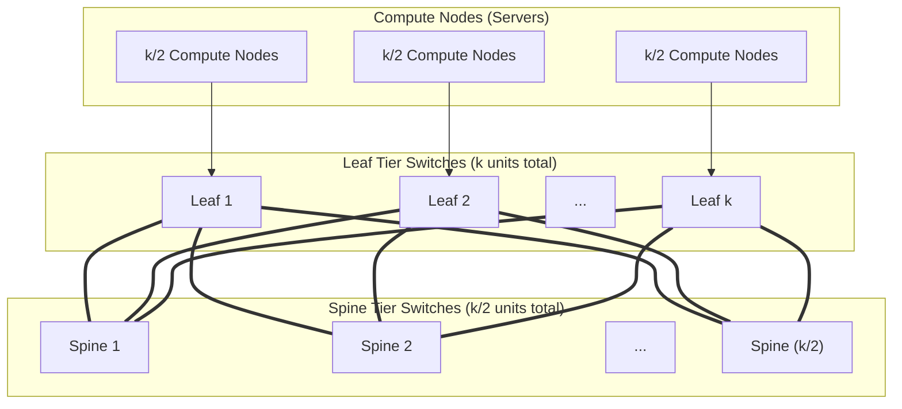
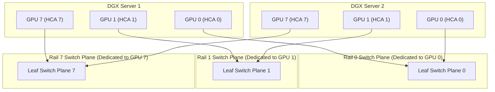
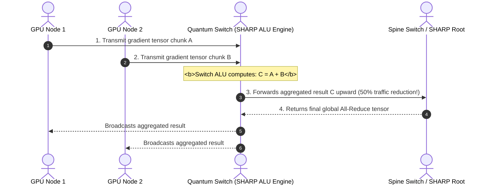

## Introduction: When 10,000-GPU Distributed Training Hits the "Communication Wall"

In Chapter 10 of our masterclass, [InfiniBand Architecture First Principles: Physical Link Rates, Credit-Based Link Flow Control, and Subnet Manager Fabric Orchestration](/en/articles/infiniband-architecture-hardware-rates-credit-flow-subnet-manager/), we deconstructed physical link speeds, hardware credit flow control, and the centralized Subnet Manager. In the 2026 era of frontier trillion-parameter Large Language Models (LLMs) and multi-modal architectures, 10,000-GPU clusters represent the baseline infrastructure for AI labs.

Training models of this scale requires combining **Tensor Parallelism (TP)**, **Pipeline Parallelism (PP)**, and **Data Parallelism (DP / ZeRO-3)**:
- **Intra-Node**: 8 GPUs communicate over high-speed NVSwitch interconnects delivering 900 GB/s to 1.8 TB/s of bi-directional bandwidth;
- **Inter-Node**: Thousands of GPUs exchange model weights and gradients via frequent `All-Reduce` and `All-to-All` collective operations. As compute speeds have accelerated, **communication overhead frequently accounts for 30% to 50% of end-to-end iteration time!**

Suboptimal network topologies, hash collisions, or credit deadlocks can quickly degrade compute efficiency across a 10,000-GPU cluster.

How can thousands of servers be cabled into a **non-blocking, deadlock-free network with nanosecond jitter**? This article examines the core engineering principles behind large-scale AI networking.

---

## 1. Fat-Tree Topology Mathematics and Scalability Limits

Traditional networks follow a "Thin Tree" design—as links ascend toward the root, link counts decrease and bandwidth narrows. In 1985, MIT professor Charles Leiserson introduced the **Fat-Tree**: **links become thicker toward the root, preserving uniform bisection bandwidth across the entire network**.

### 1.1 2-Tier Non-Blocking Fat-Tree with $k$-Port Switches

Modern fabrics use uniform $k$-port switches (e.g., 64-port 400G NDR Quantum-2 QM9700 switches where $k = 64$) to construct standard Fat-Trees:



1. **Leaf Tier Configuration**:
   Each Leaf switch has $k$ physical ports:
   - $\frac{k}{2}$ downlinks connect to compute nodes;
   - $\frac{k}{2}$ uplinks connect to Spine switches;
   - The Leaf tier comprises $k$ switches in total;
2. **Spine Tier Configuration**:
   Each Spine switch has $k$ downlinks, connecting to each of the $k$ Leaf switches;
   - The Spine tier comprises $\frac{k}{2}$ switches;
3. **Maximum Compute Node Capacity Formula**:
   
   $$N_{2\text{-tier}} = k \times \frac{k}{2} = \frac{k^2}{2}$$

- **Practical Derivation**: With 64-port NDR switches ($k=64$), a 2-tier non-blocking Fat-Tree supports:
  
  $$N = \frac{64^2}{2} = \frac{4096}{2} = 2,048\text{ physical network ports}$$

### 1.2 3-Tier Fat-Tree: Scaling to 65,536 Non-Blocking Endpoints

When clusters expand beyond 2,048 endpoints, the fabric adds a **Core tier**, forming a 3-tier (5-stage) Fat-Tree:

$$N_{3\text{-tier}} = 2 \times \left(\frac{k}{2}\right)^3 = \frac{k^3}{4}$$

- **Practical Derivation**: For $k=64$:
  
  $$N = \frac{64^3}{4} = \frac{262,144}{4} = 65,536\text{ 400G ports!}$$

This architecture provides **strict 1:1 non-blocking bisection bandwidth** across the largest single-cluster AI installations in the world.

---

## 2. Rail-Optimized Architecture for 8-GPU Servers

High-density AI servers (such as NVIDIA DGX H100, H200, and B200 platforms) house **8 GPUs** and **8 independent high-speed HCAs** (paired 1:1 via PCIe switches and NUMA domains).

```
DGX Node Topology and HCA Mapping:
[ GPU 0 ] <---> [ HCA 0 (mlx5_0) ]
[ GPU 1 ] <---> [ HCA 1 (mlx5_1) ]
[ GPU 2 ] <---> [ HCA 2 (mlx5_2) ]
[ GPU 3 ] <---> [ HCA 3 (mlx5_3) ]
[ GPU 4 ] <---> [ HCA 4 (mlx5_4) ]
[ GPU 5 ] <---> [ HCA 5 (mlx5_5) ]
[ GPU 6 ] <---> [ HCA 6 (mlx5_6) ]
[ GPU 7 ] <---> [ HCA 7 (mlx5_7) ]
```

### 2.1 The Bottleneck: Rail Contention in Naive Topologies
If all 8 HCAs of a server connect to the same Top-of-Rack Leaf switch:
- When GPU 0 executes Data-Parallel All-Reduce, its traffic shares egress queues with traffic from GPU 1 and GPU 2;
- Packets from different GPUs contend for buffer space, introducing tail latency jitter.

### 2.2 Rail-Optimized Physical Plane Isolation

To address this, modern hyperscalers deploy **Rail-Optimized physical network planes**:



#### First Principles Design
1. **The fabric is split into 8 independent, parallel Rail planes (Rail 0 through Rail 7)**;
2. Across all racks, **GPU 0 connects to Rail 0 switches, GPU 1 connects to Rail 1 switches**, and so on;
3. **Zero Cross-Rail Contention**: In data-parallel training, each GPU $i$ exchanges gradients exclusively with GPU $i$ on other hosts. Because traffic traverses isolated rail planes, **collective communication avoids buffer contention entirely, improving throughput by up to 30%!**

---

## 3. Routing Engines and Deadlock Elimination: FTree and Up/Down Models

Standard shortest-path algorithms (like Dijkstra) are unsuited for credit-based networks. **Arbitrary routing turns create circular buffer dependencies!**

```
Credit Loop Deadlock Dependency:
[Switch A Buffer] ---> Waits for ---> [Switch B Buffer]
       ^                                      |
       |                                      v
[Switch D Buffer] <--- Waits for <--- [Switch C Buffer]
```

Allowing packets to route downward and then upward across intermediate switches creates circular buffer dependencies, resulting in a **Credit Loop Deadlock that freezes the fabric**.

### 3.1 The Turn Model and Up/Down Rule
The Up/Down routing engine enforces a directional rule:
- **Core Rule: Packets may traverse Up hops followed by Down hops, but must never traverse Down followed by Up!**
- A packet ascends toward the tree root via any number of Up hops;
- Once it takes a Down hop toward its destination, **all subsequent hops must be Down; reversing direction is forbidden**;
- **Graph-Theoretic Proof**: This directional constraint breaks circular dependencies in the channel dependency graph, mathematically proving the network is **deadlock-free**.

### 3.2 FTree Routing Engine
For large symmetric Fat-Trees, OpenSM provides the **FTree routing engine**:
- Enforces strict Up/Down deadlock freedom;
- Balances uplink and downlink paths across all Spine switches deterministically to prevent localized hotspots.

---

## 4. Hardware Acceleration: Adaptive Routing (AR) and SHARP In-Network Reduction

### 4.1 Adaptive Routing (AR)

Standard ECMP binds flows to specific paths based on static hashes. When two heavy flows hash to the same link, congestion occurs while parallel links sit idle.

NVIDIA Quantum switch ASICs incorporate **Adaptive Routing (AR)**:
- Switches monitor egress **queue depth and credit consumption** in real time;
- If a preferred path experiences queuing, the switch ASIC **dynamically re-routes packets to an alternate, uncongested Spine link**;
- **Hardware Reordering**: Dynamic routing can deliver packets out of order. ConnectX-7/8 HCAs handle packet reordering in hardware buffers before writing to host memory, **increasing effective fabric utilization from ~65% to over 95%!**

### 4.2 SHARP: In-Network Reduction

In traditional distributed training, All-Reduce requires multi-stage Ring or Tree algorithms. Gradients traverse the network to destination GPUs, which compute floating-point additions using Tensor Cores and broadcast the results back.

**SHARP (Scalable Hierarchical Aggregation and Reduction Protocol) offloads these additions directly into switch hardware:**



- **Traffic Halved**: Total data volume traversing the network is cut in half;
- **GPU Resources Preserved**: GPUs avoid spending memory bandwidth and compute cycles on reduction arithmetic;
- **Lower Latency**: Collective steps collapse from $2(N-1)$ to near-constant tree depths.

---

## 5. Production OpenSM Routing Configuration

Configuring routing engines and hardware acceleration in `/etc/opensm/opensm.conf`:

```ini
# 1. Enable FTree routing engine (fallback to updn for non-symmetric fabrics)
routing_engine ftree,updn

# 2. Enable Adaptive Routing (AR) support
ar_enable 1

# 3. Configure subnet sweep interval (in seconds, for fast fault convergence)
sweep_interval 3

# 4. Enable multipath load balancing (assign multiple LIDs per port)
lmc 2

# 5. Enable SHARP hardware tree building
sharp_enable 1
```

---

## 6. Summary and Next Steps

By combining Leiserson Fat-Tree mathematics, 8-plane Rail-Optimized cabling, FTree deadlock-free routing, Adaptive Routing, and SHARP in-network reduction, we have established the architectural blueprint for 10,000-GPU AI superclusters.

With the architectural theory complete, **how do you deploy, diagnose, and optimize a large-scale InfiniBand fabric on bare metal?**
- How do you compile and verify **MLNX_OFED and DOCA drivers** in production?
- How do you configure **dual-node OpenSM master/standby HA** with split-brain fencing?
- How do you use `ibdiagnet`, `iblinkinfo`, and `flint` to locate degraded optical links and transceiver errors across tens of thousands of connections?
- At the application layer, how do you verify **GPUDirect RDMA (`nvidia-peermem`)** and tune critical NCCL environment variables (`NCCL_IB_HCA`, `NCCL_NET_GDR_LEVEL=5`)?

In the final Chapter 12 of our masterclass, we cover bare-metal operations: **[Production InfiniBand Deployment, Cluster Operations, and NCCL Tuning: OFED Drivers, OpenSM HA, ibdiagnet Fabric Auditing, and GPUDirect RDMA](/en/articles/infiniband-production-deployment-opensm-ofed-nccl-tuning/)**!

---

## Frequently Asked Questions (FAQ)

### Q1: Why does the Rail-Optimized topology accelerate Tensor Parallelism (TP) and Data Parallelism (DP) in distributed LLM training?
**Because it aligns physical traffic flows orthogonally with communication patterns.**
In distributed LLM training, workloads divide into distinct communication phases:
1. **Tensor Parallelism (TP)**: Requires high bandwidth and occurs strictly within each 8-GPU node over internal NVSwitch connections, never leaving the host;
2. **Data Parallelism (DP / ZeRO)**: Involves gradient synchronization across nodes, where GPU $i$ communicates primarily with its peer GPU $i$ on other servers.
By mapping each GPU index to an isolated switch plane (Rail 0 through Rail 7), traffic between GPU 0 peers never shares physical links or buffers with traffic from GPU 1 peers. This eliminates cross-rail contention and tail latency jitter, allowing All-Reduce operations to achieve full wire speed.

### Q2: What is the Turn Model, and why does Up/Down routing forbid "Down-then-Up" forwarding?
**It is a graph-theoretic mechanism to prevent circular buffer dependencies.**
In credit-based flow control, switch input buffers represent finite shared resources. Forwarding a packet claims a downstream buffer while holding an upstream buffer.
If packets could route downward from the root and then upward toward another spine, the channel dependency graph would develop cyclic paths. Under heavy load, switches in the cycle end up waiting for each other to clear buffer space, producing a Credit Loop Deadlock.
Up/Down routing enforces that every path consists of zero or more Up hops followed by zero or more Down hops. Because paths cannot transition from Down back to Up, the dependency graph is acyclic, preventing deadlocks.

### Q3: How does SHARP in-network aggregation double throughput during GPU All-Reduce operations?
**By offloading reduction operations to switch ASICs, halving the data volume traversing the network.**
In traditional Ring All-Reduce, gradients circulate across all GPUs twice (Reduce-Scatter followed by All-Gather), generating $2 \times \frac{N-1}{N} \times \text{DataSize}$ bytes of network traffic while consuming GPU compute cycles for floating-point additions.
With SHARP enabled:
1. GPUs push partial gradients upward to their Leaf switches;
2. Arithmetic Logic Units (ALUs) inside switch ASICs sum the tensors in real time as packets traverse the crossbar, forwarding only the aggregated result upward toward the Spine root;
3. The root broadcasts the finished sum back down the tree.
This cuts total network data volume by roughly 50% and offloads arithmetic from the GPUs, doubling collective communication efficiency.
