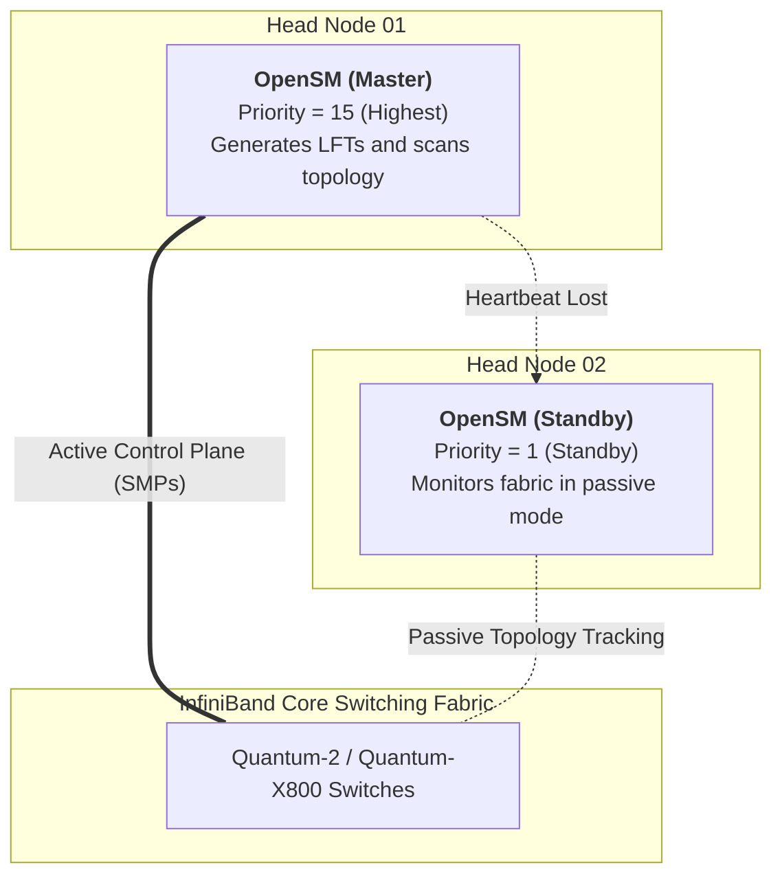
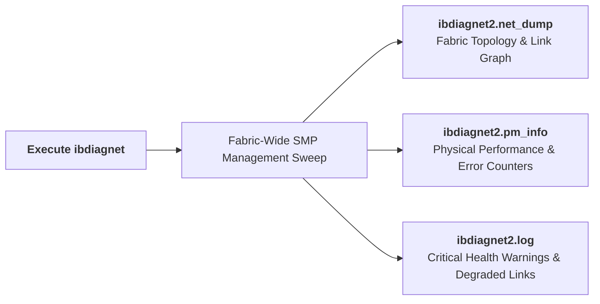
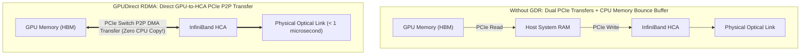
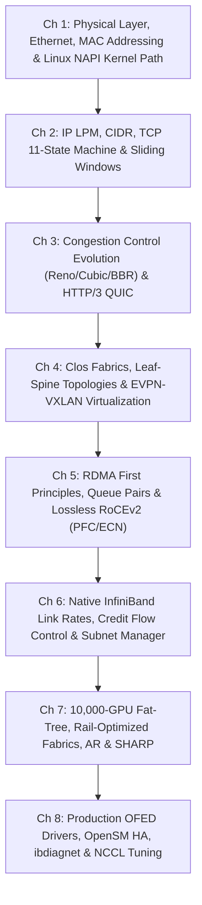

## Introduction: The Operational Reality of 10,000-GPU AI Data Centers

Across the preceding seven chapters, our masterclass progressed from physical Ethernet signaling and Linux kernel packet paths through Clos Leaf-Spine topologies, RDMA zero-copy primitives, native InfiniBand signaling, and Rail-Optimized Fat-Trees.

Yet, when deploying a production cluster composed of thousands of 8-GPU servers (such as DGX H100, H200, or B200 platforms) connected by tens of thousands of optical links, **architectural designs encounter bare-metal operational realities**:
- **Degraded Transceivers & Silent Speed Drops**: A speck of dust on an optical connector causes a 400G NDR link to negotiate down to 200G HDR or even 1X width without throwing a fatal system error, creating a bottleneck for the entire All-Reduce collective;
- **Subnet Manager Split-Brain**: Misconfigured OpenSM instances trigger forwarding table churn across switches;
- **Silent Fallback of GPUDirect RDMA**: If host kernel bridge modules fail to load, NCCL silently falls back to staging buffers through host CPU memory, cutting cluster collective bandwidth by over 70%!

As the **concluding chapter of our masterclass Computer Networking: From Ethernet to 10,000-GPU InfiniBand Architectures**, this guide provides a hands-on operational playbook covering driver deployment, OpenSM HA, fabric diagnostics with `ibdiagnet`, and NCCL tuning.

---

## 1. Host Driver Stack and Firmware Management: MLNX_OFED and DOCA

On Linux host systems, InfiniBand and RoCE rely on a coordinated stack of kernel and user-space modules—**MLNX_OFED (OpenFabrics Enterprise Distribution)** or the integrated **NVIDIA DOCA** environment.

```
Host InfiniBand Driver Hierarchy:
+-------------------------------------------------------------------------+
| User Applications: PyTorch / NCCL / MPI / ibverbs tools (ib_write_bw)   |
+-------------------------------------------------------------------------+
| User-Space Libraries: libibverbs.so, libmlx5.so, librdmacm.so           |
+-------------------------------------------------------------------------+
| Kernel Transport: ib_core.ko, ib_uverbs.ko, ib_ipoib.ko, rdma_cm.ko     |
+-------------------------------------------------------------------------+
| Hardware Device Drivers: mlx5_core.ko, mlx5_ib.ko                       |
+-------------------------------------------------------------------------+
| Physical Hardware: ConnectX-7 / ConnectX-8 HCA ASIC (PCIe Gen5 x16)     |
+-------------------------------------------------------------------------+
```

### 1.1 Driver Installation and Kernel Module Loading
Standard procedure for deploying OFED on enterprise Linux (Ubuntu/Debian or RHEL/Rocky Linux):

```bash
# 1. Mount the OFED ISO image and compile with DKMS kernel persistence
./mlnxofedinstall --without-fw-update --add-kernel-support --dkms -q

# 2. Restart the driver service and load core kernel modules
/etc/init.d/openibd restart

# 3. Verify that critical kernel modules are loaded in memory
lsmod | grep -E "mlx5_core|mlx5_ib|ib_uverbs"
```

### 1.2 Firmware and Optical Diagnostics (flint & mlxlink)

Production clusters require consistent firmware versions across all HCAs. Physical transceiver health can be verified using Mellanox diagnostic utilities:

```bash
# 1. Probe all Mellanox devices on the PCIe bus
mst start
mst status -v

# 2. Inspect firmware versions and device ROM using flint
flint -d /dev/mst/mt4129_pciconf0 query

# 3. Inspect physical transceiver optical metrics (Tx/Rx optical power and BER)
mlxlink -d /dev/mst/mt4129_pciconf0 -m
```

---

## 2. High-Availability Subnet Manager (OpenSM HA) Architecture

As explored in Chapter 6, the **Subnet Manager (SM)** is the control plane for the InfiniBand fabric. If a standalone SM crashes, existing connections continue forwarding, but the network loses the ability to adapt to topology changes.

Production environments address this by deploying **Master/Standby OpenSM instances across redundant head nodes (Head01 and Head02)**:



### 2.1 Production `/etc/opensm/opensm.conf` Configuration

On the primary head node (Head01), configure high priority:
```ini
# 1. Arbitration priority (0–15; higher values take precedence)
priority 15

# 2. Enforce deadlock-free FTree Fat-Tree routing engine
routing_engine ftree,updn

# 3. Subnet sweep interval in seconds
sweep_interval 3

# 4. Enable hardware Adaptive Routing and SHARP
ar_enable 1
sharp_enable 1

# 5. Diagnostic and forwarding table dump directories
log_file /var/log/opensm.log
dump_files_dir /var/log/opensm_dump/
```

On the secondary head node (Head02), configure an identical file, changing only `priority 1`.

### 2.2 Verifying Election Status
Query the current active Master SM using `sminfo`:

```bash
sminfo
# Sample output:
# sminfo: sm lid 1 sm guid 0x08c0eb030085a120, priority 15 state 3 (MASTER)
```
- `state 3` indicates the node is acting as the authoritative **MASTER**;
- If Head01 fails, Head02 detects the missing heartbeat within 3 seconds (`sweep_interval`) and transitions from `STANDBY` to `MASTER`.

---

## 3. Fabric Health Auditing: ibdiagnet in Practice

In fabrics with tens of thousands of optical links, cable bends, loose connectors, and aging lasers are common points of failure. NVIDIA provides a comprehensive fabric diagnostic utility: **`ibdiagnet`**.



### 3.1 Executing a Fabric-Wide Audit
```bash
# Run a physical layer sweep targeting mlx5_0 and output results to a log directory
ibdiagnet -c 50000 -v -o /var/log/ibdiagnet_report/
```

### 3.2 Key Indicators in Audit Logs
Inspect `/var/log/ibdiagnet_report/ibdiagnet2.log` for three primary warning categories:

1. **Link Speed Degradation**:
   ```
   -W- Marked link speed mismatch: Port 12 of Switch GUID 0x... is running at 200G (HDR) instead of 400G (NDR)!
   ```
   **Remedy**: Re-seat the transceiver or replace the degraded optical cable;
2. **Symbol Errors (`SymbolErrorCounter`)**:
   Indicates bit corruption during electro-optical conversion. A rapidly increasing counter points to optical attenuation or transceiver degradation;
3. **Link Integrity Errors (`LinkErrorRecoveryCounter`)**:
   Indicates physical micro-flaps where the link renegotiated silently, which can trigger timeouts in collective communication jobs.

---

## 4. Accelerating GPU Workloads: GPUDirect RDMA and NCCL Tuning

In multi-node model training, transferring tensors between GPUs by staging through host system memory adds significant latency. **GPUDirect RDMA (GDR)** enables direct PCIe peer-to-peer transfers between GPU memory and the InfiniBand HCA.



### 4.1 Enabling GPUDirect RDMA: The `nvidia-peermem` Kernel Module

GPUDirect RDMA requires the `nvidia-peermem` kernel module to bridge physical memory address translation between the NVIDIA GPU driver and the Mellanox `ib_core` subsystem:

```bash
# 1. Load the nvidia-peermem kernel bridge driver
modprobe nvidia-peermem
lsmod | grep nvidia_peermem

# 2. Persist across system reboots
echo "nvidia-peermem" >> /etc/modules-load.d/modules.conf
```

### 4.2 Production NCCL Environment Variables

Configure the following environment variables before launching distributed training workloads (PyTorch, Megatron-LM, DeepSpeed):

```bash
# 1. Enable detailed initialization logs to verify GDR state
export NCCL_DEBUG=INFO
export NCCL_DEBUG_SUBSYS=INIT,ENV,NET

# 2. Bind the 8 GPUs to their respective 1:1 NUMA-local InfiniBand HCAs
export NCCL_IB_HCA=mlx5_0,mlx5_1,mlx5_2,mlx5_3,mlx5_4,mlx5_5,mlx5_6,mlx5_7

# 3. Enable GPUDirect RDMA across PCIe Root Complexes
export NCCL_NET_GDR_LEVEL=5

# 4. Expand the ring buffer size (8MB is recommended for 400G NDR / 800G XDR links)
export NCCL_BUFFSIZE=8388608

# 5. Enable GDR read optimizations and hardware SHARP collective offloading
export NCCL_NET_GDR_READ=1
export NCCL_COLLNET_ENABLE=1
```

### 4.3 Benchmarking Fabric Performance with `nccl-tests`

Validate multi-node All-Reduce bus bandwidth using the official `nccl-tests` suite:

```bash
# Run 8-GPU All-Reduce benchmark across two DGX nodes (evaluating 64MB to 8GB payloads)
mpirun -np 16 \
    -H dgx-node-01:8,dgx-node-02:8 \
    --bind-to numa \
    -x NCCL_DEBUG=INFO \
    -x NCCL_IB_HCA=mlx5_0,mlx5_1,mlx5_2,mlx5_3,mlx5_4,mlx5_5,mlx5_6,mlx5_7 \
    -x NCCL_NET_GDR_LEVEL=5 \
    /opt/nccl-tests/build/all_reduce_perf -b 64M -e 8G -f 2 -g 1
```

- **Target Performance Baseline**:
  On a DGX H100 system equipped with 8x 400G NDR HCAs, inter-node All-Reduce bus bandwidth should reach **$\ge 360\text{ GB/s}$** (>90% of theoretical 400 GB/s peak);
  Results between 50 and 100 GB/s suggest that GPUDirect RDMA has silently fallen back to host staging memory or a link is negotiating at reduced speed.

---

## 5. Masterclass Summary: The Complete Journey

With this chapter, our eight-part series **Computer Networking: From Ethernet to 10,000-GPU InfiniBand Architectures** reaches its conclusion.

Let us review the full architectural progression:



From raw electrical signaling on copper cables to reliable TCP byte streams across the global Internet; from non-blocking Clos fabrics and overlay virtualization in cloud data centers to RDMA kernel bypass and native InfiniBand architectures powering 10,000-GPU clusters—modern networking balances physical constraints, protocol trade-offs, and operational realities to deliver high-performance distributed systems.

---

## Frequently Asked Questions (FAQ)

### Q1: When running `nccl-tests`, how do you confirm whether GPUDirect RDMA has silently fallen back to host memory staging?
**Inspect the transport descriptors in the NCCL initialization log.**
Set `export NCCL_DEBUG=INFO` before launching the benchmark.
- **Active GDR**: The log displays `NET/IB : Using GPUDirect RDMA`, and inter-node channels report the transport mechanism as `NET/IB/0/GDRDMA`;
- **Silent Fallback to Host Memory**: The log displays `NET/IB : GPU Direct RDMA Disabled` or channels report `NET/IB/0/Shared-Memory`.
**Common root causes**:
1. The `nvidia-peermem` kernel module is not loaded on the host;
2. The HCA and GPU reside on different PCIe Root Complexes and `NCCL_NET_GDR_LEVEL=5` was not set to permit cross-root GDR;
3. Access Control Services (ACS) is enabled in the system BIOS without proper ACS-bypass rules, preventing direct PCIe peer-to-peer DMA.

### Q2: How can `ibdiagnet` quickly isolate degraded optical transceivers (Symbol Errors) across a 1,000-node fabric?
**Follow this diagnostic workflow**:
1. Run `ibdiagnet -o /tmp/ibdiag_out` on the Master SM node;
2. Check for speed negotiation issues:
   Search `ibdiagnet2.log` for `speed mismatch` or `width mismatch`. This highlights ports configured for 4X NDR (400G) that degraded to 2X width or 200G HDR speeds, identifying the exact switch GUID and port number;
3. Check for high error rates:
   In `ibdiagnet2.pm_info`, locate ports with elevated `SymbolErrorCounter` values.
Technicians can then inspect, clean, or replace the specific transceivers identified in the log without disrupting the rest of the fabric.

### Q3: In a dual-OpenSM HA deployment, what mechanism prevents split-brain scenarios if the management link between the nodes fails?
**InfiniBand's in-band priority arbitration and single-master transaction semantics.**
In InfiniBand fabrics, Subnet Management Packets (SMP) travel in-band directly across the data fabric.
1. **Periodic Master Heartbeats**: The Master SM (configured with priority 15) broadcasts heartbeat sweeps across the fabric switches every few seconds. Switch ASICs accept forwarding tables only from the SM holding the active master lease;
2. **In-Band Priority Detection**: Even if the out-of-band management network between the head nodes fails, the Standby SM (configured with priority 1) observes priority-15 packets traversing the InfiniBand fabric. Recognizing an active, higher-priority Master, it remains in `STANDBY` mode;
3. **Failover Execution**: Only if the primary head node goes offline completely and its priority-15 heartbeats cease across multiple sweep cycles will the Standby SM promote itself to `MASTER`, preventing split-brain conditions at the protocol level.
