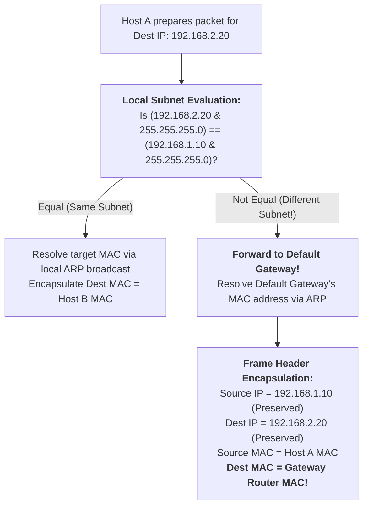
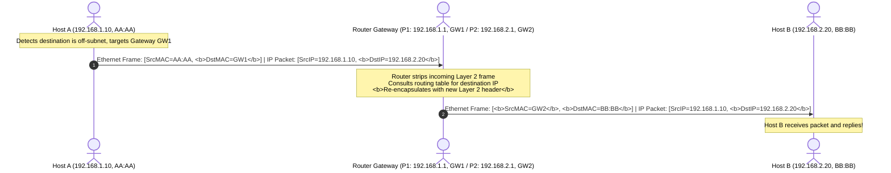

## Introduction: When the Entire Planet Must Address Every Machine

In Chapter 1 of our masterclass, [Computer Networking from Scratch: Bits, Physical Media, Hub Collision Domains, and Switch MAC Addressing First Principles](/en/articles/network-fundamentals-bits-cables-hubs-switches-mac-arp/), we saw how Layer 2 switches forward traffic within a local network using physical MAC addresses.

However, we left open an important question: **Why can't the global Internet route packets on MAC addresses alone?**
- **MAC addresses lack topological hierarchy**: Like a national identity number, a MAC address carries no geographic or topological context. Storing billions of flat MAC addresses across intermediate forwarding tables would exceed switch memory limits;
- **Broadcast storms would saturate global links**: Layer 2 addressing relies on ARP broadcasts. If the entire world operated as a single flat Layer 2 network, a single ARP request would be replicated across billions of connected devices worldwide.

To scale across cities, continents, and oceans, computer scientists introduced the **Network Layer (Layer 3)** and **hierarchical IP addresses**.

This chapter starts with **fundamental binary math** and walks through: **How IPv4 addresses are structured, how Subnet Masks partition network prefixes from host numbers, and how Default Gateways forward traffic between subnets.**

---

## 1. Physical Anatomy of an IPv4 Address: 32 Bits in Dotted-Decimal Notation

An IP address like `192.168.1.1` is, under the hood, a **32-bit binary integer**.

### 1.1 Why Does Each Octet Cap at 255?

To make 32-bit binary strings readable for humans, networking uses **Dotted-Decimal Notation**:
1. Split the 32-bit sequence into four groups of **8 bits (8 bits = 1 Byte = 1 Octet)**;
2. Separate each octet with a period (`.`);
3. Convert each 8-bit binary octet into its decimal equivalent.

```text
32-Bit Binary Anatomy of an IPv4 Address:
 Binary:    11000000  .  10101000  .  00000001  .  00000001
 Length:    8 Bits       8 Bits       8 Bits       8 Bits   = 32 Bits (4 Bytes)
 Weight:   128+64=192   128+32+8=168     1            1
 Decimal:     192     .     168    .      1     .      1
```

- **Mathematical First Principle**:
  An 8-bit binary number spans from `00000000` (decimal $0$) to `11111111` ($128+64+32+16+8+4+2+1 = 255$).
  **Consequently, each octet in an IPv4 address must fall strictly between $0$ and $255$. Addresses like `192.168.1.300` are mathematically invalid.**

---

## 2. Subnet Masks: Mechanics and Binary Mathematics

Like a postal address, an IP address encodes two distinct pieces of information:
1. **Network ID**: Identifies the specific network segment (the postal city/street);
2. **Host ID**: Identifies the specific interface on that segment (the street number).

How does a router determine where the network prefix ends and the host number begins?

**It applies a Subnet Mask.**

### 2.1 What Is a Subnet Mask?

A Subnet Mask is also a 32-bit binary number, governed by a simple rule:
- **It starts with a contiguous sequence of binary `1`s** (masking the Network ID);
- **It ends with a contiguous sequence of binary `0`s** (masking the Host ID).

```text
Standard /24 Subnet Mask (255.255.255.0):
 Decimal:     255    .     255    .     255    .      0
 Binary:   11111111  .  11111111  .  11111111  .  00000000
 Meaning: | <--------- 24 Contiguous 1s (Network) ------> | <- 8 Zeros (Host) -> |
```

### 2.2 Bitwise AND Operation

Network interfaces identify their subnet using a hardware-level **Bitwise AND (`&`)** operation:
- Truth table: `1 & 1 = 1`; `1 & 0 = 0`; `0 & 1 = 0`; `0 & 0 = 0`.

$$\text{Network Address} = \text{IP Address} \ \& \ \text{Subnet Mask}$$

### 2.3 Step-by-Step Derivation: `192.168.1.130/26`

In modern CIDR notation, `/26` indicates that **the first 26 bits of the mask are binary 1s**.

Let's compute the subnet parameters manually:

```text
Step 1: Expand Subnet Mask /26 to binary and decimal
Mask Binary : 11111111.11111111.11111111.11000000  (26 ones, followed by 6 zeros)
Octet 4 Val : 128 + 64 = 192
Mask Decimal: 255.255.255.192

Step 2: Expand IP 192.168.1.130 to binary
Octet 4 Val : 130 = 128 + 2 = 10000010 in binary
IP Binary   : 11000000.10101000.00000001.10000010

Step 3: Perform Bitwise AND (&):
   IP Address : 11000000 . 10101000 . 00000001 . 10000010 (192.168.1.130)
   Subnet Mask: 11111111 . 11111111 . 11111111 . 11000000 (255.255.255.192)
--------------------------------------------------------------------------
   Network ID : 11000000 . 10101000 . 00000001 . 10000000 (192.168.1.128)
```

The **Network Address is `192.168.1.128`**.

### 2.4 Broadcast Address and Usable Host Range (Why Subtract 2?)

With a `/26` prefix, $32 - 26 = 6$ bits remain for the Host ID ($H = 6$):
- $2^6 = 64$ possible host bit combinations (`000000` through `111111`);
- **All Zeros is reserved as the Network ID**: `192.168.1.128` identifies the subnet itself and cannot be assigned to an interface;
- **All Ones is reserved as the Directed Broadcast Address**: Setting all 6 host bits to 1 yields `10111111` in the fourth octet ($128 + 32 + 16 + 8 + 4 + 2 + 1 = 191$).
  The **Directed Broadcast Address is `192.168.1.191`**.

$$\text{Usable Host Count} = 2^H - 2 = 2^6 - 2 = 62\text{ Hosts}$$

- **Usable IP Range**:
  From Network ID + 1 to Broadcast ID - 1: **`192.168.1.129` through `192.168.1.190`**.

---

## 3. From Classful Routing to CIDR and Private Scopes

### 3.1 Historical Classful Addressing Limitations

Originally, IPv4 split addresses into rigid classes:
- **Class A (/8)**: 16,777,214 hosts per network;
- **Class B (/16)**: 65,534 hosts per network;
- **Class C (/24)**: 254 hosts per network.

**The Inefficiency**: An organization with 500 devices could not fit in a Class C (/24) network and had to request a Class B (/16) block, stranding over 65,000 unused addresses and accelerating IPv4 depletion.

### 3.2 CIDR (Classless Inter-Domain Routing) and VLSM
Introduced in 1993 (RFC 1519), **CIDR** removed class boundaries, allowing subnet prefixes of any bit length (e.g., `/21`, `/26`, `/30`) to allocate address space efficiently.

### 3.3 Private Address Allocations (RFC 1918)
To conserve public IPv4 addresses, RFC 1918 reserved three non-routable private ranges for internal networks:

| Class Scope | Private Range | CIDR Prefix | Total Addresses | Typical Use Cases |
| :--- | :--- | :--- | :--- | :--- |
| **Class A Private** | `10.0.0.0` - `10.255.255.255` | `10.0.0.0/8` | $16,777,216$ | Cloud VPCs, enterprise datacenters |
| **Class B Private** | `172.16.0.0` - `172.31.255.255` | `172.16.0.0/12` | $1,048,576$ | Medium campus networks, Kubernetes Pod subnets |
| **Class C Private** | `192.168.0.0` - `192.168.255.255` | `192.168.0.0/16` | $65,536$ | Home routers, small offices |

- **Special-Use Ranges**:
  - `127.0.0.0/8`: **Loopback** (e.g., `127.0.0.1` / `localhost`), handled directly within the local OS network stack;
  - `169.254.0.0/16`: **Link-Local (APIPA)**, self-assigned when DHCP fails to respond.

---

## 4. Cross-Subnet Forwarding and the Default Gateway

Consider two configured endpoints:
- Host A: `192.168.1.10/24` (MAC: `AA:AA`)
- Host B: `192.168.2.20/24` (MAC: `BB:BB`)

When Host A runs `ping 192.168.2.20`, **how does the operating system decide where to route the packet?**



### 4.1 A Common Misconception: Header Rewrites Across Routers

A frequent misunderstanding is assuming that cross-subnet packets are addressed directly to the destination host's MAC address.

**This is physically impossible on routed networks:**
1. Host A's network interface connects to its local Layer 2 switch; its ARP broadcasts cannot traverse Layer 3 router boundaries;
2. Recognizing that Host B resides on a different subnet, Host A forwards the packet to its **Default Gateway** (e.g., `192.168.1.1`);
3. Host A encapsulates the packet:
   - **Layer 3 IP Header (End-to-End)**: Source IP is Host A (`192.168.1.10`), Destination IP is Host B (`192.168.2.20`);
   - **Layer 2 Ethernet Header (Hop-by-Hop)**: Source MAC is Host A (`AA:AA`), **Destination MAC is the Gateway Router's MAC (`GW:GW`)!**



- **First Principle**:
  Across routed networks, **Layer 3 IP addresses remain constant end-to-end, while Layer 2 MAC addresses are stripped and rewritten at every intermediate router hop.**

---

## 5. Inspecting Linux Routing Tables

Inspect how Linux makes routing decisions:

```bash
# 1. Inspect configured IP addresses and subnet masks
ip -4 addr show

# 2. Inspect the kernel routing table
ip route show
# Typical output:
# default via 192.168.1.1 dev eth0 proto dhcp metric 100
# 192.168.1.0/24 dev eth0 proto kernel scope link src 192.168.1.10 metric 100

# 3. Simulate routing decisions for a remote destination
ip route get 8.8.8.8
# Sample output:
# 8.8.8.8 via 192.168.1.1 dev eth0 src 192.168.1.10 uid 1000
# Confirms outbound packets are routed through default gateway 192.168.1.1 on eth0
```

---

## 6. Summary and Next Steps

This chapter traced the shift from local Layer 2 links to logical Layer 3 networks:
- **IP Addresses** provide a globally scalable, hierarchical coordinate system;
- **Subnet Masks** use **bitwise AND arithmetic** to separate network prefixes from host numbers;
- **Subnet Derivations** explain why Network IDs (all zeros) and Directed Broadcasts (all ones) reduce usable host capacity by two ($2^H - 2$);
- **Default Gateways** demonstrate how Layer 3 IPs remain intact while Layer 2 MAC headers are rewritten hop-by-hop across routing hops.

However, enterprise networks face practical scaling challenges:
- How do we segment hundreds of hosts into isolated broadcast domains without buying separate physical switches?
- How does **DHCP** automatically hand out IP configurations to booting machines?
- When thousands of private hosts share a single public IP, how does **NAT / PAT** manage outbound port multiplexing?

In Chapter 3 of our masterclass, we explore enterprise LAN services: **[Enterprise LAN Infrastructure: VLAN Segmentation (802.1Q), Dynamic DHCP, and NAT Port Forwarding](/en/articles/enterprise-lan-vlan-8021q-dhcp-nat-port-forwarding/)**!

---

## Frequently Asked Questions (FAQ)

### Q1: If two PCs are directly connected with a cable, with PC A set to `192.168.1.10/24` and PC B set to `192.168.2.20/24` (no gateway configured), can they ping each other?
**No. The ping fails before any packet is transmitted on the wire.**
When PC A evaluates `ping 192.168.2.20`, it applies its local mask: `(192.168.2.20 & 255.255.255.0) = 192.168.2.0`.
Because `192.168.2.0` does not match its local network (`192.168.1.0`), PC A concludes the destination is on a remote subnet and must be forwarded to its default gateway. With no gateway configured, the OS routing lookup fails immediately, returning `connect: Network is unreachable` without emitting an electrical signal on the wire.

### Q2: Why does usable host capacity always subtract 2 ($2^H - 2$)?
**Because the all-zeros and all-ones host suffixes have reserved protocol functions:**
1. **Host bits all zeros (Network ID)**: Identifies the subnet prefix in global routing tables (e.g., `192.168.1.0/24`). Assigning this address to a specific host would cause ambiguity in route matching;
2. **Host bits all ones (Directed Broadcast)**: Reserved for broadcasting to all hosts on that subnet (e.g., `192.168.1.255/24`). Packets sent to this IP are mapped to Layer 2 broadcast frames (`ff:ff:ff:ff:ff:ff`), so it cannot be assigned to an individual interface.

### Q3: Why do point-to-point router links use `/30` or `/31` subnet masks?
- **`/30` Subnet Mask (`255.255.255.252`)**:
  Leaves 2 host bits ($2^2 = 4$ total addresses). Subtracting the network and broadcast addresses leaves **exactly 2 usable host IPs** ($4 - 2 = 2$). This was the standard configuration for point-to-point router links for decades, minimizing address waste;
- **`/31` Subnet Mask (RFC 3021)**:
  Leaves 1 host bit ($2^1 = 2$ total addresses). Under traditional rules, $2 - 2 = 0$. However, RFC 3021 defines an exception for point-to-point links: because directed broadcasts and subnet ambiguity are unnecessary on isolated two-node point-to-point interfaces, both addresses are usable, achieving 100% address efficiency in modern data center interconnects.
