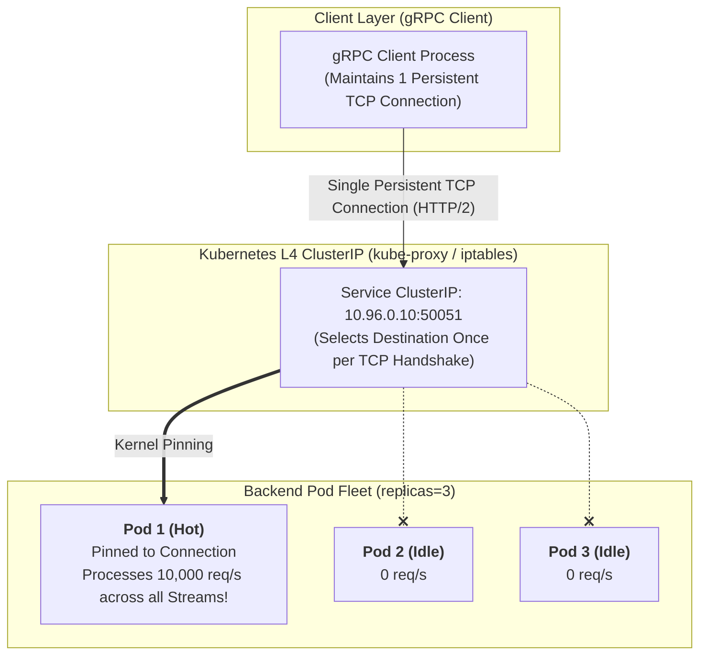
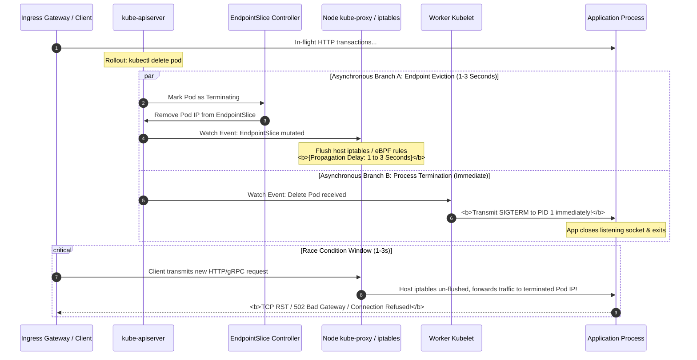

## Introduction: When Legacy Software Encounters Dynamic Cloud Networking

In Chapter 05, [Kubernetes Networking Panorama](/en/articles/k8s-networking-cni-cilium-ebpf-gateway-api/), we unraveled the underlying mechanics of CNI plugins, Calico BGP, Cilium eBPF, and the Gateway API.

However, in production microservice architectures, enterprise engineering teams migrating workloads (Java Spring Boot, Go, Rust, Python) to Kubernetes often encounter immediate operational hurdles:
- **Symptom 1**: A backend deployment scales up to 10 healthy Pod replicas, yet load-testing across gRPC reveals that **99% of total traffic saturates a single Pod**, triggering CPU throttling while the other 9 Pods remain idle;
- **Symptom 2**: During routine Deployment rolling updates, external API gateways and upstream clients experience bursts of **`502 Bad Gateway`** and **`Connection reset by peer`** errors, degrading customer transactions;
- **Symptom 3**: Java microservice clients communicate with internal Kubernetes services, and even after backend Pods restart or reschedule to new IP addresses, Java clients continue logging `UnknownHostException` or transmit traffic to decommissioned Pod IPs for hours!

Why do conventional load-balancing heuristics fail within Kubernetes? How must distributed applications be structured to cooperate cleanly with dynamic container networks?

As the seventh chapter of **From Docker to Kubernetes: Cloud-Native Container & Cluster Orchestration Handbook**, this guide deconstructs the physical realities of application protocols on Kubernetes, tackling the **gRPC load balancing bottleneck**, **microservice connection pool failure modes**, and the **asynchronous pod termination race condition**.

---

## 1. The gRPC Load Balancing Trap: Layer-4 Routing vs. Layer-7 Multiplexing

To diagnose why gRPC traffic fails to distribute evenly across Kubernetes Pods, one must understand the Layer-4 mechanics of **`kube-proxy` (iptables or IPVS mode)**.

### 1.1 kube-proxy Operates Exclusively at Layer 4 (TCP/UDP)
A Kubernetes `ClusterIP` is an in-kernel NAT forwarding rule rather than a physical network interface:
- When a client initiates a TCP handshake (SYN), kernel iptables or IPVS rules evaluate endpoints, pick a destination Pod IP, and execute Destination NAT (DNAT);
- **Once the TCP 3-way handshake succeeds, that TCP connection remains pinned to that specific Pod in the kernel connection tracking table** until termination!



### 1.2 The Architectural Side Effect of HTTP/2 Multiplexing
Standard HTTP/1.1 opens multiple short-lived connections or utilizes connection pools, regularly distributing new TCP connections across backends.
In contrast, gRPC relies on **HTTP/2**:
- **Multiplexing**: A client and server establish and maintain **a single persistent TCP connection**;
- Thousands of concurrent RPC method calls execute concurrently as lightweight, independent virtual Streams over that solitary connection;
- **The Inevitable Bottleneck**: Because only one TCP connection exists, `kube-proxy` routes it to exactly one Pod. Even if you horizontally scale the backend from 3 to 50 Pods, existing clients never open new connections, leaving fresh replicas starved of traffic!

---

## 2. Production Realities: Four Microservice Connection Pool Traps

When platform teams realize persistent connections cause imbalances, they often attempt client-side connection pooling without accounting for DNS lifetimes and lifecycle transitions. Avoid these four critical production traps:

### Trap 1: Missing `MaxConnectionAge` Leads to Immortal Connections
If backend servers do not bound connection lifespans, TCP sockets persist for weeks. During rolling deployments, newly launched Pods receive zero requests while terminating older Pods absorb full traffic.
**Production gRPC Server Configuration (Go)**:
```go
import (
    "time"
    "google.golang.org/grpc"
    "google.golang.org/grpc/keepalive"
)

func newProductionGRPCServer() *grpc.Server {
    return grpc.NewServer(
        grpc.KeepaliveParams(keepalive.ServerParameters{
            // Mandatory 1: Maximum lifespan of a single TCP connection (e.g., 5 minutes)
            // Once expired, the server transmits a GOAWAY frame, prompting clean client reconnects
            MaxConnectionAge: 5 * time.Minute,
            // Mandatory 2: Grace period allowing in-flight RPC streams to complete
            MaxConnectionAgeGrace: 30 * time.Second,
            // TCP Keepalive probes
            Time: 30 * time.Second,
            Timeout: 5 * time.Second,
        }),
    )
}
```

### Trap 2: Java JVM DNS TTL Defaulting to -1 (Permanent Caching)
In Java Spring Boot microservices, the JVM Security Manager defaults DNS resolution caching to **forever (TTL = -1)**!
- When backend Kubernetes Pods reschedule or restart, their IP addresses mutate to new allocations;
- Java clients continue directing traffic to dead IPs because cached lookups never expire;
- **Mandatory Container JVM JVM Arguments**:
  ```bash
  -Dsun.net.inetaddr.ttl=5 -Dnetworkaddress.cache.ttl=5
  ```
  Caps DNS resolution cache validity to 5 seconds, ensuring rapid IP discovery after pod migrations.

### Trap 3: Reconnection Storms (Thundering Herd on Reconnect)
When a backend Pod reboots and severs hundreds of persistent sockets simultaneously, clients that reconnect without delay overwhelm the newly initialized Pod with connection surges.
**Solution: Exponential Backoff with Full Jitter**:
$$t_{\text{sleep}} = \text{random}(0, \min(t_{\text{max}}, t_{\text{base}} \times 2^{\text{attempt}}))$$
Spreading reconnection intervals evenly across time shields recovering backends.

### Trap 4: Client-Side Load Balancing with Headless Services
Pairing **Headless Services (`clusterIP: None`)** with client-side resolution is the lowest-overhead native pattern:
```go
// Production Go client targeting a Headless Service with round-robin balancing
target := "dns:///my-service-headless.default.svc.cluster.local:50051"
conn, err := grpc.Dial(
    target,
    grpc.WithInsecure(),
    grpc.WithDefaultServiceConfig(`{"loadBalancingConfig": [{"round_robin":{}}]}`),
)
```

---

## 3. The Zero-Downtime Deployment Trap: Asynchronous Race Conditions

Beyond traffic distribution, rolling updates introduce a critical reliability challenge: **Why do deployments intermittently trigger 502 Bad Gateway errors?**

A common assumption is: *"Kubernetes surely evicts a Pod from network routing tables before terminating its processes."*

**In the Kubernetes control plane, these two operations execute asynchronously and concurrently!**



### The Anatomy of the Race Condition:
1. When a Pod enters deletion, `kube-apiserver` acts across two parallel tracks: notifying the EndpointSlice controller while instructing the target node's Kubelet to terminate the container;
2. Propagating updated EndpointSlices across cluster nodes and flushing iptables/eBPF tables introduces a **1 to 3-second propagation delay**;
3. Meanwhile, the backend application receives `SIGTERM` and shuts down its listening socket within milliseconds;
4. **During this 1–3 second window, newly arriving client requests route to a dead socket, generating connection drops and 502 errors!**

---

## 4. Production Standard: The Zero-Downtime Termination Sequence

Eliminating deployment drops requires coordinating termination stages so that **network route removal completes before application shutdown initiates**.

### 4.1 Production Deployment Manifest

```yaml
apiVersion: apps/v1
kind: Deployment
metadata:
  name: production-microservice
spec:
  replicas: 3
  strategy:
    type: RollingUpdate
    rollingUpdate:
      maxSurge: 25%         # Maintain surplus capacity during rollouts
      maxUnavailable: 0     # Prevent capacity drops below nominal threshold
  template:
    metadata:
      labels:
        app: production-microservice
    spec:
      # 1. Extend grace period to accommodate draining (recommended: 60s)
      terminationGracePeriodSeconds: 60
      containers:
      - name: app
        image: registry.example.com/api:v1.2.0
        # 2. Inject preStop delay to absorb network propagation latency
        lifecycle:
          preStop:
            exec:
              command: ["/bin/sh", "-c", "sleep 15"]
        # 3. Configure strict readiness verification
        readinessProbe:
          httpGet:
            path: /healthz
            port: 8080
          initialDelaySeconds: 5
          periodSeconds: 3
          failureThreshold: 2
```

### 4.2 Why `sleep 15` in `lifecycle.preStop` is Mandatory
- When Kubelet initiates container termination, configured `preStop` hooks execute **synchronously before sending the `SIGTERM` signal**;
- The `sleep 15` command holds the container active in a holding pattern;
- This window provides sufficient time for the `EndpointSlice` controller and node proxies to complete rule synchronization, **guaranteeing no new traffic reaches the Pod**;
- Once the hook exits, Kubelet dispatches `SIGTERM`;
- The application stops accepting new connections, drains existing in-flight transactions, and exits cleanly—achieving zero-downtime rollouts.

### 4.3 Production Go Code: Multi-Stage Graceful Shutdown State Machine

```go
package main

import (
    "context"
    "log"
    "net/http"
    "os"
    "os/signal"
    "syscall"
    "time"
)

func main() {
    server := &http.Server{Addr: ":8080", Handler: buildRoutes()}

    go func() {
        if err := server.ListenAndServe(); err != nil && err != http.ErrServerClosed {
            log.Fatalf("Server listen error: %v", err)
        }
    }()

    // Listen for OS termination signals
    quit := make(chan os.Signal, 1)
    signal.Notify(quit, syscall.SIGINT, syscall.SIGTERM)
    sig := <-quit
    log.Printf("Received termination signal: %v. Initiating graceful shutdown...", sig)

    // Stage 1: Mark readiness probe unhealthy (secondary routing guard)
    markHealthCheckUnready()

    // Stage 2: Establish connection draining window (e.g., 30s)
    ctx, cancel := context.WithTimeout(context.Background(), 30*time.Second)
    defer cancel()

    // Stage 3: Shutdown HTTP listener, processing existing in-flight requests
    if err := server.Shutdown(ctx); err != nil {
        log.Printf("Server forced shutdown due to timeout: %v", err)
    }

    // Stage 4: Close database pools and flush logging buffers
    closeDatabaseConnections()
    flushLogsToDisk()

    log.Println("Graceful shutdown completed successfully. Process exiting.")
}
```

---

## 5. Summary and Transition

Operating software on Kubernetes requires aligning application protocols with container orchestration semantics:
- **gRPC HTTP/2 Multiplexing** breaks Layer-4 load balancing, necessitating client-side resolution via Headless Services or Layer-7 Service Mesh architectures;
- **Connection Lifecycle Governance** (MaxConnectionAge, JVM DNS TTL limits, reconnection jitter) protects against client load skew and reconnection stampedes;
- **Asynchronous Pod Termination Race Conditions** account for rollout-induced 502 errors; inserting `preStop` delay buffers synchronizes route removal with process shutdown.

However, networking is only the initial hurdle for stateful systems. When managing persistent datastores (MySQL, TiDB, RocksDB, Kafka):
- Should workloads deploy atop cloud block storage (EBS), distributed filesystems (Ceph), or dedicated **Local NVMe SSDs**?
- How do Linux kernel page cache writebacks and cgroups v2 memory limits impact disk flush latencies?
- How does **Node Fencing** prevent split-brain dual-primary writes during network partitions?

In Chapter 08, **[Production Databases and Storage on Kubernetes: Local NVMe Passthrough, RocksDB/WAL Tuning, and Fencing Split-Brain Protection](/en/articles/k8s-database-storage-local-nvme-tuning-fencing/)**, we tackle stateful storage engineering!

---

## Frequently Asked Questions (FAQ)

### Q1: Why does a gRPC load test directed at a standard Kubernetes Service saturate only one Pod despite multiple replicas available?
**Root Cause**:
Kubernetes Services (ClusterIP) operate at Layer 4 (TCP/UDP). A gRPC client establishes a single persistent TCP connection upon initialization via HTTP/2 multiplexing. The underlying `kube-proxy` iptables/IPVS rules execute DNAT once during the TCP handshake, pinning the entire connection to a single Pod. Layer-4 proxies cannot inspect application-layer HTTP/2 streams.
**Resolution**:
1. Convert the Service into a Headless Service (`clusterIP: None`) and configure the client with `round_robin` name resolution;
2. Introduce a Layer-7 proxy (such as Envoy or a Service Mesh) to load-balance traffic at the stream level;
3. Configure `MaxConnectionAge: 5m` on the gRPC server to cycle connections periodically.

### Q2: If an application implements graceful shutdown routines on SIGTERM, why do 502 Bad Gateway errors persist during rolling deployments?
**Root Cause**:
The issue stems from propagation delays in updating host routing rules. When a container receives `SIGTERM` and closes its listening socket, remote nodes may not have completed flushing their local `kube-proxy` iptables or eBPF tables. During this propagation window, clients continue routing requests to the terminating Pod IP, triggering connection resets.
**Resolution**:
Configure a `lifecycle.preStop` hook executing `sleep 15` to delay application shutdown until network routes update cluster-wide.

### Q3: Does adding a `sleep 15` preStop hook across all microservices incur production drawbacks?
**Considerations**:
The primary side effect is a moderate increase in total rollout duration, as each terminating Pod waits 15 seconds before process termination.
**Best Practices**:
1. Ensure `terminationGracePeriodSeconds` exceeds the application's processing timeout plus the preStop duration (e.g., set to 60s) to prevent premature `SIGKILL` signals;
2. Configure `maxSurge: 25%` on Deployments to provision replacement capacity before terminating old replicas, keeping deployment latency transparent to end users.
