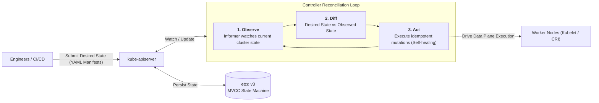
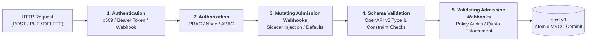
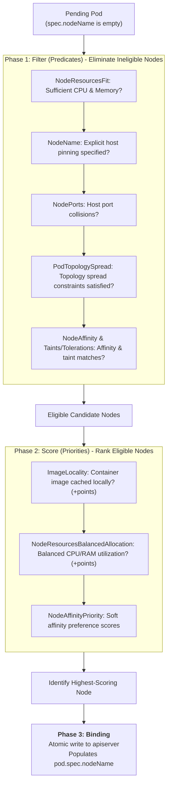
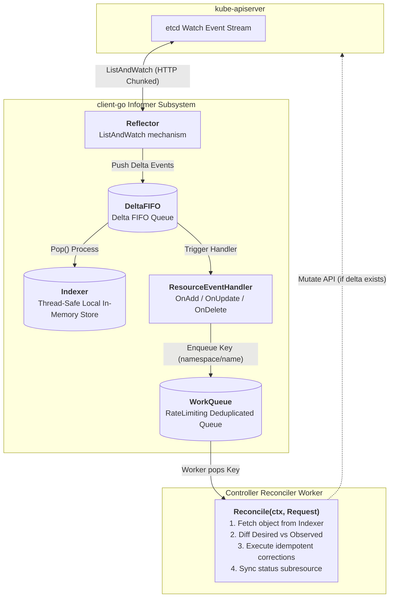

## Introduction: The Paradigm Shift from Imperative Operations to Control Theory

In traditional single-host container management and basic Docker Swarm operations, engineers are accustomed to **imperative** operational workflows:
- *"Launch 3 web containers"* (`docker run ...`);
- *"If the container crashes, trigger a restart script"*;
- *"Allocate an additional 2GB memory quota to the running container"*.

This imperative mental model relies on operators issuing sequences of step-by-step commands, operating on the fragile assumption that every step will execute predictably. However, across distributed clusters spanning hundreds or thousands of physical machines, hardware decay, network blips, and rack power failures are constant realities. **Imperative automation scripts inevitably break, leaving cluster state dangerously desynchronized from administrative intent**.

Kubernetes eradicated this brittleness by anchoring its design in the **declarative paradigm** of classical cybernetics and control theory:
- Engineers never specify **"How"** to make mutations; instead, they submit declarative YAML manifests defining the system's **Desired State**;
- Under the hood, an ecosystem of autonomous, continuous **Reconciliation Loops** continuously observes the **Actual / Observed State**, calculates error deltas against the **Desired State**, and applies corrective actuations to drive the error to zero:

$$\lim_{t \to \infty} |\text{Observed State}(t) - \text{Desired State}(t)| = 0$$



As the fourth chapter of **From Docker to Kubernetes: Cloud-Native Container & Cluster Orchestration Handbook**, this guide explores the four pillars of the Kubernetes control plane: the **kube-apiserver** admission pipeline, **etcd v3** MVCC storage, the **kube-scheduler** two-phase algorithm, and the **client-go Informer architecture and controller reconciliation loop**.

---

## 1. The Central Nervous System: kube-apiserver Admission Pipeline

In a Kubernetes cluster, **`kube-apiserver` is the sole component permitted to interact directly with etcd**. Whether external requests stem from `kubectl` and CI/CD pipelines, or internal requests originate from the Scheduler, Controller-Manager, and Kubelet, every read and write request must navigate the apiserver's defenses.

Every mutating write request traversing `kube-apiserver` passes through five sequential pipeline stages:



### 1.1 Authentication
The apiserver determines the client identity (*Who are you?*) using pluggable authenticators:
- **x509 Client Certificates**: Used by core control plane components (Kubelet, Controller-Manager) and cluster administrators;
- **ServiceAccount Tokens**: In-pod workload credentials (signed JWTs, managed with short-lived Bound ServiceAccount Tokens in modern releases);
- **OIDC (OpenID Connect) / Webhooks**: Enterprise SSO federations (Okta, Keycloak, Active Directory).
*Upon success, the request context is populated with `User`, `Groups`, and `Extra` metadata attributes.*

### 1.2 Authorization
The apiserver determines whether the identity possesses authorization to perform the requested verb on the target resource (*Are you allowed to do this?*):
- **RBAC (Role-Based Access Control)**: Production baseline. Uses `Role` / `ClusterRole` to define permissions (e.g., `get`, `list`, `watch` on `pods`), binding them to identities via `RoleBinding` / `ClusterRoleBinding`;
- **Node Authorization**: Dedicated whitelist authorizer ensuring Kubelets can only modify metadata and pods scheduled explicitly to their host node.

### 1.3 Mutating Admission Webhooks
Intercepts and alters incoming object manifests before persistence:
- **Typical Use Cases**: Service mesh sidecar injection (Istio, Linkerd) injecting Envoy sidecars into Pod specs, or automated platform defaults injecting `securityContext` parameters.

### 1.4 Schema Validation
Verifies that all fields adhere strictly to Kubernetes OpenAPI v3 specifications (field types, mandatory properties, regex constraints).

### 1.5 Validating Admission Webhooks
Serves as the final policy gate (read-only enforcement; cannot alter object content):
- **Typical Use Cases**: Policy engines such as OPA Gatekeeper or Kyverno enforcing security invariants (e.g., rejecting containers running with `privileged: true`, or requiring CPU/memory limit declarations). If rejected, the request terminates immediately with an HTTP 403 Forbidden.

---

## 2. The Single Source of Truth: etcd v3 and MVCC Architecture

All persistent cluster state resides within **etcd**, a strongly consistent, distributed key-value store governed by the Raft consensus protocol.

Unlike traditional relational databases or overwrite-based stores like Redis, **etcd v3 implements Multi-Version Concurrency Control (MVCC)**:

```text
etcd Logical Storage Architecture:
Key Space (In-Memory B-Tree Index):
  /registry/pods/default/nginx-pod ──► Revisions: [v3, v8, v15(tombstone)]

Persistent Storage (bbolt B+ Tree on Disk):
  Revision(3, 0)  ──► JSON/Protobuf Data (Pod Pending)
  Revision(8, 0)  ──► JSON/Protobuf Data (Pod Running, IP 10.244.1.5)
  Revision(15, 0) ──► Tombstone (Deleted Marker)
```

### 2.1 MVCC & Monotonic Cluster Revisions
- Every write mutation (insert, update, delete) increments a cluster-wide 64-bit integer called **`revision`**;
- Mutations append to disk files without in-place overwriting, maintaining an immutable chronological audit trail;
- **Optimistic Concurrency Control (OCC)**: Kubernetes resource metadata fields named `resourceVersion` map directly to etcd revisions. If two controllers simultaneously attempt to mutate the same resource, the slower writer receives an HTTP `409 Conflict: Operation cannot be fulfilled`, preventing blind overwrites.

### 2.2 Watch Streams and Event-Driven Pipelines
Polling a database at scale saturates network and disk I/O. etcd exposes gRPC-based **Watch Streams**:
- Clients subscribe to key ranges starting from a specific `revision` (e.g., `Watch(from_revision=8)`);
- During temporary network disconnections, a client reconnects and provides its last processed `revision`. etcd streams all missed intermediate events in exact chronological sequence, ensuring zero lost updates.

> **Production Warning**: Because MVCC preserves historical revisions, etcd disk usage grows continuously. Production clusters must configure scheduled `auto-compaction` and periodically execute `etcdctl defrag`. Furthermore, etcd write-ahead logs (WAL) demand low-latency NVMe SSD storage ($< 10$ms fsync latency) to prevent Raft election thrashing under load.

---

## 3. The Placement Engine: kube-scheduler Two-Phase Algorithm

When an application creates a Pod, its `spec.nodeName` attribute starts empty. The Pod remains in a `Pending` state until **`kube-scheduler`** locates the most optimal node to host it.

The scheduler computes placements through two sequential phases: **Filter** and **Score**.



1. **Filter Phase (Predicates)**:
   - Evaluates hard constraints across every node in the cluster. If a single predicate fails (e.g., insufficient CPU/RAM, node taint without matching toleration), the node is pruned;
   - If all nodes are disqualified, the Pod remains `Pending` with descriptive events: `0/N nodes available: Insufficient memory/cpu`.
2. **Score Phase (Priorities)**:
   - Evaluates remaining candidate nodes across weighted scoring algorithms (outputting 0–100 points per plugin);
   - Normalizes and aggregates scores, selecting the highest-ranking node.
3. **Optimistic Binding**:
   - The scheduler updates its local in-memory cache ("assuming" the binding to prevent duplicate allocation to the same node capacity) and issues an asynchronous `Binding` subresource call to `kube-apiserver`.

---

## 4. Cybernetics in Action: Informer Architecture & Controller Reconciliation

If `kube-apiserver` acts as the gateway and `etcd` represents memory, **`kube-controller-manager`** is the heartbeat keeping the cluster alive.

Each controller (DeploymentController, ReplicaSetController, NodeLifecycleController) runs an autonomous **Reconciliation Loop**.

To prevent thousands of controller instances from hammering `kube-apiserver` with repetitive queries, Kubernetes engineers designed the **client-go Informer** architecture.



### 4.1 Informer Component Anatomy
1. **Reflector**:
   - Executes an initial full `List` call to obtain all namespace objects and records the current `resourceVersion`;
   - Transitions immediately to a streaming `Watch` connection, feeding incremental delta events into the **DeltaFIFO** queue.
2. **DeltaFIFO & Indexer**:
   - Events dequeued from `DeltaFIFO` update the **Indexer**, a thread-safe, in-memory cache;
   - **Crucial Optimization**: All subsequent controller reads query the local memory Indexer, **reducing apiserver query strain to zero**!
3. **WorkQueue**:
   - Event callbacks (`OnAdd`, `OnUpdate`, `OnDelete`) **do not execute business logic**; they enqueue only the resource key (e.g., `default/my-nginx`) into a rate-limiting `WorkQueue`;
   - Multiple updates to the same key collapse into a single deduplicated entry. Failed reconcile attempts re-enqueue with exponential backoff.

### 4.2 Level-Triggered vs. Edge-Triggered Architecture

Kubernetes is often described as an event-driven system, but its formal foundation is **Level-Triggered, not Edge-Triggered**:

| Trigger Paradigm | Definition & Mechanics | Resiliency during Partitions & Drops |
| :--- | :--- | :--- |
| **Edge-Triggered** | Responds strictly to transition pulses (e.g., "Received message: +1 Pod added"). | **Fragile**. If network drops occur during the pulse, the system never reconciles, creating permanent split state. |
| **Level-Triggered** | Evaluates the overall state level (e.g., "Inspect current count: observed 2 vs desired 3"). | **Self-Healing**. Even if 10 consecutive event pulses are dropped, the subsequent reconciliation pass inspects current state and corrects the drift. |

---

## 5. Anatomy of a Production Reconciler

When developing production controllers using Controller-Runtime or KubeBuilder, the reconcile function follows a strict, idempotent contract:

```go
// Reconcile executes the central convergence loop for a given resource
func (r *DeploymentReconciler) Reconcile(ctx context.Context, req ctrl.Request) (ctrl.Result, error) {
    // 1. Fetch the Desired State from the local Indexer cache
    var deployment appsv1.Deployment
    if err := r.Get(ctx, req.NamespacedName, &deployment); err != nil {
        if errors.IsNotFound(err) {
            // Resource physically deleted; cleanup finished, return without requeue
            return ctrl.Result{}, nil
        }
        return ctrl.Result{}, err
    }

    // 2. Fetch the Observed State of child ReplicaSets matching the selector
    var rsList appsv1.ReplicaSetList
    if err := r.List(ctx, &rsList, client.MatchingLabels(deployment.Spec.Selector.MatchLabels)); err != nil {
        return ctrl.Result{}, err
    }

    // 3. Compute the delta between Desired and Observed states
    desiredReplicas := *deployment.Spec.Replicas
    currentReplicas := computeActiveReplicas(rsList)

    // 4. Act: Execute idempotent mutations to eliminate the delta
    if currentReplicas < desiredReplicas {
        // Insufficient replicas: scale up
        if err := r.scaleUp(ctx, &deployment, desiredReplicas - currentReplicas); err != nil {
            // Requeue with exponential backoff on failure
            return ctrl.Result{Requeue: true}, err
        }
    } else if currentReplicas > desiredReplicas {
        // Redundant replicas: scale down
        if err := r.scaleDown(ctx, &deployment, currentReplicas - desiredReplicas); err != nil {
            return ctrl.Result{Requeue: true}, err
        }
    }

    // 5. State converged successfully; reset rate limiter
    return ctrl.Result{}, nil
}
```

---

## 6. Summary and Transition

The Kubernetes control plane presents an elegant masterclass in distributed systems design:
- **`kube-apiserver`** acts as a stateless declarative gatekeeper;
- **`etcd v3`** provides immutable MVCC consistency;
- **`kube-scheduler`** solves multi-dimensional topological placement;
- **`Informers` and Reconciliation Loops** apply negative-feedback control theory to orchestrate self-healing fleets of containers.

With compute placement and control semantics established, distributed systems confront their next bottleneck: **the network**.

How do cross-host pods communicate without NAT? Why do legacy Linux `iptables` and IPVS rules encounter scaling limits in large clusters? And how does Cilium leverage Linux kernel eBPF to revolutionize cloud-native networking?

In our next chapter, **[Kubernetes Networking Panorama: CNI Specification, Calico BGP, Cilium eBPF, and Gateway API Architecture](/en/articles/k8s-networking-cni-cilium-ebpf-gateway-api/)**, we explore container networking at scale!

---

## Frequently Asked Questions (FAQ)

### Q1: If etcd loses its Raft Quorum during a network partition, do running application Pods immediately stop serving traffic?
**No.**
It is vital to distinguish between the **Control Plane** and the **Data Plane**:
- When etcd loses quorum, only the **Control Plane** stalls: `kube-apiserver` rejects mutating writes, preventing deployments, scaling, pod creation, or self-healing reschedule events;
- On the **Data Plane**, physical host Linux kernels, Kubelets, container runtimes (containerd), and CNI routing tables continue executing normally. Active containers process network traffic and incoming requests uninterrupted;
- Once etcd network connectivity recovers and a leader is elected, the control plane resumes operations seamlessly.

### Q2: Why does Kubernetes strictly forbid controllers and external clients from accessing etcd directly?
Centralizing all mutations through `kube-apiserver` provides critical architectural guarantees:
1. **Unified Security & Governance**: Enforces mandatory TLS authentication, granular RBAC authorization, audit logging, and webhook validation policies;
2. **Schema Integrity**: The apiserver validates OpenAPI schemas, preventing malformed objects from corrupting backend storage;
3. **Decoupled Evolution**: Controllers interact with standardized RESTful API contracts rather than raw key-value serialization formats, isolating storage implementation details.

### Q3: What is the root cause of "409 Conflict: Operation cannot be fulfilled on ... the object has been modified", and how should controllers resolve it?
**Root Cause**:
This error is triggered by Kubernetes' **Optimistic Concurrency Control (OCC)** based on etcd `resourceVersion`. When a controller fetches an object with revision 100 and prepares a mutation, another agent (e.g., Kubelet or HPA) may commit an intermediate mutation updating the revision to 101. When the first controller submits its mutation with revision 100, the apiserver detects the conflict and rejects the write to prevent silent data loss.

**Best Practices**:
1. **Use client-go Retry Utilities**: Wrap mutation logic inside `retry.RetryOnConflict(retry.DefaultRetry, func() error { ... })` from `k8s.io/client-go/util/retry`. On conflict, the utility refreshes the latest object instance and re-applies changes;
2. **Decouple Spec and Status Subresources**: Mutate operational status using `r.Status().Update()`, separating telemetry updates from user-driven specification changes.
