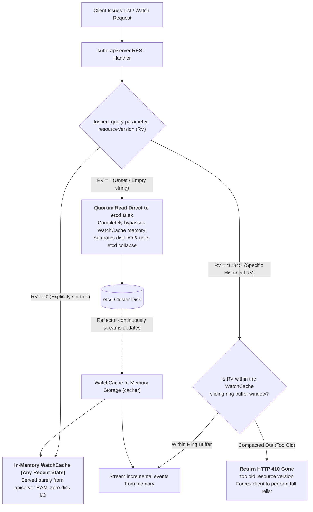
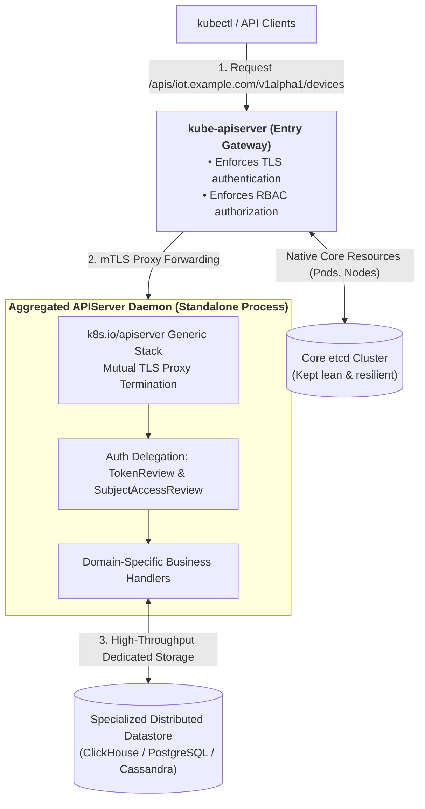
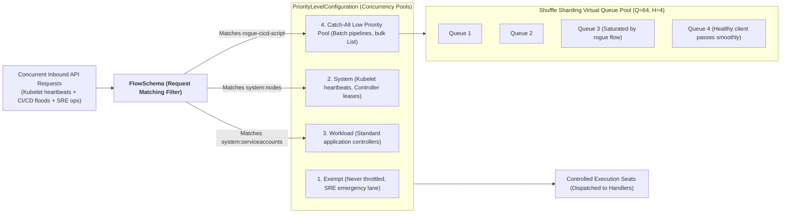

## Introduction: Scaling Towards 10,000 Nodes and Tens of Millions of Objects

In previous chapters, we mastered building Kubernetes Operators using Custom Resource Definitions (CRDs) and KubeBuilder.

For standard middleware deployments (such as MySQL or Redis clusters), CRDs are the premier architectural choice. However, when platform teams manage **hyperscale IoT device registries, high-frequency time-series telemetry, or massive security audit event streams**, the underlying storage mechanics of CRDs introduce systemic failure points:

1. **The Physical 8GB "Death Redline" of etcd**:
   Kubernetes persists all standard CRD payloads directly into underlying `etcd` clusters. As a strongly consistent memory/bbolt key-value database relying on Raft consensus, etcd enforces a strict recommended operational ceiling of **2GB to 8GB**. Continuous mutations across millions of custom objects trigger quota exhaustion (`database space exceeded`), freezing the entire Kubernetes control plane!
2. **WatchCache Cache Bypasses and Thundering Herds**:
   In clusters spanning 10,000+ worker nodes, rogue CI/CD automation pipelines or unoptimized monitoring scripts can issue hundreds of thousands of concurrent `List Pods` queries specifying `resourceVersion=""`. These queries punch through in-memory caches directly into etcd, causing Raft heartbeat starvation and cascading node lease expiration across the fleet!

To surmount these enterprise scalability barriers, platform architects must directly **re-engineer the central control plane architecture of Kubernetes**.

As the eleventh chapter of **From Docker to Kubernetes: Cloud-Native Container & Cluster Orchestration Handbook**, this guide explores control plane customization: **WatchCache internals and resourceVersion semantics**, **Aggregated APIServer architectures**, **APF Shuffle Sharding combinatorics**, and **10k-node etcd physical dual-disk optimization**.

---

## 1. Control Plane Query Critical Path: WatchCache Ring Buffers and resourceVersion Semantics

Protecting `kube-apiserver` under massive concurrent read pressure requires understanding its **multi-tiered memory caching and resource versioning pipeline**:



### 1.1 The Three Crucial `resourceVersion` Semantics
Misunderstanding `resourceVersion` is the primary reason naive API clients bring down production control planes:
1. **`resourceVersion = ""` (Unset / Empty String - High Risk)**:
   **Semantics**: Demands **absolute linearizable consistency (Quorum Read)**.
   **Mechanism**: `kube-apiserver` **bypasses its local in-memory WatchCache** and issues a quorum read across the etcd Raft cluster. When thousands of clients issue simultaneous un-versioned `List` calls, etcd disk I/O and CPU spike to 100%, causing cluster-wide heartbeat failures!
2. **`resourceVersion = "0"` (Safe & Recommended for Read Scaling)**:
   **Semantics**: Demands **any recent consistent snapshot from apiserver memory**.
   **Mechanism**: Returns immediately from the `WatchCache` in RAM. While data may lag etcd by a few milliseconds, it incurs **zero disk I/O**, increasing read throughput by orders of magnitude!
3. **`resourceVersion = "<specific_number>"`**:
   **Semantics**: Establish a Watch starting from this precise revision.
   **Mechanism**: Served from the circular cyclic event ring buffer in memory. If the requested revision has already been compacted out, the server returns **`HTTP 410 Gone (Too old resource version)`**, prompting the client to re-establish state via `resourceVersion="0"`.

---

## 2. Bypassing the 8GB etcd Boundary: Aggregated APIServer Architecture

When data domains exhibit the following operational characteristics, **CRDs must be abandoned in favor of an Aggregated APIServer**:
- Extreme volume (hundreds of thousands to tens of millions of records);
- High-frequency mutations (sub-second telemetry updates, such as `metrics.k8s.io`);
- Underlying storage requires specialized database engines (ClickHouse, PostgreSQL, or Cassandra).



### 2.1 Dynamic Registration via APIService
An Aggregated APIServer operates as an independent Go binary registered via the **`APIService`** API:

```yaml
apiVersion: apiregistration.k8s.io/v1
kind: APIService
metadata:
  name: v1alpha1.iot.example.com
spec:
  group: iot.example.com
  version: v1alpha1
  groupPriorityMinimum: 1000
  versionPriority: 15
  service:
    name: iot-aggregated-apiserver
    namespace: kube-system
    port: 443
  caBundle: LS0tLS1CRUdJTi... # Verifies aggregated server TLS certificate
```

### 2.2 Key Architectural Benefits:
1. **Unified Developer UX**: End users interact seamlessly using standard `kubectl get devices.iot.example.com` commands;
2. **Delegated Authentication and Authorization**: `kube-apiserver` validates tokens and RBAC rules upstream, forwarding authenticated identities over mTLS;
3. **Core etcd Protection**: Storage operations **never touch core etcd**, scaling custom storage horizontally to petabytes.

---

## 3. Defending Against Traffic Storms: API Priority and Fairness (APF)

In early Kubernetes releases, `--max-requests-inflight` applied blunt global concurrency limits, dropping critical Kubelet heartbeats when bursts occurred.

Kubernetes **API Priority and Fairness (APF)** implements **Fair Queuing** combined with **Shuffle Sharding**:



### 3.1 The Mathematics of Shuffle Sharding
Suppose a priority level provides a pool of $Q = 64$ virtual queues. For each client flow, APF hashes its identity into a subset "hand" of $H = 4$ queues.

The total number of unique queue combinations is:
$$C = \binom{Q}{H} = \frac{Q!}{H!(Q - H)!} = \frac{64 \times 63 \times 62 \times 61}{4 \times 3 \times 2 \times 1} = 635,376$$

**Mathematical Collision Resilience**:
- Even if a misconfigured CI/CD script floods the system and saturates all 4 queues assigned to its hand;
- The probability that another innocent client shares the exact identical 4 queues is **1 in 635,376 ($\approx 0.000157\%$)**!
- As long as at least one of the innocent client's 4 queues remains unsaturated, its requests process without interference, neutralizing the noisy-neighbor dilemma.

### 3.2 Production APF FlowSchema Configuration
```yaml
apiVersion: flowcontrol.apiserver.k8s.io/v1
kind: FlowSchema
metadata:
  name: protect-system-heartbeats
spec:
  priorityLevelConfiguration:
    name: system
  matchingPrecedence: 50
  rules:
  - subjects:
    - kind: Group
      group:
        name: system:nodes
    resourceRules:
    - verbs: ["*"]
      apiGroups: ["*"]
      resources: ["nodes", "nodes/status", "leases"]
```

---

## 4. 10,000-Node Foundations: Physical Dual-Disk Isolation and etcd Tuning

In clusters scaling between 5,000 and 15,000 worker nodes, default etcd configurations fail under heavy write throughput.

### 4.1 Physical Disk Law: Separate WAL from DB Drives
etcd write operations execute in two stages:
1. **WAL (Write-Ahead Logging)**: Requires strict sequential writes with synchronous `fdatasync()` calls completing in **under 1ms**;
2. **BoltDB Data File**: Involves random B+ tree page balancing and background snapshot flushes.

**Architectural Requirement**: **Never co-locate the WAL and data directories on the same physical SSD!**
Configure dedicated NVMe storage devices:
```bash
--wal-dir=/mnt/nvme-wal/etcd-wal \
--data-dir=/mnt/nvme-db/etcd-data
```
Physical drive separation prevents random BoltDB flushing from blocking Raft WAL disk commits, eliminating consensus leader flaps.

### 4.2 Architectural Decoupling: Dedicated Event Sharding (`/events`)
Over **80% of high-frequency ephemeral writes** in massive clusters originate from Kubernetes `Event` objects.
Configure dedicated event clustering in `kube-apiserver`:
```bash
--etcd-servers=https://etcd-core-1:2379,https://etcd-core-2:2379,https://etcd-core-3:2379 \
--etcd-servers-overrides=/events#https://etcd-events-1:2379,https://etcd-events-2:2379,https://etcd-events-3:2379
```
- **Core etcd**: Dedicated to Nodes, Pods, and ConfigMaps with minimal write churn;
- **Event etcd**: Handles transient lifecycle records, isolating compaction and defragmentation spikes from core cluster state.

### 4.3 High-Capacity etcd Flag Tuning
```bash
# 1. Expand backend storage quota to 8GB (8589934592 bytes)
--quota-backend-bytes=8589934592

# 2. Aggressive periodic compaction to prevent B+ tree fragmentation
--auto-compaction-retention=5m
--auto-compaction-mode=periodic

# 3. Heartbeat and election timeouts for high-density networks
--heartbeat-interval=250      # 250ms heartbeat interval
--election-timeout=1250       # 1250ms election timeout

# 4. Elevated maximum request payload for large List operations
--max-request-bytes=33554432  # 32MB payload limit
```

---

## 5. Summary and Transition

Customizing the Kubernetes control plane enables unprecedented infrastructure scale:
- **WatchCache and resourceVersion** reveal the internal mechanics of memory caching, preventing catastrophic disk quorum read storms via `resourceVersion="0"`;
- **Aggregated APIServers** bypass the 8GB storage limit of etcd, integrating external distributed databases behind a native API facade;
- **APF with Shuffle Sharding** applies combinatorial mathematics to protect critical control loops from noisy-neighbor traffic;
- **Physical dual-disk isolation and event sharding** provide hardware-level consensus resilience for clusters exceeding 10,000 nodes.

With application networking, databases, schedulers, node runtimes, and control planes thoroughly mastered, we turn to operational codification:

- How do we synthesize these advanced architectural capabilities into self-healing, maintainable software?
- How do we design production-grade reconciliation loops and Day-2 automation?

In Chapter 12, **[Kubernetes Extensibility Core: Operator Pattern, CRDs, and KubeBuilder in Production](/en/articles/k8s-operator-pattern-kubebuilder-crd/)**, we explore the peak paradigm of cloud-native software engineering!

---

## Frequently Asked Questions (FAQ)

### Q1: Why does the choice of `resourceVersion` dictate the survivability of the control plane during high-concurrency queries?
**Root Cause: Direct etcd disk bypass versus quorum read saturation**.
- With `resourceVersion=""`, clients demand strict linearizability (Quorum Read), forcing `kube-apiserver` to query etcd disks across all Raft nodes. Concurrent full-cluster lists quickly saturate etcd disk I/O, leading to node heartbeat timeouts and control plane failure;
- With `resourceVersion="0"`, queries are fulfilled entirely from the in-memory `WatchCache`, completing in milliseconds with zero etcd disk overhead;
- With `resourceVersion="<rv>"`, apiserver reads incremental mutations from its sliding memory ring buffer, returning HTTP 410 Gone if compacted, which smoothly triggers client resynchronization.

### Q2: When must platform architects adopt an Aggregated APIServer over a CRD?
1. **Massive data volume and update rates**: Telemetry collections generating millions of points per second (like `metrics-server`) will exhaust etcd's 8GB limit within hours if stored as CRDs;
2. **Specialized query requirements**: Workloads requiring OLAP aggregations (ClickHouse) or full-text search (Elasticsearch);
3. **Virtualizing legacy external data**: Exposing existing enterprise CMDB registries via standard Kubernetes REST endpoints without duplicating state into etcd.

### Q3: How does Shuffle Sharding in APF fundamentally differ from standard modulo hashing?
Standard modulo hashing maps a client flow to a single deterministic queue. If a rogue tenant saturates queue 3, all innocent tenants hashed into queue 3 are completely blocked.
**Shuffle Sharding** hashes each client into a **combination of multiple queues (e.g., 4 out of 64)**. A rogue tenant can only saturate its specific 4 queues. The probability of an innocent tenant sharing all 4 identical queues is $\binom{64}{4}^{-1} = 1/635,376$. If any of its 4 queues remains unsaturated, the innocent client's requests execute normally.
