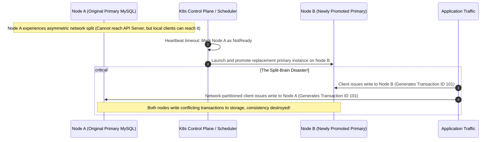

## Introduction: The Performance Deadlines and Durability Floors of Kubernetes Databases

In Chapter 06, [Kubernetes Storage Architecture](/en/articles/k8s-storage-csi-statefulset-deep-dive/), we broke down the CSI plugin specification and StatefulSet invariants.

However, in demanding production database deployments, teams that configure a generic cloud StorageClass (such as AWS gp3 or standard managed cloud disks) to deploy **MySQL, PostgreSQL, TiDB, Kafka, or Elasticsearch** regularly encounter two operational traps:
1. **The Performance Cliff**: Write latency P99 degrades from bare-metal 1ms levels up to 15ms. Under peak ingestion loads, disk I/O queues saturate, exhausting connection pools and cascading into microservice outages;
2. **Silent Data Corruption (Split-Brain)**: A physical host suffers a transient network blip. The Kubernetes scheduler instantiates a replacement primary Pod on another node; however, because the isolated original node continues writing to its local filesystem without clean unmounting, both instances accept writes, causing split-brain data corruption!

Datastores represent the foundational persistence tier of modern software. **They cannot merely be containerized passively; their underlying kernel interactions, disk channels, and failover topologies must be re-engineered for cloud-native infrastructure**.

As the eighth chapter of **From Docker to Kubernetes: Cloud-Native Container & Cluster Orchestration Handbook**, this guide deconstructs distributed database engineering on Kubernetes: **Local NVMe SSD passthrough with optimized XFS parameters**, **Linux Page Cache and WAL flush tuning**, and **Node Fencing / IPMI STONITH split-brain mitigation**.

---

## 1. The Storage Hierarchy: Why High-Performance Databases Mandate Local PVs

Storage architectures in Kubernetes fall into three distinct tiers:

```mermaid
flowchart TD
    subgraph NetStorage["1. Network Block Storage (EBS / Ceph / Managed Disks)"]
        direction LR
        App1["Database Pod"] --> VFS1["Linux VFS Subsystem"]
        VFS1 --> TCP1["TCP/IP Kernel Encapsulation"]
        TCP1 --> NIC1["Host NIC"]
        NIC1 -->|"2~3 Network Switch Hops"| SAN["Remote Storage Cluster / SAN Controller"]
        SAN --> Disk1["Remote Physical Disk (P99: 3~15 ms)"]
    end

    subgraph LocalStorage["2. Local Hardware Passthrough (Local Persistent Volumes)"]
        direction LR
        App2["Database Pod"] --> VFS2["Linux VFS (XFS / O_DIRECT)"]
        VFS2 --> PCIe["Host PCIe 5.0 / NVMe Controller"]
        PCIe --> Disk2["<b>Local Enterprise NVMe SSD (P99: 50~100 μs)</b>"]
    end
```



| Storage Paradigm | Reference Implementations | Hardware Transit Path | Random Write P99 Latency | Failure Recovery Model | Recommended Workload |
| :--- | :--- | :--- | :--- | :--- | :--- |
| **Network Block Storage** | AWS EBS (gp3/io2), Cloud Disks | Host NIC $\to$ VPC Fabric $\to$ Storage Controller | 1 ~ 5 ms | Upon host failure, cloud disk detaches and re-attaches to new node | Medium-tier web datastores without sub-millisecond SLA requirements |
| **Distributed Network Filesystem** | CephFS, NFS, Portworx | Host Kernel $\to$ FUSE / Network Driver $\to$ Multi-replica network | 3 ~ 15 ms | Software storage layer handles replication | Static assets, shared media, multi-reader Pod scenarios |
| **Local Persistent Volume (Local PV)** | Host PCIe NVMe SSDs (Direct Passthrough) | **Host PCIe bus direct, zero network encapsulation** | **50 ~ 100 μs (20x~50x lower latency!)** | Rebuilt via application-layer consensus (Raft/Paxos) | **Mission-Critical Datastores (TiDB, MySQL, Kafka, ClickHouse)** |

### Architectural Trade-Offs:
- Network block storage provides 3x storage-layer redundancy, but introduces significant **network transit hop latency** and bandwidth throttling;
- Modern distributed datastores (TiDB TiKV, Apache Kafka, Elasticsearch) **already implement application-level replication protocols (such as Raft or ISR)**;
- Running an application-level Raft database atop an underlying 3x replicated storage SAN results in **double-replication amplification**, compounding write amplification and network saturation;
- **Consequently, high-scale database architectures adopt Local Persistent Volumes (Local PV)**, delegating durability and failover entirely to application-level consensus algorithms.

---

## 2. Production Local PV Architecture & XFS Filesystem Tuning

Using Local PVs in Kubernetes requires avoiding raw `hostPath` volumes. Dedicated, node-pinned **Local PersistentVolumes** must be provisioned.

### 2.1 Disk Initialization: Tuning XFS Formatting
When formatting physical NVMe drives, optimize XFS parameters to prevent metadata write lock contention:
```bash
# Format enterprise NVMe SSD
mkfs.xfs -f \
  -n ftype=1 \          # Mandatory: ftype=1 (Prerequisite for container runtimes and OverlayFS)
  -l size=128m \        # Enlarge log buffer to 128MB to eliminate journal lock contention during WAL flushes
  -d agcount=32 \       # Increase allocation groups to 32 to maximize parallel write allocation
  /dev/nvme0n1

# Production mount parameters
mkdir -p /mnt/disks/nvme0n1
mount -o noatime,nodiratime,allocsize=64M,logbufs=8,logbsize=256k /dev/nvme0n1 /mnt/disks/nvme0n1
```
- `noatime,nodiratime`: Disables file access timestamp updates, eliminating up to 30% of unnecessary disk writes;
- `allocsize=64M`: Extends buffer pre-allocation, substantially reducing large WAL file fragmentation.

### 2.2 Local PV Manifest Declaration

```yaml
apiVersion: v1
kind: PersistentVolume
metadata:
  name: local-nvme-pv-node1
spec:
  capacity:
    storage: 1.6Ti
  volumeMode: Filesystem
  accessModes:
  - ReadWriteOnce
  persistentVolumeReclaimPolicy: Retain
  storageClassName: local-nvme-sc
  local:
    path: /mnt/disks/nvme0n1     # Mount point of dedicated NVMe block device
  nodeAffinity:
    required:
      nodeSelectorTerms:
      - matchExpressions:
        - key: kubernetes.io/hostname
          operator: In
          values:
          - k8s-worker-node-1     # Physical node pinning
---
apiVersion: storage.k8s.io/v1
kind: StorageClass
metadata:
  name: local-nvme-sc
provisioner: kubernetes.io/no-provisioner
# Mandatory requirement: defer volume binding!
volumeBindingMode: WaitForFirstConsumer
```

---

## 3. Kernel and Storage Engine Tuning

Running databases within containers introduces operational risks regarding **Linux Page Cache dirty page accumulation and cgroups v2 OOM kills**.

### 3.1 The Memory Trap: Page Cache and Container Eviction
Under default Linux kernel settings, file write operations cache within the operating system Page Cache as "dirty pages," asynchronously flushed by background `pdflush/flusher` threads.
- Under cgroups v2, **memory allocated to the Page Cache counts directly toward the container's `memory.current` consumption**;
- If the database ingests data faster than the physical medium can flush, Page Cache buffers surge, reaching the container's `resources.limits.memory`;
- The Linux kernel triggers synchronous writeback (Direct Reclaim), freezing worker threads for several seconds or terminating the database process via the OOMKiller!

```text
Host and Container Kernel Tuning Guidelines (/etc/sysctl.conf):
# 1. Lower threshold for background asynchronous dirty page flushing (from 10% to 5%)
vm.dirty_background_ratio = 5

# 2. Bound maximum dirty page volume to prevent IO stalls (cap at 10%)
vm.dirty_ratio = 10

# 3. Shorten dirty page expiration window (centiseconds: drop from 3000 to 500 = 5 seconds)
vm.dirty_expire_centisecs = 500
```

### 3.2 Bypassing the Page Cache: Direct I/O (`O_DIRECT`) and `fdatasync`
For consistent throughput across write-heavy engines (MySQL InnoDB, RocksDB WAL engines), applications should **enable Direct I/O (`O_DIRECT`)**:
- **MySQL Configuration**: `innodb_flush_method = O_DIRECT`;
- **RocksDB Configuration**: `use_direct_io_for_flush_and_compaction = true`, `use_direct_reads = true`;
- **WAL Flush Optimization**: Replace standard `fsync()` with `fdatasync()`. While `fsync()` forces synchronous metadata updates (triggering disk controller stalls), `fdatasync()` flushes only raw data blocks, delivering up to 40% higher throughput;
- Data transfers bypass the OS Page Cache entirely, **eliminating double-buffering memory overhead and guarding against container OOM kills**.

---

## 4. Split-Brain Mitigation: Node Fencing Architecture

In distributed architectures, few failures cause more data corruption than **unmitigated split-brain conditions resulting from network partitions**:



### 4.1 Principles of Node Fencing
Mitigating split-brain scenarios requires enforcing **Fencing**: **"Before a replacement primary node is permitted to accept write transactions, the system must guarantee the prior primary is incapacitated!"**

Three tiers of Fencing mechanisms are deployed in production:

1. **Storage Fencing (SCSI-3 PR / CSI Locks)**:
   Leverages SCSI-3 Persistent Reservation locks or cloud `VolumeAttachment` constraints. Before assuming primary duties, the replacement node revokes the previous node's access token at the storage controller level. Any subsequent write attempts by the isolated node encounter kernel I/O errors.
2. **Node Fencing (STONITH - Shoot The Other Node In The Head)**:
   When the control plane flags Node A as failed, automated agents issue power-cutoff commands via server out-of-band management interfaces (IPMI, iLO, or Redfish APIs), cutting power to the chassis.
3. **Software Lease Fencing**:
   The primary process maintains a short-lived distributed lease in memory (e.g., a Kubernetes `Lease` object or Raft consensus lease refreshed every 2 seconds). If the primary loses contact with the cluster and fails to renew the lease within 5 seconds, **it must execute an immediate process abort/panic**, halting disk write routines.

---

## 5. Summary and Transition

Operating distributed databases on Kubernetes requires systems-level discipline:
- **Storage Selection**: High-throughput workloads should prioritize Local PV NVMe passthrough, using application-level consensus to handle hardware redundancy;
- **Filesystem & Kernel Tuning**: Formatting with `mkfs.xfs -l size=128m` eliminates journal lock contention, while tuning dirty page parameters and enabling `O_DIRECT` protects against cgroups v2 OOM cascades;
- **Split-Brain Defense**: Enforcing Node Fencing, IPMI STONITH chassis power cutoffs, and lease-based heartbeat locks shields databases against split-brain corruption during network partitions.

However, as workloads scale beyond basic microservices and databases, platform architects confront internal control-plane bottlenecks:
- Why does the standard `kube-scheduler` struggle with batch AI jobs, causing deadlocks in distributed training workloads?
- How can platform engineers extend the Kubernetes scheduling core using the official **Scheduling Framework**?
- What are the design principles of **Gang Scheduling**, and how does the **Descheduler** maintain runtime cluster balance?

In Chapter 09, **[Hacking the Kubernetes Scheduler: Custom Plugins via Scheduling Framework, Gang Scheduling, and Descheduler Dynamic Rebalancing](/en/articles/k8s-scheduling-framework-custom-plugin-gang-scheduling/)**, we customize the Kubernetes scheduler!

---

## Frequently Asked Questions (FAQ)

### Q1: Why do distributed systems like TiDB, Kafka, and Elasticsearch prefer Local PVs over network block storage (Ceph or AWS EBS)?
**Core Reason: Eliminates Double-Replication Overhead and Delivers Low Latency**.
These distributed platforms implement data redundancy at the application layer via Raft, ISR, or primary-replica topologies. Running them atop 3x replicated network block storage multiplies every write operation into two network transit phases and nine separate disk writes. Local PVs leverage direct host PCIe buses, reducing latencies to microseconds while eliminating network transfer charges.

### Q2: Why is configuring `-l size=128m` critical when formatting XFS volumes for database workloads?
XFS maintains an internal journaling area for filesystem transactions. By default, this log buffer is restricted to a few megabytes. Under high-frequency concurrent writes (such as RocksDB WAL flushes or MySQL Binlog writes), multiple threads concurrently submitting transaction commits saturate the internal XFS log ticket lock, freezing threads in kernel space. Expanding the log buffer to 128MB provides sufficient queuing capacity to eliminate up to 80% of metadata lock contention.

### Q3: What is Node Fencing, and why are Kubernetes Liveness Probes insufficient to prevent database split-brain conditions?
Liveness probes evaluate process health locally within a node; they cannot distinguish between container failure and an asymmetric network partition. If a primary node becomes isolated from the control plane while remaining reachable by local clients, promoting a secondary node without fencing causes both instances to accept writes simultaneously. Node Fencing guarantees that the original node is cut off from storage or power before the new primary is promoted.
