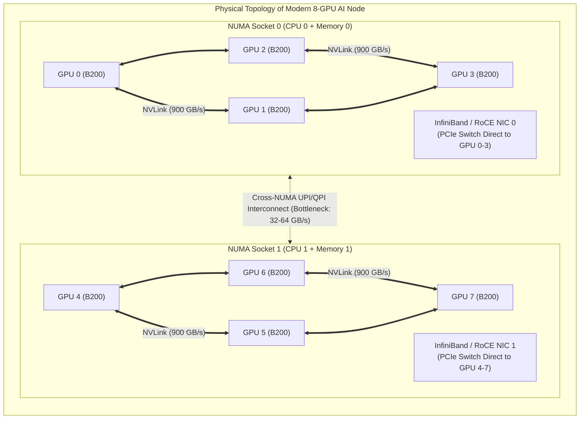
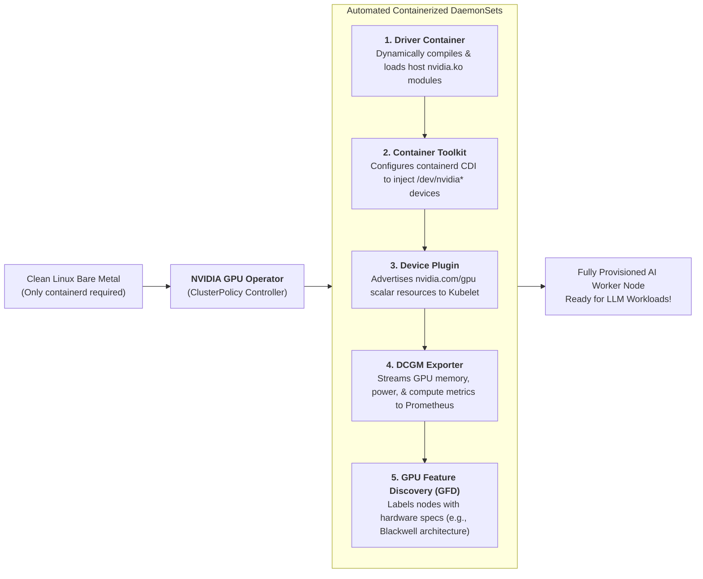
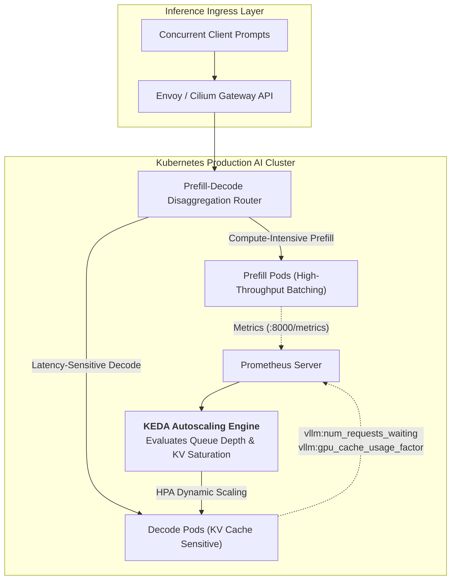
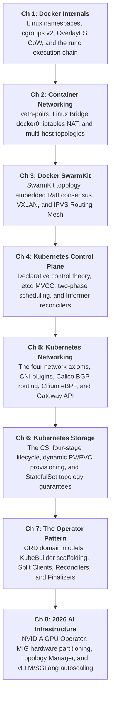

## Introduction: The Paradigm Shift from Scalar CPUs to AI GPU Topologies

Throughout the first decade of cloud-native evolution, the core resource abstractions of Kubernetes scheduling were fundamentally **scalar and homogeneous**:
- A standard Pod requests `cpu: "2"` and `memory: "4Gi"`;
- The scheduler executes straightforward integer subtraction: $Node_{\text{allocatable}} - Pod_{\text{requests}}$. Whether those two CPU cores reside on socket 0 or socket 1, and which memory bus feeds that RAM, has negligible performance impact on conventional web microservices.

However, in the 2026 era of Large Language Models (LLMs), multimodal foundation models, and embodied intelligence, **these simplistic scalar scheduling assumptions collapse**:
1. **Capital Expenditure & Extreme Topology Sensitivity**: An 8x NVIDIA H100/H200/B200 computing node represents significant hardware investment;
2. **The "Topology Cliff" of NUMA and NVLink Interconnects**: When executing Tensor Parallelism (TP=4) across multiple GPUs, if the scheduler assigns 4 GPUs split across disparate NVSwitch interconnect groups or across CPU NUMA boundaries, cross-device communication latency increases by $5\times$ to $10\times$, degrading token generation rates (Tokens/s);
3. **Sub-Device Granularity**: Dedicated full-GPU allocation under-utilizes hardware for auxiliary workloads, requiring hardware-enforced Multi-Instance GPU (MIG) physical slicing with strict multi-tenant isolation.



As the capstone chapter of **From Docker to Kubernetes: Cloud-Native Container & Cluster Orchestration Handbook**, this guide explores AI computing infrastructure: the **NVIDIA GPU Operator** automated lifecycle, **MIG hardware slicing, topology-aware scheduling**, and production autoscaling architectures for **vLLM and SGLang** inference clusters.

---

## 1. NVIDIA GPU Operator: Zero-Touch Management at Scale

Historically, enabling GPU workloads on Kubernetes was an operational bottleneck. Administrators had to manually SSH into bare-metal servers, compile kernel-matching NVIDIA drivers, configure CUDA runtimes, set up `nvidia-container-toolkit`, and deploy the Device Plugin DaemonSet.

In hyperscale AI clusters subject to continuous node cycling and autoscaling, manual provisioning causes driver version drift and node initialization failures.

The **NVIDIA GPU Operator** applies the [Operator Pattern](/en/articles/k8s-operator-pattern-kubebuilder-crd/) to hardware management. It automates node enablement via a declarative `ClusterPolicy`, delivering **zero-touch node configuration**:



### Component Architecture:
1. **Driver Container**: Compiles and injects `nvidia.ko` and `nvidia-uvm.ko` kernel modules into the host kernel at boot, **keeping the underlying Linux host filesystem clean**;
2. **NVIDIA Container Toolkit**: Modifies the container runtime (`/etc/containerd/config.toml`) with Container Device Interface (CDI) hooks, ensuring containers securely bind `/dev/nvidia*` devices and CUDA libraries at launch;
3. **NVIDIA Device Plugin**: Communicates with Kubelet over gRPC to register assignable GPU inventory;
4. **DCGM Exporter**: Collects high-frequency GPU telemetry—such as VRAM consumption, Tensor Core utilization, NVLink throughput, and thermal metrics—via the Data Center GPU Manager (DCGM);
5. **GPU Feature Discovery (GFD)**: Applies descriptive Kubernetes labels to nodes (e.g., `nvidia.com/gpu.product=NVIDIA-H100-80GB-HBM3`), enabling targeted workload scheduling.

---

## 2. GPU Slicing Architecture: Time-Slicing, MIG, and DRA

Not all AI tasks require an entire 80GB or 140GB HBM GPU. To maximize hardware utilization across enterprise clusters, three distinct allocation mechanisms are used:

| GPU Slicing Mechanism | Isolation Architecture | Memory & Compute Independence | Recommended Use Case |
| :--- | :--- | :--- | :--- |
| **Time-Slicing** | Software-level temporal sharing. Exposes multiple virtual devices to Kubelet. | **No Hardware Isolation**. Shared memory space; an out-of-memory error in one process terminates all co-located containers. | Dev/test staging, lightweight CI/CD, tiny feature-extraction models. |
| **MIG (Multi-Instance GPU)** | **Hardware-Level Partitioning**. Divides physical silicon into dedicated Compute Instances (CI) and GPU Instances (GI). | **Strict Physical Isolation**. Dedicated Streaming Multiprocessors, independent memory controllers, and isolated DMA engines. | Enterprise multi-tenancy, inference serving for small models (Embedding, Reranking). |
| **DRA (Dynamic Resource Allocation)** | Kubernetes 1.30+ claim-based allocation model replacing scalar integer counters. | **Topology-Aware Claims**. Requests specific device pairings (e.g., "Pair 2 GPUs connected via NVLink"). | Large-scale LLM training, disaggregated heterogeneous inference clusters. |

```
NVIDIA MIG Physical Partitioning (Example: H100 80GB):
┌─────────────────────────────────────────────────────────────┐
│ Physical NVIDIA H100 80GB HBM3 GPU                          │
├──────────────────┬──────────────────┬───────────────────────┤
│ Instance 1       │ Instance 2       │ Instance 3            │
│ Profile: 3g.40gb │ Profile: 2g.20gb │ Profile: 1g.10gb (x2) │
│ • 42 SM Units    │ • 28 SM Units    │ • 14 SM Units         │
│ • 40GB VRAM      │ • 20GB VRAM      │ • 10GB VRAM           │
│ • 1.6 TB/s Band  │ • 800 GB/s Band  │ • 400 GB/s Band       │
│ (Deploy 14B LLM) │ (Deploy 7B LLM)  │ (Deploy Embedding)    │
└──────────────────┴──────────────────┴───────────────────────┘
```

Configuring `mig.strategy=mixed` within the GPU Operator enables declarative partitioning of physical cards into distinct MIG profiles (such as `nvidia.com/mig-3g.40gb: 2`), which the Kubernetes scheduler treats as non-preemptible hardware assets.

---

## 3. Topology-Aware Scheduling: NUMA and NVLink Co-location

Distributed LLM inference using Tensor Parallelism (TP) relies on ultra-low latency inter-card communication. Suboptimal placement decisions introduce significant performance degradation:

### 3.1 The Cross-NUMA Interconnect Bottleneck
On a typical dual-socket platform, CPU 0 controls Socket 0 local memory and GPUs 0–3, while CPU 1 controls Socket 1 and GPUs 4–7.
- If a Pod is assigned `CPU Core 2` (Socket 0) alongside `GPU 5` (Socket 1 PCIe root complex);
- Every host-to-device tensor memory transfer must cross CPU interconnect buses (such as Intel UPI or AMD Infinity Fabric), reducing bandwidth from 64 GB/s down to sub-15 GB/s!

### 3.2 Kubelet Topology Manager Alignment
To resolve this, Kubernetes provides the **Topology Manager** on worker nodes. It coordinates the CPU Manager, Memory Manager, and Device Plugin to enforce co-location:

```yaml
# Kubelet node configuration: /var/lib/kubelet/config.yaml
topologyManagerPolicy: single-numa-node
topologyManagerScope: container
cpuManagerPolicy: static
```

Under `single-numa-node`:
1. When Kubelet receives a container assignment, the Topology Manager evaluates NUMA boundaries;
2. **The container launches only if all requested exclusive CPU cores, HugePages memory allocations, and GPU devices reside within the identical physical NUMA node**;
3. If alignment cannot be satisfied, Kubelet rejects the placement (`TopologyAffinityError`), forcing `kube-scheduler` to find an aligned node and preventing cross-NUMA interconnect stalls.

---

## 4. Production AI Serving: Autoscaling vLLM & SGLang on Kubernetes

Operating production inference engines like **vLLM** and **SGLang** on Kubernetes requires accounting for two architectural constraints:
1. **Aggressive VRAM Pre-allocation**: Upon initialization, vLLM allocates up to 90% of available VRAM to establish its PagedAttention KV Cache pool. Consequently, **conventional Kubernetes CPU/Memory HPA policies fail**, as GPU memory utilization remains constant regardless of active traffic;
2. **Prefill/Decode (P/D) Disaggregation**: Prefill operations are compute-bound, whereas Decode operations are memory-bandwidth-bound.

The modern production architecture leverages **KEDA (Kubernetes Event-driven Autoscaling)** triggered by vLLM metrics scraped via Prometheus:



### 4.1 Production KEDA ScaledObject Configuration

The following manifest demonstrates autoscaling for a production vLLM deployment:

```yaml
apiVersion: keda.sh/v1alpha1
kind: ScaledObject
metadata:
  name: vllm-inference-autoscaler
  namespace: llm-serving
spec:
  scaleTargetRef:
    apiVersion: apps/v1
    kind: Deployment
    name: vllm-qwen-72b-instruct
  minReplicaCount: 2
  maxReplicaCount: 16
  cooldownPeriod: 300       # 300s scale-down delay prevents thrashing from large model reload cycles
  pollingInterval: 5        # Polls telemetry every 5s for rapid burst response
  advanced:
    horizontalPodAutoscalerConfig:
      behavior:
        scaleUp:
          stabilizationWindowSeconds: 0
          policies:
          - type: Percent
            value: 100      # Permits instantaneous 100% replica expansion during surges
            periodSeconds: 15
        scaleDown:
          stabilizationWindowSeconds: 300
  triggers:
  # Trigger 1: Queued inference requests awaiting compute capacity
  - type: prometheus
    metadata:
      serverAddress: http://prometheus-k8s.monitoring.svc.cluster.local:9090
      metricName: vllm_num_requests_waiting
      query: sum(vllm:num_requests_waiting{model="qwen-72b"})
      threshold: '5'        # Scales up when queue backlog exceeds 5 requests
  # Trigger 2: KV cache block allocation saturation
  - type: prometheus
    metadata:
      serverAddress: http://prometheus-k8s.monitoring.svc.cluster.local:9090
      metricName: vllm_gpu_cache_usage_factor
      query: avg(vllm:gpu_cache_usage_factor{model="qwen-72b"})
      threshold: '0.80'     # Triggers expansion when KV cache saturation crosses 80%
```

---

## 5. Comprehensive Series Review: Full Curriculum Retrospective

This concludes all eight chapters of **From Docker to Kubernetes: Cloud-Native Container & Cluster Orchestration Handbook**!

Reviewing the architectural progression across the curriculum:



- **Linux Kernel Foundations to Single-Host Runtimes (Ch 1–2)**: We deconstructed the abstraction of containers into standard Linux processes bounded by kernel namespaces and cgroups, mapped through virtual bridges and iptables routing rules;
- **Lightweight Clustering to Declarative Control Planes (Ch 3–4)**: We examined Docker Swarm's embedded Raft consensus, then progressed to Kubernetes declarative control loops and MVCC storage architectures;
- **Networking, Storage, and Custom Operators (Ch 5–7)**: We explored eBPF programmable datapath alternatives to legacy iptables, CSI lifecycle mechanics for stateful workloads, and Operator automation for complex infrastructure;
- **The 2026 AI Frontier (Ch 8)**: We synthesized these cloud-native abstractions with modern accelerator architectures, tracing the path from physical NUMA/NVLink alignment to distributed LLM inference scaling.

---

## Frequently Asked Questions (FAQ)

### Q1: Why does vLLM report GPU VRAM allocation above 90% immediately after booting, and will this trigger Kubernetes OOMKills?
**No.**
This is an intentional design pattern of **PagedAttention KV Cache pre-allocation**:
- During startup, vLLM loads model weights (e.g., Qwen-72B requires ~144GB across multiple cards);
- Following model initialization, vLLM pre-allocates 90% of remaining physical VRAM (`--gpu-memory-utilization=0.9`) to manage dynamic paging tables;
- **Kubernetes OOM Behavior**: The Kubernetes OOMKiller monitors **Host Physical RAM**, not device VRAM. As long as host memory stays within `resources.limits.memory`, the container will not be terminated;
- **Autoscaling Guidance**: Do not base HPA rules on raw VRAM consumption reported by DCGM. Instead, autoscale against vLLM's internal metric `vllm:gpu_cache_usage_factor`.

### Q2: On an 8-GPU node, why does distributing a Tensor Parallel (TP=4) model across arbitrary GPUs introduce severe latency, and how does the Topology Manager resolve it?
**Root Cause: Asymmetric Interconnect Topologies**.
In HGX architectures, GPUs communicate in distinct sub-clusters via high-bandwidth NVSwitch fabrics (up to 900 GB/s bidirectional bandwidth per card).
If the scheduler places a TP=4 workload across non-co-located GPUs (e.g., GPUs 0, 1, 4, and 5):
- GPUs 0 and 1 communicate over high-speed NVLink;
- GPUs 1 and 4 are forced over lower-bandwidth PCIe or cross-socket CPU interconnects (dropping bandwidth to sub-30 GB/s);
- Because Tensor Parallelism requires frequent synchronization via `All-Reduce` operations, overall throughput drops significantly;
**Resolution**:
Enable `topologyManagerPolicy: single-numa-node` or leverage Kubernetes 1.30+ **Dynamic Resource Allocation (DRA)** to schedule GPU workloads within verified interconnect boundaries.

### Q3: What is the primary operational advantage of Kubernetes Dynamic Resource Allocation (DRA) over traditional Device Plugins for AI workloads?
**Limitations of Traditional Device Plugins**:
Device Plugins advertise resources as scalar integers (e.g., `nvidia.com/gpu: 4`). The scheduler cannot evaluate whether the assigned GPUs share an NVLink fabric, connect to the same NUMA socket, or align with local InfiniBand NICs.

**Capabilities of Dynamic Resource Allocation (DRA)**:
1. **Claim-Based Parameterization**: Workloads submit a `ResourceClaim` specifying structured hardware constraints;
2. **Topology Discovery**: DRA enables vendor drivers to expose hardware topology (NVLink connectivity matrices, PCIe switch mappings) directly to the scheduling framework;
3. **Coordinated Multi-Device Scheduling**: The scheduler atomically pairs GPU allocations with corresponding local network controllers on the same PCIe root complex, preventing interconnect bottlenecks.
