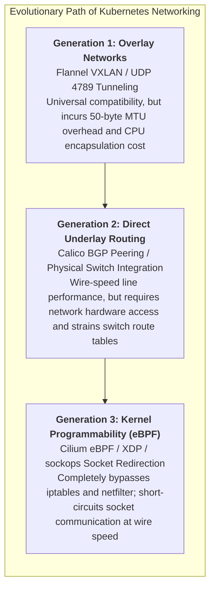
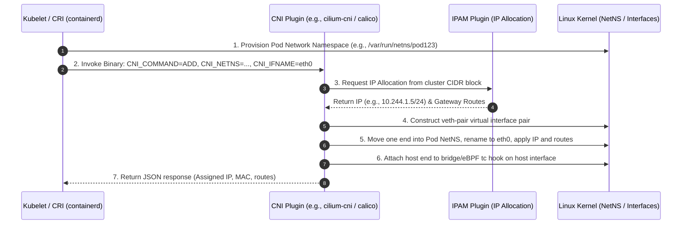
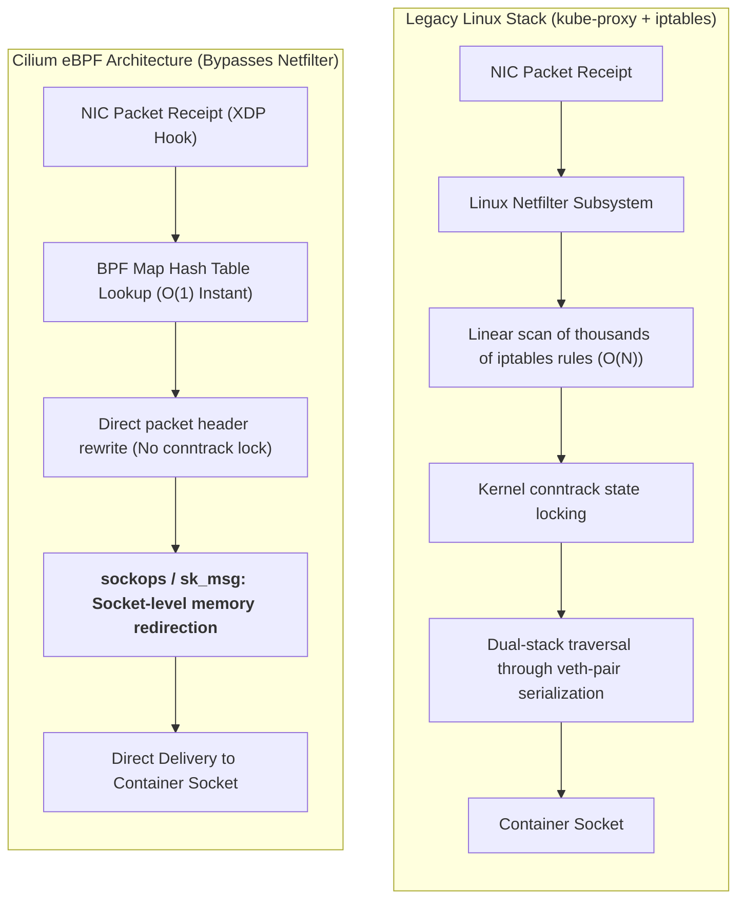
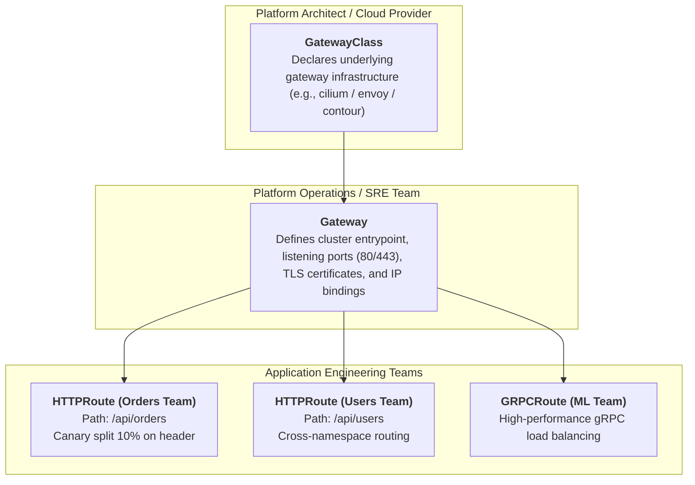

## Introduction: The Evolutionary Battle of Cloud-Native Networking

In Chapter 02, [Container Networking Deep Dive: veth-pair, Linux Bridge, iptables NAT, and Cross-Host Topologies](/en/articles/container-networking-veth-bridge-iptables/), we unraveled how single-host Docker creates local container subnets using Linux Bridges, veth-pairs, and iptables NAT.

However, when infrastructure expands into large-scale Kubernetes clusters running tens of thousands of microservice Pods across thousands of physical servers, traditional single-host NAT networking collapses:
- If every container exposes ports via host-port mapping, host port collisions rapidly saturate the cluster;
- If inter-pod cross-node traffic constantly undergoes Network Address Translation (NAT), bi-directional packet tracing, network security policies, and distributed observability devolve into opaque troubleshooting nightmares.

To address this challenge, Kubernetes established a set of radical yet elegant **fundamental networking axioms**, giving birth to the **CNI (Container Network Interface)** ecosystem and the modern **eBPF networking revolution**.



As the fifth chapter of **From Docker to Kubernetes: Cloud-Native Container & Cluster Orchestration Handbook**, this guide deconstructs the four Kubernetes networking axioms, the CNI execution lifecycle, Calico BGP routing, Cilium eBPF kernel innovations, and the modern **Gateway API**.

---

## 1. The Four Kubernetes Networking Axioms

Kubernetes enforces strict network contracts across all certified implementations:

1. **IP-per-Pod (Unique Cluster-Wide Addressability)**:
   Every Pod receives a dedicated, routable IP address within the cluster network. All containers inside a single Pod share the same network namespace and communicate over `localhost`.
2. **NAT-Free Pod-to-Pod Communication**:
   All Pods can communicate with all other Pods across nodes without Network Address Translation (NAT). Source and destination IP addresses remain immutable throughout the entire transit path.
3. **NAT-Free Node-to-Pod Communication**:
   Agents executing on a node (such as the Kubelet or system monitoring daemons) communicate with all Pods on that node directly without NAT.
4. **NAT-Free HostNetwork Communication**:
   Pods operating in the host network space (`hostNetwork: true`) communicate with all other Pods without address translation.

```
Classic Kubernetes Flat Layer-3 Network Perspective:
Node A (192.168.1.10)              Node B (192.168.1.20)
┌──────────────────────┐          ┌──────────────────────┐
│ Pod 1 (10.244.1.5)   │          │ Pod 3 (10.244.2.8)   │
│ Pod 2 (10.244.1.6)   │          │ Pod 4 (10.244.2.9)   │
└──────────┬───────────┘          └──────────┬───────────┘
           │                                 │
           └──────── Direct Route without NAT ───────┘
        (Src: 10.244.1.5  ──►  Dst: 10.244.2.8)
```

These axioms establish a flat, clean **Layer 3 network**, eliminating port exhaustion and the unpredictable latency introduced by cascading NAT tables.

---

## 2. The CNI Plugin Specification: Container Sandbox Assembly

Kubernetes does not bundle an embedded network implementation. Instead, it delegates networking to pluggable binary drivers adhering to the **CNI (Container Network Interface)** specification.

When Kubelet prepares a newly scheduled Pod on a node, it first instructs the Container Runtime Interface (CRI, such as containerd) to construct an isolated network namespace sandbox. Kubelet then invokes the configured CNI binary, passing environment variables and JSON configurations via standard input:



The CNI specification defines four core verbs:
- **`ADD`**: Configures network interfaces, assigns an IP address, establishes default routes, and connects the container to the cluster network;
- **`DEL`**: Tears down network interfaces, reclaims IP addresses, and flushes host routing entries;
- **`CHECK`**: Verifies that existing networking configurations match runtime expectations;
- **`VERSION`**: Outputs supported CNI specification versions.

---

## 3. Underlay vs. Overlay: Fundamental Architecture Trade-Offs

When selecting a CNI provider, platform architects must choose between two networking approaches: **Overlay (Tunneling)** and **Underlay (Direct Routing)**.

```
Overlay (VXLAN) Encapsulation:
[Outer Eth][Outer IP][UDP 4789][VXLAN 8B][Inner Pod IP Packet] -> MTU reduced by 50 Bytes

Underlay (Calico BGP) Direct Packet:
[Physical Eth Header][Original Pod IP Packet (Src: 10.244.1.5, Dst: 10.244.2.8)] -> Pure line rate
```

### 3.1 Overlay Networks (e.g., Flannel VXLAN, Cilium Geneve)
- **Mechanics**: Regardless of underlying physical network complexity, as long as host nodes exchange UDP datagrams, Pod packets are encapsulated inside outer UDP frames, projecting a virtual Layer 2 overlay atop physical infrastructure;
- **Strengths**: **Maximum Portability**. Works out-of-the-box across any public cloud provider, hybrid virtualization platform, or complex multi-VPC environment without physical switch dependencies;
- **Trade-offs**: Adds a 50-byte header overhead per packet, requiring host MTUs to drop to `1450` (or `8950` with Jumbo Frames) to prevent packet fragmentation. CPU cycles are consumed by constant encapsulation and decapsulation, causing a 5%–15% throughput penalty under intense workloads.

### 3.2 Underlay / BGP Direct Routing (e.g., Calico BGP)
- **Mechanics**: Treats every host node as an autonomous **BGP Router**. Using internal routing daemons (such as BIRD / Felix), nodes peer with physical Top-of-Rack (ToR) switches using the Border Gateway Protocol (BGP), advertising node-local Pod CIDR blocks directly into physical routing tables;
- **Strengths**: **Pure Hardware Wire-Speed**. Zero packet encapsulation overhead, zero MTU penalties, and identical latency to bare-metal host communication;
- **Trade-offs**: Requires administrative control over data center network hardware and switch BGP configurations. Large clusters spanning thousands of nodes can overwhelm hardware routing table memory (TCAM) on older physical switches.

---

## 4. Service Load Balancing: From iptables to Cilium eBPF

Kubernetes `Service` resources represent virtual IP (ClusterIP) abstractions backed by dynamic Pod endpoints maintained via `EndpointSlice` resources. Historically, `kube-proxy` handled traffic translation and load balancing.

### 4.1 The Limits of kube-proxy iptables Mode
1. **Userspace Mode (Deprecated)**: Incurred heavy context switching between kernel space and user space;
2. **iptables Mode (Long-Standing Default)**:
   - Configures linear chains of iptables rules for every Service and Pod;
   - **Performance Wall**: iptables is a linear array evaluated sequentially with $O(N)$ time complexity. In clusters with 5,000+ Services and tens of thousands of Pods, iptables chains swell past hundreds of thousands of entries;
   - Any single Pod reschedule triggers a global kernel table lock, inducing severe CPU thrashing and latency spikes.

### 4.2 The eBPF Revolution: How Cilium Transformed the Network Stack

**Cilium** bypassed the iptables paradigm by utilizing the Linux kernel's **eBPF (Extended Berkeley Packet Filter)** subsystem, dynamically attaching sandboxed bytecode directly to kernel network hooks:



#### Cilium eBPF Innovations:
1. **$O(1)$ Hash Table Lookups**: Maintains service routing tables inside BPF Maps. Whether a cluster hosts 10 or 100,000 Services, route resolution takes constant time;
2. **Total Removal of kube-proxy & iptables**: With `kube-proxy-replacement=strict`, host nodes run without kube-proxy, leaving iptables tables clean and performant;
3. **`sockops` Socket-Level Short-Circuiting**: When two Pods residing on the same host communicate over TCP, Cilium intercepts socket calls via `sockops` and copies payloads directly between socket queues in kernel memory, **bypassing the veth-pair, device drivers, and the entire TCP/IP network stack**, boosting performance by up to 300%!

---

## 5. North-South Ingress Modernization: The Gateway API

While CNI and eBPF handle East-West (Pod-to-Pod) communication, North-South (external traffic entering the cluster) has also undergone structural modernization.

Historically, Kubernetes leveraged the **Ingress** resource. However, Ingress suffered from design limitations:
- **Limited Spec & Annotation Sprawl**: Lacked native primitives for header matching, path rewrites, canary splits, and traffic mirroring, forcing vendors to rely on brittle, non-portable `annotations`;
- **Monolithic Permissions**: Infrastructure operators, security administrators, and application developers were forced to edit the same YAML manifest.

### 5.1 Role-Oriented Separation in the Gateway API
The **Gateway API** resolves these challenges by decomposing routing into three decoupled, role-aligned tiers:



1. **`GatewayClass` (Infrastructure Tier)**: Defines the gateway implementation type (e.g., AWS ALB, Envoy, or Cilium);
2. **`Gateway` (Platform Operations Tier)**: Declares physical traffic entry points, configuring listening ports, cluster-wide TLS certificates, and namespace boundary policies;
3. **`HTTPRoute` / `GRPCRoute` / `TCPRoute` (Application Tier)**: Developers configure routing rules, canary percentages (e.g., 90% v1, 10% v2), and retries within their own namespaces, independent of platform operations.

---

## 6. Summary and Transition

The evolution of Kubernetes networking reflects a sustained effort to push cloud software closer to the Linux kernel:
- **The Four Axioms** ensure a transparent, non-NAT foundation;
- **The CNI Standard** decouples infrastructure, enabling diverse Overlay and Underlay solutions;
- **Cilium eBPF** frees cloud environments from legacy iptables constraints, transforming packet handling into programmable kernel operations;
- **The Gateway API** establishes clean role separation for enterprise traffic ingress.

With compute and networking configured, we arrive at the next major production hurdle: **State**.

How can stateful databases (MySQL, PostgreSQL, Redis) operate reliably in Kubernetes? How does dynamic storage provisioning work through PersistentVolumeClaims and StorageClasses? How does the Container Storage Interface (CSI) drive disk attachment and formatting? And how does StatefulSet ensure topological stability across restarts?

In our next chapter, **[Kubernetes Storage Architecture: CSI Specification, Dynamic PV/PVC Provisioning, and StatefulSet Guarantees](/en/articles/k8s-storage-csi-statefulset-deep-dive/)**, we explore stateful workloads in Kubernetes!

---

## Frequently Asked Questions (FAQ)

### Q1: Why do large packets (such as TLS handshakes or bulk uploads) experience intermittent timeouts or silent drops on VXLAN Overlay networks?
**Root Cause: MTU (Maximum Transmission Unit) Misconfiguration**.
Standard Ethernet physical interfaces operate with a 1500-byte MTU. VXLAN encapsulation adds an outer IP header (20B), outer UDP header (8B), VXLAN header (8B), and inner Ethernet header (14B), creating a **50-byte encapsulation penalty**.
If the Pod's virtual interface (`eth0`) remains at the default MTU of 1500 bytes and the application transmits a 1500-byte frame with the `DF` (Don't Fragment) flag set, the encapsulated packet grows to 1550 bytes. Physical switches drop the oversized frame, causing silent packet loss.
**Remedy**:
Configure the CNI plugin (Flannel or Cilium) to automatically set container MTU to `1450` (Physical MTU minus 50), and verify that TCP MSS Clamping is active in the host kernel.

### Q2: How does Cilium handle NodePort traffic without running kube-proxy or iptables?
Cilium utilizes **eBPF XDP (eXpress Data Path) and tc (Traffic Control) hooks**:
1. When ingress traffic hits a host `NodePort` (e.g., port `30080`), the attached **XDP eBPF program** captures the frame at the network card driver level before allocating a `sk_buff` buffer;
2. Cilium performs an $O(1)$ lookup in its in-kernel BPF Map to locate healthy backend Pod endpoints;
3. If the destination Pod runs locally, eBPF rewrites the destination IP and redirects it via `sockops`. If the Pod resides on a remote node, Cilium forwards it using Direct Server Return (DSR) or SNAT, **completely bypassing the Linux netfilter connection tracker and iptables tables**.

### Q3: When should engineering teams transition from classic Ingress to the Gateway API?
Organizations should consider migrating when encountering these operational requirements:
1. **Cross-Team Role Friction**: Application teams require autonomy over routing paths, URL rewrites, and canary splits, while SRE teams need centralized governance over TLS certificates and port configurations;
2. **Advanced Traffic Routing**: The architecture demands cross-namespace routing, gRPC-specific load balancing, or header-based canary releases without custom scripting;
3. **Vendor Lock-in Concerns**: Teams want to avoid non-portable vendor `annotations` across ingress controllers (such as Nginx and Envoy), preferring a standardized, portable Kubernetes API.
