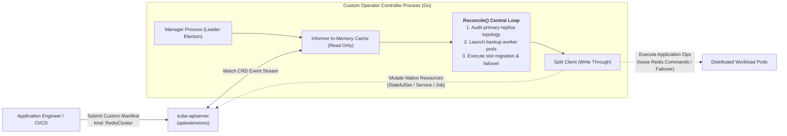
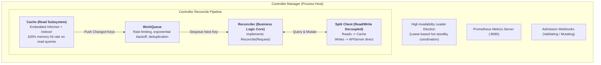

## Introduction: From Infrastructure Orchestration to "Operations as Code"

In earlier chapters, we examined how Kubernetes leverages declarative APIs and native controllers (Deployments, StatefulSets) to manage general-purpose workloads.

However, in demanding enterprise production environments, operational requirements for mission-critical software far exceed spinning up pods and attaching volumes:
- Operating an enterprise **MySQL primary-replica cluster** requires initializing replication streams, dynamically executing automated failover, verifying GTID consistency, and orchestrating non-disruptive physical backups;
- Deploying a distributed **Kafka / ZooKeeper** ensemble requires coordinating Controller quorum elections, rebalancing partition replicas, and executing online cluster expansions;
- Managing a massive **Prometheus** observability platform requires dynamically synthesizing and hot-reloading hundreds of scrape configurations across shifting microservices.

Generic controllers are blind to application-internal state. Historically, engineering teams resorted to fragile bash/python glue scripts or manual operator intervention during midnight on-call alerts.

In 2016, the CoreOS engineering team introduced a transformative paradigm: **The Operator Pattern**:

$$\text{Operator} = \text{Custom Resource Definition (CRD)} + \text{Custom Controller}$$

**Its core philosophy: Codify the hard-won operational heuristics, runbooks, and failure recovery trees of expert SREs directly into autonomous Go software running within the Kubernetes control plane!**



As the seventh chapter of **From Docker to Kubernetes: Cloud-Native Container & Cluster Orchestration Handbook**, this guide explores the pinnacle of Kubernetes extensibility: Custom Resource Definitions (CRDs), Controller-Runtime internals, KubeBuilder scaffolding, and production Go implementations for automated middleware management.

---

## 1. CRD Internals: Teaching Kubernetes Your Custom Domain Model

By default, Kubernetes recognizes only built-in core resource types: `Pods`, `Services`, and `Deployments`. **Custom Resource Definitions (CRDs)** empower platform engineers to register custom data models dynamically **without altering a single line of core Kubernetes code or recompiling kube-apiserver**!

### 1.1 Dynamic Registration via apiextensions-apiserver
When a cluster administrator submits a CRD manifest, the internal `apiextensions-apiserver` intercepts the request and registers new REST endpoints:
```
/apis/<group>/<version>/namespaces/<namespace>/<plural>
Example:
/apis/database.example.com/v1alpha1/namespaces/default/redisclusters
```

From that point forward, developers interact with this custom type identically to native Kubernetes resources using `kubectl get rediscluster` and `kubectl apply -f my-cluster.yaml`.

### 1.2 Four Pillars of Production CRD Design

Production-grade CRDs must incorporate four structural patterns:

1. **OpenAPI v3 Structural Schema Validation**:
   Enforces strict property typing, default value injections, and regex constraints. Malformed manifests are rejected at the apiserver admission boundary.
2. **Status Subresource Isolation (`/status`)**:
   ```yaml
   subresources:
     status: {}
   ```
   Physically isolates user-declared `spec` modifications from controller-reported `status` telemetry. Developers can modify the `spec`, while only the Operator daemon holds RBAC privileges to update `/status`, preventing unauthorized status tampering.
3. **Autoscaling Integration (`/scale`)**:
   Declares field JSON paths for replica counts (`.spec.replicas` and `.status.readyReplicas`). This allows native **Horizontal Pod Autoscalers (HPA)** to scale custom resources automatically based on metrics!
4. **API Versioning & Conversion Webhooks**:
   Supports schema migrations (`v1alpha1` $\to$ `v1beta1` $\to$ `v1`) using conversion webhooks that translate differing schema formats in-memory.

---

## 2. KubeBuilder & Controller-Runtime Architecture

Production operators are rarely written from raw HTTP clients. The industry standard utilizes the official **Controller-Runtime** Go library and the **KubeBuilder** scaffolding toolkit.

The architecture comprises four collaborating components:



### Component Breakdown:
1. **Manager**:
   The lifecycle anchor of the Operator process. It handles controller initializations, coordinates high-availability **Leader Election** using Kubernetes `Leases` (ensuring only one active writer operates across multiple replicas), exposes Prometheus metrics, and manages webhook certificates.
2. **Split Client**:
   A high-throughput client architecture. All read operations (`client.Get()`, `client.List()`) **hit the local in-memory Informer cache**, shielding `kube-apiserver` from load; all mutating write operations (`client.Create()`, `client.Update()`, `client.Delete()`) **write directly through to the apiserver**.
3. **Reconciler**:
   The domain-logic engine. It enforces an **idempotent contract**, consuming a `reconcile.Request{NamespacedName}` and returning a `reconcile.Result` and `error`.

---

## 3. Implementation: High-Availability RedisCluster Operator

The following production Go implementation demonstrates reconcile workflows, status management, and finalizer cleanup routines.

### 3.1 CRD Go Type Declarations

```go
package v1alpha1

import (
    metav1 "k8s.io/apimachinery/pkg/apis/meta/v1"
)

// RedisClusterSpec defines the desired state of the cluster
type RedisClusterSpec struct {
    // Desired number of Redis replicas
    Replicas int32 `json:"replicas"`
    // Container image repository and tag
    Image string `json:"image"`
    // Toggle for automated primary failover
    EnableAutoFailover bool `json:"enableAutoFailover,omitempty"`
}

// RedisClusterStatus defines the observed runtime telemetry
type RedisClusterStatus struct {
    // Current count of ready Pod replicas
    ReadyReplicas int32 `json:"readyReplicas"`
    // Pod name of the active primary Redis node
    CurrentMaster string `json:"currentMaster,omitempty"`
    // Operational phase: Initializing, Running, Degraded
    Phase string `json:"phase"`
}

// +kubebuilder:object:root=true
// +kubebuilder:subresource:status
// +kubebuilder:subresource:scale:specpath=.spec.replicas,statuspath=.status.readyReplicas
// +kubebuilder:printcolumn:name="Replicas",type="integer",JSONPath=".spec.replicas"
// +kubebuilder:printcolumn:name="Ready",type="integer",JSONPath=".status.readyReplicas"
// +kubebuilder:printcolumn:name="Phase",type="string",JSONPath=".status.phase"

// RedisCluster is the Schema for the redisclusters API
type RedisCluster struct {
    metav1.TypeMeta   `json:",inline"`
    metav1.ObjectMeta `json:"metadata,omitempty"`

    Spec   RedisClusterSpec   `json:"spec,omitempty"`
    Status RedisClusterStatus `json:"status,omitempty"`
}
```

### 3.2 Production Reconcile Loop & Finalizer Cleanups

When an operator issues `kubectl delete rediscluster my-redis`, external cloud resources (such as cloud load balancers or un-flushed persistent snapshots) risk becoming orphaned if the operator does not intervene. **Finalizers** provide the necessary deletion locks:

```go
package controllers

import (
    "context"
    "fmt"
    "time"

    corev1 "k8s.io/api/core/v1"
    "k8s.io/apimachinery/pkg/api/errors"
    ctrl "sigs.k8s.io/controller-runtime"
    "sigs.k8s.io/controller-runtime/pkg/client"
    "sigs.k8s.io/controller-runtime/pkg/controller/controllerutil"
    "sigs.k8s.io/controller-runtime/pkg/log"

    dbv1alpha1 "example.com/api/v1alpha1"
)

const redisFinalizer = "database.example.com/finalizer"

type RedisClusterReconciler struct {
    client.Client
}

func (r *RedisClusterReconciler) Reconcile(ctx context.Context, req ctrl.Request) (ctrl.Result, error) {
    logger := log.FromContext(ctx)

    // 1. Fetch the RedisCluster instance from the local in-memory Cache
    var cluster dbv1alpha1.RedisCluster
    if err := r.Get(ctx, req.NamespacedName, &cluster); err != nil {
        if errors.IsNotFound(err) {
            // Resource deleted; reconciliation complete
            return ctrl.Result{}, nil
        }
        return ctrl.Result{}, err
    }

    // 2. Check if the resource is undergoing deletion (DeletionTimestamp set)
    if !cluster.ObjectMeta.DeletionTimestamp.IsZero() {
        if controllerutil.ContainsFinalizer(&cluster, redisFinalizer) {
            // Execute domain-specific cleanup (e.g., flush RDB snapshot to S3, dereference external DNS)
            logger.Info("Executing safe cleanup before resource deletion", "cluster", cluster.Name)
            if err := r.finalizeExternalResources(ctx, &cluster); err != nil {
                return ctrl.Result{}, err
            }

            // Cleanup completed; remove finalizer to unblock physical etcd removal
            controllerutil.RemoveFinalizer(&cluster, redisFinalizer)
            if err := r.Update(ctx, &cluster); err != nil {
                return ctrl.Result{}, err
            }
        }
        return ctrl.Result{}, nil
    }

    // 3. Resource is active: ensure finalizer lock is registered
    if !controllerutil.ContainsFinalizer(&cluster, redisFinalizer) {
        controllerutil.AddFinalizer(&cluster, redisFinalizer)
        if err := r.Update(ctx, &cluster); err != nil {
            return ctrl.Result{}, err
        }
    }

    // 4. Reconcile underlying infrastructure (StatefulSet and Service primitives)
    if err := r.reconcileStatefulSet(ctx, &cluster); err != nil {
        return ctrl.Result{}, err
    }

    // 5. Execute domain operations (Audit node health, trigger failover if master failed)
    readyReplicas, currentMaster, err := r.auditRedisNodes(ctx, &cluster)
    if err != nil {
        logger.Error(err, "Failed to audit Redis cluster nodes")
        return ctrl.Result{RequeueAfter: 5 * time.Second}, nil
    }

    // 6. Update Status subresource using optimistic locking
    cluster.Status.ReadyReplicas = readyReplicas
    cluster.Status.CurrentMaster = currentMaster
    cluster.Status.Phase = "Running"
    if err := r.Status().Update(ctx, &cluster); err != nil {
        return ctrl.Result{}, err
    }

    // 7. Schedule recurring sync to guarantee continuous convergence
    return ctrl.Result{RequeueAfter: 30 * time.Second}, nil
}
```

---

## 4. Production Operator Anti-Patterns & Best Practices

Avoid these architectural pitfalls when building production-grade operators:

### 1. Mandatory Rule: Strict Idempotence in Reconcile Loops
- **Anti-Pattern**: Dispatching transactional notifications (such as firing an alert email or billing an external credit API) on every reconcile pass;
- **Core Principle**: A reconcile call for a single key can trigger dozens of times per second due to watch stream events. **Executing the function once or 10,000 times must leave the system in the identical converged steady state!**

### 2. Avoid Synchronous Blocking in Reconcile Logic
- **Anti-Pattern**: Running a 5-minute database backup or awaiting pod initialization synchronously within the reconcile loop;
- **Core Principle**: Worker goroutines in Controller-Runtime are finite (default concurrency is typically 1–10). Long-running operations must be delegated asynchronously to Kubernetes `Jobs`. The Reconcile function must exit within milliseconds.

### 3. Establish Cascading Deletion via OwnerReferences
- Every underlying child resource created by an Operator (StatefulSet, Service, Secret) must establish parental linkage using `controllerutil.SetControllerReference(&cluster, childObj, r.Scheme)`;
- When the parent custom resource is deleted, the Kubernetes Garbage Collector cascades cleanup across all associated child objects automatically.

---

## 5. Summary and Transition

The Operator pattern solidified Kubernetes as an extensible distributed runtime:
- It transforms tribal SRE operational knowledge into tested, versioned software;
- **CRDs** expand the control plane's domain vocabulary;
- **KubeBuilder & Controller-Runtime** supply production-tested frameworks for enterprise reliability.

As large language models (LLMs) and generative AI accelerate infrastructure demand, the Operator pattern faces its most intensive test yet.

In modern AI clusters hosting thousands of NVIDIA GPUs connected over high-speed InfiniBand/RoCE fabrics:
- How does the **NVIDIA GPU Operator** automate driver lifecycle management, Container Toolkits, and MIG partitioning?
- How do Dynamic Resource Allocation (DRA) and the Topology Manager prevent cross-NUMA interconnect bottlenecks?
- How do distributed LLM serving engines (**vLLM**, **SGLang**) orchestrate Prefix/Decode disaggregation and scale dynamically based on real-time KV cache pressure?

In our series finale, **[2026 AI Computing Infrastructure: Kubernetes GPU Operator, MIG Partitioning, Topology-Aware Scheduling, and Auto-scaling Inference Engines](/en/articles/k8s-gpu-operator-ai-inference-scheduling/)**, we examine cloud-native infrastructure at the AI frontier!

---

## Frequently Asked Questions (FAQ)

### Q1: What is the fundamental difference between a Helm Chart and an Operator? Can an Operator replace Helm?
**Core Distinction**:
- **Helm is a Packaging and Templating Manager**: Its lifecycle is transactional—it renders parameter values into static YAML manifests and submits them via `helm install` or `helm upgrade`. Once applied, Helm is blind to runtime application anomalies (such as MySQL replication lag or Redis slot imbalances);
- **An Operator is an Autonomous Controller (Day-2 Operations)**: It runs continuously, observing application-internal telemetry 24/7 to execute automated failovers, online slot migrations, and rolling backups;
- **Synergy**: They are complementary rather than mutually exclusive. Helm charts are widely used to package and distribute Operators themselves!

### Q2: Why do custom resources occasionally become stuck indefinitely in Terminating, and how do we resolve it?
**Root Cause: Deadlocked Finalizers**.
When a custom resource's `metadata.finalizers` slice contains registered strings, Kubernetes sets `deletionTimestamp` and defers physical deletion until controllers complete cleanup.
If the Operator process crashes, is uninstalled prematurely, or fails to contact external services, the finalizer is never removed.
**Resolution**:
1. Inspect Operator container logs to resolve underlying cleanup errors;
2. If the resource is obsolete and external assets have been safely cleaned, remove the finalizer manually:
   `kubectl patch rediscluster my-redis -p '{"metadata":{"finalizers":[]}}' --type=merge`. The object will delete immediately.

### Q3: Why does Controller-Runtime mandate updating status fields via `r.Status().Update()` instead of generic `r.Update()`?
**Key Reasons**:
1. **Minimizes 409 Conflict Errors**: Generic `r.Update()` commits both `spec` and metadata fields. If a user modifies the spec concurrently, the controller hits an optimistic locking conflict. Calling `r.Status().Update()` targets only status subresource paths, drastically reducing collision probability;
2. **Enforces RBAC Least-Privilege Separation**: Platform configurations typically permit application engineers to alter `spec` while forbidding `/status` modifications. Decoupling these updates in controller code preserves clean security boundaries.
