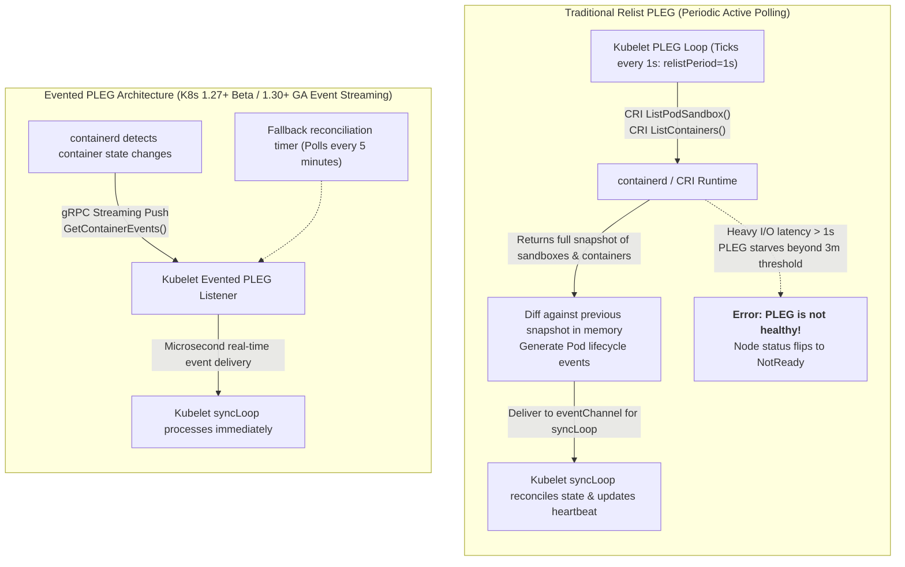
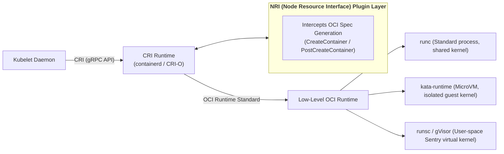
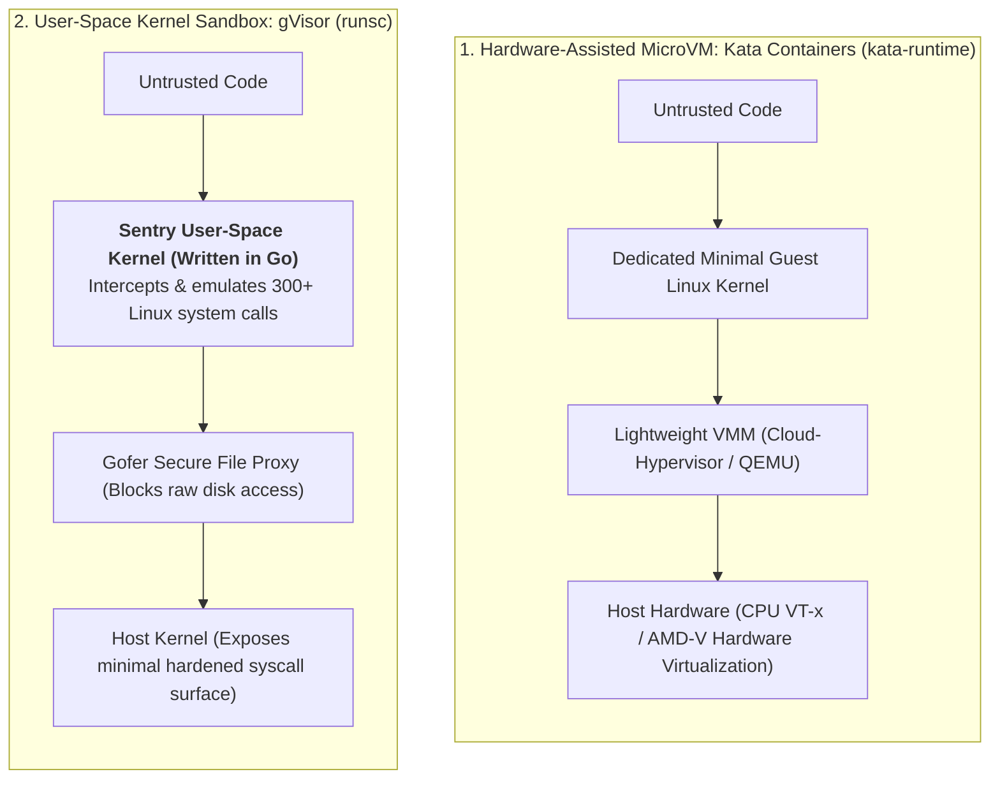

## Introduction: Breaking runc's "Shared-Kernel Original Sin" and Node Freeze Flaws

In Chapter 01, [Docker Kernel First Principles](/en/articles/docker-internals-namespace-cgroups-overlayfs/), we established a foundational physical truth: **A container is merely a standard host process constrained by Linux Namespaces and throttled by cgroups, sharing the identical underlying Linux operating system kernel with thousands of other host processes**.

While this "lightweight sharing" delivers microsecond startups and near-zero overhead, in enterprise multi-tenant and hyperscale production environments, it introduces two catastrophic architectural vulnerabilities:

1. **Unacceptable Zero-Day Escape Vulnerabilities (Multi-Tenant Isolation)**:
   When clusters run untrusted third-party code (such as SaaS Serverless function platforms or AI Agent code execution sandboxes), any kernel privilege escalation or escape exploit (e.g., Dirty COW, CVE-2024-21626) allows malicious code to pierce namespace boundaries, hijacking the physical host and compromising the entire Kubernetes control plane.
2. **Kubelet PLEG Periodic Polling Causing Node Flapping Outages**:
   On dense nodes running 100+ Pods, or during intensive image pulling and I/O congestion, Kubelet frequently triggers the dreaded alert: `PLEG is not healthy: pleg was last seen active 3m5s ago; threshold is 3m0s`. The node flips to `NotReady`, causing the control plane to initiate cascading pod evictions.
3. **Crude Sysctl Bottlenecks and Brutal OOMKills**:
   High-concurrency services must elevate TCP listen backlogs (`somaxconn`) to 4096, while standard Linux memory limits (`memory.max`) ruthlessly terminate processes on traffic spikes, lacking smooth throttling buffers.

To permanently conquer these industrial challenges, platform engineers must descend into the worker node substrate to **re-architect Kubelet internals and container runtimes (CRI & OCI)**.

As the tenth chapter of **From Docker to Kubernetes: Cloud-Native Container & Cluster Orchestration Handbook**, this guide explores worker node customization: **overcoming PLEG bottlenecks with Evented PLEG**, **developing NRI plugins in Go**, **evaluating Kata Containers vs gVisor sandboxes**, and **tuning cgroups v2 and Linux Sysctls**.

---

## 1. Overcoming Node Freezes: Kubelet PLEG Bottlenecks and Evented PLEG

On any Kubernetes worker node, the core heartbeat of `kubelet` is an event control loop named **`syncLoop`**, driven continuously by the **Pod Lifecycle Event Generator (PLEG)**.



### 1.1 The Achilles' Heel of Relist-Based PLEG
Traditional PLEG relies on **exhaustive snapshot diffing (Relist)**:
- Every second, PLEG calls CRI's `ListPodSandbox` and `ListContainers` to capture the state of every container on the host;
- It diffs the current state against the previous snapshot. If any container status has changed, it generates an internal lifecycle event for `eventChannel`;
- **The Cascading Freeze Trap**: When a node hosts over 100 Pods, or when heavy disk I/O drives containerd processes into uninterruptible D-state sleeps, CRI gRPC calls balloon from 10ms to several seconds. If a relist cannot complete within 3 minutes, Kubelet declares PLEG broken, marks the node `NotReady`, and triggers cluster-wide evictions!

### 1.2 The Production Solution: Evented PLEG (Event Streaming)
To eliminate polling overhead, Kubernetes and containerd introduced **Evented PLEG** (KEP-3386):
1. **Streaming gRPC Connection**: At startup, Kubelet opens a persistent streaming gRPC subscription to containerd via `runtimeService.GetContainerEvents()`;
2. **Push-Based Notifications**: As containers start, stop, or pause, containerd pushes lifecycle events directly into the stream in **microseconds**, bypassing the need to rescan the container inventory every second;
3. **Extended Fallback Intervals**: To guard against rare missed events, the periodic relist interval is lengthened from 1 second to **5 minutes (300 seconds)**;
4. **Production Benefit**: Kubelet CPU utilization **drops by up to 80%**, and spurious `PLEG is not healthy` node flaps are eliminated!

---

## 2. Runtime Layers and NRI: Injecting Hardware Intent at Container Creation

Customizing container runtimes requires understanding the invocation hierarchy of modern Kubernetes nodes:



### 2.1 What is NRI (Node Resource Interface)?
Historically, dynamically mutating container cgroup configs, injecting hardware mounts, or pinning processes to specific CPU sockets required maintaining bespoke containerd source code forks.
**NRI** is the open industry-standard plugin specification jointly developed by containerd and CRI-O (analogous to CNI for networking and CSI for storage):
- Plugins operate as standalone, decoupled external processes;
- Within the **sub-millisecond lifecycle window** when containerd prepares OCI specifications, NRI plugins intercept and mutate the spec (e.g., adjusting `resources.cpu.cpus`, injecting environment flags, altering mount paths) before calling the OCI runtime!

### 2.2 Implementing an NRI CPU Pinning Plugin in Go

```go
package main

import (
    "context"
    "fmt"
    "log"

    "github.com/containerd/nri/pkg/api"
    "github.com/containerd/nri/pkg/stub"
)

type CPUPinningPlugin struct {
    stub stub.Stub
}

// CreateContainer intercepts containers prior to instantiation: directly alters OCI Spec!
func (p *CPUPinningPlugin) CreateContainer(ctx context.Context, pod *api.PodSandbox, container *api.Container) (*api.ContainerAdjustment, []*api.ContainerUpdate, error) {
    // Check if the Pod requests high-priority dedicated cores
    pinCore, exists := pod.Annotations["highperf.example.com/pin-core"]
    if !exists {
        return nil, nil, nil // Standard Pod: pass through untouched
    }

    log.Printf("Intercepted container: %s in Pod: %s. Pinning to core: %s", container.Name, pod.Name, pinCore)

    // Build the dynamic OCI adjustment object
    adjust := &api.ContainerAdjustment{}

    // 1. Force container cpuset binding to eliminate cross-NUMA migration jitter
    adjust.SetLinuxCPUSetCPUs(pinCore)

    // 2. Inject environment flags exposing host topology tier
    adjust.AddEnv("ISOLATION_TIER", "HARDWARE_PINNED")

    // 3. Return adjustment: containerd merges it atomically into the OCI runtime payload
    return adjust, nil, nil
}

func main() {
    plugin := &CPUPinningPlugin{}
    // Connect to containerd NRI UNIX Domain Socket (/var/run/nri/nri.sock)
    stub, err := stub.New(plugin, stub.WithPluginName("cpu-pinner"))
    if err != nil {
        log.Fatalf("Failed to initialize NRI stub: %v", err)
    }
    plugin.stub = stub

    log.Println("NRI CPU-Pinner Plugin running successfully...")
    if err := stub.Run(context.Background()); err != nil {
        log.Fatalf("NRI Plugin exited with error: %v", err)
    }
}
```

Through NRI, platform engineers enforce microsecond hardware governance without modifying core Kubernetes binaries!

---

## 3. Multi-Runtime Security Sandboxes: Kata Containers vs gVisor

When running untrusted multi-tenant code, software-based runc namespaces must be replaced with **strongly isolated sandboxed runtimes**. The two industry standards are **Kata Containers** and **gVisor**:



### Comprehensive Technical Comparison:

| Dimension | Kata Containers | gVisor (runsc) |
| :--- | :--- | :--- |
| **Isolation Mechanism** | **Hardware-Assisted Virtualization (MicroVM)** | **User-space Syscall Interception & Emulation** |
| **Kernel Exclusivity** | Each Pod owns an independent, minimal Guest Linux Kernel | Containers execute against the Go-based Sentry virtual kernel in user space |
| **Syscall Overhead** | **Native hardware execution; zero syscall interception penalty** | Syscalls trapped via ptrace/KVM; **10%~30% overhead on syscall-heavy workloads** |
| **Memory Floor** | Higher (~30~50MB memory overhead per Pod for MicroVM) | **Extremely Low** (~15MB memory overhead per Pod) |
| **Cold Boot Latency** | ~200 to 500 ms | **Near Instantaneous** (50 to 100 ms) |
| **Target Workloads** | Compute-heavy AI model execution, Enterprise hard multi-tenancy | Short-lived Serverless functions, high-density untrusted scripts |

### 3.1 Managing Multi-Runtime via RuntimeClass
Kubernetes natively supports running runc, Kata, and gVisor concurrently on the same cluster via **`RuntimeClass`**:

```yaml
apiVersion: node.k8s.io/v1
kind: RuntimeClass
metadata:
  name: kata-sandbox
handler: kata               # Maps to containerd runtime_type: io.containerd.kata.v2
overhead:
  podFixed:
    memory: "64Mi"          # Declares MicroVM overhead for accurate scheduler accounting
    cpu: "250m"
---
apiVersion: node.k8s.io/v1
kind: RuntimeClass
metadata:
  name: gvisor-sandbox
handler: runsc              # Maps to containerd io.containerd.runsc.v1
```

Workloads selectively declare runtime sandboxing in their Pod specs:
```yaml
apiVersion: v1
kind: Pod
metadata:
  name: untrusted-ai-agent-runner
spec:
  runtimeClassName: kata-sandbox   # Enforces dedicated MicroVM hardware isolation
  containers:
  - name: runner
    image: python:3.12-slim
    command: ["python", "-c", "exec(user_submitted_untrusted_code)"]
```

---

## 4. Kernel Isolation & cgroups v2 Tuning: From Sysctl to PSI

### 4.1 Production Sysctl Tuning
High-concurrency reverse proxies (e.g., Ingress-Nginx) encounter connection queue saturation and dropped syn packets under high load. Tuning kernel networking parameters is mandatory.

Kubernetes divides Sysctls into two tiers:
- **Safe Sysctls**: Fully namespaced parameters with zero risk to the host or neighboring pods (e.g., `net.ipv4.ip_local_port_range`);
- **Unsafe Sysctls**: Modifications that may degrade host stability (e.g., `net.core.somaxconn`).

**Production Configuration**:
1. Whitelist parameters in `/var/lib/kubelet/config.yaml`:
   ```yaml
   allowedUnsafeSysctls:
   - "net.core.somaxconn"
   - "net.ipv4.tcp_tw_reuse"
   ```
2. Apply directly inside Pod definitions:
   ```yaml
   apiVersion: v1
   kind: Pod
   metadata:
     name: high-concurrency-gateway
   spec:
     securityContext:
       sysctls:
       - name: net.core.somaxconn
         value: "8192"           # Elevates listen backlog queue from 128 to 8192!
       - name: net.ipv4.tcp_tw_reuse
         value: "1"
     containers:
     - name: gateway
       image: nginx:alpine
   ```

### 4.2 cgroups v2 Tuning: Eliminating Abrupt OOMs with `memory.high` and PSI
In legacy cgroups v1, Kubernetes only configured `memory.limit_in_bytes`. When consumption hit the limit, the Linux kernel triggered the OOM Killer, abruptly terminating processes.

Modern clusters running **cgroups v2** provide granular stability controls:
1. **`memory.high` Proactive Throttling**:
   When memory crosses `memory.high`, the kernel **does not invoke OOMKills**. Instead, it throttles the cgroup's CPU cycles, forcing aggressive Page Cache writebacks and slowing down allocation rates. This provides a crucial time buffer for HPA autoscaling to react!
2. **`memory.oom.group = 1` Atomic Eviction**:
   For multi-process applications (e.g., PostgreSQL), killing a single child process causes database corruption. Enabling `memory.oom.group = 1` guarantees that if an OOM occurs, all processes in the cgroup terminate simultaneously, avoiding corrupted orphan states.
3. **Pressure Stall Information (PSI)**:
   By tracking `/proc/pressure/memory` and `/proc/pressure/io`, controllers inspect the exact percentage of wall-clock time stalled waiting for memory or disk I/O (`some` vs `full`), feeding actionable metrics into custom autoscalers.

---

## 5. Summary and Transition

Customizing Kubernetes worker nodes and container runtimes dissolves low-level operational bottlenecks:
- **Evented PLEG** transforms fragile polling into streaming gRPC events, eliminating spurious `PLEG is not healthy` node flapping;
- **NRI Plugins** enable microsecond-level hardware interception and OCI customization without upstream codebase patches;
- **Kata Containers and gVisor** neutralize runc's shared-kernel vulnerabilities, securing modern multi-tenant AI workloads;
- **RuntimeClass, Sysctls, and cgroups v2** deliver production-grade stability and kernel-level performance.

With worker nodes fortified, we turn our attention to the central nervous system of Kubernetes: the **Control Plane**.

- When custom resource inventories scale past millions of objects, why does etcd hit its 8GB wall?
- How do we build an **Aggregated APIServer** to bypass etcd completely and mount high-throughput distributed database backends?
- How does **API Priority and Fairness (APF)** with **Shuffle Sharding** prevent catastrophic traffic storms across 10,000+ nodes?

In Chapter 11, **[Hacking the Kubernetes Control Plane: Aggregated APIServers, APF Traffic Prioritization, and 10k-Node etcd Sharding](/en/articles/k8s-control-plane-hacking-aggregated-apiserver-apf-etcd/)**, we re-engineer the Kubernetes control plane!

---

## Frequently Asked Questions (FAQ)

### Q1: Why does traditional Relist PLEG trigger "PLEG is not healthy" errors, and how does Evented PLEG resolve it?
**Root Cause: The fragility of synchronous polling under load**.
Traditional PLEG issues `ListPodSandbox` and `ListContainers` every single second. On nodes running heavy workloads or experiencing I/O bottlenecks, these gRPC calls stall. If PLEG misses heartbeats for 3 minutes, Kubelet flags the node as `NotReady`.
**The Evented PLEG Fix**: By establishing a persistent gRPC event stream with containerd, the runtime pushes container lifecycle events immediately upon occurrence. Fallback polling is relaxed from 1 second to 5 minutes, permanently removing queuing latency and preventing false node failures.

### Q2: How should architects choose between Kata Containers and gVisor in multi-tenant environments?
**Syscall Profile and Workload Lifespan determine the choice**:
- Choose **gVisor** for short-lived, high-density serverless workloads or lightweight scripts where low memory footprint (15MB overhead) and ultra-fast cold boot (50ms) are paramount, and application syscall frequency is moderate;
- Choose **Kata Containers** for long-running, I/O-intensive, or compute-heavy AI/ML tasks. Because Kata executes syscalls against a dedicated Guest OS kernel at bare-metal hardware speeds without user-space ptrace trapping, it provides superior throughput despite a slightly higher memory footprint.

### Q3: Why is configuring `memory.high` in cgroups v2 preferred over relying strictly on `memory.max`?
`memory.max` (Kubernetes hard limit) acts as an operational cliff: the moment memory consumption crosses the boundary, the Linux kernel invokes the OOM Killer, terminating processes without warning.
`memory.high` introduces a resilient throttling buffer: crossing this threshold triggers aggressive kernel page reclamation and slows memory allocation rates by penalizing CPU schedules. This keeps the application alive under brief traffic spikes, providing autoscalers and monitoring pipelines sufficient time to shed load before fatal crashes occur.
