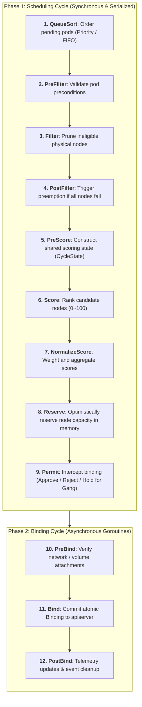
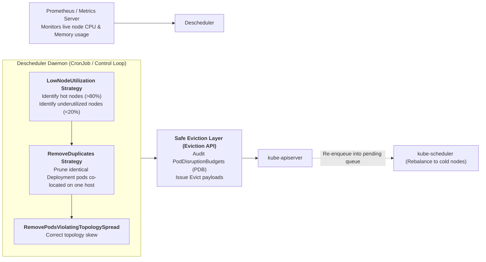

## Introduction: Why the Default Scheduler Fails AI and Batch Computing

In Chapter 04, [Kubernetes Control Plane Deep Dive](/en/articles/k8s-control-plane-declarative-reconciliation/), we analyzed the classic Filter and Score stages of `kube-scheduler`.

For standard stateless microservices, the default scheduler performs admirably. However, when clusters host **distributed AI training jobs (PyTorch Distributed), big data batch pipelines (Apache Spark / Flink), or complex co-located topologies**, fundamental architectural limitations surface:

1. **The Single-Pod Deadlock**:
   The default scheduler evaluates workloads **one individual Pod at a time**. Consider two distributed training jobs requiring 4 GPUs each:
   - The scheduler assigns 2 GPUs to Job A, then allocates the remaining 2 GPUs to Job B;
   - Neither Job A nor Job B has enough GPUs to initialize; both hold their partial allocations indefinitely, plunging the cluster into a **deadlock**!
2. **Lack of Multi-Resource Fair Share (Fairness)**:
   The default scheduler cannot compute multi-dimensional resource skew across tenants (CPU, Memory, GPU). Large monopolistic jobs starve smaller interactive jobs, or fragmented jobs saturate critical accelerator capacity.
3. **Static "Schedule-Once, Bound-Forever" Inflexibility**:
   The scheduler makes a placement decision once during Pod admission. Over weeks of runtime, memory leaks or traffic spikes transform certain nodes into hotspot bottlenecks while newly scaled nodes sit idle. The default scheduler never migrates running Pods.

To overcome these constraints, platform architects must extend the Kubernetes scheduling core.

As the ninth chapter of **From Docker to Kubernetes: Cloud-Native Container & Cluster Orchestration Handbook**, this guide explores scheduler customization: mastering the **Scheduling Framework**, dissecting **Volcano and DRF (Dominant Resource Fairness)** mathematical algorithms, building a production-grade **Gang Scheduling plugin in Go**, and operating the **Descheduler** for dynamic cluster rebalancing.

---

## 1. The Scheduling Framework: 11 Extension Points Panorama

Early Kubernetes versions supported external webhooks (Scheduler Extenders), but issuing remote HTTP JSON calls during high-frequency scheduling cycles crippled placement throughput.

To deliver performant extensibility, Kubernetes introduced the **Scheduling Framework** directly inside `kube-scheduler`. It decomposes the placement pipeline across two distinct phases and **11 Extension Points**:



### 1.1 Key Architectural Differences:
1. **Scheduling Cycle**:
   Must execute with sub-millisecond efficiency. Evaluates nodes synchronously per Pod while holding in-memory snapshot locks (`NodeSnapshot`). Running blocking I/O calls here degrades cluster scheduling throughput (Pods/s);
2. **Binding Cycle**:
   Executes asynchronously. Because mutating `kube-apiserver` incurs network latency, the framework delegates `Bind` operations to background worker goroutines, allowing the main scheduling thread to evaluate the next queued Pod immediately.

### 1.2 Cross-Extension State Sharing: CycleState
The Scheduling Framework passes a thread-safe `*framework.CycleState` container throughout the entire lifecycle of a single scheduling cycle:
- A plugin computes Pod affinity topologies in `PreFilter` and writes data via `state.Write("my-plugin-state", data)`;
- Downstream `Filter` and `Score` extensions read the precomputed data via `state.Read("my-plugin-state")` in microseconds, **eliminating redundant $O(N^2)$ cluster rescanning**.

---

## 2. Batch Computing Core: Volcano Architecture and DRF (Dominant Resource Fairness) Math

In large-scale AI compute clusters and elastic batch processing, modern platforms adopt **Volcano**, a specialized batch scheduling engine built on Kubernetes. Its foundational core is the **Dominant Resource Fairness (DRF)** algorithm and the **PodGroup CRD**.

### 2.1 DRF Mathematical Model
In multi-tenant, heterogeneous computing environments, resource demands span multiple dimensions (CPU, Memory, GPU). DRF establishes fairness by **equalizing the dominant share allocated to each tenant**:

Let total cluster capacity vector be $R = \langle R_1, R_2, \dots, R_m \rangle$ (e.g., total CPUs, total GPUs).
Let the resources allocated to tenant $i$ be $U_i = \langle U_{i,1}, U_{i,2}, \dots, U_{i,m} \rangle$.
The share of resource $j$ consumed by tenant $i$ is:
$$s_{i,j} = \frac{U_{i,j}}{R_j}$$

The **Dominant Share** of tenant $i$, denoted $s_i^*$, is the maximum share among all resource types:
$$s_i^* = \max_{j=1}^m \{ s_{i,j} \}$$

**Volcano Scheduling Policy**: In every scheduling iteration, the scheduler **always prioritizes dequeuing workloads for the tenant with the lowest dominant share $s_i^*$**!

```
DRF Scheduling Example:
Cluster Total Capacity: 100 CPUs, 100 GPUs
• Tenant A task: requires 2 CPUs + 1 GPU
  Dominant Resource: CPU (2/100 = 2% > GPU 1/100 = 1%)
• Tenant B task: requires 1 CPU + 2 GPUs
  Dominant Resource: GPU (2/100 = 2% > CPU 1/100 = 1%)

The scheduler alternates allocations between Tenant A and Tenant B:
When Tenant A and B each run 33 tasks:
- Tenant A consumes 66 CPUs + 33 GPUs (Dominant Share = 66%)
- Tenant B consumes 33 CPUs + 66 GPUs (Dominant Share = 66%)
Both dominant shares match at 66%, overall cluster utilization hits 99%, with mathematical Pareto efficiency!
```

---

## 3. Implementation: Gang Scheduling (All-or-Nothing) Plugin

Distributed AI training relies on **"All-or-Nothing"** semantics: all $N$ workers in a job must obtain host assignments simultaneously before any worker launches. If even one worker fails admission, all preliminary reservations must be rolled back.

In the Scheduling Framework, Gang Scheduling integrates naturally at the **`Permit` extension point**, combined with atomic **`Reserve / Unreserve` rollback logic**.

### 3.1 Permit & Reserve Plugin Implementation in Go

```go
package gang

import (
    "context"
    "fmt"
    "sync"
    "time"

    v1 "k8s.io/api/core/v1"
    "k8s.io/apimachinery/pkg/runtime"
    "k8s.io/kubernetes/pkg/scheduler/framework"
)

const PluginName = "CustomGangScheduling"

// GangPlugin manages lifecycle readiness for co-scheduled Pod groups
type GangPlugin struct {
    handle framework.Handle
    mu     sync.Mutex
    // Tracks pods that reached the Permit phase per gang group
    gangTable map[string]*GangGroup
}

type GangGroup struct {
    MinAvailable int
    WaitingPods  []string
}

var _ framework.PermitPlugin = &GangPlugin{}
var _ framework.ReservePlugin = &GangPlugin{}

func New(_ runtime.Object, h framework.Handle) (framework.Plugin, error) {
    return &GangPlugin{
        handle:    h,
        gangTable: make(map[string]*GangGroup),
    }, nil
}

func (gp *GangPlugin) Name() string {
    return PluginName
}

// Reserve extension point: tracks optimistic node reservation
func (gp *GangPlugin) Reserve(ctx context.Context, state *framework.CycleState, p *v1.Pod, nodeName string) *framework.Status {
    return framework.NewStatus(framework.Success)
}

// Unreserve extension point: triggers atomic group rollback on timeout or filter failure
func (gp *GangPlugin) Unreserve(ctx context.Context, state *framework.CycleState, p *v1.Pod, nodeName string) {
    gangName, exists := p.Labels["gang.example.com/name"]
    if !exists {
        return
    }

    gp.mu.Lock()
    defer gp.mu.Unlock()

    if group, ok := gp.gangTable[gangName]; ok {
        // A gang member failed: abort all currently waiting siblings to eliminate deadlocks
        for _, podName := range group.WaitingPods {
            gp.handle.IterateOverWaitingPods(func(waitingPod framework.WaitingPod) {
                if waitingPod.GetPod().Name == podName {
                    waitingPod.Reject(PluginName, "Gang member unreserved or timed out")
                }
            })
        }
        delete(gp.gangTable, gangName)
    }
}

// Permit intercepts pods post-Reserve, withholding binding until all gang members arrive
func (gp *GangPlugin) Permit(ctx context.Context, state *framework.CycleState, p *v1.Pod, nodeName string) (*framework.Status, time.Duration) {
    gangName, exists := p.Labels["gang.example.com/name"]
    if !exists {
        // Standard non-gang pod: pass through immediately
        return framework.NewStatus(framework.Success), 0
    }

    minAvailable := getMinAvailable(p) // Extracted from pod annotation, e.g., 4

    gp.mu.Lock()
    defer gp.mu.Unlock()

    group, exists := gp.gangTable[gangName]
    if !exists {
        group = &GangGroup{
            MinAvailable: minAvailable,
            WaitingPods:  make([]string, 0),
        }
        gp.gangTable[gangName] = group
    }

    group.WaitingPods = append(group.WaitingPods, p.Name)

    // Check if the gang quorum is satisfied
    if len(group.WaitingPods) >= group.MinAvailable {
        // Quorum reached! Unblock all waiting pods in this gang
        for _, podName := range group.WaitingPods {
            gp.handle.IterateOverWaitingPods(func(waitingPod framework.WaitingPod) {
                if waitingPod.GetPod().Name == podName {
                    waitingPod.Allow(PluginName) // Permit to enter Binding Cycle!
                }
            })
        }
        delete(gp.gangTable, gangName) // Clean up state
        return framework.NewStatus(framework.Success), 0
    }

    // Quorum incomplete: suspend this pod in Permit state for up to 60 seconds
    timeout := 60 * time.Second
    return framework.NewStatus(framework.Wait, fmt.Sprintf("Waiting for gang %s to complete", gangName)), timeout
}
```

---

## 4. Dynamic Rebalancing: Production Descheduler Architecture

Scheduler placements are inherently point-in-time decisions. Over runtime weeks, enterprise clusters degrade into fragmentation:
- **Hotspot Skew**: Certain nodes run hot (e.g., actual CPU utilization at 95%) while newly provisioned nodes idle at 5%;
- **Taint / Affinity Drift**: Administrators apply new taints or topology spread constraints, but running workloads remain stationary.

To introduce dynamic liquidity, Kubernetes provides the **Descheduler**.



### 4.1 Core Strategy: `LowNodeUtilization`
```yaml
apiVersion: "descheduler/v1alpha2"
kind: "DeschedulerPolicy"
profiles:
- name: profile-rebalance
  pluginConfig:
  - name: "LowNodeUtilization"
    args:
      thresholds:
        "cpu": 20
        "memory": 20
      targetThresholds:
        "cpu": 70
        "memory": 70
```
- **Operation**: The Descheduler periodically audits the cluster. When it detects nodes exceeding target thresholds (e.g., 70% CPU) alongside nodes below lower thresholds (e.g., 20% CPU), it selects non-critical Pods from saturated hosts for eviction.

### 4.2 Production Safety: Eviction API and PDBs
The Descheduler **never executes un-gated `kubectl delete pod` calls**:
1. Configure `maxNoOfPodsToEvictPerNode: 3` to prevent cascading evictions and allow gradual load shedding;
2. It calls the **Eviction API (`/pods/{name}/eviction`)**;
3. Eviction requests are checked against **PodDisruptionBudgets (PDB)**. If a service specifies `minAvailable: 2` and currently has only 2 healthy replicas, the eviction is rejected, **preserving production availability**;
4. Evicted pods follow standard `preStop` draining sequences and are re-created by Deployments onto underutilized nodes.

---

## 5. Summary and Transition

Customizing the Kubernetes scheduler marks a maturity leap in platform engineering:
- **The Scheduling Framework** provides 11 decoupled extension points and `CycleState` shared caching, allowing custom placement algorithms without maintaining downstream forks of core Kubernetes;
- **Volcano and DRF** establish rigorous mathematical equilibrium across multi-dimensional, heterogeneous computing resources;
- **Gang Scheduling** eliminates deadlocks in distributed batch and AI computing;
- **The Descheduler** breaks static placement constraints, continuously rebalancing runtime workloads.

However, control plane customizations solve only placement. On the physical worker nodes:
- How does the container runtime launch and isolate processes on specific CPU sockets?
- How do security-conscious teams run untrusted third-party code without risking Linux kernel privilege escapes?
- How can we leverage the **Node Resource Interface (NRI)**, **Kata Containers** (microVM isolation), and **gVisor** (user-space kernel sandboxing) to secure node runtimes?

In Chapter 10, **[Hacking Kubernetes Nodes & Runtimes: NRI Plugins, Kata/gVisor Multi-Sandbox Runtimes, and Kernel Sysctl Isolation](/en/articles/k8s-runtime-nri-kata-gvisor-kernel-tuning/)**, we explore worker node runtime customization!

---

## Frequently Asked Questions (FAQ)

### Q1: Why is separating the Scheduling Cycle from the Binding Cycle critical in the Scheduling Framework?
**Balancing Placement Accuracy with High Throughput**.
- **Scheduling Cycle is Synchronous**: It evaluates node state snapshots serially, reserving capacity in local memory (`Reserve`). Running multiple goroutines concurrently here causes race conditions where two Pods claim the same remaining node capacity;
- **Binding Cycle is Asynchronous**: Binding involves making remote HTTP mutations to `kube-apiserver` and awaiting etcd writes. Delegating binding to separate goroutines frees the main scheduling thread within microseconds, allowing the scheduler to sustain throughputs of thousands of Pods per second.

### Q2: What is Dominant Resource Fairness (DRF), and how does it prevent resource starvation in heterogeneous GPU/CPU clusters?
DRF is a generalized multi-resource max-min fairness algorithm based on cooperative game theory. In clusters mixing CPUs, GPUs, and Memory, simple single-resource quotas fail when workloads consume disproportionate ratios (e.g., 1 CPU with 8 GPUs).
DRF normalizes every resource consumption against total cluster capacity to discover each tenant's "dominant resource" (the resource with the highest percentage consumed). By continuously scheduling whichever tenant currently possesses the lowest dominant share, DRF guarantees Pareto efficiency, sharing incentives, and strategy-proof fairness across heterogeneous workloads.

### Q3: Should custom scheduler plugins be compiled into the unified scheduler binary or run as a standalone Secondary Scheduler?
**Production Recommendation: Compile into a single unified binary via scheduler-plugins scaffolding**.
While Kubernetes supports running multiple schedulers (routing via `spec.schedulerName`), running separate scheduler binaries introduces memory snapshot inconsistencies:
Two independent schedulers maintain decoupled in-memory node snapshots and can simultaneously assign different Pods to the identical capacity slice, causing runtime failures on worker nodes. Compiling custom plugins into the main scheduler preserves an atomic global decision pipeline.
