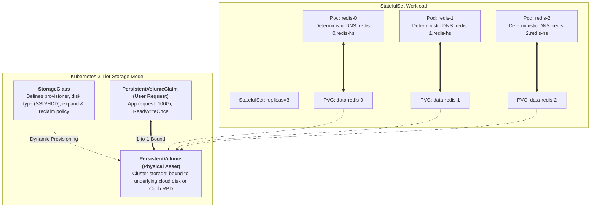
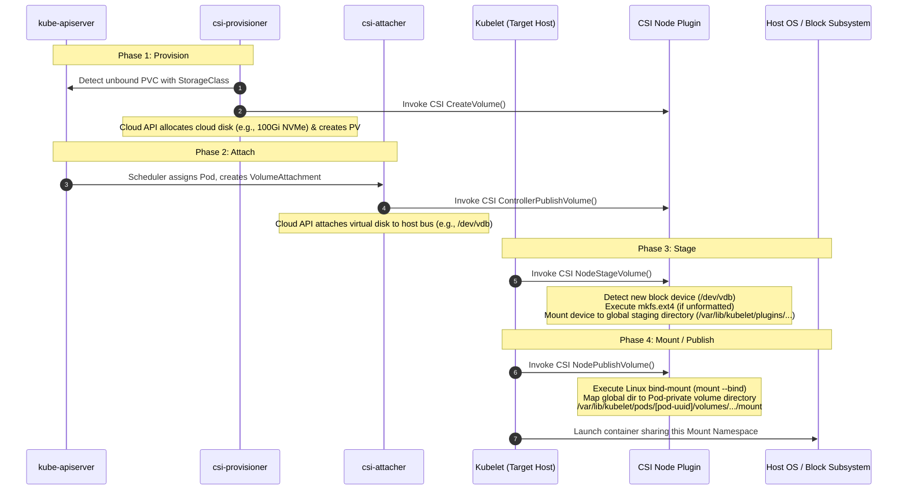

## Introduction: Dismantling the "Containers Are Stateless" Dogma

In the early years of the container revolution, the dogma that *"Containers are ephemeral by design"* reigned supreme. As examined in Chapter 01, [Docker Internals: Linux Namespaces, cgroups v2, and OverlayFS](/en/articles/docker-internals-namespace-cgroups-overlayfs/), the Copy-on-Write (CoW) upper layer of a container is completely discarded upon termination.

Consequently, enterprise architects reached a tacit consensus: **Kubernetes should be restricted to stateless web services and APIs; stateful workloads—such as MySQL, PostgreSQL, Redis, and Kafka—must remain sequestered on dedicated bare-metal servers or persistent virtual machines**.

However, enterprise software is intrinsically stateful:
- Microservice proliferation requires development teams to operate autonomous, self-contained database instances;
- If provisioning every datastore requires manual ticketing for SAN allocations, static IP reservations, and physical mounting, the promise of cloud-native agility evaporates.

To conquer stateful workloads, the Kubernetes community engineered a robust storage architecture: the **Container Storage Interface (CSI)** specification, **dynamic PV/PVC provisioning**, and the deterministic topology guarantees of the **StatefulSet controller**.



As the sixth installment of **From Docker to Kubernetes: Cloud-Native Container & Cluster Orchestration Handbook**, this guide deconstructs Kubernetes storage internals: the four-phase CSI execution lifecycle, StatefulSet topological contracts, and essential production resiliency guidelines.

---

## 1. Storage Evolution: From In-Tree Drivers to the CSI Standard

Early iterations of Kubernetes bundled third-party volume drivers (AWS EBS, GCE PD, Azure Disk, Ceph, GlusterFS) directly within the core `k8s.io/kubernetes` codebase.

This **In-Tree** approach incurred severe architectural friction:
1. **Coupled Release Lifecycles**: A minor bug fix in an enterprise SAN plugin required waiting for a quarterly Kubernetes upstream release;
2. **Codebase Bloat and Privilege Escalation**: Third-party storage code ran inside the privileged `kube-controller-manager` process, presenting memory leaks and security vulnerabilities.

To establish clean modularity, the community ratified the **CSI (Container Storage Interface)** specification in partnership with Cloud Foundry, Mesos, and Docker. Starting with Kubernetes 1.20+, In-Tree drivers were deprecated in favor of **Out-of-Tree gRPC CSI plugin architectures**:

```
CSI Control and Data Plane Architecture:
┌──────────────────────────────────────────────────────────────┐
│ Control Plane Sidecars (CSI Controller Deployment)            │
│  ├── csi-provisioner : Watches PVCs; calls Create/DeleteVolume │
│  ├── csi-attacher    : Watches VolumeAttachments; calls Attach │
│  ├── csi-resizer     : Watches PVC size edits; calls Expand   │
│  └── csi-snapshotter : Watches snapshots; calls CreateSnapshot│
└──────────────────────────────────────────────────────────────┘
                               │ gRPC (UNIX Domain Socket)
┌──────────────────────────────▼───────────────────────────────┐
│ CSI Driver Binary (Authored by Hardware/Cloud Vendors)        │
└──────────────────────────────────────────────────────────────┘
                               ▲ gRPC (UNIX Domain Socket)
┌──────────────────────────────┴───────────────────────────────┐
│ Data Plane (CSI Node Plugin - DaemonSet on Each Host)         │
│  ├── node-driver-registrar: Registers driver with host Kubelet │
│  └── csi-driver container : Executes NodeStage & NodePublish   │
└──────────────────────────────────────────────────────────────┘
```

---

## 2. Four-Stage Volume Lifecycle: How Linux Mounts Physical Storage

When a developer submits a Pod requesting persistent storage, how does a raw block device or network volume transition onto the container filesystem?

The workflow traverses four distinct stages: **Provision $\to$ Attach $\to$ Stage $\to$ Mount (Publish)**.



### 1. Provisioning Phase
- The `csi-provisioner` sidecar intercepts an unbound PVC and inspects its `StorageClass`;
- It invokes the storage provider API to allocate physical or virtual storage (e.g., an AWS EBS volume or Ceph RBD image), synthesizing an authoritative `PersistentVolume` (PV) in Kubernetes.

### 2. Attach Phase (ControllerPublishVolume)
- Once `kube-scheduler` selects a node for the Pod, the control plane's `attach-detach-controller` registers a `VolumeAttachment` resource;
- The `csi-attacher` sidecar intercepts this resource and calls the cloud provider control plane to connect the storage device to the host's virtual PCIe/SATA bus.

### 3. Stage Phase (NodeStageVolume)
- On the scheduled host node, `Kubelet` observes the newly attached block device (e.g., `/dev/vdb`);
- Kubelet triggers the CSI Node plugin's `NodeStageVolume` RPC;
- The plugin inspects the block device, formats it with a filesystem (e.g., `ext4` or `xfs`) if unformatted, and mounts it into a node-wide global staging directory (`/var/lib/kubelet/plugins/kubernetes.io/csi/...`).

### 4. Mount / Publish Phase (NodePublishVolume)
- Kubelet invokes `NodePublishVolume`;
- The CSI driver executes a Linux `mount --bind` operation, bridging the global staging directory directly into the Pod-specific mount path (`/var/lib/kubelet/pods/<pod-uuid>/volumes/...`);
- When the container engine spawns the application process within its isolated Mount Namespace, the directory is exposed as standard local storage.

---

## 3. StatefulSet Guarantees: Deterministic Invariants

Stateful datastores cannot tolerate the arbitrary replacement semantics of `Deployment` controllers. Deployments treat containers as anonymous, ephemeral entities: Pod names incorporate random hash strings (`web-5d789f8b4-k6w9q`), pods spin up and terminate concurrently, and all replicas share homogeneous storage.

If a primary-replica MySQL database or Kafka broker cluster runs on a Deployment, pod reboots shuffle network identities and detach storage, corrupting replication state.

The **`StatefulSet`** controller manages pods as persistent entities, enforcing three structural invariants:

```
StatefulSet Structural Invariants:
1. Deterministic Sequential Identity:
   redis-0 (Ordinal 0) ──► redis-1 (Ordinal 1) ──► redis-2 (Ordinal 2)

2. Ordered, Sequential Lifecycle Operations:
   Scale-Up Order:   0 Ready ──► 1 Ready ──► 2 Ready
   Scale-Down Order: 2 Terminated ──► 1 Terminated ──► 0 Terminated

3. Dedicated PVC Template Association (volumeClaimTemplates):
   redis-0 ──► Bound PVC: data-redis-0 ──► Exclusive PV 0 (Immutable)
   redis-1 ──► Bound PVC: data-redis-1 ──► Exclusive PV 1
   redis-2 ──► Bound PVC: data-redis-2 ──► Exclusive PV 2
```

### 1. Deterministic Network Identity (Headless Service)
StatefulSets operate alongside a **Headless Service** (`clusterIP: None`):
- CoreDNS registers predictable internal DNS records for every individual Pod:
  $$\text{<pod-name>}.\text{<service-name>}.\text{<namespace>}.\text{svc}.\text{cluster}.\text{local}$$
  e.g., `redis-0.redis-service.default.svc.cluster.local`;
- When physical host nodes reboot, `redis-0` retains its DNS identity, ensuring consensus peers can locate it across restarts.

### 2. Ordered Lifecycle Progression
- **Scale-Up**: Pods initialize sequentially from ordinal $0$ to $N-1$. `redis-1` will not initialize until `redis-0` passes its Readiness Probe;
- **Scale-Down**: Pods terminate in strict reverse ordinal order ($N-1$ down to $0$). `redis-1` will not terminate until `redis-2` cleanly exits, preserving quorum thresholds in Raft- and Paxos-based datastores.

### 3. Persistent Storage Continuity (volumeClaimTemplates)
StatefulSets manage persistent storage using `volumeClaimTemplates`:
- When scaling to 3 replicas, the controller automatically synthesizes 3 unique indexed PVCs (`data-redis-0`, `data-redis-1`, `data-redis-2`);
- **Failover Guarantee**: If host hardware fails and `redis-0` reschedules onto a different physical node, **the new `redis-0` rebinds to its original `data-redis-0` storage volume**, preserving write-ahead logs and database files.

---

## 4. Production Storage Pitfalls & Troubleshooting Guidelines

Operating stateful workloads in production clusters requires vigilance against common storage failure modes:

### 4.1 The "Multi-Attach Error" Deadlock
- **Symptom**: Node A encounters a power outage or kernel panic. The scheduler reschedules the Pod onto Node B, but the Pod remains trapped in `ContainerCreating` with the event: `Multi-Attach error for volume pvc-xxx. Volume is already exclusively attached to node Node A`;
- **Root Cause**: Cloud block storage engines operate in **ReadWriteOnce (RWO)** mode, permitting attachment to only one host at a time. Because Node A halted abruptly without clean disconnection, the storage control plane still reports the volume as attached to Node A. To prevent split-brain filesystem corruption, the CSI attacher halts attachment to Node B;
- **Resolution**:
  1. Do not execute `kubectl delete pod --force --grace-period=0`. This clears the Pod from etcd while leaving the volume attachment lock orphaned;
  2. Confirm Node A is fenced or powered down, allowing `attach-detach-controller` to complete its timeout cycle, or detach the volume via the cloud console.

### 4.2 Multi-AZ Topologies: `volumeBindingMode: WaitForFirstConsumer`
- **Symptom**: A newly created PVC provisions successfully, but the scheduled Pod fails with: `1 node had volume node affinity conflict`;
- **Root Cause**: Under `volumeBindingMode: Immediate`, the CSI driver provisions storage the moment the PVC manifest is applied. The driver randomly selects an availability zone (e.g., `Zone-A`). When the Pod later schedules, cluster compute resources are available only in `Zone-B`, making cross-zone block device attachment impossible;
- **Best Practice**: In multi-AZ production clusters, **always configure `volumeBindingMode: WaitForFirstConsumer` on all StorageClasses**. This defers disk provisioning until `kube-scheduler` selects a node, ensuring the storage volume resides in the identical availability zone.

---

## 5. Summary and Transition

Kubernetes storage architecture balances operational automation against data durability requirements:
- **The CSI Standard** decouples proprietary storage plugins behind modular gRPC contracts;
- **Dynamic Provisioning and the Four-Phase Lifecycle** orchestrate complex Linux block attachments and bind mounts into declarative pipelines;
- **StatefulSet Invariants** maintain deterministic network identities and storage associations across node migrations.

However, mastering low-level storage and networking abstractions still leaves a significant chasm to running enterprise microservices reliably:
- Why does standard gRPC connection multiplexing break `kube-proxy` Layer-4 load balancing, driving all traffic into a single Pod?
- Why do rolling deployments frequently trigger 502 Bad Gateway and connection reset errors on ingress gateways?
- What subtle, asynchronous race conditions unfold between Pod termination (`preStop` / `SIGTERM`) and Kubernetes EndpointSlice propagation?

In Chapter 07, **[Application Networking on Kubernetes: The gRPC Load Balancing Trap, Service Mesh, and Zero-Downtime Draining Sequences](/en/articles/k8s-application-networking-grpc-service-mesh-zero-downtime/)**, we dive into application-layer communications!

---

## Frequently Asked Questions (FAQ)

### Q1: When a physical node crashes abruptly, why does a StatefulSet Pod remain trapped in Terminating rather than rescheduling immediately?
**Root Cause: Split-Brain and Data Corruption Prevention**.
If Kubernetes immediately instantiated a replacement `redis-0` on another node while the original node experienced a temporary network partition, two active instances of `redis-0` would write to storage simultaneously, corrupting database logs.
Kubernetes adheres to a conservative design: it will not migrate stateful workloads until the original node's failure is confirmed.
**Resolution**: Administrators should verify node failure, drain the node (`kubectl drain`), or confirm machine power-off before forcing pod deletion.

### Q2: Why does Kubernetes retain PersistentVolumeClaims (PVCs) when a StatefulSet or Pod is deleted?
**Data Durability Protection**.
Compute instances can be recreated trivially, but persistent volumes store critical enterprise data.
If `kubectl delete statefulset` cascaded deletions down to attached disks, a typo could permanently destroy terabytes of production data.
Kubernetes decouples PVC lifecycles from workload controllers. Reclaiming storage requires explicit, deliberate deletion via `kubectl delete pvc <pvc-name>`.

### Q3: What is the architectural difference between `persistentVolumeReclaimPolicy: Retain` and `Delete`?
- **`Delete` Policy**: When a PVC is deleted, the bound PV and the underlying cloud disk asset are automatically destroyed.
- **`Retain` Policy**: When a PVC is deleted, the underlying PV transitions to the `Released` state without deleting the physical disk, preserving data. The volume cannot be rebound until an administrator clears or reprovisions it.
- **Production Recommendation**: For critical production datastores (MySQL, PostgreSQL, MongoDB), **always configure `persistentVolumeReclaimPolicy: Retain`** to guard against accidental administrative data loss.
