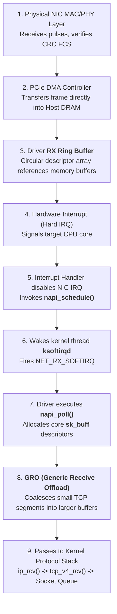
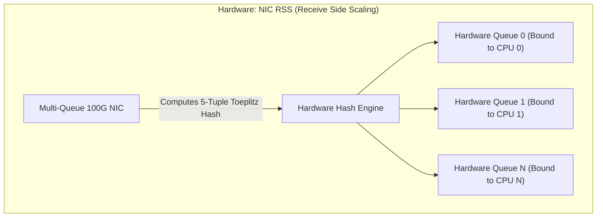
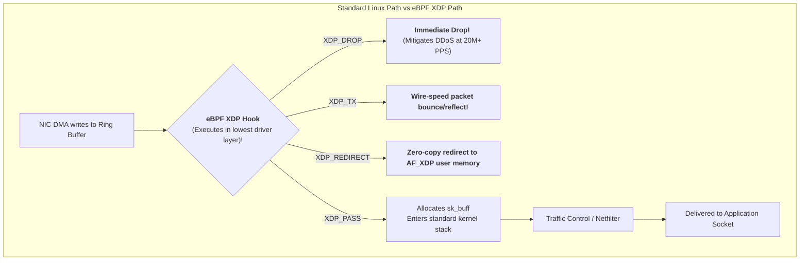

## Introduction: Deconstructing the Operating System's Network Lifeline

In preceding chapters, we examined Layer 2 switching, Layer 3 IP subnetting, VLAN/NAT infrastructure, DNS resolution, and Layer 4 TCP/UDP fundamentals.

Yet, in high-throughput system design, engineers often treat the operating system as an opaque black box:
- Assuming the NIC directly "pushes" packets into application memory buffers;
- Watching a server buckle under millions of requests per second as CPU softirq usage (`%si`) pegs at 100%, without clear visibility into the bottleneck;
- Wondering why standard Linux protocol stacks become a bottleneck on 100 Gbps interfaces, and how cloud providers achieve tens of millions of packets per second (Mpps) using **eBPF XDP**.

As **Chapter 7 of our masterclass**, this article examines the Linux kernel network subsystem: from **NIC hardware Ring Buffers** and **NAPI softirq polling** to **`sk_buff` memory pointer architecture** and **eBPF XDP wire-speed forwarding**.

---

## 1. The Linux Ingress Packet Path: From Physical Wire to `sk_buff`

When an optical or electrical pulse reaches an Ethernet interface, the operating system coordinates a multi-stage pipeline:



### 1.1 NIC Hardware and the RX Ring Buffer
1. **The Ring Buffer**: A fixed-length circular array allocated by the device driver in host RAM;
2. **Descriptors**: Slots in the Ring Buffer store memory pointers (DMA buffer descriptors) rather than packet data directly;
3. **Zero-Copy PCIe DMA**: The NIC controller writes packet payloads into host memory over the PCIe bus, **requiring zero CPU cycles to move bytes off the wire.**

### 1.2 The NAPI Hybrid Polling Mechanism
In early Linux kernels, each incoming packet generated a dedicated hardware interrupt (Pure Interrupt-Driven).
- **The Interrupt Storm Hazard**: At 10 Gbps or 100 Gbps, millions of small packets arrive per second. Servicing millions of interrupts consumes 100% of CPU time in context switches, freezing the system;
- **NAPI (Interrupt + Polling Hybrid)**:
  1. The first packet triggers an initial **Hardware Interrupt**;
  2. The CPU acknowledges the interrupt and **temporarily disables hardware interrupts on the NIC**;
  3. The kernel registers the interface on the CPU's poll queue, waking the `ksoftirqd` daemon;
  4. `ksoftirqd` batches packet processing (processing a default budget of 64 packets per poll cycle) to drain the Ring Buffer;
  5. Only when the Ring Buffer is empty does the driver **re-enable hardware interrupts**.
  **This hybrid design prevents CPU collapse under heavy traffic loads.**

---

## 2. Core Kernel Data Structure: `sk_buff`

In the Linux network subsystem, **`struct sk_buff` (skb)** is the primary abstraction representing packets as they traverse the stack from device drivers to user-space sockets.

```
Pointer Architecture of struct sk_buff:
+-------------------------------------------------------------+
| struct sk_buff (Control Metadata Block)                     |
|   head  -------------------------\                          |
|   data  ------------------\      |                          |
|   tail  ------------\     |      |                          |
|   end   -----\      |     |      |                          |
+--------------|------|-----|------|--------------------------+
               |      |     |      |
               v      v     v      v
      +--------+------+-----+------+--------------------------+
      | Headroom Area | Hdr | Payload| Tailroom Area          |
      +---------------+-----+------+--------------------------+
      ^               ^     ^      ^
      head            data  tail   end
```

### 2.1 Zero-Copy Header Manipulations: `skb_push` and `skb_pull`
Encapsulating and decapsulating protocol headers is handled via pointer updates rather than memory copies:
- **Egress (Encapsulation)**: Invoking `skb_push(skb, len)` moves the `data` pointer **leftward**, creating headroom to write TCP and IP headers **without reallocating memory**;
- **Ingress (Decapsulation)**: Invoking `skb_pull(skb, len)` moves the `data` pointer **rightward**, advancing the pointer past parsed headers before passing data to the next layer.

---

## 3. Multi-Core Scaling: RSS, RPS, and RFS

Modern server processors feature 64 or 128 hardware cores. Distributing multi-gigabit traffic across these cores prevents individual cores from becoming bottlenecks:



1. **RSS (Hardware Receive Side Scaling)**:
   The NIC ASIC maintains multiple independent RX/TX Ring Buffers. The hardware computes a hash of the 5-tuple and distributes flows to specific hardware queues, interrupting distinct CPU cores;
2. **RPS (Software Receive Packet Steering)**:
   For single-queue adapters, the Linux kernel emulates multi-queue behavior by hashing packets in software to distribute softirq processing across cores;
3. **RFS (Receive Flow Steering)**:
   Binds network processing to application affinity. RFS tracks which CPU core executes the target application thread and **schedules softirq execution on that same core**, maximizing L1/L2 cache locality.

---

## 4. Bypassing Kernel Overhead: eBPF and XDP

Even with NAPI and hardware RSS, **the standard Linux kernel network stack introduces significant per-packet overhead**:
- Each packet entering the stack requires an `alloc_skb()` allocation, metadata tracking, routing lookups, and netfilter evaluation;
- At line rate on 40 Gbps and 100 Gbps links, handling tens of millions of packets per second can overwhelm `ksoftirqd` threads.

Linux 4.8 introduced **XDP (eXpress Data Path)** to address this bottleneck:



### 4.1 XDP First Principles: Pre-`sk_buff` Execution
- **Earliest Possible Execution Point**: XDP programs run as verified eBPF bytecode inside the network driver at the point where DMA buffers are initially read;
- **Zero `sk_buff` Allocation Overhead**: XDP inspects raw memory buffers (`xdp_buff`) **before `sk_buff` allocation or softirq invocation**;
- **Throughput Scaling**: A single CPU core running an XDP drop program can process **24+ million packets per second (24 Mpps)**, making it a common choice for high-volume DDoS mitigation and Layer 4 load balancing (e.g., Cloudflare, Meta's Katran).

---

## 5. Linux Kernel Tuning and Diagnostic Commands

```bash
# 1. Query current and maximum Ring Buffer capacity
ethtool -g eth0
# Expand Ring Buffer to hardware maximum (reduces burst packet loss):
# ethtool -G eth0 rx 4096 tx 4096

# 2. Inspect and configure hardware queue allocations
ethtool -l eth0

# 3. Monitor softirq distribution across CPU cores
watch -n 1 "cat /proc/softirqs | grep NET_RX"

# 4. Check hardware drop and buffer overrun counters
ethtool -S eth0 | grep -E "drop|miss|over|err"

# 5. Check if an eBPF XDP program is attached to the interface
ip link show eth0
```

---

## 6. Summary and Next Steps

The Linux kernel network subsystem balances throughput and latency across multiple layers:
- **Ring Buffers and DMA** handle data transfer between physical adapters and system RAM without CPU intervention;
- **NAPI** switches between interrupts and polling to prevent CPU livelock under load;
- **The `sk_buff` Pointer Topology** enables header manipulation across layers without data copying;
- **RSS and RFS** distribute traffic across available CPU cores while preserving cache locality;
- **eBPF XDP** operates at the driver layer to support high-throughput packet processing.

However, once individual Linux hosts are tuned, broader architectural questions emerge at data center scale:
- How do data center fabrics handle east-west traffic when Spanning Tree Protocol (STP) blocks half of all links in three-tier topologies?
- How do **Clos architectures and 2-Tier / 3-Tier Leaf-Spine designs** provide non-blocking bisection bandwidth?
- How do **BGP Underlay routing and EVPN-VXLAN virtualization** coordinate multi-tenant virtual machines and container networking?

In Chapter 8 of our masterclass, we explore data center fabrics: **[Modern Data Center Network Architecture First Principles: Clos Topologies, Leaf-Spine Fabrics, BGP Underlay, and EVPN-VXLAN Large Layer-2 Virtualization](/en/articles/datacenter-network-clos-leaf-spine-bgp-evpn-vxlan/)**!

---

## Frequently Asked Questions (FAQ)

### Q1: In `top`, one CPU core's `%si` (softirq) is pegged at 100% while other cores remain idle. What causes this, and how is it resolved?
**Root Cause: Unbalanced interrupt affinity or single-queue network adapter configuration.**
If NIC hardware interrupts are bound to a single CPU core (typically CPU 0) or the adapter lacks multi-queue support, `ksoftirqd/0` must process all incoming packets, allocate every `sk_buff`, and handle the entire protocol stack alone. This core saturates and drops packets while remaining cores sit idle.
**Remediation**:
1. Enable multi-queue support on the NIC and configure RSS;
2. Run `irqbalance` or write CPU masks into `/proc/irq/<IRQ_NUM>/smp_affinity` to distribute queue interrupts across cores;
3. Enable RPS and RFS to steer softirq processing to the core where the receiving application thread is scheduled.

### Q2: Why does increasing the NIC Ring Buffer size (`ethtool -G eth0 rx 4096`) help prevent packet drops, and what are the trade-offs of setting it too high?
- **Benefits**: The Ring Buffer absorbs bursts between DMA transfers and CPU softirq drains. When bursty traffic (incast) arrives, small default buffers (e.g., 256 or 512 descriptors) quickly fill, causing hardware drops (`rx_dropped`). Expanding to 4096 descriptors buffers transient traffic spikes;
- **Drawbacks (Bufferbloat)**: The Ring Buffer is an in-memory queue. Under sustained overload, thousands of packets wait in the buffer, introducing microsecond or millisecond queueing delays that increase end-to-end RTT and degrade latency-sensitive workloads.

### Q3: Why does eBPF XDP deliver higher throughput than the traditional kernel stack, and how does it compare to DPDK?
**Root Cause: Bypassing `sk_buff` allocation and minimizing kernel context.**
- **XDP Performance**: XDP processes raw memory pointers (`xdp_buff`) directly from driver DMA buffers before the kernel allocates metadata structures, processing packets in nanoseconds via JIT-compiled bytecode;
- **XDP vs DPDK Trade-Offs**:
  - **DPDK**: Bypasses the kernel completely into user space using Poll Mode Drivers (PMD). It offers high raw throughput, but requires dedicated 100% CPU core pinning and bypasses standard Linux networking tools (`tcpdump`, `iptables`, `iproute2`);
  - **XDP**: Runs inside the Linux kernel driver layer without monopolizing CPU cores. It integrates with native kernel tooling and allows programs to pass selected packets up to the standard Linux stack, balancing raw performance with system maintainability.
