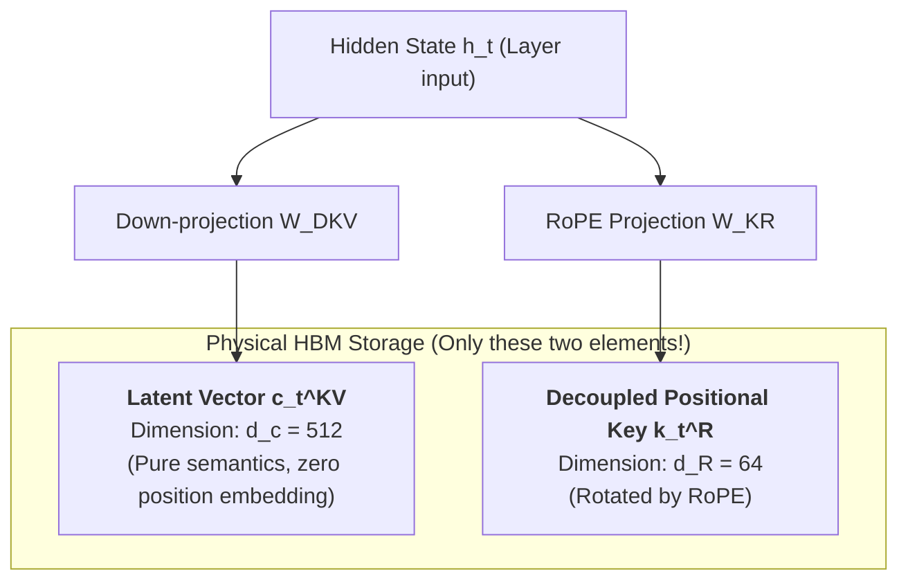
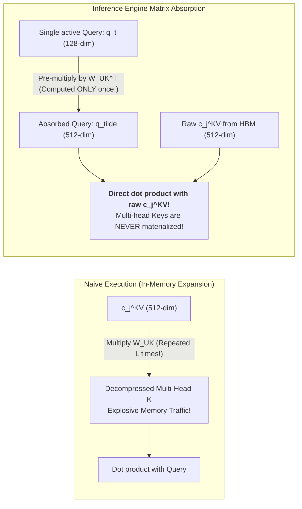

## Introduction: When Software Optimizations Collide with Physical Limits

Throughout the first five chapters of this series, we pushed modern GPU hardware and runtime schedulers to their absolute physical boundaries:
- In [Roofline Model and Prefill vs Decode Physical Divergence](/en/articles/inference-roofline-prefill-decode/), we quantified the hardware throughput ceiling separated by compute-bound prefill and bandwidth-bound decode;
- In [PagedAttention Virtual Memory Management](/en/articles/pagedattention-memory-virtualization/), we suppressed memory fragmentation down to under 4%;
- In [Continuous Batching and Chunked Prefill](/en/articles/continuous-batching-chunked-prefill-guide/), we flattened tail-latency spikes by interleaving compute-dense prefill chunks with memory-bound decode steps;
- In [Prefix Caching with RadixAttention](/en/articles/prefix-caching-radix-attention-internals/) and [Attention Kernel Acceleration](/en/articles/flashattention-flashinfer-kernel-evolution/), we maximized context reuse and eliminated intermediate matrix materialization in SRAM.

Yet, as the industry scales into **128k, 1M, and multi-turn agent contexts**, serving clusters confront an uncompromising mathematical barrier defined by model architecture:

During autoregressive decoding, the memory footprint generated per token is dictated strictly by the model's structural parameters:
$$\text{KV Cache Bytes per Token} = 2 \times n_{\text{layers}} \times n_{\text{kv\_heads}} \times d_{\text{head}} \times \text{sizeof(dtype)}$$

For a standard 70B parameter model (80 layers, 64 attention heads, head dimension 128, stored in FP16):
- Each generated token requires $2 \times 80 \times 64 \times 128 \times 2 = 2.62\text{ MB}$ of KV cache;
- When a context window stretches to 128k tokens, **a single request's KV cache monopolizes a staggering 335 GB of VRAM!**
- This means that even on a premium server equipped with 8x 80GB NVIDIA H100 GPUs (640 GB total HBM), **the entire node cannot support even two concurrent requests at 128k context!**

When software and kernel optimizations reach the physical limits of memory bandwidth and hardware capacity, the only remaining path forward is: **The model architecture itself must evolve to rescue the inference engine.**

From **Multi-Head Attention (MHA)** to **Multi-Query Attention (MQA)**, **Grouped-Query Attention (GQA)**, and finally to **DeepSeek's Multi-Head Latent Attention (MLA)**, this architectural evolution has permanently reshaped the economics of LLM serving.

This chapter walks through the mathematical foundations of this transition, examining how DeepSeek decoupled RoPE to achieve low-rank compression, and how inference engines leverage **Matrix Absorption** to eliminate over 90% of Key-Value tensor traffic during decoding.

---

## 1. The Heritage of MHA and the Compromise of GQA

To appreciate the design of MLA, we must first trace the structural bottlenecks of its predecessors.

```mermaid
graph TD
    subgraph MHA["1. Standard Multi-Head Attention (MHA)"]
        direction TB
        Q1["Q0, Q1, ... Q63 (64 Heads)"]
        K1["K0, K1, ... K63 (64 Heads)"]
        V1["V0, V1, ... V63 (64 Heads)"]
        MHA_Note["KV Heads == Q Heads<br/>KV Cache footprint is massive (100% baseline)"]
    end

    subgraph MQA["2. Multi-Query Attention (MQA, 2019)"]
        direction TB
        Q2["Q0, Q1, ... Q63 (64 Heads)"]
        K2["K_shared (Single Head)"]
        V2["V_shared (Single Head)"]
        MQA_Note["KV compressed 64x<br/>Severe drop in expressive power & reasoning"]
    end

    subgraph GQA["3. Grouped-Query Attention (GQA, 2023)"]
        direction TB
        Q3["Q0..Q7, Q8..Q15, ... (8 Groups)"]
        K3["K0, K1, ... K7 (8 Heads)"]
        V3["V0, V1, ... V7 (8 Heads)"]
        GQA_Note["LLaMA-3 / Mistral industry standard<br/>8x KV compression with near-zero quality loss"]
    end
```

### 1.1 The Unsustainable Growth of Multi-Head Attention (MHA)

In original Transformer models (such as LLaMA-1 65B), every individual attention head maintains independent Query, Key, and Value projections ($n_{\text{kv\_heads}} = n_{\text{heads}} = 64$).
- While this offers maximal expressive capacity, KV cache volume scales linearly with the product of head count and layer depth;
- In long-context decoding, HBM bus bandwidth is overwhelmed by loading multi-head Key and Value tensors for every newly generated token.

### 1.2 Multi-Query Attention (MQA): An Overly Aggressive Pruning

In 2019, Noam Shazeer proposed Multi-Query Attention (MQA):
- All 64 Query heads share a **single common Key head and Value head** ($n_{\text{kv\_heads}} = 1$);
- Memory footprint drops by a factor of 64;
- **The trade-off proved severe**: Collapsing heads strips the network of its ability to attend to diverse feature subspaces simultaneously, causing sharp accuracy regressions in coding, multi-step math, and nuanced reasoning tasks.

### 1.3 Grouped-Query Attention (GQA): The Established Baseline

In 2023, Ainslie et al. introduced Grouped-Query Attention (GQA), which became the standard across LLaMA-2/3, Mistral, and Qwen:
- Query heads are grouped (e.g., $G=8$ groups of 8 Query heads sharing 1 KV head);
- With $n_{\text{kv\_heads}} = 8$, GQA delivers an **8x compression** over MHA while preserving model quality across standard benchmarks.

**Yet, is an 8x reduction sufficient?**
For an enterprise 70B model, single-token KV cache storage still requires roughly **400 KB**. At 128k context, a single session consumes 50 GB. To run cost-effective large-scale serving, the industry required a more radical architectural leap.

---

## 2. DeepSeek MLA: Low-Rank Latent Compression and Memory Minimalism

In 2024, DeepSeek introduced **Multi-Head Latent Attention (MLA)** in the DeepSeek-V2 technical report, establishing it as the core attention architecture for DeepSeek-V3 and DeepSeek-R1.

MLA operates on a bold hypothesis: **Since high-dimensional Key and Value representations exhibit substantial low-rank redundancy, why must we store uncompressed multi-head tensors in physical HBM at all?**

### 2.1 Low-Rank Latent Compression

Rather than projecting the hidden state $h_t \in \mathbb{R}^d$ directly into multiple high-dimensional Key and Value heads, MLA down-projects $h_t$ into a compact **latent vector**:

$$c_t^{KV} = W^{DKV} h_t \in \mathbb{R}^{d_c}$$

In DeepSeek-V2 and V3:
- Hidden dimension $d = 5120$ or $7168$;
- Latent dimension $d_c = 512$;
- Rather than preserving hundreds of separate head channels, the entire multi-head KV representation is condensed into a single 512-dimensional vector per token.

However, compressing the KV cache directly into a latent vector encounters a major mathematical obstacle: **Rotary Position Embedding (RoPE) is non-commutative with low-rank linear projections**.

### 2.2 The RoPE Dilemma: Why RoPE Resists Linear Compression

RoPE applies a position-dependent block-diagonal rotation matrix $R_t$ to each head's Key vector:
$$k_{t, i} = R_t (W^{UK}_i c_t^{KV})$$

Notice the operational ordering:
1. $W^{UK}_i \in \mathbb{R}^{d_h \times d_c}$ expands the 512-dimensional latent vector into head $i$'s Key space;
2. The rotation matrix $R_t$ is position-dependent and **cannot commute across the linear transformation**:
$$R_t (W^{UK}_i c_t^{KV}) \neq W^{UK}_i (R_t c_t^{KV})$$

**If we store only $c_t^{KV}$ in the cache, we cannot bake position information into it ahead of time. But if we postpone rotation until decode time, we would have to project and rotate all historical tokens at every single step, incurring prohibitive computational overhead!**

### 2.3 Decoupled RoPE: The Mathematical Breakthrough

DeepSeek resolved this deadlock by introducing **Decoupled RoPE**:

MLA splits Query and Key vectors into two decoupled functional components:
1. **Content Vectors ($k_{t, i}^C$, $q_{t, i}^C$)**: Carry pure semantic meaning, **completely free of positional rotation**, enabling clean low-rank compression;
2. **Positional Vectors ($k_t^R$, $q_t^R$)**: Carry dedicated positional information with a small dimension ($d_R = 64$), evaluated via standard RoPE.

$$k_{t, i} = \begin{bmatrix} k_{t, i}^C \\ k_t^R \end{bmatrix}, \quad q_{t, i} = \begin{bmatrix} q_{t, i}^C \\ q_{t, i}^R \end{bmatrix}$$

- The content representation derives from the latent vector: $k_{t, i}^C = W^{UK}_i c_t^{KV} \in \mathbb{R}^{d_h}$;
- The positional key is projected independently: $k_t^R = \text{RoPE}(W^{KR} h_t) \in \mathbb{R}^{d_R}$ (**and shared across all attention heads!**).

### 2.4 Quantifying the 96.5% Cache Reduction

In MLA, the KV cache entry for each token consists of only two compact arrays:
1. Compressed Content Latent: $c_t^{KV} \in \mathbb{R}^{512}$
2. Decoupled Positional Key: $k_t^R \in \mathbb{R}^{64}$

Comparing per-token cache storage per layer across architectures:

| Attention Architecture | Per-Layer Storage Representation | Stored Values (FP16) | Memory vs MHA |
| :--- | :--- | :--- | :--- |
| **Standard MHA** | $2 \times 64 \text{ heads} \times 128$ | 16,384 floats (32,768 Bytes) | Baseline (100%) |
| **Grouped-Query Attention (GQA-8)** | $2 \times 8 \text{ heads} \times 128$ | 2,048 floats (4,096 Bytes) | 87.5% reduction |
| **DeepSeek MLA** | $512 (c_t^{KV}) + 64 (k_t^R)$ | **576 floats (1,152 Bytes)** | **96.5% reduction (1/28th size!)** |

MLA enables an inference server to host **nearly 4x the concurrent batch capacity of GQA, and 28x that of MHA**, within identical VRAM constraints.

---

## 3. The Runtime Secret: Matrix Absorption

While storing only 576 floats per token saves VRAM capacity, how does the serving engine compute attention without explicitly decompressing $c_t^{KV}$ into multi-head Keys and Values?

If an engine had to expand $c_t^{KV}$ in memory before computing dot products, memory bandwidth saturation would persist.

The solution is the defining algebraic technique of MLA serving: **Matrix Absorption (Weight Absorption)**.

### 3.1 Absorbing Key Up-Projections into Query

Consider the dot-product attention score for head $i$:
$$S_{t, j, i} = \frac{1}{\sqrt{d_h + d_R}} \left( (q_{t, i}^C)^T k_{j, i}^C + (q_{t, i}^R)^T k_j^R \right)$$

Substituting the definition of the content key $k_{j, i}^C = W^{UK}_i c_j^{KV}$:
$$(q_{t, i}^C)^T k_{j, i}^C = (q_{t, i}^C)^T \left( W^{UK}_i c_j^{KV} \right)$$

By associativity of matrix multiplication, we regroup the terms:
$$(q_{t, i}^C)^T \left( W^{UK}_i c_j^{KV} \right) = \left( (q_{t, i}^C)^T W^{UK}_i \right) c_j^{KV} = \left( (W^{UK}_i)^T q_{t, i}^C \right)^T c_j^{KV}$$

We define the transformed **absorbed query** $\tilde{q}_{t, i}^C$:
$$\tilde{q}_{t, i}^C = (W^{UK}_i)^T q_{t, i}^C \in \mathbb{R}^{d_c}$$

This transformation creates a massive efficiency gain:
- During autoregressive decode, there is only **one single query token ($L_q = 1$)**, but **$L$ historical tokens** in the cache;
- Computing $W^{UK}_i c_j^{KV}$ naively requires $L$ matrix-vector multiplications across all historical tokens;
- **With Matrix Absorption, we multiply $(W^{UK}_i)^T$ only once against the single current Query vector, mapping it from dimension $d_h=128$ into the latent space $d_c=512$!**
- **The kernel then computes dot products directly between $\tilde{q}_{t, i}^C$ and the raw, unexpanded $c_j^{KV}$ in memory!**

### 3.2 Value Projection and Output Absorption

The same mathematical principle applies to the Value projection:
The attention-weighted output vector is:
$$o_{t, i} = \sum_j P_{t, j, i} v_{j, i}^C = \sum_j P_{t, j, i} \left( W^{UV}_i c_j^{KV} \right)$$

In multi-head attention, outputs across all heads are concatenated and multiplied by the out-projection matrix $W^O$:
$$u_t = \sum_i W^O_i o_{t, i} = \sum_i W^O_i \left( \sum_j P_{t, j, i} W^{UV}_i c_j^{KV} \right)$$

Factoring out the linear transformation:
$$u_t = \sum_i \left( W^O_i W^{UV}_i \right) \left( \sum_j P_{t, j, i} c_j^{KV} \right)$$

We pre-fuse the output projection weight matrix:
$$\tilde{W}^O_i = W^O_i W^{UV}_i \in \mathbb{R}^{d \times d_c}$$

**The result**: During decode attention, the kernel computes attention weights $P_{t, j, i}$ directly against the 512-dimensional latent vectors $c_j^{KV}$ to produce a 512-dimensional intermediate sum. This vector is then multiplied directly by the pre-fused projection matrix $\tilde{W}^O$.

**Conclusion: Throughout the entire decode phase, multi-head Key and Value tensors are never materialized in GPU memory.**

---

## 4. Production Engineering: FlashMLA and Serving Engine Integration

Translating Matrix Absorption from mathematical derivation into high-throughput production kernels required extensive systems engineering.

### 4.1 DeepSeek's Open-Source FlashMLA

In early 2025, DeepSeek open-sourced **FlashMLA**, an attention kernel library tuned specifically for Hopper architectures (H800 / H100 SXM):
1. **Specialized Tiling for $d_c = 512$**: Optimized warp-group memory access patterns designed around the 512 latent dimension and 64 RoPE dimension;
2. **Sustained Memory Bandwidth**: FlashMLA achieves sustained memory read bandwidth of over **3,000 GB/s** during decoding on H800/H100 GPUs, reaching ~90% of physical hardware capacity;
3. **Native Paged KV Cache Support**: Employs block size 64 page allocations, integrating directly into virtual memory managers.

### 4.2 Ecosystem Integration: vLLM vs SGLang

Modern open-source inference engines treat MLA as a first-class optimization:

- **SGLang**:
  SGLang achieves notable throughput on DeepSeek-V3/R1 workloads by using a hybrid execution strategy: pairing FlashInfer or TileLang for prompt prefill with **FlashMLA** for token decoding, coordinated through its RadixTree cache structure;
- **vLLM**:
  vLLM implements offline weight pre-fusion for MLA models, computing $\tilde{W}^O = W^O W^{UV}$ at model load time. This removes runtime matrix multiplication overhead and minimizes kernel dispatch latency during token generation.

---

## 5. Architectural Comparison Matrix

| Dimension | Standard MHA | MQA (2019) | GQA (2023) | DeepSeek MLA (2024-2026) |
| :--- | :--- | :--- | :--- | :--- |
| **Representative Models** | LLaMA-1, Original GPT-3 | Falcon-40B, StarCoder | LLaMA-2/3, Mistral, Qwen | DeepSeek-V2/V3/R1 |
| **KV Cache Footprint vs MHA** | 100% (Baseline) | ~1.5% | 12.5% | **~3.5% (Minimalist)** |
| **Complex Reasoning Retention**| Maximum | Severe Degradation | Near-Lossless vs MHA | **Equal or Superior to MHA** |
| **Position Encoding** | Monolithic RoPE | Monolithic RoPE | Monolithic RoPE | **Decoupled RoPE Splitting** |
| **Decode Attention Kernel** | GEMV across all heads | Single-head GEMV | Grouped-head GEMV | **Matrix Absorption Dot-Product** |
| **Intermediate Multi-Head KV** | Fully Materialized | Single Head Materialized | Group Heads Materialized | **Never Materialized in VRAM** |
| **128k Concurrency Scale** | Poor (Immediate OOM) | High (Poor Quality) | Moderate | **High (Massive Batch Capacity)** |

---

## Frequently Asked Questions (FAQ)

### Q1: Given that MLA reduces KV cache size by over 90% while maintaining accuracy, why hasn't it been universally adopted in models like LLaMA-3 or Mistral? What are the training costs?

MLA optimizes **inference serving efficiency**, but introduces distinct challenges during model pre-training:
1. **Optimization Sensitivity and Rank Collapse**: Compressing representation states into a 512-dimensional bottleneck increases optimization sensitivity. Without careful learning rate scheduling and gradient clipping, low-rank layers risk representational collapse early in training;
2. **Specialized Training Regimes**: DeepSeek's success with MLA relies on extensive hyperparameter tuning, custom weight initializations, and multi-stage learning rate annealing;
3. **Legacy Ecosystem Investments**: Organizations with established GQA pipelines face high switching costs, as adopting MLA requires training new base checkpoints from scratch over trillions of tokens.

### Q2: Why does Matrix Absorption operate during autoregressive decoding, but cannot be applied effectively during prompt prefill?

This is determined by the **computational geometry of matrix multiplication**:
- **During Decode ($L_q = 1$)**: The Query is a single vector. Projecting one 128-dimensional vector into 512 dimensions incurs minimal FLOPs, while avoiding decompression across all $L$ historical tokens in memory;
- **During Prefill ($L_q = 4096$)**: Query and Key inputs are large matrices. Absorbing $W^{UK}$ into the full Query matrix $Q \in \mathbb{R}^{4096 \times 128}$ expands it into $\mathbb{R}^{4096 \times 512}$. Computing attention with this expanded matrix increases total FLOPs by 4x.

Consequently, modern engines execute prefill using uncompressed GEMM kernels, switching dynamically to Matrix Absorption during decode.

### Q3: If MLA compresses the KV cache by over 90%, why do clusters still encounter memory constraints under extreme concurrency?

While MLA dramatically compresses dynamic KV cache memory, large-scale serving clusters face additional physical baselines:

1. **Static Parameter Footprint**:
   In frontier models like DeepSeek-V3 (671B MoE with 37B active parameters), model weights occupy approximately **350 GB** even in FP8 quantization, consuming significant baseline VRAM across the cluster;
2. **Working Memory at High Concurrency**:
   Across hundreds of concurrent streams executing long chain-of-thought reasoning (such as DeepSeek-R1 emitting thousands of reasoning tokens), scratchpad buffers and activation tensors accumulate substantially.

Under these conditions, system constraints shift from single-node KV capacity to **inter-node Expert Parallelism (EP) communication bandwidth**, which we will explore in the next chapter on distributed MoE serving.
