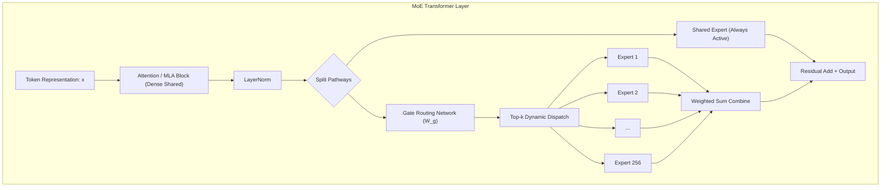
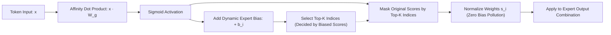
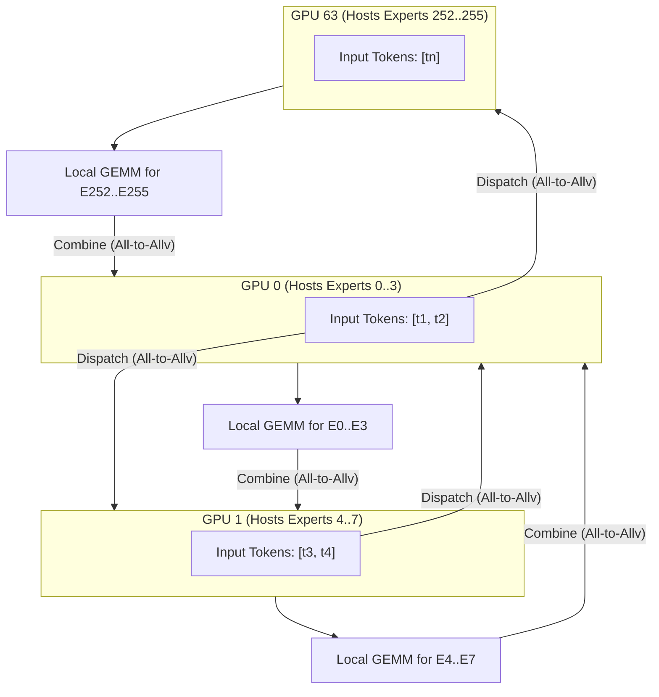
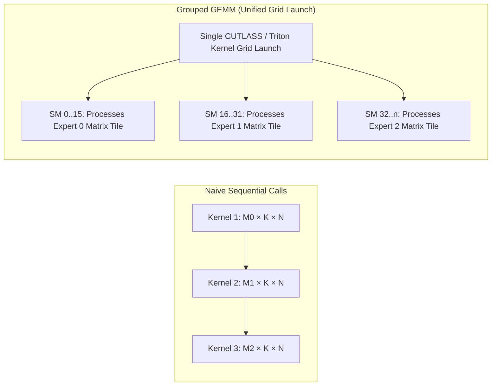
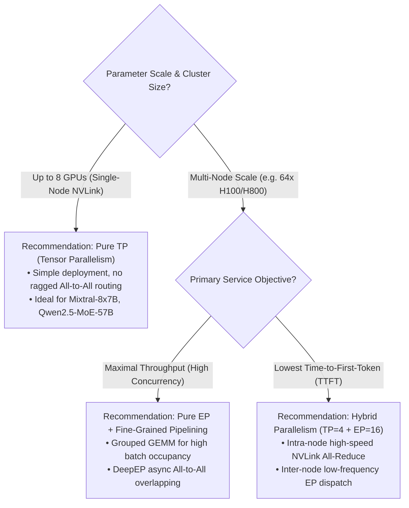

## Introduction: The Sparsity Paradox of a 671B Behemoth

Across the first six chapters of our series, we journeyed through the physical principles governing autoregressive inference: from [Roofline Modeling and the Prefill vs Decode Divide](/en/articles/inference-roofline-prefill-decode/), [PagedAttention Virtual Memory Pooling](/en/articles/pagedattention-memory-virtualization/), [Continuous Batching and Chunked Prefill](/en/articles/continuous-batching-chunked-prefill-guide/), [Prefix Caching & RadixAttention](/en/articles/prefix-caching-radix-attention-internals/), to [FlashAttention/FlashInfer Kernel Evolution](/en/articles/flashattention-flashinfer-kernel-evolution/) and [DeepSeek MLA Matrix Absorption](/en/articles/mha-gqa-mla-matrix-absorption-inference-engine/).

Each of these techniques pushed dense model compute efficiency and memory utilization to the hardware limits of modern GPUs. However, as model capacity scaled from 70B beyond 600B, dense architectures slammed into an insurmountable **compute wall**: generating every single token required computing matrix-vector multiplications across all weight parameters, scaling inference costs strictly linearly with model size.

**Mixture-of-Experts (MoE)** broke this fundamental constraint. Taking the renowned **DeepSeek-V3** as a prime architecture study:
- **Total Parameter Count**: A staggering **671B**;
- **Active Parameters per Token**: Only ~**37B** (comprising 1 shared expert + 8 dynamically routed experts);
- **Sparsity Ratio**: Reaching $94.5\%$, meaning $94.5\%$ of FFN parameters remain completely idle for any single token!

```
DeepSeek-V3 Compute Sparsity Overview:
┌─────────────────────────────────────────────────────────────┐
│ Total Parameters: 671B (256 Routed Experts + 1 Shared Expert)│
│ Active Parameters: 37B (8 Routed Experts + 1 Shared Expert) │
│ FLOPs Reduction: ~94.5% FLOPs eliminated per token          │
└─────────────────────────────────────────────────────────────┘
```

On paper, MoE delivers the holy grail of system design: "trillion-parameter knowledge capacity at hundred-billion-parameter compute latency." However, deploying MoE models into production inference clusters (using vLLM, SGLang, or TensorRT-LLM) confronts systems engineers with acute bottlenecks rarely seen in dense workloads:

1. **Severe Memory-Bound Degradation in Decode**: When batch sizes are small, tokens routed to individual experts drop to tiny numbers (often 0 or 1), collapsing GEMM operations into memory-bandwidth-choked GEMV calls;
2. **Expert Parallelism (EP) All-to-All Network Storms**: Experts reside on distinct GPUs across machines. Tokens must cross cluster fabrics via ragged **All-to-All** permutations (Token Dispatch and Token Combine), where network latency quickly devours compute gains;
3. **Load Imbalance & Straggler Effects**: Popular experts become compute bottlenecks while cold experts sit idle, degrading multi-GPU execution pipelines.

In this seventh chapter of the **Production LLM Inference Engines** handbook, we deconstruct MoE inference systems from first principles: dynamic routing algorithms, expert parallelism communication topologies, CUTLASS Grouped GEMM kernels, and the **DualPipe** overlapping execution pipelines that power modern hyperscale serving.

---

## 1. Physical Profiles of MoE: Compute Sparsity vs Memory Wall

### 1.1 Architectural Topology: Shared vs Routed Experts

A standard Transformer block cascades Multi-Head Attention (or MLA) and a Feed-Forward Network (FFN). MoE architectures retain the dense, shared Attention layer while replacing the dense FFN with an ensemble of parallel "Expert MLPs":



Modern architectures pioneered by DeepSeek-V3 introduce a **Shared Expert + Fine-Grained Routed Experts** paradigm:
- **Shared Expert ($E_{\text{shared}}$)**: Processes every token unconditionally, capturing universal grammatical structures and common factual representations;
- **Fine-Grained Routed Experts ($\{E_1, E_2, \dots, E_N\}$)**: Decomposed into a large pool of compact experts (e.g., 256 experts with an intermediate dimension of only 2048), with the routing gate selecting only $K$ experts (e.g., $K=8$) per token.

Formally, the layer output is defined as:

$$y = E_{\text{shared}}(x) + \sum_{i \in \text{TopK}(S, K)} s_i E_i(x)$$

where $s_i$ denotes the normalized routing score assigned to expert $i$.

### 1.2 Roofline Analysis: Why Low-Batch MoE Decode Suffers Severe Memory Bottlenecks

In [Chapter 01](/en/articles/inference-roofline-prefill-decode/), we derived the Roofline Model: **Arithmetic Intensity $I = \frac{\text{FLOPs}}{\text{Memory Access Bytes}}$ dictates whether hardware operates in the compute-bound or memory-bound regime**.

For dense models with batch size $B$, hidden size $h$, and weight bytes $W$, forward pass arithmetic intensity is $I_{\text{dense}} \approx \frac{2 B W}{W} = 2B$ (independent of model weight size, scaling strictly with $B$).

In an MoE model with $E$ experts activating $k$ experts per token, consider a decode scenario with low concurrency (e.g., $B=8$ requests):
The total assigned tokens across all experts is $B \times k = 8 \times 8 = 64$.
With $E=256$ total experts:
- Average tokens per expert: $M_e = \frac{B \cdot k}{E} = \frac{64}{256} = 0.25$!
- Most experts receive **0 tokens**, while selected experts receive merely **1 or 2 tokens**!

When an expert processes a single token, the GPU must stream its entire set of weight matrices ($W_{\text{gate}}, W_{\text{up}}, W_{\text{down}}$) from HBM into SRAM, only to execute a single matrix-vector multiplication (GEMV):

```
MoE Per-Expert Arithmetic Intensity:
- Prefill Phase (Long Context S=4096, B=4):
  Total assigned tokens = 4096 * 4 * 8 = 131,072
  Tokens per expert M_e ≈ 131,072 / 256 = 512
  -> Large GEMM, I ≈ 2 * 512 = 1024 FLOPs/Byte (Saturating Tensor Core Compute-Bound zone)

- Decode Phase (Low Concurrency B=4):
  Total assigned tokens = 4 * 8 = 32
  Tokens per expert M_e ≈ 32 / 256 = 0.125
  -> Collapses to GEMV, I ≈ 2 * 1 = 2 FLOPs/Byte (Choked in HBM Memory-Bound zone)
```

**Takeaway 1: While MoE drastically reduces theoretical FLOPs per token, it shifts low-batch autoregressive decode deeper into the memory-bandwidth wall. Without sufficient concurrency to batch tokens across experts, MoE throughput gains degrade rapidly.**

---

## 2. Dynamic Routing Gating and Load Balancing

### 2.1 Classic Softmax Gating & The Routing Collapse Problem

Naive gating mechanisms (such as Switch Transformer and Mixtral 8x7B) employ linear projection followed by Softmax:

$$P(x) = \text{Softmax}(x \cdot W_g)$$

$$\text{TopK}(x) = \operatorname{arg top-k}(P(x), K)$$

$$s_i = \frac{\exp(x \cdot W_{g,i})}{\sum_{j \in \text{TopK}(x)} \exp(x \cdot W_{g,j})}$$

This scheme is highly prone to **Routing Collapse**: the router discovers early in training that certain initialized experts yield slightly lower loss, routing an increasing cascade of tokens to them. Over time, a handful of experts carry $90\%+$ of traffic while the rest become unutilized "dead experts."

Early mitigations (GShard, Megatron-MoE) enforced an **Auxiliary Balancing Loss** penalizing expert variance:

$$\mathcal{L}_{\text{balance}} = \alpha \cdot E \sum_{i=1}^E f_i \cdot P_i$$

where $f_i$ is the fraction of tokens routed to expert $i$, $P_i$ is the average routing probability, and $\alpha$ is a loss coefficient.

**The Fatal Flaw of Auxiliary Loss**: A small $\alpha$ fails to prevent routing collapse; a large $\alpha$ overpowers the primary next-token prediction objective, forcing the model to sacrifice linguistic capability for artificial balance.

### 2.2 DeepSeek-V3 Innovation: Auxiliary-Loss-Free Balancing

To ensure uniform load distribution without degrading language modeling accuracy, DeepSeek-V3 introduced **Auxiliary-Loss-Free Dynamic Bias Balancing**.

The router adds a dynamic, expert-specific bias term $b_i$ during scoring:

$$S_i = \operatorname{Sigmoid}(x \cdot W_{g,i}) + b_i$$

- **Routing Decision Phase**: Top-$K$ selection operates on the biased scores:
  $$\text{TopK}(x) = \operatorname{arg top-k}(\{S_i\}_{i=1}^E, K)$$
- **Weight Normalization Phase**: The bias $b_i$ is **stripped away** when computing the final scaling weights, preserving clean semantic affinities:
  $$s_i = \frac{\operatorname{Sigmoid}(x \cdot W_{g,i})}{\sum_{j \in \text{TopK}(x)} \operatorname{Sigmoid}(x \cdot W_{g,j})}$$



During serving and training, runtime monitors track expert assignments $C_i$. If expert $i$ is overloaded, $b_i$ is decremented; if underloaded, $b_i$ is incremented:

$$b_i \leftarrow b_i + \gamma \cdot \left(\frac{1}{E} \sum_{j=1}^E C_j - C_i\right)$$

This mechanism completely decouples load leveling from token representation: bias governs traffic routing without corrupting the mathematical expectation of the output representations.

---

## 3. Parallelism Strategies: Tensor Parallelism (TP) vs Expert Parallelism (EP)

Deploying a 671B model requires partitioning across multi-node GPU clusters. Two primary parallelism strategies exist for MoE: **Tensor Parallelism within Experts (TP)** and **Expert Parallelism across Nodes (EP)**.

### 3.1 Option A: Tensor Parallelism within Experts (TP on MoE)

In intra-node TP (e.g., TP=8 on an 8-GPU node):
Each expert's linear layers are sliced across 8 GPUs (ColumnParallel Linear 1 + RowParallel Linear 2). Every GPU holds a $\frac{1}{8}$ slice of all 256 experts.

```
TP Data & Weight Topology (TP=8):
GPU 0: [E0_slice0, E1_slice0, E2_slice0, ... E255_slice0]
GPU 1: [E0_slice1, E1_slice1, E2_slice1, ... E255_slice1]
...
GPU 7: [E0_slice7, E1_slice7, E2_slice7, ... E255_slice7]

Every token resides on all 8 GPUs; an All-Reduce synchronizes partial sums
after every MoE layer.
```

- **Communication Primitive**: Standard **All-Reduce**;
- **Communication Volume per Token**: $2 \times h \times \frac{TP - 1}{TP} \times \text{bytes}$;
- **The Bottleneck**: At 671B parameters (requiring ~1.34 TB in BF16), weights cannot fit inside an 8-GPU node. Scaling TP across physical nodes introduces inter-node All-Reduce synchronization delays that cripple token generation.

### 3.2 Option B: Expert Parallelism (EP)

Expert Parallelism (EP) keeps experts unsliced, distributing full experts across GPUs.
For $E=256$ experts across 64 GPUs (8 nodes $\times$ 8 GPUs), $EP=64$:
Each GPU hosts $\frac{256}{64} = 4$ complete experts!



In this architecture, token execution follows a **Dispatch-Compute-Combine** lifecycle:

1. **Token Dispatch**: GPU 0 computes gating for token $t_1$, determining its Top-2 experts reside on GPU 1 and GPU 63. GPU 0 packages $t_1$'s activations and transmits them via cluster fabrics to GPU 1 and GPU 63;
2. **Local Compute**: Each GPU collects tokens dispatched to its local experts from across the cluster and runs batched Grouped GEMMs;
3. **Token Combine**: Result vectors are routed back to their origin GPUs (GPU 0), which sums the weighted outputs.

### 3.3 Communication Analysis: All-to-All vs All-to-Allv

EP communication relies on ragged **All-to-All** primitives (`all_to_all_single` or variable-length `all_to_allv`).

| Dimension | Tensor Parallelism (TP on MoE) | Expert Parallelism (EP on MoE) |
| :--- | :--- | :--- |
| **Weight Storage** | Experts sliced across all GPUs | Whole experts partitioned across GPUs |
| **Expert Weights per GPU** | $\frac{\text{Total Weights}}{TP}$ | $\frac{\text{Total Weights}}{EP}$ |
| **Underlying Primitive** | `ncclAllReduce` | `ncclAllToAllv` (Ragged All-to-All) |
| **Per-Token Comm Volume** | $2 \times h \times \frac{TP-1}{TP}$ | $2 \times k \times h$ ($k$ dispatch + $k$ combine) |
| **Latency Sensitivity** | Extreme (every layer synchronizes) | Moderate (tolerates async streams) |
| **Scalability Bound** | Confined to single-node NVLink | Scales to 64~256 nodes over RDMA |

**Quantifying Communication Bandwidth**:
For hidden size $h = 7168$, BF16 (2 bytes/element), and $k = 8$ active experts:
- EP Dispatch volume per token: $8 \times 7168 \times 2 = 114,688 \text{ Bytes} \approx 112 \text{ KB}$;
- EP Combine volume per token: $\approx 112 \text{ KB}$;
- Total communication per token per layer: **~224 KB**.

Across 60 MoE layers, generating a single token transmits $60 \times 224 \text{ KB} \approx 13.1 \text{ MB}$ over the network fabric! At 1,000 tokens/sec cluster throughput, bi-directional fabric bandwidth must exceed **$13.1 \text{ GB/s} \times 8 \approx 105 \text{ Gbps}$**.
This explains why **DeepSeek-V3 deployments mandate 8-node clusters connected by 3.2Tbps InfiniBand / RoCE fabrics**.

---

## 4. Kernel Engineering: CUTLASS Grouped GEMM & Token Permutation

Once All-to-All routes tokens to target GPUs, execution bottlenecks shift to local GPU kernels.

### 4.1 The Flaw of Sequential Looping

Iterating over experts in Python or naive CUDA creates massive overhead:

```python
# ANTI-PATTERN: Do NOT use sequential looping in production!
expert_outputs = torch.zeros_like(x)
for e in range(num_local_experts):
    mask = (expert_indices == e)
    tokens_for_e = x[mask]
    if tokens_for_e.shape[0] > 0:
        expert_outputs[mask] = local_experts[e](tokens_for_e)
```

Why this kills GPU performance:
1. **Kernel Launch Latency**: Firing hundreds of small GEMMs introduces CPU-GPU pipeline stalls;
2. **Wave Quantization & Low Occupancy**: When an expert receives few tokens ($M=2$), thread blocks cannot saturate GPU SMs, leaving Tensor Cores idle.

### 4.2 Grouped GEMM Acceleration

Modern engines (vLLM, SGLang, FlashMoE) leverage **Grouped GEMM (originated in NVIDIA CUTLASS)**.



Grouped GEMM executes independent matrix multiplications with variable $M_i$ dimensions in a **Single Kernel Launch**:

$$C_i = A_i \times B_i, \quad A_i \in \mathbb{R}^{M_i \times K}, B_i \in \mathbb{R}^{K \times N}, \quad i \in [0, E_{\text{local}}-1]$$

Hardware thread blocks dynamically retrieve work tiles using an offsets array. Once Expert 0 completes, SMs seamlessly transition to Expert 1 tiles without kernel launch boundaries.

### 4.3 Production Token Permutation: PyTorch & Triton Reference

Before invoking Grouped GEMM, tokens must be permuted into contiguous memory grouped by expert ID:

```python
import torch
import torch.nn as nn
import torch.nn.functional as F

class FusedMoERouterAndDispatcher(nn.Module):
    def __init__(self, hidden_dim: int, num_experts: int, top_k: int):
        super().__init__()
        self.hidden_dim = hidden_dim
        self.num_experts = num_experts
        self.top_k = top_k
        self.gate = nn.Linear(hidden_dim, num_experts, bias=False)
        # DeepSeek-V3 style dynamic expert bias (Auxiliary-Loss-Free)
        self.register_buffer("expert_bias", torch.zeros(num_experts))

    def forward(self, x: torch.Tensor):
        # x shape: [B, hidden_dim]
        batch_size = x.shape[0]
        
        # 1. Routing affinity computation
        raw_logits = self.gate(x) # [B, num_experts]
        biased_scores = torch.sigmoid(raw_logits) + self.expert_bias
        
        # 2. Top-k expert selection
        _, topk_indices = torch.topk(biased_scores, self.top_k, dim=-1) # [B, top_k]
        
        # 3. Clean score normalization (decoupled from bias)
        clean_scores = torch.sigmoid(raw_logits)
        selected_scores = torch.gather(clean_scores, dim=-1, index=topk_indices)
        routing_weights = selected_scores / (selected_scores.sum(dim=-1, keepdim=True) + 1e-6)
        
        # 4. Token Permutation: argsort expert IDs for contiguous memory packing
        flat_topk_ids = topk_indices.view(-1) # [B * top_k]
        permuted_token_indices = torch.argsort(flat_topk_ids)
        
        # Map back to source token indices
        source_token_ids = torch.arange(batch_size, device=x.device).repeat_interleave(self.top_k)
        gather_indices = source_token_ids[permuted_token_indices]
        
        # 5. Scatter tokens into contiguous buffer
        permuted_inputs = x[gather_indices] # [B * top_k, hidden_dim]
        
        # 6. Compute histogram and offsets for Grouped GEMM
        expert_token_counts = torch.bincount(flat_topk_ids, minlength=self.num_experts)
        expert_offsets = torch.cumsum(expert_token_counts, dim=0)
        
        return permuted_inputs, routing_weights, permuted_token_indices, expert_offsets
```

---

## 5. DualPipe: Overlapping Computation and Communication

Even with optimized Grouped GEMM kernels, inter-node All-to-All fabric transfer latency remains a major overhead.

**The ultimate optimization is overlapping communication with computation in time.**

### 5.1 DeepSeek-V3 DualPipe Architectural Insights

Traditional execution is strictly sequential:
`Attention -> Dispatch -> MoE GEMM -> Combine -> Next Layer`.
During network transmission, Tensor Cores idle; during GEMM computation, RDMA channels sit empty.

DeepSeek-V3's **DualPipe** exploits key structural characteristics:
1. **Shared Experts require zero inter-node communication** (computed locally on every GPU);
2. **Attention / MLA is computed locally (or via intra-node TP)**;
3. Splitting batches into micro-chunks allows overlapping Chunk 0 communication with Chunk 1 computation.

```mermaid
sequenceDiagram
    autonumber
    participant Stream_Comm as CUDA Stream 1 (Comm: NVLink / RDMA)
    participant Stream_Comp as CUDA Stream 0 (Compute: Tensor Core)
    
    Note over Stream_Comp: Compute Chunk 0 MLA Attention
    Note over Stream_Comp: Compute Chunk 0 Shared Expert GEMM
    
    rect rgb(30, 41, 59)
    Note over Stream_Comm,Stream_Comp: [Overlapping Phase 1]
    Stream_Comm->>Stream_Comm: Async Chunk 0 Token Dispatch (All-to-Allv)
    Stream_Comp->>Stream_Comp: Parallel Compute Chunk 1 MLA Attention & Shared Expert
    end
    
    Note over Stream_Comp: Await Chunk 0 Dispatch -> Run Chunk 0 Routed Grouped GEMM
    
    rect rgb(30, 41, 59)
    Note over Stream_Comm,Stream_Comp: [Overlapping Phase 2]
    Stream_Comm->>Stream_Comm: Async Chunk 0 Token Combine (All-to-Allv)
    Stream_Comp->>Stream_Comp: Parallel Compute Chunk 1 Routed Grouped GEMM
    end
```



### 5.2 Multi-Stream Pipelining Reference

In production libraries like DeepEP, SGLang, and vLLM, overlapping relies on explicit CUDA Streams and Events:

```python
# Multi-Stream Overlapped Execution Skeleton
stream_comm = torch.cuda.Stream()
stream_comp = torch.cuda.current_stream()

# ----------------- Step 1: Async Dispatch Chunk 0 -----------------
with torch.cuda.stream(stream_comm):
    dispatch_handle_chunk0 = async_all_to_all_dispatch(tokens_chunk0)

# ----------------- Step 2: Parallel Local Compute for Chunk 1 -----------------
# Tensor Cores run at 100% capacity while RDMA hardware transmits Chunk 0
out_shared_chunk1 = shared_expert(tokens_chunk1)
out_attn_chunk1 = mla_attention(tokens_chunk1)

# ----------------- Step 3: Synchronize and Interleave -----------------
stream_comp.wait_event(dispatch_handle_chunk0.event)

# Execute Grouped GEMM on arrived Chunk 0 tokens
out_routed_chunk0 = grouped_gemm_experts(dispatch_handle_chunk0.result)

# Launch async combine while processing Chunk 1 routed GEMM...
```

By hiding All-to-All transmission behind Attention and Shared Expert computation, communication stalls disappear, boosting end-to-end serving throughput by **$40\% \sim 70\%$**.

---

## 6. Architecture Comparison & Production Deployment Guide

Deploying MoE architectures requires choosing the appropriate parallelism model for your cluster scale:



Production Engine Capabilities:

| Engine | Grouped GEMM Backend | EP Multi-Node Support | Overlap Capability | Key Innovations |
| :--- | :--- | :--- | :--- | :--- |
| **SGLang** | CUTLASS / FlashMoE / DeepEP | Production-Grade (DeepSeek-V3 64-GPU) | Superior (Micro-chunk pipelining) | RadixAttention routing reuse |
| **vLLM** | Marlin-MoE / CUTLASS | Native & rapidly maturing | Good (CUDA Graphs + Multi-stream) | FP8 / INT4 expert quantization |
| **TensorRT-LLM** | Proprietary double-buffered CUTLASS | Industry benchmark (NCCL + nvlink-tree)| State-of-the-Art (Native C++ async) | TMA & Async Copy on Hopper/Blackwell |
| **llama.cpp** | CPU SIMD / Metal thread groups | Local CPU / Single-node Multi-GPU | Minimal | Edge and consumer hardware efficiency |

---

## Frequently Asked Questions (FAQ)

### Q1: During MoE decode, what happens if an expert on a GPU receives zero tokens? Does it cause crashes or pipeline deadlocks?
**It does not cause errors or deadlocks, provided the kernel is designed for ragged inputs.**
In naive PyTorch code, passing empty tensors can trigger shape errors or kernel launch overhead. In production Grouped GEMM kernels (CUTLASS or Triton), input boundaries are passed as an offset or count array (`expert_offsets`).
When expert $e$ receives zero tokens ($M_e = 0$), its segment span is zero. The GPU thread-block scheduler skips this range immediately without launching arithmetic instructions. Furthermore, **communication backends (such as NCCL `all_to_allv`) must natively support variable-length or zero-byte buffers across ranks without stalling communication rings**.

### Q2: Why did DeepSeek-V3 adopt 256 fine-grained experts instead of 8 large experts like Mixtral 8x7B?
This represents a **Pareto-optimal architectural decision**:
1. **Higher Knowledge Specialization**: Compact, numerous experts specialize in distinct syntactic or factual domains, avoiding the dilution of a 7B expert forced to master all topics;
2. **Exponential Combinatorial Capacity**: Selecting 8 out of 256 experts yields $\binom{256}{8} \approx 4.3 \times 10^{14}$ unique activation combinations, compared to only $\binom{8}{2} = 28$ combinations in an 8-expert model;
3. **Compatibility with DeepEP**: Paired with 1 shared expert and optimized All-to-All communication, fine-grained experts yield superior representation capacity at ultra-low active parameter counts.

### Q3: When configuring hybrid TP+EP on a 32-GPU cluster (4 nodes of 8 GPUs), should we choose TP=8 + EP=4 or TP=4 + EP=8?
**Topology-aware placement dictates this choice:**
- **Golden Rule**: **Confine high-frequency, latency-sensitive Tensor Parallelism (TP) strictly within single-node NVLink domains (900 GB/s bandwidth); assign Expert Parallelism (EP) to inter-node network fabrics (InfiniBand / RoCE)**.
- Across 4 nodes with 8 GPUs each:
  - **TP=4 + EP=8**: Each 8-GPU node is split into two independent TP=4 groups over NVLink, spanning 8 nodes via EP. This configuration provides superior network load distribution and is the standard choice for long-context, high-concurrency workloads;
  - **TP=8 + EP=4**: Each node forms a full TP=8 group, with EP distributed across 4 nodes. While inter-node token dispatch volume is lower, TP=8 All-Reduce latency within the node can degrade small-batch decode latency.
Benchmark using cluster diagnostics (`all_reduce_perf` vs `all_to_all_perf`) to determine optimal sizing for your physical fabric.
