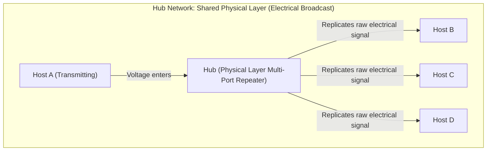
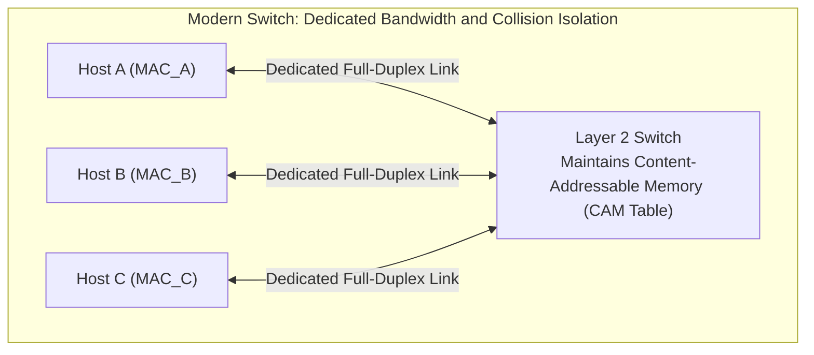
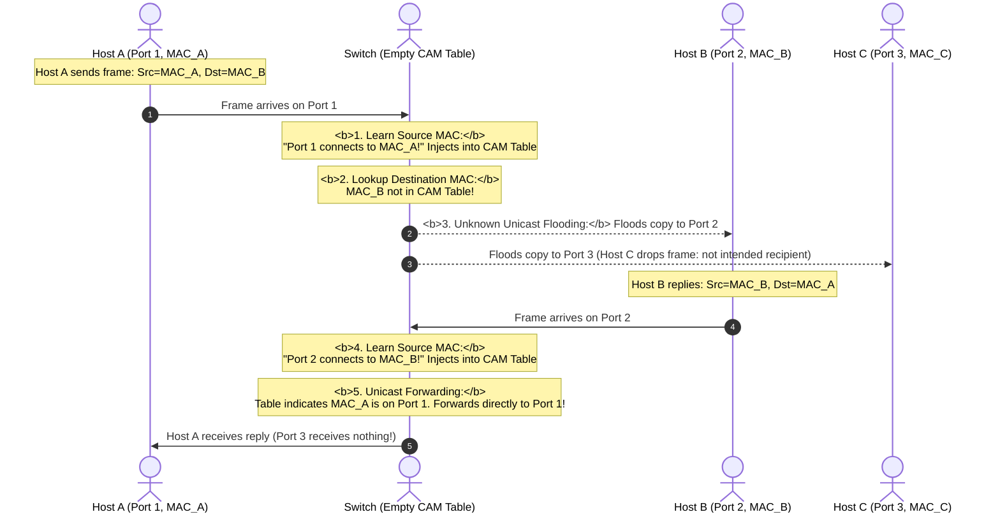
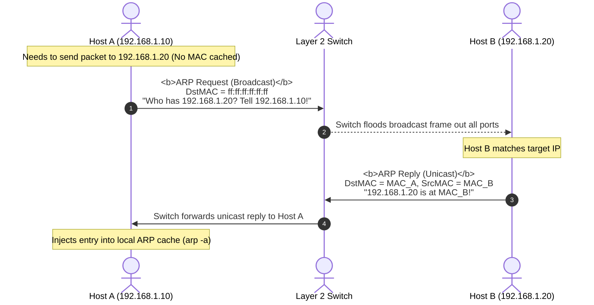

## Introduction: The Essence of Networking — How Do Two Computers "Talk"?

Picture a simple scenario: two computers sit on a desk—Computer A and Computer B. You want to transfer a file from Computer A to Computer B.

Inside a computer, every piece of text, image, and video exists solely as a string of binary digits (`0`s and `1`s, or bits).
- How do you deliver these bits from Computer A's memory directly into Computer B's memory?
- Can you simply connect the two motherboards with a copper wire?
- If an office has 100 computers, do you run physical wires between every single pair?

These core questions drove the evolution of computer networking over the past half-century.

This article is **Chapter 1 of our masterclass: Computer Networking: From Ethernet Principles to Hyperscale InfiniBand Architecture**. We set aside academic jargon to start **from ground zero**, tracing how tiny electrical currents and laser pulses give rise to **the physical layer, hub collision domains, Layer 2 switching, and Ethernet MAC/ARP addressing**.

---

## 1. Physical Layer (Layer 1): Bits, Voltages, Cables, and Fiber Optics

### 1.1 The Physical Manifestation of 0 and 1: Voltage Levels and Light Pulses

Computers are electronic devices. They cannot directly perceive abstract numbers; they respond only to **voltage shifts** or the **presence/absence of light pulses**:

```
NRZ Voltage Encoding of Binary Bits:
   High Voltage (+5V)  -------\       /-------\
                               \     /         \
   Low Voltage  ( 0V)           \-----/           \-------
   Binary Bit Stream:     1       0       1           0
```

1. **Electrical Signaling (Copper Cables)**: Data is represented by voltage transitions across conductors—e.g., high voltage indicates `1`, low voltage indicates `0`;
2. **Optical Signaling (Fiber Optics)**: Semiconductor lasers or LEDs pulse light down glass strands—light pulses indicate `1`, dark intervals indicate `0`.

### 1.2 Why Are Twisted-Pair Cables Spiraled?

A standard RJ45 Ethernet cable (such as Cat5e or Cat6) contains eight thin copper wires twisted into four distinct pairs. **Why twist the wires around each other instead of running them straight and parallel?**

```
Differential Signaling and Noise Cancellation:
Wire 1 (TX+) :  +  +  +  +  +  +  +  +  +  +  (Positive Signal)
Wire 2 (TX-) :  -  -  -  -  -  -  -  -  -  -  (Inverted Negative Signal)
      \       /       \       /       \
       \     /         \     /         \  <- Spiraled Twisting
        \   /           \   /           \
External Noise: ~~~~~ Penetrates both wires with near-identical voltage spike ~~~~~
Receiver Differential Amp: V_out = (TX+ + Noise) - (TX- + Noise) = TX+ - TX- (Noise Cancelled!)
```

- **First Principle: Eliminating Electromagnetic Interference (EMI)**:
  Physical environments are flooded with ambient electromagnetic radiation from power lines, fluorescent ballasts, and radio signals. Ethernet cables employ **Differential Signaling**, transmitting complementary voltages across twisted pairs.
  Because the two wires are twisted closely around one another, ambient noise couples equally into both conductors. When the receiving transceiver computes the **difference** between the two wires, common-mode noise cancels out, preserving signal integrity.

### 1.3 Optical Fiber: Single-Mode vs Multi-Mode

When link distances exceed 100 meters (the physical limit of copper Ethernet) or require 100 Gbps to 400 Gbps speeds, high-frequency signal attenuation makes copper impractical. Networks turn to **Fiber Optics**:

| Characteristic | Multi-Mode Fiber (MMF) | Single-Mode Fiber (SMF) |
| :--- | :--- | :--- |
| **Core Diameter** | Wide ($50\,\mu m$ or $62.5\,\mu m$) | Narrow (approx. $9\,\mu m$) |
| **Light Source** | Low-cost VCSEL / LED | Precision Long-Wavelength Laser Diode |
| **Propagation** | Multiple light modes bounce via total internal reflection | Single axial mode propagates without internal reflection |
| **Limiting Factor** | **Modal Dispersion** (pulse spreading over distance) | Near-zero modal dispersion |
| **Wavelength** | 850 nm | 1310 nm / 1550 nm |
| **Reach** | Tens to hundreds of meters (intra-datacenter racks) | Kilometers to tens of kilometers (campus backbones, metro/WAN) |
| **Jacket Color** | Aqua / Orange (OM3/OM4) | Yellow (OS1/OS2) |

---

## 2. From Hubs to Switches: The Evolution of Collision and Broadcast Domains

With transmission media established, consider four computers (A, B, C, D) in a room. How do we interconnect them?

### 2.1 The Legacy Era: Hubs and the "Collision Domain"

Early networks relied on **Hubs**. A hub's internal circuitry acts as a simple electrical splitter connecting all ports in parallel:



- **Mechanism**: When Host A transmits electrical pulses on Port 1, the hub amplifies and blindly repeats the voltage onto Ports 2, 3, and 4;
- **The Core Hazard: Collisions**:
  If Host A and Host B transmit simultaneously, their electrical signals collide on the shared conductor. The overlapping voltages corrupt both transmissions;
- **Collision Domain**: **A network segment where simultaneous transmissions from two or more devices cause electrical collisions**. All hosts plugged into a hub share a single collision domain.

#### The Classical Solution: CSMA/CD
To manage contention on shared media, Ethernet network adapters implemented **CSMA/CD (Carrier Sense Multiple Access with Collision Detection)**:
1. **Carrier Sense**: Listen before transmitting. If voltage on the wire indicates active traffic, wait;
2. **Collision Detection**: Listen while transmitting. If voltage spikes unexpectedly, a collision occurred;
3. **Jamming Signal**: Upon detecting a collision, abort transmission immediately and broadcast a 32-bit jam signal so all nodes recognize the collision;
4. **Exponential Backoff**: Each node waits a randomized backoff interval before attempting retransmission, avoiding immediate re-collisions.

### 2.2 The Layer 2 Revolution: Network Switches and CAM Tables

Shared media scales poorly: ten computers sharing a 100 Mbps hub effectively yield an average throughput of only 10 Mbps per host. To solve this, engineers developed the **Network Switch**.

Operating at the **Data Link Layer (Layer 2)**, a switch parses frame headers using dedicated memory and ASICs:



#### How Switches Eliminate Collisions
Each switch port constitutes an **isolated collision domain**. When Host A transmits to Host B, the switch crossbar matrix forwards traffic exclusively between Ports 1 and 2. **Hosts C and D see zero electrical noise and retain full wire bandwidth on their ports.**

---

## 3. Data Link Layer (Layer 2): MAC Addresses and Ethernet Frames

How does a switch know which port should receive Host A's data? It inspects the hardware identifier burned into each network interface card: the **MAC Address**.

### 3.1 What Is a MAC Address?

A MAC (Media Access Control) address is a globally unique 48-bit hardware identifier burned into a network interface's ROM:
- Represented as 12 hexadecimal characters, e.g., `08:00:27:B2:3C:9A`;
- **First 24 bits (OUI, Organizationally Unique Identifier)**: Assigned by the IEEE to hardware vendors (e.g., Intel, Apple, Cisco, NVIDIA/Mellanox);
- **Last 24 bits**: Vendor-assigned serial number for that specific interface.

### 3.2 Anatomy of the Ethernet II Frame

At Layer 2, data moves encapsulated within **Frames**:

```
Standard Ethernet II Frame (IEEE 802.3):
+----------------+-----+-------------+-------------+------+---------------+---------+
| Preamble       | SFD | Dest MAC    | Source MAC  | Type | Payload       | FCS     |
| (7 Bytes)      | 1B  | (6 Bytes)   | (6 Bytes)   | 2B   | (46 - 1500B)  | (CRC,4B)|
+----------------+-----+-------------+-------------+------+---------------+---------+
```

1. **Preamble & Start Frame Delimiter (SFD, 8 bytes total)**:
   Alternating patterns of `10101010...` ending in `10101011`. This bit sequence allows receiver clock circuits to synchronize with incoming bit edges;
2. **Destination MAC & Source MAC (6 bytes each)**:
   Identifies the sending and receiving hardware interfaces on the local link;
3. **EtherType (2 bytes)**:
   Identifies the encapsulated Layer 3 protocol:
   - `0x0800`: IPv4;
   - `0x86DD`: IPv6;
   - `0x0806`: ARP;
4. **Payload (46 to 1500 bytes)**:
   The encapsulated upper-layer packet. Minimum payload size is 46 bytes (padded if necessary to meet the 64-byte minimum frame size required by CSMA/CD slot time constraints). Maximum transmission unit (MTU) defaults to 1500 bytes;
5. **Frame Check Sequence (FCS / CRC32, 4 bytes)**:
   A cyclic redundancy check computed by the sender across the entire frame. The receiver recalculates the checksum; if noise flipped any bit in transit, the frame is discarded at the hardware level.

---

## 4. Switch CAM Table Learning and the ARP Protocol

### 4.1 How Switches Learn: The CAM Table Lifecycle

When a switch boots up, its MAC address table (CAM Table) is empty:



- **Aging Timer**: Learned MAC entries typically time out after 300 seconds of inactivity. This allows the switch to adapt dynamically if a machine is unplugged or moved to a different switch port.

### 4.2 ARP: Resolving IP Addresses to MAC Addresses

Applications address destinations by IP (e.g., `192.168.1.20`), but Layer 2 switches forward based on physical MAC addresses. How does a host discover the MAC address associated with a target IP?

It uses the **Address Resolution Protocol (ARP)**.



1. **ARP Request (Broadcast)**:
   The destination MAC is set to `ff:ff:ff:ff:ff:ff` (all ones broadcast). The switch replicates the frame to all active ports on the local network;
2. **ARP Reply (Unicast)**:
   The owner of the requested IP returns its MAC address via a directed unicast frame;
3. **Gratuitous ARP**:
   When an interface comes online, it broadcasts an ARP request querying its own assigned IP. If another host responds, the operating system detects an **IP Address Conflict** and alerts the user.

---

## 5. Practical Inspection Commands on Linux

Inspect Layer 1 and Layer 2 state on a Linux system using standard tools:

```bash
# 1. Inspect physical link state, negotiated duplex, and speed (Layer 1)
ethtool eth0
# Key output fields:
# Speed: 1000Mb/s              <- Negotiated link rate
# Duplex: Full                 <- Full-duplex (Zero collision domain)
# Link detected: yes           <- Physical carrier detected

# 2. Query hardware MAC addresses of local interfaces
ip link show eth0
# Output contains: link/ether 52:54:00:12:34:56 brd ff:ff:ff:ff:ff:ff

# 3. Display the OS ARP cache table (Layer 2 to Layer 3 mappings)
ip neigh show
# Sample output:
# 192.168.1.1 dev eth0 lladdr 00:50:56:c0:00:08 REACHABLE
```

---

## 6. Summary and Next Steps

The Physical and Data Link layers establish the foundation for local network communication:
- **The Physical Layer** encodes bits as voltage transitions or light pulses, using twisted pairs and low-dispersion optical fibers to resist noise and attenuation;
- **Legacy Hubs** shared physical media, bounding hosts within a single collision domain and relying on CSMA/CD;
- **Layer 2 Switches** eliminate collisions using **MAC addresses** and **CAM table learning**, delivering full-duplex wire-speed forwarding;
- **ARP** bridges logical IP addresses to physical MAC addresses.

However, Layer 2 networks cannot scale globally on their own:
- **Broadcast Storms**: If billions of devices shared a flat Layer 2 fabric, a single ARP broadcast would flood the entire Internet;
- **Flat Address Space**: MAC addresses are randomly burned into hardware without geographic or topological hierarchy; switches cannot store billions of entries in memory;
- Why must we layer **IP Addresses** on top of MAC addresses?
- What is a **Subnet Mask**, and how does binary bitwise arithmetic separate network prefixes from host identifiers?
- How does the **Default Gateway** rewrite frame headers when forwarding packets across subnets?

In Chapter 2 of our masterclass, we explore network-layer math: **[IP Addressing and Subnetting First Principles: Binary Arithmetic, Subnet Masks, CIDR, and Default Gateway Routing](/en/articles/ip-addressing-subnet-mask-cidr-default-gateway-routing/)**!

---

## Frequently Asked Questions (FAQ)

### Q1: Why do we need IP addresses if every network interface already has a unique MAC address?
**MAC addresses are flat identifiers, whereas IP addresses are hierarchical routing locators.**
- **MAC addresses resemble personal identity numbers**: Your ID number remains the same whether you are in Tokyo, London, or San Francisco. If the global Internet routed on MAC addresses alone, every router on Earth would need to track billions of flat MAC entries in memory, causing hardware forwarding tables to collapse;
- **IP addresses resemble postal addresses**: Structured hierarchically as Country $\to$ State $\to$ City $\to$ Street $\to$ Building. Core routers inspect only high-level network prefixes (e.g., regional aggregate routes) to forward packets across continents. The specific MAC address is resolved via ARP only on the final local hop. This hierarchical structure enables global route aggregation and internet-scale routing.

### Q2: What is the fundamental difference between a Collision Domain and a Broadcast Domain?
- **Collision Domain (Layer 1)**: A physical segment where simultaneous transmissions from multiple devices collide at the electrical/signal level. Hubs cannot isolate collision domains; **every port on a Layer 2 switch represents an independent collision domain**;
- **Broadcast Domain (Layer 2/3)**: The set of all devices that receive a broadcast frame (destination MAC `ff:ff:ff:ff:ff:ff`). Standard switches forward broadcasts out all active ports, so all ports share one broadcast domain; **only Layer 3 routers or switches segmented with VLANs divide broadcast domains**.

### Q3: How does ARP Spoofing compromise local networks, and how do switches mitigate it in hardware?
**Attack Mechanism**: ARP is stateless and lacks authentication. An attacker repeatedly sends forged ARP replies to a victim host stating: *"I am the gateway `192.168.1.1`, and my MAC is `AA:AA:AA:AA:AA:AA`"*. The victim overwrites its local ARP cache, redirecting all outbound internet traffic through the attacker's machine and enabling Man-in-the-Middle (MITM) inspection.
**Hardware Mitigation**: Enterprise switches deploy **Dynamic ARP Inspection (DAI)**. The switch snoops DHCP handshakes to build a trusted `<IP-MAC-Port>` binding database, dropping any ARP response packet on untrusted ports whose IP-MAC pairing does not match the hardware-validated binding table.
