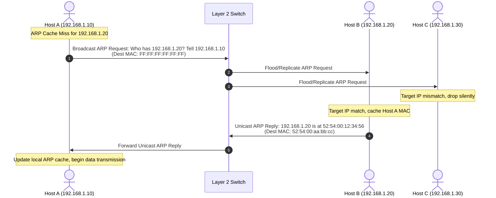
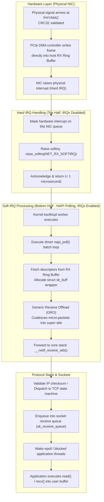

## Introduction: Deconstructing the Networking "Black Box" from First Principles

In modern software engineering—across microservice meshes, distributed storage, or hyperscale clusters synchronizing tens of thousands of GPUs—the network serves as the foundational physical reality governing latency, throughput, and system stability.

For many application developers, networking is treated as an opaque abstraction: invoking `socket.connect()` or issuing an HTTP request intuitively suggests that data simply arrives at its destination. However, when traffic floods overwhelm ingress gateways, tail latency spikes mysteriously, or distributed training stalls on barrier synchronization, abstract models break down.

In the physical world:
1. **Networks Are Bound by Physics, Not Magic**: Optical signals propagate through glass fibers at roughly two-thirds the vacuum speed of light (~$200\,\text{km/ms}$). Cross-continental propagation latency is physically irreducible;
2. **The Operating System Kernel is the Primary Bottleneck**: A single 100Gbps Ethernet interface running full-tilt on minimum-sized frames must process over **140 million packets per second (Mpps)**. Triggering a hardware interrupt per packet would paralyze even a 128-core bare-metal host in microseconds from interrupt livelock!

To architect resilient, ultra-high-throughput infrastructure, engineers must master the low-level physical layers, link-layer switching, and the kernel network subsystem.

As the inaugural chapter of **Computer Networking Masterclass: From Ethernet Principles to Hyperscale InfiniBand Architecture**, this guide explores low-level networking from raw physical signals: dissecting **Ethernet II framing**, **MAC addressing**, **ARP protocols and mitigation techniques**, and tracing the **Linux NAPI softirq packet path**.

---

## 1. Physical & Data Link Layers: Ethernet Physical Reality

### 1.1 From Twisted Pair to Fiber: How Signals Become Bits
The Physical Layer (Layer 1) transmits raw, unstructured bitstreams across physical media:
- **Copper (Twisted Pair / DAC - Direct Attach Copper)**: Transmits electrical voltage differentials. At ultra-high signaling rates (e.g., 25G/100G DAC), skin effect and high-frequency attenuation strictly constrain reach to 3–5 meters;
- **Optical Fiber (Multimode MMF / Singlemode SMF)**: Leverages total internal reflection of laser pulses. Modern high-speed transceivers employ **PAM4 (4-level Pulse Amplitude Modulation)** encoding, packing 2 bits per optical baud symbol to drive per-lane bandwidths from 50Gbps to 100Gbps and 200Gbps.

### 1.2 Ethernet II Frame Anatomy

At the Data Link Layer (Layer 2), continuous bitstreams are structured into standardized **Ethernet Frames**:

```
Ethernet II Frame Physical Layout:
+------------+-------+------------+------------+-----------+----------------------+-----------+
| 7 Bytes    | 1 B   | 6 Bytes    | 6 Bytes    | 2 Bytes   | 46 - 1500 Bytes      | 4 Bytes   |
| Preamble   | SFD   | Dest MAC   | Src MAC    | EtherType | Data Payload (MTU)   | FCS CRC32 |
+------------+-------+------------+------------+-----------+----------------------+-----------+
```

1. **Preamble (7 Bytes) & SFD (Start Frame Delimiter, 1 Byte)**:
   A repeating pattern of `10101010...` terminating in `10101011`. Enables receiver physical transceiver circuitry (PHY) to synchronize its bit clock and lock frame boundaries;
2. **MAC Address (6 Bytes / 48 Bits)**:
   Globally unique hardware address (first 24 bits denote vendor OUI, last 24 bits represent device serial). Broadcast MAC is represented as `FF:FF:FF:FF:FF:FF`;
3. **EtherType (2 Bytes)**:
   Identifies the encapsulated network-layer protocol: `0x0800` (IPv4), `0x86DD` (IPv6), `0x0806` (ARP), or `0x8100` (802.1Q VLAN tagged);
4. **MTU (Maximum Transmission Unit, Payload Length)**:
   Standard Ethernet payloads range from **46 to 1500 bytes**. Payloads smaller than 46 bytes (such as a bare 40-byte TCP ACK) are padded to guarantee a minimum 64-byte frame length;
5. **FCS (Frame Check Sequence, 4 Bytes)**:
   A 32-bit Cyclic Redundancy Check (CRC32). The transmitter computes the checksum on frame egress; the receiving NIC hardware verifies it upon ingress, silently dropping corrupted frames in silicon without burning host CPU cycles.

> [!NOTE]
> **Jumbo Frames in Production**: Transmitting 9000 bytes over standard Ethernet requires 6 individual 1500-byte frames, incurring 6 protocol headers and 6 CPU interrupt cycles. Standardizing on **MTU=9000 (Jumbo Frames)** in storage fabrics (Ceph/NFS) and AI compute clusters reduces header overhead by 80% and slashes packet-processing interrupts.

---

## 2. Link-Layer Address Resolution: ARP and Linux Kernel Defenses

Within an Ethernet local area network (LAN), frame delivery relies strictly on MAC addresses, yet applications operate with IP addresses. Translating 32-bit IP addresses into 48-bit MAC addresses is the function of the **Address Resolution Protocol (ARP)**.



### 2.1 Gratuitous ARP: IP Conflict Detection and High-Availability Failover
A Gratuitous ARP is an unprompted ARP broadcast query sent by a host asking for its own IP address:
1. **IP Conflict Detection**: Upon interface initialization, an OS sends Gratuitous ARPs. If a reply is received, another host is using that IP, triggering an immediate conflict alert;
2. **VIP Failover (Keepalived / Virtual IP)**: In active-backup load balancer clusters, when the active master crashes, the backup node binds the Virtual IP (VIP) and broadcasts a burst of Gratuitous ARPs, updating forwarding tables on upstream switches and neighbor caches within milliseconds.

### 2.2 Production Defense: Multi-NIC Servers and LVS ARP Suppression
When multi-homed Linux servers run Virtual IPs on loopback interfaces (`lo`) in Direct Routing (LVS-DR) architectures, default kernel ARP behaviors cause address conflicts across network segments.

Harden ARP behavior via `/etc/sysctl.conf`:
```bash
# Reply to ARP requests only if target IP matches local address of incoming interface
net.ipv4.conf.all.arp_ignore = 1
net.ipv4.conf.eth0.arp_ignore = 1

# Always use best local address for outgoing ARP requests (matches egress interface IP)
net.ipv4.conf.all.arp_announce = 2
net.ipv4.conf.eth0.arp_announce = 2
```

---

## 3. Inside the Linux Kernel: The NAPI Packet Path Demystified

From electrical packet ingress at physical NIC pins to user-space application consumption via `recv()`, the Linux kernel executes a pipelined architecture balancing **sub-microsecond latency and overload livelock prevention**:



### 3.1 Foundational Data Structures: Ring Buffers and `sk_buff`
1. **RX/TX Ring Buffers**:
   Circular pointer arrays allocated in host memory shared between the NIC driver and hardware. They contain fixed-size memory **descriptors** rather than packet payloads. The NIC's PCIe DMA controller transfers packet data directly into host RAM without consuming CPU cycles;
2. **`sk_buff` (Socket Buffer)**:
   The core memory structure of the Linux network stack. By maintaining four internal pointers (`head`, `data`, `tail`, `end`), the kernel prepends and strips protocol headers (Ethernet, IP, TCP) purely by adjusting pointer offsets, **eliminating physical memory copies across layers**.

### 3.2 The Architectural Necessity of NAPI (New API)
Legacy drivers used pure interrupt-driven models: every arriving packet triggered a CPU hardware interrupt. Under high packet rates, CPU cores spent 100% of clock cycles saving registers and switching interrupt contexts, freezing the host in **Interrupt Livelock**.

**The NAPI Solution**:
- **Low Traffic (Interrupt Mode)**: In quiet periods, the NIC fires hard IRQs to guarantee sub-microsecond wakeups;
- **High Traffic (Adaptive Polling)**: The first packet triggers an interrupt, but the handler immediately **masks subsequent hardware interrupts on that queue** and schedules NAPI polling;
- **Batch Drain**: The kernel softirq daemon (`ksoftirqd`) polls the RX Ring Buffer in batches (up to `netdev_budget=300` packets per round);
- **Return to Sleep**: Once the Ring Buffer is drained, interrupts are re-enabled, returning the system to low-power interrupt mode.

---

## 4. Production High-Throughput NIC Tuning

Under hundreds of thousands of QPS or multi-gigabit workloads, default Linux network parameters inevitably trigger packet drops.

### 4.1 Diagnostic Inspection
```bash
# 1. Audit Ring Buffer drops and hardware FIFO overrun counters
ethtool -S eth0 | grep -E "rx_dropped|rx_errors|rx_fifo_errors|rx_missed_errors"

# 2. Inspect softirq distribution across physical CPU cores (check for single-core saturation)
cat /proc/softirqs | grep NET_RX

# 3. Monitor kernel network backlog overflow statistics
cat /proc/net/softnet_stat
```

### 4.2 Production Tuning Parameters
```bash
# Step 1: Expand physical NIC Ring Buffers to maximum hardware capacity (prevents DMA overflow)
ethtool -G eth0 rx 4096 tx 4096

# Step 2: Enable hardware offload features (GRO coalescing, TSO segmentation, checksums)
ethtool -K eth0 gro on tso on gso on rxhash on

# Step 3: Optimize kernel softirq polling queues in /etc/sysctl.conf
# Maximum packets polled per softirq execution slice
net.core.netdev_budget = 600
# Maximum microseconds spent per softirq execution slice
net.core.netdev_budget_usecs = 4000
# Maximum backlog queue size for incoming packets prior to protocol handling
net.core.netdev_max_backlog = 100000
```

---

## 5. Summary and Transition

From physical signaling to the kernel's `sk_buff` pipelines, we have explored the foundational substrate of computer networking:
- **Ethernet Framing & MTU** establish physical boundaries for data transfers, where Jumbo Frames minimize CPU tax;
- **MAC Addressing & ARP** bridge logical IPs to hardware endpoints, where Gratuitous ARP powers VIP failovers;
- **NAPI & Softirq Pipelines** provide the Linux kernel's high-speed defense against interrupt livelock.

However, single-host link-layer communication is only the beginning:
- When packets must navigate across multiple autonomous routers and long-haul links, how does IP routing compute longest-prefix matches?
- Across lossy wide-area networks, how does TCP construct an absolute reliability abstraction via its classic 11-state machine, three-way handshake, and four-way teardown?
- How do sliding windows optimize end-to-end throughput without overrunning receiver memory buffers?

In Chapter 02, **[Network Layer & Transport Layer Deep Dive: IP Routing, CIDR, TCP State Machines, and Sliding Window First Principles](/en/articles/network-layer-transport-layer-ip-routing-tcp-state-machine/)**, we ascend to the network and transport layers!

---

## Frequently Asked Questions (FAQ)

### Q1: Why is the minimum Ethernet frame length mandated at 64 bytes (with at least 46 bytes of payload)?
**Root Cause: The Slot Time collision-detection requirement of half-duplex CSMA/CD**.
In legacy shared coaxial Ethernet, signals take time to propagate across cables (round-trip propagation delay RTT). To guarantee that a sending station detects collisions before completing transmission, frame duration must exceed the network's maximum round-trip transit time ($51.2\,\mu\text{s}$).
On a 10Mbps link, $51.2\,\mu\text{s} \times 10\,\text{Mbps} = 512\,\text{bits} = 64\,\text{bytes}$. If frames could be smaller, a sender might complete transmission before a collision pulse returned, falsely assuming success. While modern full-duplex switched networks eliminate collision domains, the 64-byte minimum frame size is permanently preserved as a global compatibility standard.

### Q2: Why does `top` report 100% `si` (software interrupt) utilization on CPU 0 while all other cores idle, and how is it resolved?
**Root Cause: Single-queue NIC hardware or unconfigured IRQ Affinity**.
By default, all hardware interrupts from a network interface may route to CPU 0. Even on a 64-core system, hard IRQs and subsequent `NET_RX_SOFTIRQ` routines saturate CPU 0 while neighboring cores idle, causing massive packet drops.
**Resolution**:
1. Ensure the driver operates multiple queues (RSS, Receive Side Scaling): `ethtool -L eth0 combined 8`;
2. Enable `irqbalance` or pin individual queue interrupts across distinct CPU cores by configuring hexadecimal bitmasks into `/proc/irq/<irq_number>/smp_affinity`.

### Q3: How do hardware interrupts, softirqs (ksoftirqd), and user-space system calls (`recv()`) coordinate without corrupting memory?
1. **DMA Isolation**: The NIC writes received frames directly into host RAM (Ring Buffer) via PCIe DMA without interrupting CPU registers or caches;
2. **Top-Half Hard IRQ**: The NIC triggers an interrupt; the CPU masks further hardware interrupts on that queue, raises a `NET_RX_SOFTIRQ` flag, and returns in sub-microsecond time;
3. **Bottom-Half Softirq**: The `ksoftirqd` daemon wakes, polls the Ring Buffer with interrupts enabled, constructs `sk_buff` objects, and enqueues payload segments into the socket's receive buffer;
4. **User-Space Copy**: Blocked threads or `epoll` instances awaken, invoking `recv()`. The kernel copies payload bytes from the kernel socket buffer into user-space memory, safely concluding the receive lifecycle.
