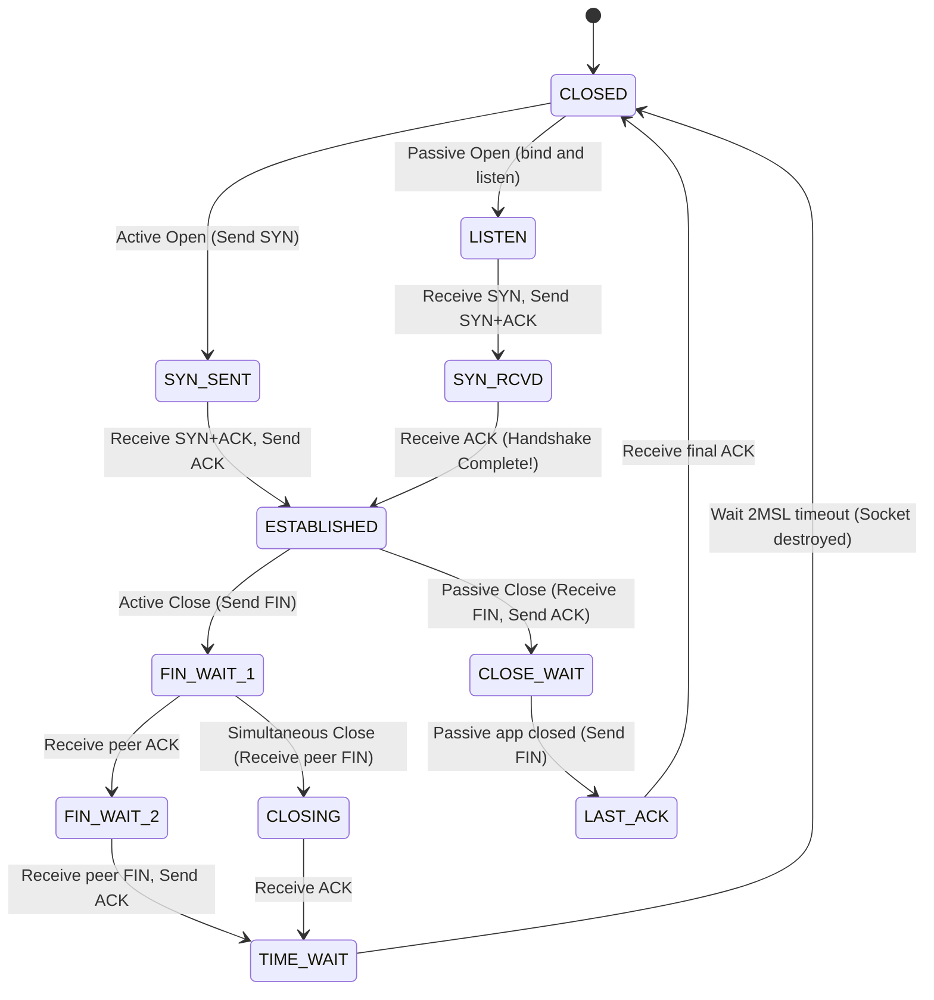
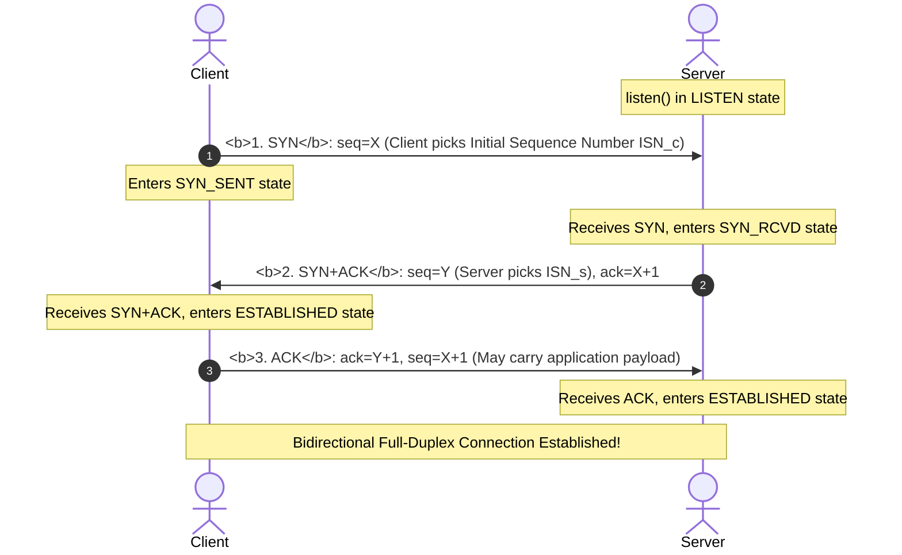
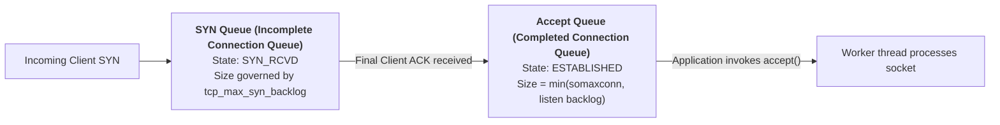

## Introduction: Forging Determinism over an Untrusted Medium

In the first chapter of our masterclass, [Computer Networking First Principles: Physical Layer, Ethernet, MAC Addressing, and Linux NAPI Kernel Path](/en/articles/network-fundamentals-ethernet-mac-arp-linux-packet-path/), we explored how raw frames traverse local physical links, MAC addresses, and NIC Ring Buffers.

However, the global Internet is a vast, heterogeneous web of millions of local area networks bridged together by intermediate routers:
- **The physical universe is inherently unreliable**: Transoceanic submarine cables can be severed, router hardware queues frequently experience buffer overflow during traffic spikes, and wireless links suffer severe electromagnetic interference;
- **Stateless Best-Effort Delivery**: The IP protocol is strictly best-effort. It does not guarantee in-order delivery, does not guarantee against loss, and does not prevent packets from being duplicated or reordered by multi-path routing fabrics.

Confronted with this chaotic substrate fraught with packet loss, reordering, duplication, and latency jitter, computer scientists conceived one of the greatest software marvels in engineering history: **TCP (Transmission Control Protocol)**.

Through ingenious **Sequence Number acknowledgments, bidirectional Sliding Windows, and a rigorous 11-state transition machine**, TCP conjures an **error-free, non-lossy, deduplicated, and strictly ordered full-duplex byte stream** out of a fundamentally unreliable IP substrate.

As Part 2 of our masterclass **Computer Networking: From Ethernet to 10,000-GPU InfiniBand Architectures**, this article guides you through Layer 3 and Layer 4: starting from **IP routing lookups and CIDR**, dissecting the **TCP 3-way handshake and 4-way teardown state machines**, and unraveling the **first principles of sliding windows and flow control**.

---

## 1. Network Layer (Layer 3): IP Packet Structure and Longest Prefix Match (LPM)

### 1.1 Physical Anatomy of the IPv4 Header

```
IPv4 Header Structure (Fixed 20 bytes without Options):
 0                   1                   2                   3
 0 1 2 3 4 5 6 7 8 9 0 1 2 3 4 5 6 7 8 9 0 1 2 3 4 5 6 7 8 9 0 1
+-+-+-+-+-+-+-+-+-+-+-+-+-+-+-+-+-+-+-+-+-+-+-+-+-+-+-+-+-+-+-+-+
|Version|  IHL  |Type of Service|          Total Length         |
+-+-+-+-+-+-+-+-+-+-+-+-+-+-+-+-+-+-+-+-+-+-+-+-+-+-+-+-+-+-+-+-+
|         Identification        |Flags|      Fragment Offset    |
+-+-+-+-+-+-+-+-+-+-+-+-+-+-+-+-+-+-+-+-+-+-+-+-+-+-+-+-+-+-+-+-+
|  Time to Live |    Protocol   |         Header Checksum       |
+-+-+-+-+-+-+-+-+-+-+-+-+-+-+-+-+-+-+-+-+-+-+-+-+-+-+-+-+-+-+-+-+
|                       Source IP Address                       |
+-+-+-+-+-+-+-+-+-+-+-+-+-+-+-+-+-+-+-+-+-+-+-+-+-+-+-+-+-+-+-+-+
|                    Destination IP Address                     |
+-+-+-+-+-+-+-+-+-+-+-+-+-+-+-+-+-+-+-+-+-+-+-+-+-+-+-+-+-+-+-+-+
```

1. **TTL (Time to Live, 8 bits)**:
   Every router hop decrements TTL by 1. When it hits 0, the router drops the packet and transmits an ICMP Time Exceeded message back to the source. **This is the fundamental safeguard preventing rogue packets from looping infinitely in cyclic routing topologies**;
2. **Identification, Flags, and Fragment Offset**:
   When an IP datagram exceeds the egress link MTU (e.g., 1500 bytes) and the DF (Don't Fragment) bit is 0, the router fragments the payload. All fragments share the same Identification. The receiver reconstructs the original datagram using the Offset. In modern high-throughput networks, fragmentation introduces severe tail-latency amplification and head-of-line blocking; modern stacks enforce **PMTUD (Path MTU Discovery)** with DF=1 to eliminate network-layer fragmentation entirely;
3. **Protocol (8 bits)**:
   Identifies the transport protocol: `0x06` for TCP, `0x11` for UDP, and `0x01` for ICMP.

### 1.2 Classless Inter-Domain Routing (CIDR) and Longest Prefix Match (LPM)

In the early days of ARPANET and early Internet, addresses were categorized into rigid Classes (Class A, B, C), resulting in astronomical address wastage. In 1993, **CIDR (Classless Inter-Domain Routing, e.g., `192.168.1.0/24`)** decoupled addressing from rigid octet boundaries.

When the Linux kernel or a hardware switch inspects its Forwarding Information Base (FIB), multiple rules may simultaneously match an incoming packet:
- Route A: `10.0.0.0/8` via `eth0`
- Route B: `10.1.0.0/16` via `eth1`
- Route C: `10.1.2.0/24` via `eth2`

**Longest Prefix Match (LPM) Rule**: When the destination IP is `10.1.2.55`, all three routes match, but the kernel **always selects Route C (/24) because it has the longest subnet mask and the most specific address scope!** In the Linux kernel, this lookup is driven by highly optimized Level-Compressed Trie (LC-Trie) data structures.

---

## 2. Transport Layer (Layer 4): The 11 TCP States, Handshake, and Teardown

TCP models network communication as a synchronized state machine between two endpoints. Its complete lifecycle comprises **11 distinct states**:



### 2.1 Dissecting the 3-Way Handshake: Why Not Two? Why Not Four?



#### Why Must It Be Exactly Three Packets?
1. **Preventing Stale Duplicate Connection Initialization**:
   Imagine an old, delayed SYN packet traversing a congested router that arrives at the server long after the client has given up. With only a 2-way handshake, the server would immediately allocate memory and consider the connection live. In a 3-way handshake, when the client receives the server's SYN+ACK with an unexpected acknowledgment number, it immediately dispatches an **RST packet** to abort the invalid connection;
2. **Synchronizing Both Initial Sequence Numbers (ISN)**:
   Because TCP is full-duplex, both parties must independently declare their own sequence numbers ($X$ and $Y$) and verify that the peer has confirmed them. The client announces $X$ and receives confirmation (Steps 1 & 2); the server announces $Y$ and receives confirmation (Steps 2 & 3). Bundling the server's ACK and SYN into Step 2 collapses 4 interactions cleanly into 3!

### 2.2 SYN Queue, Accept Queue, and SYN Flood Mitigation

During the three-way handshake, the Linux kernel manages two queues for each listening socket:



#### The Lethal Threat: SYN Flood Attack
Attackers spoof millions of random source IPs and flood the server with SYN packets, deliberately withholding the final ACK. The server's SYN Queue exhausts its memory budget within milliseconds, starving legitimate user connections.

#### The Production Remedy: SYN Cookies
Enabled via `/etc/sysctl.conf`:
```bash
net.ipv4.tcp_syncookies = 1
```
- **How it works**: When the SYN Queue overflows, the kernel **refuses to allocate socket buffers (`struct sock`) in memory**;
- Instead, it hashes the 4-tuple (Client IP, Client Port, Server IP, Server Port) combined with a local secret timestamp to compute a cryptographic token, used directly as the server's Initial Sequence Number $Y$ (the SYN Cookie);
- Only when the client responds with a valid ACK does the server reconstruct and verify the Cookie, allocating connection resources just-in-time—**completely neutralizing memory exhaustion attacks!**

### 2.3 4-Way Teardown and the First Principles of TIME_WAIT

Terminating a TCP connection requires four steps because TCP supports "half-close": when an endpoint sends a FIN, it indicates that it has finished transmitting data, but it remains fully capable of receiving data sent by the peer.

#### Why Must the Active Closer Linger in TIME_WAIT for 2MSL?
MSL (Maximum Segment Lifetime) represents the longest duration an IP datagram can survive in the network before being dropped (defaulting to 30 seconds on Linux; 2MSL is approximately 60 seconds).
1. **Ensuring Reliable Delivery of the Final ACK**:
   If the client's final ACK packet is dropped by an intermediate router, the server will time out and retransmit its FIN. Remaining in TIME_WAIT allows the client to catch the retransmitted FIN and reissue the ACK. If the client destroyed its socket immediately, the server's retransmitted FIN would trigger an unexpected RST;
2. **Purging Stale Packets from the Network**:
   Dwelling in TIME_WAIT for 2MSL guarantees that any duplicate packets wandering through multi-path routing fabrics will expire and die naturally. This prevents a newly spawned connection reusing the same 4-tuple from inadvertently consuming corrupted, delayed packets from the previous session.

---

## 3. Sliding Window and Flow Control

TCP achieves high network throughput through its **pipelined sliding window mechanism**, abandoning the sluggish stop-and-wait paradigm.

```
TCP Sender Sliding Window Model:
          Sent & Acked            Sent & Unacked        Usable Window (Unsent)        Cannot Send Yet
        [ ... 1 2 3 4 ]       [ 5 6 7 8 ]        [ 9 10 11 12 ]       [ 13 14 15 ... ]
                               |<---------- Send Window (SND.WND) ---------->|
                               ^                  ^                    ^
                            SND.UNA            SND.NXT              SND.UNA + SND.WND
```

1. **SND.UNA (Send Unacknowledged)**: Sequence number of the earliest unacknowledged byte;
2. **SND.NXT (Send Next)**: Sequence number of the next byte scheduled to be sent;
3. **Advertised Window (win)**: Announced dynamically by the receiver in every TCP header, indicating the remaining byte capacity in its kernel receive buffer.

### 3.1 Breaking the 64KB Ceiling: Window Scaling

The legacy TCP header allocated only 16 bits for the window size, capping the maximum advertised window at $2^{16} - 1 = 65,535\,\text{Bytes}$ (64KB). Over modern high-bandwidth long-delay fiber links (large BDP), a 64KB window cannot even saturate a 100Mbps link!
- Modern networks negotiate **TCP Window Scale (RFC 7323)** during the 3-way handshake, bit-shifting the window value up to 14 bits leftward, expanding the effective sliding window ceiling to **1 GB**;
- Production requirement: ensure `net.ipv4.tcp_window_scaling = 1` is turned on.

### 3.2 Silly Window Syndrome and TCP_NODELAY in Practice

In low-latency RPC gateways, financial order routing, and gaming backends, engineers frequently suffer from sudden latency spikes. This is almost always caused by the **deadly interaction between Nagle's Algorithm and Delayed ACK**:
- **Nagle's Algorithm**: Buffers outgoing small packets until a full MSS (Maximum Segment Size) is accumulated or until an outstanding ACK arrives;
- **Delayed ACK**: The receiver postpones sending ACKs (by 40ms to 200ms), hoping to piggyback the acknowledgment onto an outgoing response payload;
- **The 40ms Standoff**: The sender waits for an ACK, while the receiver waits for more data. Both nodes stall in silence for 40ms!
- **Production Standard**: All latency-sensitive TCP sockets (such as gRPC, Redis clients, reverse proxies) must explicitly disable Nagle's algorithm at the socket layer:
  ```c
  int flag = 1;
  setsockopt(sock, IPPROTO_TCP, TCP_NODELAY, (char *)&flag, sizeof(int));
  ```

---

## 4. Production-Grade TCP Kernel Parameter Tuning

```bash
# 1. Expand Accept Queue and SYN Queue limits
net.core.somaxconn = 65535
net.ipv4.tcp_max_syn_backlog = 65535

# 2. Allow outbound port reuse for TIME_WAIT sockets (Client-side only)
net.ipv4.tcp_tw_reuse = 1

# 3. Optimize dynamic buffer scaling (min / default / max memory in bytes)
net.ipv4.tcp_rmem = 4096 87380 16777216
net.ipv4.tcp_wmem = 4096 65536 16777216

# 4. Tune keepalive timers to reap dead zombie sockets
net.ipv4.tcp_keepalive_time = 300     # Send probe after 5 minutes of idle
net.ipv4.tcp_keepalive_intvl = 15     # Interval between probes: 15s
net.ipv4.tcp_keepalive_probes = 3     # Disconnect after 3 consecutive failed probes
```

---

## 5. Summary and Next Steps

The design of the Network and Transport Layers represents a masterclass in distributed systems engineering:
- **IP & CIDR** establish the global addressing coordinate system, while Longest Prefix Matching (LPM) enables line-rate packet forwarding;
- **TCP 3-Way Handshake & 4-Way Teardown** conquer asynchronous transport hazards and rogue duplicate packets using a rigorous 11-state machine;
- **Sliding Windows and Flow Control** ensure the sender does not overwhelm the receiver's buffer space.

However, end-to-end flow control only protects the **receiver's memory**—it possesses zero visibility into the **congestion state of intermediate routers and optical switches**:
- When thousands of hosts concurrently pump traffic into the network, switch buffers overflow, causing massive packet loss and throughput collapse;
- How did congestion control evolve from early loss-driven models (Reno, Cubic) to Google's revolutionary delay-bandwidth model **BBR**?
- Why is the industry moving past TCP toward UDP-based **HTTP/3 (QUIC)** in 2026?

In Chapter 3 of our masterclass, we dive straight into network control theory: **[TCP Congestion Control Evolution & High-Performance Transport: From Reno and Cubic to BBR Mathematical Models, and the HTTP/2 to HTTP/3 (QUIC) Revolution](/en/articles/tcp-congestion-control-reno-cubic-bbr-quic-http3/)**!

---

## Frequently Asked Questions (FAQ)

### Q1: Why does TCP require three packets to establish a connection, but four packets to close it?
**The fundamental reason is the asymmetry between data transmission completion and peer application termination in full-duplex communication.**
- **Handshakes can be combined (3 packets)**: During connection initialization, when the server receives the client's SYN, it can simultaneously bundle its acknowledgment (ACK) and its own connection request (SYN) into a **single packet (SYN+ACK)**, completing setup in 3 flights;
- **Teardowns cannot be combined immediately (4 packets)**: When the client sends a FIN, it only indicates that the client has no further data to transmit. The server may still have queued data or pending application requests that must be delivered to the client. Thus, the server must **immediately respond with an ACK** to confirm receipt of the client's FIN, finish processing its workload, and only later issue its own FIN when invoking `close()`. Because the server's ACK and FIN are separated in time, the teardown requires 4 distinct steps.

### Q2: With thousands of sockets stuck in `TIME_WAIT` on a production server, should we enable `tcp_tw_recycle` to reclaim ports rapidly?
**Never! Enabling `tcp_tw_recycle` in modern production environments causes catastrophic, random connection drops for real clients!**
`tcp_tw_recycle` relies on monotonically increasing PAWS (Protect Against Wrapped Sequences) timestamps per remote IP. In the real Internet, client traffic almost invariably passes through corporate or mobile NAT gateways. Different client devices behind the same public NAT address exhibit slight clock skews. When `tcp_tw_recycle` is active, the server interprets packets from a device with a slightly slower clock as stale duplicate segments and drops them silently, causing widespread connection timeouts and 502 errors.
*Note: Linux kernel 4.12+ has completely removed `tcp_tw_recycle`.*
**The correct remedy**: Enable `net.ipv4.tcp_tw_reuse = 1` (which safely reuses outbound client sockets) and deploy reverse proxies (such as Nginx or Envoy) with persistent connection pooling toward backend servers.

### Q3: What causes the "40ms latency standoff" between Nagle's algorithm and Delayed ACK, and how can microservices eliminate it?
Nagle's algorithm mandates that a sender buffer subsequent small packets until an ACK for previously transmitted data has arrived. Conversely, the receiver's Delayed ACK timer waits (typically 40ms) before responding, hoping to attach the ACK to an upcoming application reply.
When a microservice issues an RPC request consisting of a small header followed by a small payload body, the first chunk triggers Nagle's waiting condition, while the receiver triggers Delayed ACK. Both endpoints sit idle waiting on each other, causing inter-service RPC latency to jump by 40ms even within the same rack!
**The solution**: In all latency-critical TCP services (e.g., gRPC, Redis drivers, Kafka clients, Netty), **unconditionally invoke `setsockopt(..., TCP_NODELAY)` to disable Nagle's algorithm**, allowing the network interface card to dispatch small packets without artificial serialization delay.
