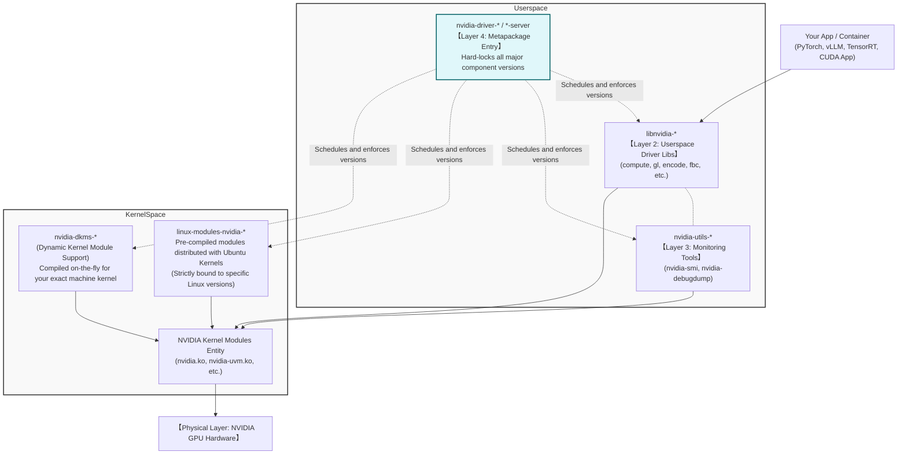

## A Beginner's Nightmare: Why Does Installing Drivers Break the System?

Deploying deep learning workstations or large language model (LLM) inference servers usually means crossing swords with NVIDIA GPU driver deployments—arguably the most frustrating process in Linux computing.

If you have ever downloaded a `.run` file directly from NVIDIA's website, mashed the enter key, and ended up with a broken desktop environment, or if an automatic Ubuntu kernel update suddenly triggered the dreaded `NVIDIA-SMI has failed because it couldn't communicate with the NVIDIA driver` message, it means you haven't grasped the true packaging logic of NVIDIA distributions on Linux.

When you type `apt search nvidia-driver` in the terminal, the hundred-line output featuring components like `ubuntu-drivers`, `nvidia-dkms`, `libnvidia-compute`, and various packages trailing with `-server` suffices is enough to make anyone dizzy.

**To permanently cure this deployment anxiety, the only way out is to abandon the "one-click UI installer" mindset and truly understand the "5-Layer Relationship" of the NVIDIA driver stack in Linux.**

---

## 60-Second Mantras: Mastering the Naming Conventions

Before diving into complex system architecture diagrams, absolutely burn these four rules into your memory:

1. **`linux-modules-nvidia-*` or `nvidia-dkms-*` are the actual physical drivers**: They run in Kernel Space and are the only things actually talking to the GPU hardware silicon.
2. **`nvidia-driver-*` is just an empty checklist (Meta-package)**: It contains almost no code. Its single purpose is to orchestrate the installation of matching kernel modules, user-space libraries, and utilities, forcing them strictly into alignment.
3. **`libnvidia-*` are the user-space translators (Userspace Libraries)**: Upper-level frameworks like PyTorch or vLLM never talk directly to the OS kernel. They exclusively call these libraries (e.g., `libnvidia-compute`).
4. **`nvidia-utils-*` is the admin toolbox**: The famous `nvidia-smi` monitoring panel lives inside this package.

---

## The Deep Dive: The 5-Layer NVIDIA Driver Architecture

With the mantas memorized, let's look at how a signal travels from running a line of PyTorch Python code all the way down to the physical graphics card.



### Layer 1: Hardware Interface (Kernel Modules)
This is the bedrock of all applications. Regardless of how many cutting-edge AI frameworks you install, if the `.ko` modules fail to mount into the Linux kernel, the GPU is nothing but an expensive heating brick to the OS.
* **Route A: Static Pre-compiled (`linux-modules-nvidia-xxx`)**: Officially packaged by Canonical/Ubuntu, strictly bound to a specific Ubuntu Kernel version. *Pros*: Lightning fast and stable. *Cons*: **The moment your Linux Kernel upgrades, it breaks instantly.**
* **Route B: Dynamic Compilation (`nvidia-dkms-xxx`)**: The king of DKMS (Dynamic Kernel Module Support). It automatically fetches driver source code (`nvidia-kernel-source`) and your current kernel headers (`linux-headers`) to compile the driver on your machine. **Highly recommended; this is your ultimate shield against kernel-update-induced breakage.**

### Layer 2: Userspace Libraries
**Examples**: `libnvidia-compute-535`, `libnvidia-gl-535`, `libnvidia-decode-535`
For LLM inference or AI training, you care most about `libnvidia-compute`. It exposes the crucial CUDA Driver API functions needed for compute tasks. Graphic engineers rely on `libnvidia-gl`.
*Warning*: If manual intervention causes a version split (e.g., this layer is stuck at 530 while the Layer 1 kernel module upgraded to 535), your system will crash with the notorious error: `Driver/library version mismatch`.

### Layer 3: System Utilities
**Examples**: `nvidia-utils-535` or `nvidia-utils-535-server`
Contains all CLI tools for debugging and monitoring.

### Layer 4: The Project Manager (Metapackage)
**Examples**: `nvidia-driver-535` or `nvidia-driver-535-server`
In daily operations, you simply instruct the package manager: `apt install nvidia-driver-535-server`. Think of it as a project manager pulling down all dependencies from the previous three layers using correct, mutually compatible versions, sparing you from manual matching.

### 【Special Add-on Layer】 Highway Maintenance (Fabric / NVSwitch)
**Examples**: `nvidia-fabricmanager-*`, `libnvidia-nscq-*`
Exclusive to multi-GPU computing behemoths featuring **NVSwitch chips** (HGX/DGX systems).
Regular consumer desktops or simple servers do not need this. On an HGX/DGX, if the Fabric Manager (a background daemon) isn't running and precisely version-aligned with the NVIDIA Driver, the extremely expensive NVLink interconnects function like severed fiber-optic cables, making inter-GPU high-speed communication impossible.

---

## The Core Dilemma: `-server` Suffix vs. Un-suffixed Packages

When running `apt search`, deciding between `nvidia-driver-535` and `nvidia-driver-535-server` triggers severe choice paralysis. Here is the golden rule:

**If your monitor handles Chrome and Gaming, use the Un-suffixed branch; if your machine is locked in a server room crunching matrix multiplications or running Docker, use `-server`.**

| Comparison Dimension | `-server` Suffixed Packages | Un-suffixed Packages (General) |
|---------|---------------------|------------------------|
| **Target Audience** | **Data Center DevOps, AI Researchers, MLOps Engineers** | Gamers, CUDA desktop learners, UI/UX designers |
| **Functional Focus** | Servers, Headless Compute priority | Desktop Graphics, Display priority |
| **Included Components** | Base driver layer, CUDA compatibility, Container API dependencies. Strips out bloated 3D/GL graphic dependencies for minimalism. | Mandates OpenGL/Vulkan/Xorg UI driver stacks to ensure your desktop environment GUI works seamlessly. |
| **Lifecycle** | Long-Term Stability (LTS). Rarely disrupted by minor patches. Synergizes with DGX NVSwitch setups. | Short, fast-paced updates. Frequently patched for the latest game rendering optimizations. |

> Note: For branches >= 590, NVIDIA's official Ubuntu repositories deployed "Version Locking" mechanisms which simplified naming conventions. Always check your actual repository strategy with `apt-cache search`, but the architectural paradigm dividing "Production/Compute" and "Graphics/Desktop" will never change.

---

## 4 Deployment Scenarios: The Best Practices

Here are four of the most frequent enterprise and personal AI deployment setups, broken down with clear APT package management procedures.

### Scenario 1: The Modern Enterprise Standard — Dockerized LLM Deployments

**Characteristics**: The host OS acts purely as a hardware bridge, absolutely free of conflict-prone AI frameworks or bloated CUDA Toolkits. All execution flows inside Docker containers.

**Execution Steps**:
1. **Hardware Check**: `lspci | grep -i nvidia` (Confirm the motherboard visually recognizes the GPU).
2. **Install the Foundation (Metapackage)**: 
   ```bash
   sudo apt update
   # Highly recommended to use the -server suffix.
   sudo apt install nvidia-driver-535-server
   ```
3. **Reboot and Verify**: 
   ```bash
   sudo reboot
   # After restart, verify your GPU models and max CUDA capacity.
   nvidia-smi 
   ```
4. **Install the NVIDIA Container Toolkit** (The crucial breakthrough):
   Years ago, people used `nvidia-docker2`, which is now entirely deprecated. You must install the **NVIDIA Container Toolkit (`nvidia-ctk`)**. Follow official docs to import the repo, then execute:
   ```bash
   # Configures Docker hooks allowing it to transparently pass GPUs into containers
   sudo apt-get install -y nvidia-container-toolkit
   sudo nvidia-ctk runtime configure --runtime=docker
   sudo systemctl restart docker
   ```
5. **Deploy the Workload**:
   Do NOT install the massive host CUDA Toolkit. Pull images directly:
   ```bash
   # If this outputs nvidia-smi stats from inside the container, the entire 5-layer pipeline is flawless.
   docker run --rm --gpus all nvidia/cuda:12.1.1-base-ubuntu22.04 nvidia-smi
   ```

### Scenario 2: Personal AI Hacker Desktop — "One RTX 4090 For Coding & AI"

**Characteristics**: A monitor is physically plugged into the GPU. You need the Ubuntu desktop GUI (X11/Wayland) while also experimenting with local LLMs on the terminal.

**Execution Steps**:
1. **Install General Foundation** (DO NOT use `-server`, or you risk a UI black screen):
   ```bash
   sudo ubuntu-drivers autoinstall
   # Or specify manually
   sudo apt install nvidia-driver-535
   ```
2. **Install Host CUDA Toolkit** (Since you aren't strictly running Docker):
   Download and install the official `cuda-toolkit` matching your driver limits from NVIDIA. This places the `nvcc` compiler directly in your host's PATH for local Python compilation.

### Scenario 3: Traditional Bare-Metal Training Nodes (No Docker)

**Characteristics**: A shared lab machine accessed via SSH by multiple researchers. Historical constraints prevent container use.

**Deployment Logic**:
This is an extension of **Scenario 1**: Deploy the 5-layer stack (`nvidia-driver-535-server`). Afterwards, you must layer the software stack onto the bare metal OS:
Driver -> `CUDA Toolkit` -> `cuDNN` -> `TensorRT` -> `Python Env` -> `Frameworks`.

**Fatal Flaw**: Because everything sits on the system layer, immediately tear-inducing conflicts arise when User A needs TensorFlow (old CUDA) and User B runs vLLM (bleeding-edge CUDA). This is why Scenario 1 is drastically preferred.

### Scenario 4: The Data Center Behemoth — HGX / DGX NVSwitch Servers

**Characteristics**: Multi-million-dollar 8-GPU enclosed systems. You cannot simply `apt install` and walk away.

1. **Deploy Standard Driver**: Complete everything in Scenario 1. 
2. **Deploy Fabric Manager**:
   This package is mandatory, and its version must be a **pixel-perfect match (down to the minor version)** with your installed metapackage.
   ```bash
   sudo apt install nvidia-fabricmanager-535
   sudo systemctl enable --now nvidia-fabricmanager
   ```
3. If this step fails or has a misaligned version, the HGX cluster logs will spam initialization failures, causing cross-GPU Tensor Parallelism (TP>1) to crash catastrophically.

---

## Crisis Management: Seamless Upgrades and Troubleshooting

System environments in long-term operation will inevitably face tricky maintenance scenarios, such as major driver version upgrades or kernel updates. Here are the three most common pitfalls.

### Mandatory Lesson: How to seamlessly upgrade from a low-version driver to a high-version one?

**The Scenario**: Your existing driver is an older version (e.g., `525` or earlier). To run the latest model frameworks or match a new CUDA 12.x ecosystem, you must upgrade the foundational driver to a higher major version (like `535` or `550`).

**The Fatal Mistake**: Directly executing `apt install nvidia-driver-550-server` to overwrite the old one. This predictably causes the new packages to create dependency deadlocks when trying to overwrite the old ones. Specifically, Userspace and Kernel Modules frequently become a tangled mess, causing `dpkg` to enter an unrecoverable broken state.

**The True Enterprise 4-Step Seamless Upgrade**:
1. **Stop Services and Purge the Old Battlefield**: You must uproot the old branch entirely.
   ```bash
   # Stop all daemons occupying the GPU (e.g., Docker, Kubelet)
   sudo systemctl stop docker
   
   # Completely purge old packages containing nvidia and various cuda/cublas keywords
   sudo apt-get purge -y "*nvidia*" "*cublas*" "*cufft*" "*cufile*" "*curand*" "*cusolver*" "*cusparse*" "*gds-tools*" "*npp*" "*nvjpeg*" "nsight*"
   sudo apt-get autoremove -y
   ```
2. **Clear Residual Module Links**: If the machine ever ran DKMS, sometimes uninstalling doesn't automatically wipe the compiled residuals, which will secretly assassinate your new driver.
   ```bash
   sudo rm -rf /var/lib/dkms/nvidia*
   ```
3. **Install the Target Branch as if on a Fresh Machine**:
   ```bash
   sudo apt update
   sudo apt install nvidia-driver-550-server   # Replace with your target version
   ```
   > Reminder: If you are an NVSwitch (Scenario 4) user, you must also install `nvidia-fabricmanager-550` simultaneously right now.
4. **Reboot to Take Effect**: Changes to the kernel driver layer require a full `reboot`. Once restarted, type `nvidia-smi` to verify your glorious upgrade.

### Epic Fail 1: The Silent Linux Kernel Update

**The Scene**:
The server room operates perfectly. Over the weekend, an automated security cron job executes `apt-get upgrade`, silently shifting the Linux Kernel from `5.15.0-70` to `5.15.0-80`. After a server restart, `nvidia-smi` refuses to return calls.

**Root Cause**: Pre-compiled `.ko` modules are strictly bound inside the old `/lib/modules/5.15.0-70/` path. The newly booted kernel searches its own directory and finds no NVIDIA driver hardware link.

**The Fix**:
* If you run DKMS, manually kickstart the compiler against the new headers:
  ```bash
  sudo apt install linux-headers-$(uname -r)
  sudo dpkg-reconfigure nvidia-dkms-535
  ```
* If you strictly use pre-compiled, inject the new package missing link:
  ```bash
  sudo apt install linux-modules-nvidia-535-$(uname -r)
  ```

### Epic Fail 2: The Bare-Metal Upgrade Taboo

**Rule: NEVER forcefully upgrade Host CUDA Tollkits if your base driver cannot support them!**

Whether migrating from 11.x to modern 12.x/13.x APIs, always **upgrade the foundational Driver Stack (Driver/Module layer) first**. Reboot to confirm GPU connectivity, *then* layer on the newer CUDA Toolkits. Bottom-layer drivers possess remarkable backward software compatibility, but attempting to run a modern AI software API on an aging kernel module results in terrible GPU utilization or catastrophic memory crashes.

---

## The Panic Room Cheat Sheet

Tape this to your monitor. When the deployment seems doomed, run these down the list:

| Troubleshooting Goal | Specific Command | What does it prove? |
|---------|---------|-------------|
| **Physical Visibility** | `lspci \| grep -i nvidia` | Output proves the motherboard/CPU can physically see the GPU card. |
| **Kernel Context** | `uname -r` | Memorize this number; it is the "identity badge" for driver compilation. |
| **What did I install?** | `apt-mark showmanual \| grep nvidia` | Exposes which Metapackage is controlling the host, and if ghosting/orphan packages exist. |
| **E2E Driver Health** | `nvidia-smi` | Output proves the entire 5-layer stack from kernel space up to userspace is communicating flawlessly. |
| **Container Runtime Health** | `docker run --rm --gpus all nvidia/cuda:12.1.1-base-ubuntu22.04 nvidia-smi` | Output proves your `nvidia-ctk` daemon links seamlessly pierced Docker boundaries. |

Mastering this "5-Layer Perspective" transforms confusing tracebacks into simple manual checklists. May your terminal never print `version mismatch` again!
