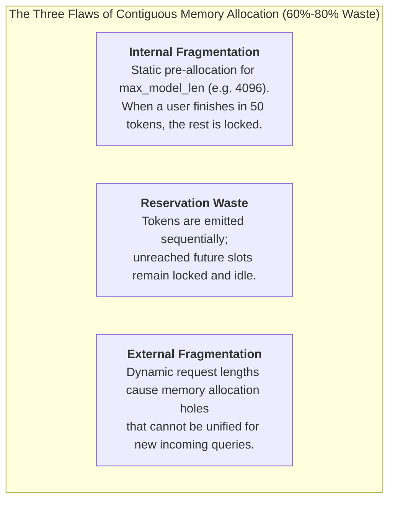
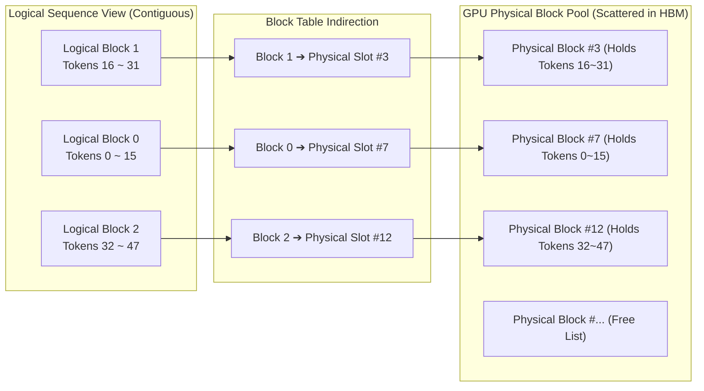
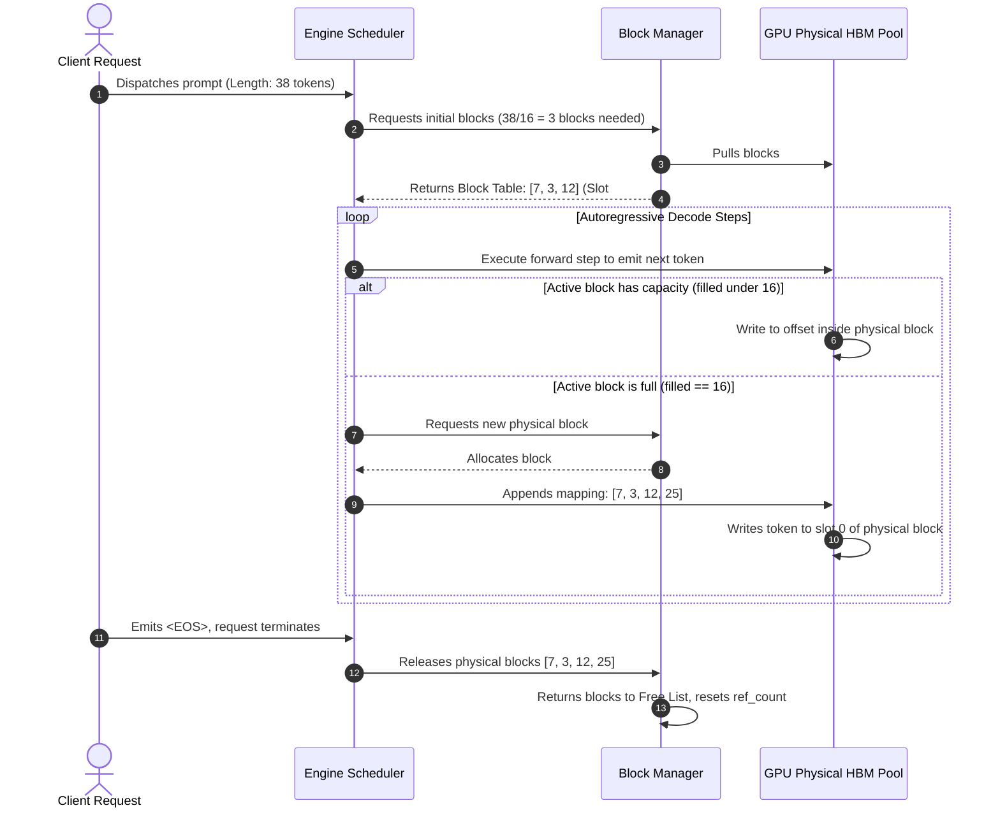
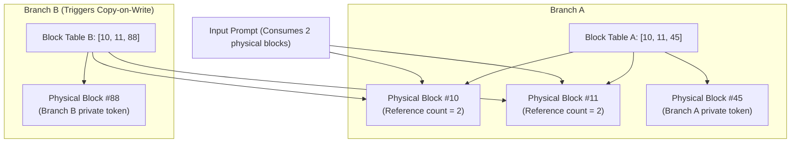

## Introduction: The Eighty-Percent Memory Drain

In our previous deep dive, [From model.generate() to the Roofline Model: The Physics of Prefill and Decode Divergence](/en/articles/inference-roofline-prefill-decode/), we derived from first principles that the autoregressive decode phase is deeply **memory-bandwidth bound**. To maximize effective GPU compute utilization and amortize memory traffic, the only viable path is to scale concurrent batch sizes as high as possible.

Yet, when early serving stacks (such as early FasterTransformer or raw PyTorch serving scripts) attempted to scale concurrency, system engineers ran headfirst into an insurmountable wall:

**On an 80GB A100 or H100 accelerator, systems frequently crashed with fatal `CUDA Out of Memory (OOM)` errors with as few as a dozen concurrent requests. Strangely, if you calculated the physical size of the KV caches for the tokens actively being generated, they occupied less than 20GB of actual memory.**

Where did the remaining 60GB of premium High Bandwidth Memory (HBM) disappear?

According to the landmark paper published at SOSP 2023 by UC Berkeley researchers, *"Efficient Memory Management for Large Language Model Serving with PagedAttention,"* legacy inference runtimes **wasted between 60% and 80% of total GPU memory**.

To overcome this physical barrier, **vLLM** introduced **PagedAttention**. This article explores how a core concept from operating system design — **virtual memory paging** — was adapted for GPU accelerators, reshaping modern LLM inference architectures.

---

## 1. Contiguous Allocation: The Three Memory Flaws

Prior to PagedAttention, deep learning frameworks (including PyTorch and TensorFlow) relied on a foundational assumption: **tensors must occupy contiguous physical memory**.

In dynamic, token-by-token autoregressive generation, this contiguous memory model creates three major sources of memory waste:



### 1. Internal Fragmentation
Because large language models terminate nondeterministically upon emitting an `<EOS>` token, the serving engine **cannot predict how many tokens a given request will generate**.
To prevent mid-generation crashes, traditional systems pre-allocated a contiguous memory chunk sized for the model's maximum context window (`max_model_len`, e.g., 4096 or 8192 tokens).
* If a user issues a short question requiring only 100 input tokens and 50 output tokens,
* The remaining ~4000 token slots remain reserved and locked for the duration of the request, unavailable to other queries.

### 2. Reservation Waste
Even if an engine attempts progressive allocation (e.g., reserving memory in increments of 128 tokens), expanding a contiguous tensor requires allocating a larger buffer elsewhere and copying the existing cache.
To avoid the throughput penalties of frequent memory copies, memory allocators maintained large safety buffers that remained mostly idle.

### 3. External Fragmentation
In concurrent serving environments, requests arrive and complete asynchronously. Request A may consume 256 tokens, Request B 2048 tokens, and Request C 512 tokens. As contiguous buffers of varied sizes are allocated and freed, GPU physical memory becomes fragmented into isolated chunks.
Even if 15GB of aggregate memory is available across the GPU, an incoming request requiring a 2GB **contiguous** buffer will trigger an OOM error if no single contiguous block of that size exists.

---

## 2. Virtual Memory Paging: PagedAttention's Core Design

To eliminate memory fragmentation, computer science had already developed the solution in operating system design: **virtual memory paging**.

In modern operating systems, processes operate within continuous virtual address spaces, while physical memory is divided into discrete **page frames** (typically 4KB). The hardware Memory Management Unit (MMU) uses **page tables** to map contiguous virtual addresses to non-contiguous physical pages transparently.

vLLM adapted this architecture for GPU KV caches, creating **PagedAttention**:



### 1. Key Architectural Abstractions

* **Block Size ($B$)**:
  The basic unit of memory allocation. A block stores key and value tensors for a fixed number of tokens across all layers (commonly $B = 16$ or $B = 32$).
* **Logical Block**:
  A virtual, contiguous abstraction presented to the sequence. From the perspective of the attention layer, the sequence appears as a standard contiguous array from Token 0 to Token $L-1$.
* **Physical Block**:
  During engine initialization, a large contiguous region of GPU HBM is allocated and divided into fixed-size physical block slots. Each physical block has a unique global `block_number`.
* **Block Table**:
  A per-request lookup table that maps each logical block index to its corresponding physical block number in GPU memory, while tracking the fill level (`filled_count`) of the active block.

### 2. Quantifying Fragmentation Reduction

Under the PagedAttention design:
* **External fragmentation is eliminated**: Because all physical blocks share identical dimensions (e.g., exactly 16 token slots), memory is allocated and freed in uniform units without creating mismatched gaps.
* **Internal fragmentation is minimized**: Memory waste occurs only in the final logical block of a sequence. For a block size of $B = 16$, the maximum waste is 15 token slots per request:
  $$\text{Average Waste} = \frac{B}{2} \times \text{Size of 1 Token KV Cache}$$
  Per-request memory waste drops from 60%–80% to **under 4%**, allowing engines to fit **2x to 4x more concurrent sequences** into the same GPU memory pool.

---

## 3. Dynamic Memory Pool Lifecycle

In production engines like vLLM, memory management is coordinated by a host-side **Block Manager**:



### Physical Tensor Layout on the GPU

Rather than managing thousands of separate GPU tensor allocations, the engine allocates two large, contiguous physical tensors at startup: `key_cache` and `value_cache`.

In half-precision (BF16/FP16), the physical key cache tensor is laid out to enable **coalesced memory access**:

```python
# Physical Key Cache Tensor Layout in vLLM
# Dimensions are permuted to ensure 128-byte warp memory alignment
key_cache = torch.empty(
    size=(num_total_blocks, num_kv_heads, head_size // x, block_size, x),
    dtype=torch.bfloat16,
    device="cuda"
)
# Where x = 16 // sizeof(dtype) (x = 8 for 16-bit floating point)
```

Allocating a block requires only updating integer indices in CPU memory. No runtime `cudaMalloc` calls are issued during generation, enabling sub-microsecond block management.

---

## 4. Copy-on-Write and Branching Generation

PagedAttention also enables **zero-copy memory sharing via Copy-on-Write (CoW)** across sequences.

This is particularly useful in workloads where multiple outputs share common prompt prefixes:
1. **Parallel Sampling**: Generating $N$ candidate responses from a single prompt with different sampling temperatures.
2. **Beam Search**: Retaining top-$k$ partial hypotheses that share identical prefix histories.
3. **Agentic Branching (Tree-of-Thoughts / MCTS)**: Evaluating alternative tool-use trajectories from a common decision state.

Under contiguous allocation models, the prompt's KV cache had to be duplicated across each branch. PagedAttention manages this through **reference counting**:



### The Copy-on-Write Workflow
1. **Initial Shared State**: When Branch A and Branch B fork from the same prompt, both block tables reference physical blocks `#10` and `#11`. The reference counter for these blocks increments to `2`.
2. **Shared Reads**: During attention computation, GPU execution units read from physical blocks `#10` and `#11` concurrently across both branches without data duplication.
3. **Copy-on-Write**: When Branch A writes a new token to a partially filled block with `ref_count > 1`, the engine allocates a new physical block (`#45`), copies the existing contents, repoints Branch A's mapping, and decrements the original block's reference counter.

This mechanism serves as the architectural foundation for advanced prefix caching systems, such as SGLang's [RadixAttention tree cache](/en/articles/sglang-vs-vllm-architecture/).

---

## 5. Non-Contiguous CUDA Kernels

Standard attention kernels (such as cuBLAS GEMM or standard FlashAttention) require keys and values to reside in contiguous physical memory buffers.

To compute attention over non-contiguous physical blocks without copying data, PagedAttention uses custom CUDA kernels that resolve addresses dynamically:

### Block Table Indirection Inside the Kernel

During dispatch, the scheduler passes `block_tables` as a 2D integer tensor to the GPU kernel:

```cpp
// PagedAttention CUDA Kernel Execution Concept
template<typename scalar_t, int BLOCK_SIZE>
__global__ void paged_attention_kernel(
    scalar_t* __restrict__ out,               // Output tensor [num_seqs, num_heads, head_dim]
    const scalar_t* __restrict__ q,           // Query vector [num_seqs, num_heads, head_dim]
    const scalar_t* __restrict__ k_cache,     // Physical Key cache pool
    const scalar_t* __restrict__ v_cache,     // Physical Value cache pool
    const int* __restrict__ block_tables,     // Block table matrix [num_seqs, max_blocks]
    const int* __restrict__ context_lens,     // Sequence context lengths
    const int max_num_blocks_per_seq
) {
    const int seq_idx = blockIdx.y;
    const int head_idx = blockIdx.x;
    const int cur_context_len = context_lens[seq_idx];
    const int num_blocks = (cur_context_len + BLOCK_SIZE - 1) / BLOCK_SIZE;

    // Iterate over logical blocks for this sequence
    for (int block_idx = 0; block_idx < num_blocks; ++block_idx) {
        // Resolve physical block index via block_tables lookup
        const int physical_block_number = block_tables[seq_idx * max_num_blocks_per_seq + block_idx];
        
        // Compute base pointer in global physical memory
        const scalar_t* k_block_ptr = k_cache + physical_block_number * BLOCK_STRIDE;
        
        // Load key/value tokens from this block into on-chip SRAM
        // Compute partial QK^T dot-products and update online softmax accumulators
    }
    // Normalize and write output back to global device memory
}
```

### Why Indirection Does Not Degrade Memory Throughput

Engineers often ask whether the pointer indirection of block lookups degrades GPU memory efficiency through cache misses:
1. **Intra-Block Memory Coalescing**: Within each physical block of 16 or 32 tokens, data is stored contiguously. A 32-thread GPU warp accesses data aligned to 128-byte transactions, maintaining high memory bus efficiency.
2. **Metadata Locality**: For a 4096-token sequence with $B = 16$, the block table contains only 256 32-bit integers (1 KB of memory). This metadata resides in high-speed GPU **L1/L2 caches**, introducing minimal overhead relative to multi-gigabyte HBM streaming operations.

---

## 6. Architectural Summary

By implementing virtual memory concepts in GPU software, PagedAttention addressed the primary memory inefficiencies of early serving engines:
* **Reduced memory waste from 80% to under 4%**;
* **Increased single-node serving throughput by 2x to 4x**;
* **Eliminated memory fragmentation OOM errors**;
* **Provided the baseline primitives for prefix sharing (RadixAttention) and continuous batching**.

However, memory efficiency is only the first piece of the puzzle. Once memory allocation is optimized, the scheduler must manage requests of varying lengths without introducing pipeline stalls.

In our next chapter, we will examine execution scheduling: **《Continuous Batching and Chunked Prefill: Eliminating Head-of-Line Blocking》**.

---

## Frequently Asked Questions (FAQ)

### Q1: Should block size be configured to 16 or 32? Why not 1 or 128?
Block size represents an engineering trade-off between **internal fragmentation** and **GPU memory bus alignment**:
* **Very small blocks ($B = 1$ or $2$)**: While internal fragmentation drops to zero, physical blocks become too small to saturate 128-byte coalesced memory transactions. Memory bus efficiency degrades, and the block table expands by an order of magnitude, increasing cache pressure.
* **Very large blocks ($B = 128$)**: Unused slots in the final block result in an average waste of 64 tokens per sequence, re-introducing significant fragmentation in short-prompt workloads.
* **Production standard**: Across A100 and H100 hardware, **$B = 16$ or $B = 32$** delivers over 96% memory utilization while matching warp memory transaction widths and shared memory bank configurations.

### Q2: If PagedAttention eliminates memory fragmentation, why do serving systems still experience OOM errors?
PagedAttention eliminates **fragmentation-induced OOMs**, but cannot exceed the **physical capacity limits of device memory**.
Under heavy concurrent load, as active requests generate tokens and expand their KV caches, the pool of available physical blocks can become fully depleted.
When the physical block pool is exhausted, modern engines use **request preemption**:
1. **Swap**: Low-priority sequences have their physical blocks transferred over PCIe to host system memory (DRAM), freeing blocks for active streams.
2. **Recompute**: The engine halts and discards intermediate generation state for selected requests, re-running prefill once memory pressure subsides.

### Q3: How does PagedAttention interact with model-level attention optimizations like GQA or MLA?
PagedAttention operates orthogonally to architectural optimizations like GQA and MLA:
* Architectural innovations like [Kimi KDA and DeepSeek MLA](/en/articles/kimi-kda-deepseek-mla-architecture/) compress the dimension of the key-value representation mathematically, reducing the byte size of each token's cache entry.
* **PagedAttention** manages the storage and allocation of those compressed entries across non-contiguous memory pages. Combining architectural compression with memory paging is what makes serving 100K+ context lengths viable in production clusters.
