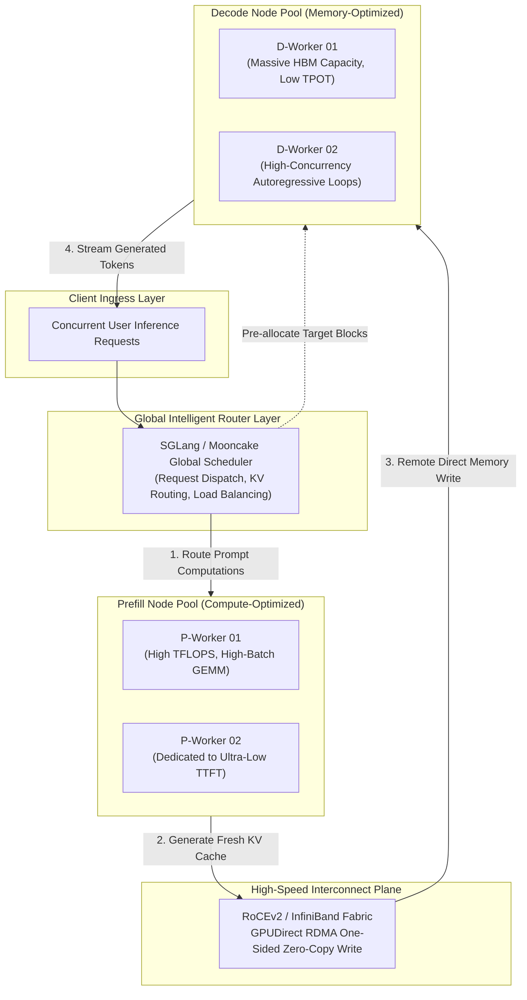
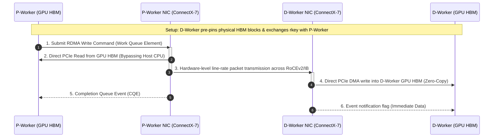
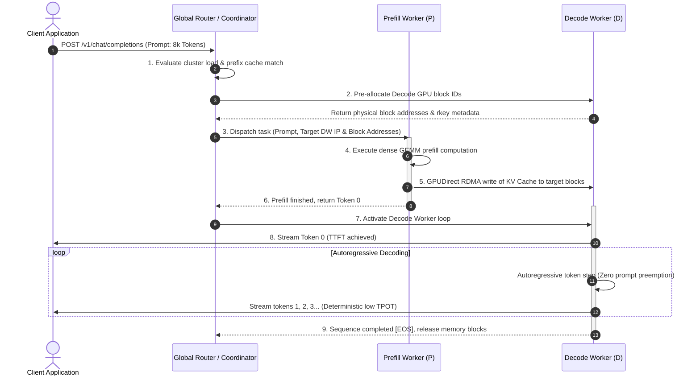
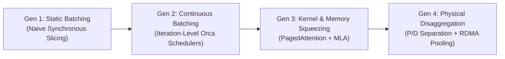

## Introduction: The Inevitable Physical Limit of Colocated Serving

In Chapter 01 of this handbook, [From model.generate() to Reality: Roofline Modeling of Prefill vs. Decode Disruption](/en/articles/inference-roofline-prefill-decode/), we derived from first hardware principles the foundational physical dilemma underlying all autoregressive Large Language Model (LLM) serving systems:

- **Prefill (Prompt Processing Phase)**: Strictly **Compute-bound**. Processing long prompts involves high Arithmetic Intensity, saturating GPU Tensor Cores and aiming for peak Model FLOPs Utilization (MFU);
- **Decode (Autoregressive Token Generation Phase)**: Strictly **Memory-bound**. Generating each subsequent token requires streaming billions of static model parameters and extensive historical KV Caches from HBM to SRAM, plunging arithmetic intensity to near single-digit levels and bounding throughput entirely by High Bandwidth Memory (HBM) bandwidth.

Over the past few years, the engineering community devised ingenious software techniques to make these two fundamentally antithetical phases coexist harmoniously on a single GPU node: from [PagedAttention Memory Virtualization](/en/articles/pagedattention-memory-virtualization/) eliminating internal memory fragmentation, to [Continuous Batching and Chunked Prefill](/en/articles/continuous-batching-chunked-prefill-guide/) flattening Head-of-Line (HOL) blocking latency spikes.

However, as production workloads evolve into the era of **128k long contexts** and **long chain-of-thought reasoning models (Test-Time Compute)**, this classical "time-sharing" single-node scheduling paradigm hits an unyielding physical wall:

1. **Compute vs. Memory Hardware Contention**: Even with Chunked Prefill, when bursts of long prompts arrive, the GPU must bundle compute-dense large-matrix multiplications (GEMM) alongside memory-bound tiny-batch matrix-vector operations (GEMV) within the same execution step. Consequently, Tensor Cores operate sub-optimally, while the Time Per Output Token (TPOT) of active streaming sessions degrades noticeably;
2. **Resource Provisioning Paradox**: Prefill demands minimal, transient memory to store activations while hungering for maximal raw compute density (FP8 / INT8 TFLOPS). Conversely, Decode demands massive, persistent HBM pools to retain KV Caches across tens of thousands of concurrent sessions while requiring maximal memory bandwidth. Forcing both onto identical server topologies guarantees severe underutilization of either compute or memory capacity;
3. **Irreconcilable Service Level Agreements (SLAs)**: Enterprise workloads typically demand strict Time to First Token (TTFT) SLAs (sub-second) alongside rock-solid TPOT SLAs (e.g., 30~50 ms/token). Under colocated execution, a spike in incoming prompt length immediately derails the TPOT of ongoing decodes, and vice versa.

The physical law is clear: **We must transition from time-domain multiplexing to spatial physical isolation — the Prefill-Decode (P/D) Disaggregation Architecture**.

In this eighth installment of the **Production LLM Inference Engines** series, we will dissect the architectural anatomy of P/D disaggregation, cross-node distributed KV Cache fabric protocols, zero-copy GPUDirect RDMA implementations, and cluster-scale dynamic pooling schedulers.

---

## 1. First Principles of P/D Disaggregation and Cluster Topology Evolution

### 1.1 What is P/D Disaggregated Serving?

The core premise of P/D disaggregation is straightforward: **physically partition the inference cluster into two distinct, specialized hardware pools — Prefill-optimized worker nodes (P-Workers) and Decode-optimized worker nodes (D-Workers)**.



The control flow and data flow across the entire request lifecycle are cleanly decoupled:
1. **Prompt Dispatch**: An incoming prompt arrives at the global router and is dispatched to the optimal **P-Worker** based on queue depth and cached prefix locality;
2. **Dense Prefill Computation**: The P-Worker computes the attention over the entire prompt at peak MFU, generating Token 0;
3. **KV Cache Transfer**: Instantly upon completion, the P-Worker pushes the newly generated KV Cache across the high-speed network fabric directly into pre-allocated physical memory pages on a target **D-Worker**;
4. **Isolated Autoregressive Generation**: The D-Worker assumes responsibility for subsequent token generation steps in an isolated environment, completely immune to prompt prefill preemption, streaming tokens out at deterministic intervals until reaching `[EOS]`.

### 1.2 Evolution of Systems: From Splitwise to Mooncake

The adoption of P/D disaggregation represents a rigorous progression from early academic concepts to hyperscale production infrastructure:

| System / Proposal | Origin & Milestone | Core Contribution | Architectural Limitations |
| :--- | :--- | :--- | :--- |
| **Splitwise** | ISCA 2024 (Microsoft Research) | First systematic formulation of separating Prefill and Decode onto distinct hardware tiers, demonstrating substantial TCO reductions | Pure conceptual proof-of-concept; relied on standard TCP/IP networking which bottlenecked TTFT under long contexts |
| **DistServe** | OSDI 2024 (Peking University / UCSD) | Established explicit **decoupled TTFT vs. TPOT SLA** optimization targets, introducing independent Tensor Parallelism (TP) and Pipeline Parallelism (PP) tuning | Tailored primarily to intra-rack networking; cross-node KV transfers choked under context windows beyond 32k tokens |
| **Mooncake** | 2024~2025 (Moonshot AI / Kimi) | Proposed a **KVCache-centric disaggregated architecture**, organizing cluster DRAM, NVMe SSDs, and GPU HBM into a unified, tiered memory pool | High architectural complexity; strong dependency on distributed metadata consistency |
| **vLLM v1 Disaggregated** | 2025 (vLLM Open Source) | Re-architected core engine around an asynchronous C++ runner, natively integrating disaggregated prefill workflows via Ray/Nix backends | Requires strict network fabric topology tuning across heterogeneous multi-cloud environments |
| **SGLang Disaggregated** | 2025 (SGLang Open Source) | Deeply couples [RadixAttention tree-based caching](/en/articles/prefix-caching-radix-attention-internals/) with RDMA-driven KV transfer, optimizing multi-turn prompt reuse | Complex multi-tier prefix routing table synchronization |

---

## 2. The Core Technical Bottleneck: Cross-Node Distributed KV Cache Transfers
> [!TIP]
> **Interactive Sizing Tool**: Before deciding on the GPU allocation ratio between Prefill and Decode pools, leverage our [LLM VRAM & Throughput Calculator](/en/tools/) to estimate KV cache footprint per request and the required network transport throughput.


While the theoretical advantages of P/D disaggregation are clear, systems engineers encounter a brutal physical barrier in practice: the **Network Bandwidth Wall**.

In standard colocated serving, KV Caches computed during prefill already reside natively in local GPU HBM; the Decode phase reads them with zero network latency. In a disaggregated cluster, however, **gigabytes of KV Cache data must traverse physical network switches before decoding can begin!**

If network transmission latency exceeds the prefill execution time, disaggregation backfires, causing severe TTFT degradation.

### 2.1 Mathematical Derivation of Transfer Volumes: GQA vs. DeepSeek MLA

Let us derive the exact byte volume transferred per request across different model architectures:

Let $L$ denote the number of Transformer layers, $S$ the context sequence length, using 16-bit precision (2 bytes per scalar).

#### Case A: Standard Grouped-Query Attention (GQA, e.g., LLaMA-3-70B)
With $H_{kv}$ key-value heads and a per-head dimension of $D_{head}$, the total bytes generated per token per layer for Key and Value projections are:
$$\text{Bytes}_{\text{GQA/token/layer}} = 2 \times H_{kv} \times D_{head} \times 2 = 4 \times H_{kv} \times D_{head} \text{ bytes}$$

For **LLaMA-3-70B** ($L = 80$, $H_{kv} = 8$, $D_{head} = 128$):
$$\text{Bytes}_{\text{LLaMA-70B}} = 80 \times (4 \times 8 \times 128) = 327,680 \text{ bytes} \approx 320 \text{ KB}$$

When handling a modest **16,384 (16k)** sequence context, the total KV Cache size transferred is:
$$\text{Size}_{\text{GQA-16k}} = 320 \text{ KB} \times 16,384 \approx 5.24 \text{ GB}$$

Over a **400 Gbps (effective ~45 GB/s throughput)** InfiniBand / RoCEv2 fabric, transmitting 5.24 GB requires:
$$T_{\text{net}} \approx \frac{5.24 \text{ GB}}{45 \text{ GB/s}} \approx 116.4 \text{ ms}$$

This latency is prohibitive: adding over 110 ms solely for network transit negates the gains of fast prefill. If 10 concurrent requests finish simultaneously, the network interface saturates completely.

#### Case B: Multi-Head Latent Attention (MLA, e.g., DeepSeek-V3)
As derived in [Chapter 06 on DeepSeek MLA Matrix Absorption](/en/articles/mha-gqa-mla-matrix-absorption-inference-engine/), MLA compresses the multi-head KV projection into a single latent vector $c_t^{KV} \in \mathbb{R}^{d_c}$ ($d_c = 512$) along with a decoupled RoPE key vector $k_t^R \in \mathbb{R}^{d_R}$ ($d_R = 64$).

The scalar count stored and transferred per token per layer is merely $512 + 64 = 576$.
For **DeepSeek-V3** ($L = 61$ layers):
$$\text{Bytes}_{\text{MLA}} = 61 \times (576 \times 2) = 70,272 \text{ bytes} \approx 68.6 \text{ KB}$$

At the same **16,384 (16k)** sequence length, the data transferred drops to:
$$\text{Size}_{\text{MLA-16k}} = 68.6 \text{ KB} \times 16,384 \approx 1.12 \text{ GB}$$

```text
16k Context Cross-Node Transfer Volume Comparison:
┌─────────────────────────────────────────────────────────────┐
│ Classical GQA (LLaMA-3-70B):  ████████████████████ 5.24 GB  │
│ DeepSeek MLA (671B):          ████ 1.12 GB (-78.6% Bandwidth)│
└─────────────────────────────────────────────────────────────┘
```

**An immediate 78.6% reduction in network traffic!**
This explains why modern production P/D serving architectures converge heavily with latent compressed attention: **without an architecture like MLA, long-context P/D disaggregation is impractical; combined with MLA, it becomes extraordinarily fast.**

---

### 2.2 Transport Layer: Why Classical TCP/IP Fails

Standard socket-based TCP/IP communication fails catastrophically under multi-gigabyte GPU memory transfers:

1. **Host CPU Saturation**: Packet fragmentation, checksum validations, and interrupt handling at hundreds of gigabits per second saturate host CPU cores with software interrupts;
2. **Intermediate Memory Bounces**: Data journeys through multiple hops: GPU HBM -> PCIe -> Host Kernel Page Buffers -> Socket Buffer -> NIC DMA. This introduces substantial memory bus contention and latency;
3. **P99 Tail-Latency Jitter**: Flow control oscillations and TCP retransmissions induce severe latency tails.

### 2.3 GPUDirect RDMA (GDR) One-Sided Zero-Copy Implementation

Production P/D serving systems universally rely on **GPUDirect RDMA (GDR)** across RoCEv2 or InfiniBand fabrics:



The key principles of GPUDirect RDMA include:
- **Total CPU & Host RAM Bypass**: The network adapter accesses GPU memory directly over PCIe bus peer-to-peer (P2P) channels;
- **One-Sided Operations**: The receiving node's GPU and CPU perform zero operational logic during transmission (`recv()` calls are unnecessary). The P-Worker writes directly into registered memory regions on the D-Worker using remote keys (`rkey`);
- **Layer-by-Layer Pipelined Overlap**: While the P-Worker executes layer $i+1$, the KV Cache for layer $i$ is asynchronously dispatched across the network interface.

---

## 3. Global Scheduling Flow and Optimal P:D Node Ratio Modeling

### 3.1 End-to-End Request Lifecycle Across Nodes

With P/D disaggregation, the single-node scheduler is replaced by an orchestrator managing heterogeneous worker tiers:



Once step 5 concludes, the P-Worker purges the request context immediately, freeing its transient memory space for subsequent incoming prompts, while the D-Worker independently carries out token generation.

### 3.2 Queuing Theory Model: Deriving the Optimal P:D Ratio

A common operational challenge in data center management is: **Given a cluster of 64 GPU servers, what is the optimal partitioning between P-Workers and D-Workers?**

Let:
- $\lambda$ denote the average request arrival rate (req/s);
- $S_{\text{in}}$ be the average input prompt length, and $S_{\text{out}}$ the average output response length;
- $T_P$ represent per-GPU prefill throughput (tokens/s), and $T_D$ per-GPU decode throughput (tokens/s);
- $N_P$ and $N_D$ be the count of allocated P-GPUs and D-GPUs, respectively.

To avoid buffer queue overflow, processing capacity must balance token flow:

1. **Required Prefill Processing Capacity**:
   $$\Phi_{\text{in}} = \lambda \cdot S_{\text{in}} \implies N_P \ge \frac{\lambda \cdot S_{\text{in}}}{T_P}$$

2. **Required Decode Processing Capacity**:
   $$\Phi_{\text{out}} = \lambda \cdot S_{\text{out}} \implies N_D \ge \frac{\lambda \cdot S_{\text{out}}}{T_D}$$

The optimal partitioning ratio $R = \frac{N_P}{N_D}$ is given by:
$$R = \frac{N_P}{N_D} \approx \left(\frac{S_{\text{in}}}{S_{\text{out}}}\right) \cdot \left(\frac{T_D}{T_P}\right)$$

#### Real-World Operational Example:
Consider an enterprise Retrieval-Augmented Generation (RAG) workload:
- Prompt length averages $S_{\text{in}} = 4000$ tokens; output length averages $S_{\text{out}} = 500$ tokens;
- Ratio $\frac{S_{\text{in}}}{S_{\text{out}}} = \frac{4000}{500} = 8$;
- Measured throughput: Prefill achieves $T_P \approx 4000 \text{ tokens/s/GPU}$ via large-batch GEMMs, while Decode achieves $T_D \approx 500 \text{ tokens/s/GPU}$ constrained by memory bandwidth. Throughput ratio $\frac{T_D}{T_P} = \frac{500}{4000} = \frac{1}{8}$.

Substituting these values yields:
$$R = 8 \times \frac{1}{8} = 1.0 \implies N_P : N_D = 1 : 1$$

Under this workload, an equal **50% / 50% split** between P-Workers and D-Workers provides ideal queue stability.

Conversely, for an **extended reasoning workload (like o-series or DeepSeek-R1 models)**:
- $S_{\text{in}} = 1000$ tokens, but generated chain-of-thought tokens average $S_{\text{out}} = 8000$ tokens;
- $\frac{S_{\text{in}}}{S_{\text{out}}} = \frac{1}{8}$;
- The optimal ratio shifts dramatically:
  $$R = \frac{1}{8} \times \frac{1}{8} = \frac{1}{64}$$
In reasoning-heavy deployments, **over 95% of cluster GPU capacity must be dedicated to D-Workers**, with only a minimal tier of P-Workers required to handle prompt ingestion.

---

## 4. Production Engineering Realities and Design Trade-offs

Scaling P/D disaggregation to thousands of accelerators introduces critical operational nuances:

### 4.1 Memory Block Alignment and Lease Garbage Collection
In colocated PagedAttention, block allocation is handled locally. Under disaggregation:
- P-Workers generate linear or chunked KV pages;
- D-Workers allocate scattered physical block IDs remotely;
- If network connections drop mid-transfer, D-Workers must enforce robust **lease-based garbage collection** to reclaim abandoned, pinned memory pages.

### 4.2 Dynamic Role Switching Under Diurnal Traffic Shifts
Production traffic follows diurnal cycles: interactive chat peaks during daylight hours, while batch summarization jobs run overnight. Static hardware partitioning leads to severe underutilization during traffic shifts.
Modern engines implement **millisecond-grade dynamic role switching**: nodes dynamically reload serving contexts to morph from D-Workers into P-Workers and vice versa based on real-time ingress queue depths.

### 4.3 Is Chunked Prefill Still Needed Within P-Nodes?
A common misconception is that P/D disaggregation renders Chunked Prefill obsolete.
**In reality, Chunked Prefill remains essential within the P-node tier.**
Without it, an arriving 128k prompt would monopolize a P-Worker for seconds, causing massive queuing delays for concurrent lightweight 100-token queries. Chunking ensures multi-tenant fairness and prevents HOL blocking within the prefill tier itself.

---

## 5. Architectural Summary and Future Outlook

The transition to P/D disaggregation marks a defining evolution in distributed inference systems:



1. **Physical Soundness**: It honors the immutable divergence of the Roofline model by separating Compute-bound and Memory-bound regimes into isolated hardware tiers;
2. **Fabric Modernization**: It elevates GPUDirect RDMA from an HPC nicety into standard inference infrastructure;
3. **Algorithmic Synergy**: It achieves peak cost efficiency when coupled with latent-compressed attention mechanisms like DeepSeek MLA.

With the foundations of P/D disaggregation established, we are ready to examine the codebase architectures of the leading open-source engines. In **Chapter 09**, we will explore: **Production Engine Source Code Teardown: vLLM v1 vs. SGLang vs. TensorRT-LLM vs. llama.cpp**, comparing their scheduler internals, runtime execution loops, and C++ kernels.

---

## Frequently Asked Questions (FAQ)

### Q1: Does P/D disaggregation guarantee higher overall system throughput in all deployments?
**No. The primary benefits of P/D disaggregation are SLA decoupling and tail latency stabilization, not raw throughput maximization.**
In standard colocated architectures, GPUs continuously interleave prefill and decode kernels, achieving high aggregate utilization under homogeneous loads. Disaggregation introduces network transfer latency. However, its immense value lies in eliminating interference: Decode nodes deliver consistent, low TPOT without interruption from long prompts, and hardware tiers can be independently matched to their physical bottlenecks (e.g., high TFLOPS cards for P-nodes, high-capacity HBM cards for D-nodes).

### Q2: Why is P/D disaggregation generally discouraged on small-scale deployments (e.g., a single 8-GPU node)?
On a single 8-GPU server, partitioning hardware into 4 P-cards and 4 D-cards is typically inefficient:
1. **Constrained Tensor Parallelism (TP)**: 70B+ parameter models typically require TP=8 across all 8 GPUs to achieve optimal GEMM efficiency. Splitting into 4+4 reduces TP to 4, risking out-of-memory errors or forcing high-latency Pipeline Parallelism (PP);
2. **Loss of Statistical Multiplexing**: Small clusters suffer from high traffic variance. A static split frequently causes either the P-tier or D-tier to sit idle;
3. **Ideal Sweet Spot**: P/D disaggregation thrives in clusters with dozens to hundreds of nodes, where pooling effects smooth traffic variance and dedicated RoCEv2/IB fabrics maximize RDMA efficiency.

### Q3: How do disaggregated inference engines recover from cross-node RDMA transmission timeouts or network packet drops?
Modern systems implement three-tier fault tolerance:
1. **Lossless Ethernet via PFC and DCQCN**: RoCEv2 Priority Flow Control (PFC) and Data Center Quantized Congestion Notification (DCQCN) minimize buffer overflows and prevent packet loss at the network switch tier;
2. **Hardware Timers and Fallback Rerouting**: P-Workers monitor transfer completions via Completion Queue Events (CQEs). If an acknowledgment times out (e.g., 200 ms), the coordinator invalidates the transfer and reschedules the prompt onto an alternate worker to recompute locally, avoiding dropped user requests;
3. **Versioned Global Prefix Trees**: Schedulers maintain immutable versions of KV Cache block metadata. Incomplete or corrupted blocks are discarded before reaching the downstream decode engine.
