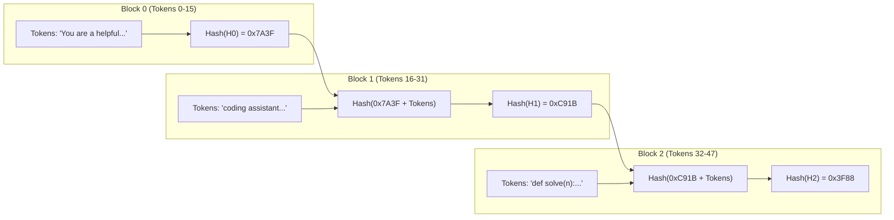
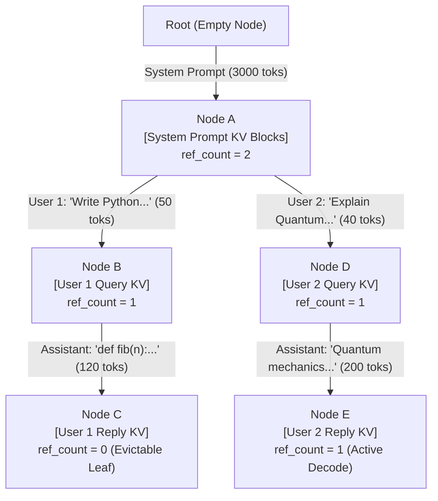
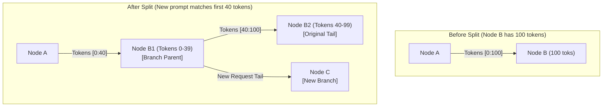
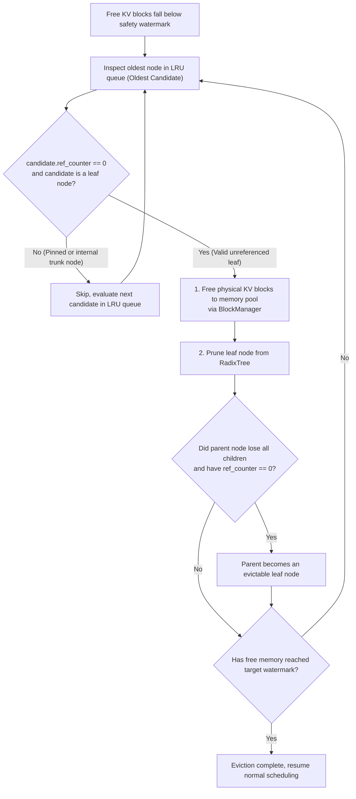
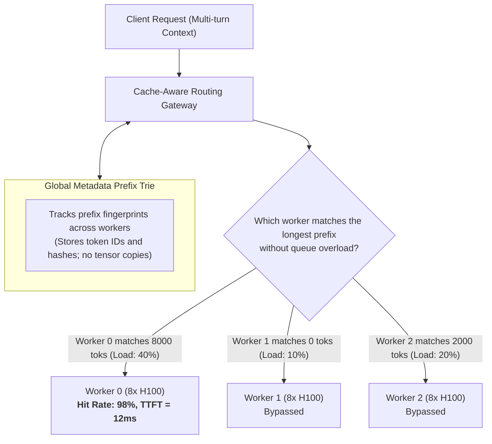

## Introduction: Why Do LLMs Continuously Repeat Redundant Computation?

In the preceding chapters of this series, we systematically constructed the foundational principles of modern LLM inference systems:
- In [Roofline Model and Prefill vs Decode Physical Divergence](/en/articles/inference-roofline-prefill-decode/), we quantified why the Prefill phase is strictly **compute-bound**, where causal self-attention scaling at $O(L^2)$ creates massive FLOP demands that dominate Time to First Token (TTFT);
- In [PagedAttention and Virtual Memory Management](/en/articles/pagedattention-memory-virtualization/), we explored how virtual memory paging and Copy-on-Write eliminate fragmentation to enable physical block sharing;
- In [Continuous Batching and Chunked Prefill](/en/articles/continuous-batching-chunked-prefill-guide/), we addressed concurrency scheduling and head-of-line blocking by interleaving compute-bound prefill chunks with memory-bound decode steps.

Yet, in production environments—particularly across **AI Agent workflows, multi-turn conversations, coding copilots, and retrieval-augmented generation (RAG)**—serving engines encounter a glaring computational inefficiency:

**Across sequential requests, between 70% and 95% of incoming prompt tokens are completely identical!**

Consider a typical ReAct Agent cycle:
- **Turn 1**: The system injects a 4,000-token System Prompt (containing role instructions, schema definitions for dozens of tools, and few-shot examples). The user provides a 50-token query, and the model outputs a 100-token tool call;
- **Turn 2**: The agent executes the tool, appending the result into the context. The next prompt concatenates the full conversation history, expanding to 4,300 tokens;
- **Turn 3**: Another tool returns data, expanding the prompt to 4,600 tokens...

Without state reuse, an inference engine in Turns 2 and 3 **must recalculate the exact same 4,000-token system prompt and earlier conversation history from scratch on GPU Tensor Cores.**

This redundancy wastes more than 60% of GPU compute capacity on repetitive operations, while progressively inflating multi-turn TTFT.

**Prefix Caching** was created to eliminate this waste. By retaining already-computed Key-Value (KV) cache blocks in GPU memory, subsequent requests sharing an identical prefix bypass the expensive prefill forward pass entirely. **This collapses TTFT from hundreds of milliseconds (or seconds) down to single-digit milliseconds (a simple pointer lookup in memory)**.

This chapter traces the engineering evolution of prefix caching: from vLLM's static hash-chained block matching to the dynamic **RadixAttention** tree architecture pioneered by UC Berkeley's LMSYS team in SGLang, examining node splitting, reference counting, LRU eviction state machines, and cluster-wide cache-aware routing.

---

## 1. The First Generation: vLLM's Hash-Chained Block-Level Prefix Caching

Following the advent of PagedAttention, vLLM introduced Automatic Prefix Caching (APC) based on block-level indexing.

### 1.1 The Mathematical Necessity of Hash Chaining

In standard operating system virtual memory, file deduplication can be achieved simply by hashing individual blocks (e.g., `md5(block_data)`). In autoregressive language models, however, **one cannot evaluate a token block in isolation**.

This constraint stems directly from Transformer **Causal Self-Attention**:
A block of 16 tokens (e.g., `[" the", " capital", " of", ...]`) produces **entirely different Key and Value vectors** when preceded by a paragraph about French geography compared to when preceded by Python code comments. Every token's KV projection is inextricably conditioned on the complete preceding context.

To solve this, vLLM adopted a Merkle-tree-inspired **context-sensitive hash chain**:

For a sequence partitioned into physical blocks of fixed size, the hash $H_i$ of block $i$ is computed recursively:
$$H_0 = \text{Hash}(\text{Tokens}_0)$$
$$H_i = \text{Hash}(H_{i-1}, \text{Tokens}_i) \quad (i \ge 1)$$



The scheduler maintains a global lookup table:
$$\text{HashMap}: H_i \longrightarrow \text{Physical Block ID}$$

When a new request arrives, the scheduler chunks the prompt into blocks of size 16 and computes hashes sequentially:
1. If $H_i$ exists in the HashMap and its physical block has not been evicted, the engine directly appends the physical block to the request's block table;
2. As soon as a block hash $H_k$ misses, matching halts immediately. The engine then executes a standard prefill forward pass for all remaining tokens.

### 1.2 Limitations of the Flat Hash Block Approach

While conceptually clean, block-level hash tables exhibit major limitations in complex production scenarios:

1. **Block Boundary Penalty**:
   Hashes are strictly tied to full block boundaries (e.g., 16 tokens). If a prompt differs by even a single character at token 15, Block 0 fails to match, invalidating the entire subsequent sequence even if thousands of identical tokens follow;
2. **Structural Disconnect from Branching Workloads**:
   Conversations and tree-search algorithms (like Tree-of-Thought) naturally branch into tree structures. A flat hash map lacks hierarchical awareness, making ancestor traversal and branch pruning difficult to coordinate;
3. **Fragile Eviction Prioritization**:
   Under memory pressure, a flat hash table cannot readily distinguish shared trunk blocks from abandoned leaf blocks, risking the eviction of high-value system prompt blocks.

---

## 2. SGLang's Breakthrough: RadixAttention Tree-Structured Prefix Caching

To natively match the branching lifecycle of LLM contexts, researchers from UC Berkeley LMSYS published a seminal paper in 2024: *Fast and Expressive LLM Inference with RadixAttention and SGLang*, introducing **RadixAttention**.

### 2.1 Core Innovation: Modeling Memory as a Dynamic Radix Tree

RadixAttention replaces flat hash tables by structuring GPU memory management as a global **Radix Tree (Compressed Prefix Tree / Patricia Trie)**.

Inside the Radix Tree:
- **Edges**: Represent contiguous sequences of token IDs of arbitrary length (not restricted to fixed block sizes like 16 or 32);
- **Nodes**: Store references to the sequence of **physical KV cache blocks (`kv_indices`)** allocated in GPU memory;
- **Path from Root to Node**: Uniquely and deterministically represents a distinct prefix context.



### 2.2 Key Advantages of Tree-Based Modeling

1. **Arbitrary Token-Level Matching**:
   Edges dynamically compress token sequences. Whether a shared prefix spans 17 or 4,093 tokens, the search walks the tree path smoothly without block-boundary truncation penalties;
2. **Isomorphism with Multi-Turn Topologies**:
   Agent branches and conversational turns map directly onto tree nodes. Universal system prompts reside naturally at the root trunk, while divergent user queries branch outward cleanly into children.

---

## 3. The Four Core Primitives and State Machine of RadixTree

To manage this dynamic tree within millisecond scheduler loops, SGLang defines four core physical primitives: **Match, Split, Insert, and Evict**.

### 3.1 Primitive 1: Prefix Matching (`match_prefix`)

When a new request arrives with input sequence `req_tokens`:
1. The scheduler traverses top-down from `Root`, greedily matching tokens along child edges;
2. Matching continues until a token mismatch occurs or `req_tokens` is fully consumed;
3. All physical KV cache blocks associated with matched nodes are immediately reused. **The actual prefill computation required for this request collapses to the remaining unmatched suffix!**

```python
# Simplified abstraction of RadixTree prefix matching
def match_prefix(self, req_tokens: List[int]) -> Tuple[List[int], List[int]]:
    curr_node = self.root
    matched_kv_indices = []
    idx = 0
    
    while idx < len(req_tokens):
        matched_child = None
        for child in curr_node.children:
            edge_len = len(child.token_ids)
            # Check if child edge matches current prompt slice
            if req_tokens[idx : idx + edge_len] == child.token_ids:
                matched_child = child
                break
        
        if matched_child:
            matched_kv_indices.extend(matched_child.kv_indices)
            idx += len(matched_child.token_ids)
            curr_node = matched_child
        else:
            # Partial match on edge requires node splitting
            break
            
    unmatched_suffix = req_tokens[idx:]
    return matched_kv_indices, unmatched_suffix
```

### 3.2 Primitive 2: Node Splitting (`split_node`)

In practice, a new prompt often matches only a portion of an existing edge. When this occurs, the tree executes a **Node Split**:

Suppose an edge from Node A to Node B contains 100 tokens, and a new request matches the first 40 tokens:
1. Node B is split into an intermediate parent Node B1 (tokens 0-39) and a child Node B2 (tokens 40-99);
2. Physical KV block indices are partitioned proportionally between B1 and B2;
3. The new request branches off from B1, creating an independent child Node C.



### 3.3 Primitive 3: Dynamic Insertion (`insert`)

As an active sequence completes its suffix prefill and generates new tokens during autoregressive decode, newly allocated physical blocks are appended to the tree:
- Blocks generated during execution are chained beneath the request's active leaf node;
- Upon sequence termination (emitting `<eos>`), the branch remains cached in the tree, immediately available for future requests.

### 3.4 Primitive 4: Reference-Counted LRU Leaf Eviction (`evict`)

GPU memory capacity is strictly bounded. When available free blocks fall below a safety watermark, the tree must evict cached nodes to free up space.

**How does the system reclaim memory without corrupting active sequences?**

SGLang enforces two critical safeguards:
1. **Reference Counting (`ref_counter`)**:
   - Every node maintains an active reference counter;
   - If an active request is currently reading or decoding against a node, its `ref_counter > 0`. Nodes with `ref_counter > 0` are **pinned** and immune to eviction;
2. **Leaf-Only Eviction**:
   - The eviction engine maintains an LRU queue ordered by `last_access_time`;
   - Eviction can **only operate on leaf nodes where `ref_counter == 0`**;
   - This provides inherent structural protection: **trunk nodes near the root (e.g., shared system prompts) have active children and an elevated reference count, granting them natural immunity from eviction.**



---

## 4. Distributed Systems: From Single-Node Trees to Cache-Aware Cluster Routing

While RadixAttention delivers orders-of-magnitude TTFT improvements on a single node, naive deployment across an enterprise cluster (e.g., 16 nodes of 8x H100s) frequently causes the cache hit rate to **collapse below 20%**.

The root cause is a **Cache-Blind Load Balancer**.

### 4.1 The Cache Avalanche of Round-Robin Routing

Consider a user engaged in a multi-turn coding session:
- **Turn 1**: The gateway routes the request round-robin to **Worker 0**. Worker 0 computes 8,000 prompt tokens and caches the KV blocks in its local RadixTree;
- **Turn 2**: The gateway routes the next user turn to **Worker 1**. Worker 1 has no cached context and must execute an 8,100-token prefill from scratch;
- **Turn 3**: The gateway routes to **Worker 2**...

Under cache-blind routing, each worker repeatedly recomputes prompts that neighboring workers have already processed. Memory pools become isolated islands, rendering prefix caching ineffective.

### 4.2 Cache-Aware Router Architecture

Modern inference gateways (such as SGLang Router and vLLM Router) incorporate **Cache-Aware Routing**:



Key gateway architectural principles:
1. **Lightweight Metadata Trie**: The gateway tracks token-level prefix trees and node locations across the cluster at negligible CPU cost, without transferring heavy KV tensors;
2. **Two-Factor Routing Metric**:
   $$\text{Score}(Worker_i) = \alpha \times \frac{\text{CachedTokens}_i}{\text{TotalPromptTokens}} - \beta \times \text{CurrentQueueDelay}_i$$
   The router prioritizes workers with the **highest cache overlap**, gracefully spilling over to idle workers when the primary node is backlogged.

In production environments, cache-aware routing routinely lifts cluster-wide cache hit rates **from ~25% to over 88%**, driving overall throughput gains of up to 2.8x.

---

## 5. Architectural Comparison Matrix

| Evaluation Dimension | Vanilla Serving (No Caching) | Hash-Chained Blocks (vLLM APC) | Tree-Structured RadixAttention (SGLang) |
| :--- | :--- | :--- | :--- |
| **Core Data Structure** | None (allocate & free per request) | Flat Hash Map | Dynamic Compressed Radix Tree |
| **Matching Precision** | 0% reuse | Aligned strictly to fixed block size (e.g., 16) | **Arbitrary token-level prefix matching** |
| **Boundary Perturbation** | Not applicable | Severe (1 token change invalidates all following blocks)| **Resilient (matches longest common ancestor, splits node)** |
| **Branching Contexts** | Inefficient | Redundant hash entries | **Native (direct tree isomorphism)** |
| **Eviction Mechanics** | Immediate upon sequence finish | Coarse LRU block eviction | **Reference counting + Leaf-priority recursive LRU** |
| **Multi-Turn TTFT** | Degrades linearly or quadratically | Substantially reduced (block-aligned)| **Slashed to 5ms-20ms (suffix-only compute)** |
| **Computational Overhead** | $O(L_{\text{prompt}}^2)$ | $O(\text{Hash}) + O(L_{\text{suffix}}^2)$ | $O(\text{Tree Depth}) + O(L_{\text{suffix}}^2)$ |
| **Cluster Routing** | Standard Round-Robin | Consistent Hashing fallback | **Cache-Aware Gateway Routing** |

---

## Frequently Asked Questions (FAQ)

### Q1: Since Prefix Caching significantly reduces prefill computation, why does it sometimes lead to high GPU memory utilization or Out-Of-Memory (OOM) errors?

Prefix caching fundamentally **trades memory capacity for compute savings**.

Without prefix caching, an engine frees 100% of an executed request's KV cache blocks immediately upon completion. With prefix caching enabled (e.g., RadixAttention), **completed request blocks remain resident in GPU memory to service potential future requests, and are only evicted when memory pressure forces reclamation**.

Consequently, monitoring tools will show GPU memory hovering continuously at **90% or higher**. This is intentional cache retention, not a memory leak.

The operational risk occurs during **abrupt traffic surges**: if incoming requests arrive faster than the eviction engine can reclaim unreferenced leaf nodes, or if concurrent active requests pin too many nodes (`ref_counter > 0`), the free pool can become exhausted, resulting in an OOM exception.

**Mitigation**: Production clusters should maintain a conservative GPU memory utilization limit (e.g., `--gpu-memory-utilization 0.90`), reserving a 10% safety margin for runtime decode spikes.

### Q2: If prompts contain dynamic variables (such as timestamps or request IDs), does this invalidate prefix caching? How is this resolved in engineering?

**Yes. Placing dynamic variables at the start of a prompt causes an immediate "cache avalanche."**

Because causal self-attention conditions every token on all preceding tokens, a prompt structured like:
```
[Request ID: 9845123] [Current Time: 2026-09-24 14:30:02]
[System Prompt: You are an enterprise database expert with 20 tools...] (4,000 tokens)
```
diverges from all cached paths at the very first token. The RadixTree search halts at the root, **completely invalidating the subsequent 4,000-token system prompt**.

**Prompt Engineering Best Practices for Prefix Caching**:
1. **Front-load static content**: Always position system personas, tool schemas, and few-shot examples at the beginning of the prompt;
2. **Sink dynamic variables**: Position timestamps, session IDs, and transient variables at the end of the context, adjacent to the user query;
3. **Normalize whitespace and formatting**: Ensure JSON schemas and template tags maintain consistent tokenization without varying spaces or linebreaks.

### Q3: When scaling across nodes in a distributed cluster, what happens to the RadixTree cache during node restarts or auto-scaling?

In a single-node configuration, restarting a worker clears its GPU HBM cache, forcing a cold-start recomputation phase. Modern distributed systems mitigate this through multi-tiered architectures:

1. **Tiered Memory Hierarchy**:
   When GPU memory is reclaimed, high-frequency prefix blocks can be offloaded over PCIe to **Host CPU RAM** or fast **local NVMe SSDs** instead of being dropped. When the prefix is requested again, asynchronous CUDA memory copies restore the cache far faster than recomputing a GPU prefill;
2. **Distributed Remote KV Stores (e.g., Mooncake Architecture)**:
   Modern Prefill-Decode (P/D) disaggregated architectures establish a cluster-wide **distributed memory pool interconnected via RDMA (RoCEv2/InfiniBand)**. When a worker restarts, newly spawned instances can fetch remote KV pages across the network fabric at hundreds of gigabytes per second, decoupling KV cache persistence from individual GPU node lifecycles.
