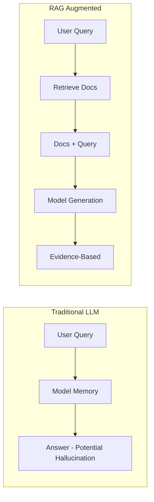
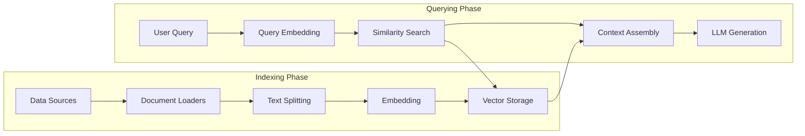

## What is RAG?

Retrieval-Augmented Generation (RAG) is a technical paradigm that enhances the output quality of large language models through **external knowledge retrieval**. Put simply:



In enterprise scenarios, RAG solves two core pain points of LLMs:
- **Knowledge Updates**: No need to retrain the model; simply update the knowledge base.
- **Hallucination Control**: Answers are based on real documents and can be traced and verified.

## System Architecture

A complete RAG system includes the following pipeline:



### Core Components Explained

**1. Document Loaders**

Supports data ingestion across various formats:

```python
from langchain_community.document_loaders import (
    PyPDFLoader,
    UnstructuredMarkdownLoader,
    CSVLoader,
    WebBaseLoader
)

# Load PDF
loader = PyPDFLoader("company_report.pdf")
docs = loader.load()

# Load Webpage
web_loader = WebBaseLoader("https://docs.example.com")
web_docs = web_loader.load()
```

**2. Text Splitting Strategies (Semantic Chunking)**

The chunking strategy dictates the upper ceiling of RAG recall. In 2026, enterprise RAG has abandoned brute-force length splitting, which easily severs context, completely pivoting to **Semantic Chunking**.

The underlying algorithm logic is:
1. Initially split the document into minimum units (e.g., sentences).
2. Calculate the Embedding cosine similarity between adjacent sentences.
3. If the similarity is higher than a set threshold (or lower than a percentile breakpoint), the semantic flow is considered continuous, and they are merged into a larger chunk. Otherwise, a "split" is asserted there.

```python
from langchain_experimental.text_splitter import SemanticChunker
from langchain_openai import OpenAIEmbeddings

# Using a semantic similarity sliding window splitter
semantic_splitter = SemanticChunker(
    OpenAIEmbeddings(model="text-embedding-3-small"),
    breakpoint_threshold_type="percentile", # Split when encountering a semantic shift (top 95% difference)
    breakpoint_threshold_amount=95
)
chunks = semantic_splitter.create_documents([raw_text])
```
*This chunking methodology ensures that every Chunk is a complete semantic cluster internally, completely eliminating the disaster of "half a sentence being cut into the next chunk."*

**3. Choosing an Embedding Model**

Comparison of mainstream Embedding models in 2026:

| Model | Dimensions | MTEB Score | Chinese Support | Cost |
|------|------|-----------|----------|------|
| OpenAI text-embedding-3-large | 3072 | 64.6 | ✅ Good | $0.13/1M |
| Cohere embed-v4 | 1024 | 66.2 | ✅ Excellent | $0.10/1M |
| BGE-M3 (Open Source) | 1024 | 63.8 | ✅ Optimal | Free |

For Chinese-heavy scenarios, **BGE-M3** or **Cohere embed-v4** are recommended.

## Vector Database Architecture & Low-Level Tuning

In an enterprise environment with hundreds of millions of vectors, choosing a DB is just the first step. True hardcore engineering lies in **HNSW (Hierarchical Navigable Small World) index parameter tuning** and **Product Quantization (PQ)** compression. Without tuning, full Float32 vectors will overflow extremely expensive RAM.

### HNSW Core Parameters Demystified and Trade-offs

If you self-host Weaviate or Milvus, you must master the following two low-level control parameters:

| Parameter | Physical Meaning | Impact on Memory & Performance | Impact on Recall |
|------|----------|----------------|----------------------|
| `m` (Max Connections) | The maximum number of bidirectional edges per node in the graph. | **Dictates Memory Overhead**: The larger `m` is, the more edges are stored, leading to a linear explosion in RAM usage. | Larger `m` yields a denser graph, logarithmically improving recall (with rapid diminishing returns). |
| `efConstruction` | The depth of the candidate queue explored during neighbor search when inserting into the index. | **Dictates Build Time**: Does not directly increase memory size, but doubling this parameter can slow down data ingestion by 4x. | Higher values yield a more optimized graph topology, significantly improving concurrent query speeds and maximum recall. |

**Enterprise Best Practice**:
If budget constraints prevent keeping all vectors in memory, you must enable **IVF-PQ (Inverted File + Product Quantization)**. It compresses 3072-dimensional floats into 8-bit cluster centroid IDs, reducing memory footprint by ~90%, at the cost of roughly a 3-5% recall drop (which can be compensated by a precise post-retrieval Rerank).

### Retrieval Strategy

```python
from langchain_community.vectorstores import Weaviate
import weaviate

# Connect to the vector database
client = weaviate.Client(url="http://localhost:8080")

# Create retriever (Hybrid Search = Vector + BM25 Keywords)
retriever = vectorstore.as_retriever(
    search_type="mmr",       # Maximal Marginal Relevance
    search_kwargs={
        "k": 5,              # Return 5 results
        "fetch_k": 20,       # Candidate pool size
        "lambda_mult": 0.7,  # Relevance vs. Diversity weight
    }
)
```

## Optimization Techniques

### 1. Query Rewriting

User queries are often not precise enough. Rewriting them via LLMs can improve the retrieval hit rate:

```python
# Multi-query rewriting: Expand one question into multiple angles
query = "How to optimize a RAG system?"
rewritten = [
    "Methods for optimizing RAG retrieval quality",
    "Techniques to improve vector search accuracy",
    "Best practices for RAG system chunking strategies",
]
```

### 2. Millisecond High-Concurrency Reranking (ColBERT v2 Late Interaction)

Traditional Rerankers (like BGE-Reranker or Cohere) utilize a **Cross-Encoder**. It concatenates the user's Query and the candidate Document into a single sequence and feeds it into the Transformer. This is the most accurate method, but its computational complexity is O(N). If you retrieve 100 Chunks for reranking, it adds hundreds of milliseconds or even a full second of extreme latency, causing direct timeouts in production APIs.

The standard architecture for 2026 is the **Late Interaction Architecture** utilized by **ColBERT v2 (e.g., Flash-Reranker)**:

- It **pre-computes** all Documents offline into microscopic Token-level Multi-vectors and caches them.
- When a Query arrives, it only performs a lightweight `MaxSim` (maximum cosine similarity summation) dot-product matrix operation between the Query and Document tokens.
- **Result**: It maintains extreme precision remarkably close to Cross-Encoders, but latency plunges from 300ms down to 15-40ms, making "fine-ranking" of massive document pools plausible in production environments.

### 3. Context Assembly

Inject the retrieved document snippets structurally into the prompt:

```text
Answer the user's question based on the following reference documents. If the information is not in the documents, state clearly that you do not know.

--- Reference Documents ---
[1] {chunk_1_content} (Source: report.pdf, Page 3)
[2] {chunk_2_content} (Source: docs.md, Section 2.1)
[3] {chunk_3_content} (Source: faq.html)
--- End of Documents ---

User Question: {user_query}
```

### 4. Advanced RAG Architectures

Enterprise RAG in 2026 has moved far beyond simple "text chunking + vector search." To handle complex, long documents and cross-document reasoning, the following advanced architectures are standards:

- **Multi-Vector Retrieval**: Summarize the documents and create embeddings of the **summaries** for search, but inject the **full original text chunks** into the prompt. This ensures high search precision while retaining deep context.
- **HyDE (Hypothetical Document Embeddings)**: Instead of searching with a short user query, have the LLM hallucinate a "hypothetical answer" first. Then, use the **embedding of that fake answer** to search the vector database for real documents. This drastically mitigates the Vocabulary Mismatch problem between short questions and long technical documents.
- **GraphRAG (Knowledge Graph RAG)**: For macro-global questions like "Summarize the risk factors across all products in Q3", pure vector search will always fail due to Top-K limits, because the answer is scattered across hundreds of fragmented docs.
  - **Extraction Engine**: Utilize `instructor` or Pydantic representations to constrain the LLM, coercing it to extract `(Entity_A, Relationship, Entity_B)` triplets and ingesting them into Neo4j.
  - **Community Detection**: Invoke Python's `NetworkX` library to run the **Hierarchical Leiden Algorithm**. This algorithm mathematically clusters tens of thousands of nodes into densely connected "Communities" based on graph network connectivity.
  - **Map-Reduce Macro Reasoning**: The LLM pre-summarizes each clustered "Community". When faced with a global narrative query, RAG performs a Map-Reduce aggregation directly over these high-level community summaries rather than fighting with isolated raw chunks.

### 5. Automated RAG Quantitative Evaluation

Saying "the RAG feels inaccurate" doesn't help engineering teams iterate. Enterprise deployment requires quantitative metrics. We recommend frameworks like **[Ragas](https://github.com/explodinggradients/ragas)** or **TruLens**, which use LLM-as-a-Judge to score RAG systems across three dimensions:

1. **Context Precision**: Are the most relevant retrieved documents ranked at the very top? (Evaluates the retriever and re-ranker).
2. **Context Recall**: Do the retrieved documents contain all the necessary information to answer the question? (Evaluates chunking and indexing strategies).
3. **Faithfulness (Anti-Hallucination Index)**: Is the final answer generated by the LLM 100% deducible from the retrieved context? (Evaluates the generator's resistance to hallucinations).

**Evaluation Code Example**:
```python
from ragas import evaluate
from ragas.metrics import faithfulness, answer_relevancy, context_precision, context_recall
from datasets import Dataset

# Prepare Testset: Query, RAG Answer, Retrieved Contexts, Ground Truth
data = {
    "question": ["What is GraphRAG?"],
    "answer": ["GraphRAG combines knowledge graphs and vector search..."],
    "contexts": [["Chunk 1...", "Chunk 2..."]],
    "ground_truth": ["GraphRAG is an architecture that utilizes graph structures for global reasoning..."]
}

# Run automated scoring
result = evaluate(
    Dataset.from_dict(data),
    metrics=[context_precision, context_recall, faithfulness, answer_relevancy]
)
print(result) # Outputs specific scores between 0 and 1 for each metric
```
*Run this evaluation script every time you modify chunking strategies or swap Embedding models. Deploy changes only if the scores (especially Faithfulness) strictly improve or remain perfectly stable.*

## Frequently Asked Questions

- **Inaccurate Retrieval**: First check the match between your splitting strategy and the Embedding model.
- **Hallucinations in Answers**: Emphasize in the prompt to "answer solely based on the provided documents."
- **High Latency**: Consider caching retrieval results for popular queries and using Flash-Lite to reduce LLM latency.
- **High Costs**: Pre-compute Embeddings for static documents, and only process incremental data in real-time.
