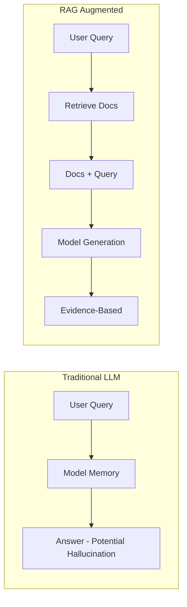
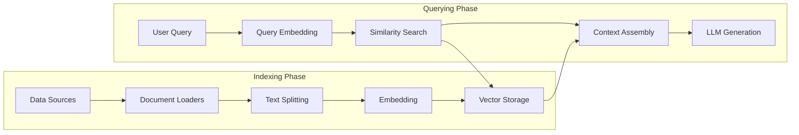

## What is RAG?

Retrieval-Augmented Generation (RAG) is a technical paradigm that enhances the output quality of large language models through **external knowledge retrieval**. Put simply:



In enterprise scenarios, RAG solves two core pain points of LLMs:
- **Knowledge Updates**: No need to retrain the model; simply update the knowledge base.
- **Hallucination Control**: Answers are based on real documents and can be traced and verified.

## System Architecture

A complete RAG system includes the following pipeline:



### Core Components Explained

**1. Document Loaders**

Supports data ingestion across various formats:

```python
from langchain_community.document_loaders import (
    PyPDFLoader,
    UnstructuredMarkdownLoader,
    CSVLoader,
    WebBaseLoader
)

# Load PDF
loader = PyPDFLoader("company_report.pdf")
docs = loader.load()

# Load Webpage
web_loader = WebBaseLoader("https://docs.example.com")
web_docs = web_loader.load()
```

**2. Text Splitting Strategies**

The chunking strategy directly impacts retrieval quality. This is the most easily overlooked yet critical step in RAG:

| Strategy | Applicable Scenario | Characteristics |
|------|----------|------|
| Fixed-length splitting | General text | Simple and fast, but may break semantic meaning |
| Recursive character splitting | Structured documents | Splits by paragraph/sentence boundaries |
| Semantic splitting | Technical documents | Segments based on Embedding similarity |
| Document structure splitting | Markdown/HTML | Splits by heading hierarchies |

Recommended configuration:

```python
from langchain.text_splitter import RecursiveCharacterTextSplitter

splitter = RecursiveCharacterTextSplitter(
    chunk_size=512,       # 512 tokens per chunk
    chunk_overlap=64,     # 64 tokens overlap to retain context
    separators=["\n\n", "\n", ".", ";", " "],  
)
chunks = splitter.split_documents(docs)
```

> **Tips**: The choice of `chunk_size` should match the optimal input length of your Embedding model. For OpenAI's `text-embedding-3-large`, the optimal length is around 512 tokens.

**3. Choosing an Embedding Model**

Comparison of mainstream Embedding models in 2026:

| Model | Dimensions | MTEB Score | Chinese Support | Cost |
|------|------|-----------|----------|------|
| OpenAI text-embedding-3-large | 3072 | 64.6 | ✅ Good | $0.13/1M |
| Cohere embed-v4 | 1024 | 66.2 | ✅ Excellent | $0.10/1M |
| BGE-M3 (Open Source) | 1024 | 63.8 | ✅ Optimal | Free |

For Chinese-heavy scenarios, **BGE-M3** or **Cohere embed-v4** are recommended.

## Vector Database Selection

### Pinecone vs. Weaviate

| Feature | Pinecone | Weaviate |
|------|----------|----------|
| Deployment | Cloud Managed | Self-hosted / Cloud |
| Scalability | Auto-scaling | Manual configuration |
| Hybrid Search | ✅ Keyword + Vector | ✅ BM25 + Vector |
| Filtering | ✅ Metadata filtering | ✅ GraphQL |
| Free Tier | 100K vectors | Open source free |
| Best For | Quick Prototypes / SaaS | Enterprise / Complete control |

### Retrieval Strategy

```python
from langchain_community.vectorstores import Weaviate
import weaviate

# Connect to the vector database
client = weaviate.Client(url="http://localhost:8080")

# Create retriever (Hybrid Search = Vector + BM25 Keywords)
retriever = vectorstore.as_retriever(
    search_type="mmr",       # Maximal Marginal Relevance
    search_kwargs={
        "k": 5,              # Return 5 results
        "fetch_k": 20,       # Candidate pool size
        "lambda_mult": 0.7,  # Relevance vs. Diversity weight
    }
)
```

## Optimization Techniques

### 1. Query Rewriting

User queries are often not precise enough. Rewriting them via LLMs can improve the retrieval hit rate:

```python
# Multi-query rewriting: Expand one question into multiple angles
query = "How to optimize a RAG system?"
rewritten = [
    "Methods for optimizing RAG retrieval quality",
    "Techniques to improve vector search accuracy",
    "Best practices for RAG system chunking strategies",
]
```

### 2. Re-ranking

After retrieving candidate documents, re-rank them using a Cross-Encoder:

```python
from langchain.retrievers import ContextualCompressionRetriever
from langchain.retrievers.document_compressors import CohereRerank

reranker = CohereRerank(model="rerank-v3.5", top_n=3)
compression_retriever = ContextualCompressionRetriever(
    base_compressor=reranker,
    base_retriever=retriever
)
```

### 3. Context Assembly

Inject the retrieved document snippets structurally into the prompt:

```text
Answer the user's question based on the following reference documents. If the information is not in the documents, state clearly that you do not know.

--- Reference Documents ---
[1] {chunk_1_content} (Source: report.pdf, Page 3)
[2] {chunk_2_content} (Source: docs.md, Section 2.1)
[3] {chunk_3_content} (Source: faq.html)
--- End of Documents ---

User Question: {user_query}
```

## Frequently Asked Questions

- **Inaccurate Retrieval**: First check the match between your splitting strategy and the Embedding model.
- **Hallucinations in Answers**: Emphasize in the prompt to "answer solely based on the provided documents."
- **High Latency**: Consider caching retrieval results for popular queries and using Flash-Lite to reduce LLM latency.
- **High Costs**: Pre-compute Embeddings for static documents, and only process incremental data in real-time.
