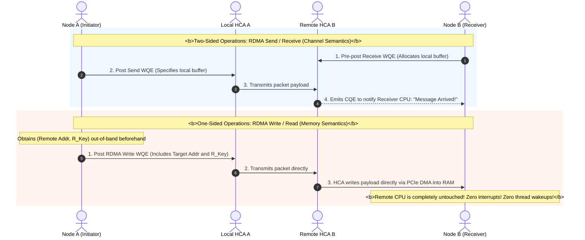
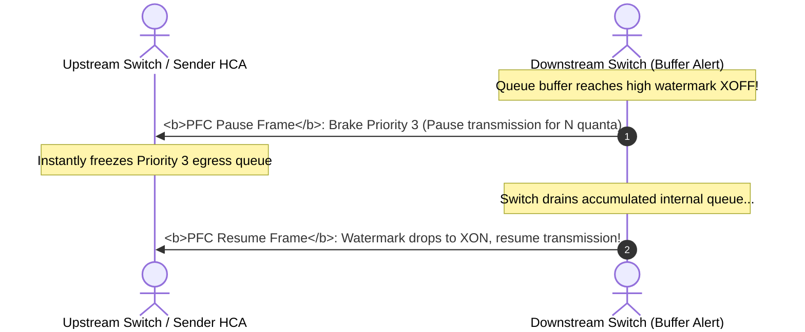
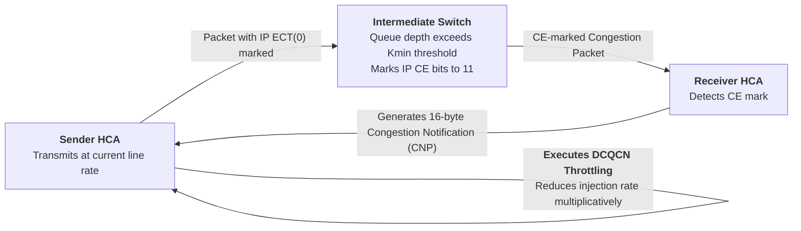

## Introduction: The "CPU Memory Wall" and Microsecond Latency Crisis at 400Gbps

In the traditional Linux TCP/IP networking stack, a packet arriving from the physical interface card must traverse a complex, multi-stage path:
1. The NIC triggers a hardware interrupt to notify the CPU;
2. The kernel device driver allocates an `sk_buff` and copies the packet into OS kernel memory;
3. The CPU executes TCP stack processing (checksum verification, parsing, stream reassembly);
4. The user application calls `read()`, triggering a context switch, and the CPU copies data a second time from kernel space to user-space memory.

At 1 Gbps or 10 Gbps speeds, this model operated reliably. However, in modern **400 Gbps and 800 Gbps hyperscale AI compute clusters**, the traditional paradigm hits a hard **"CPU Memory Wall"**:
- **Compute Black Hole**: As an empirical rule of thumb, processing 1 byte of TCP traffic consumes approximately 1 CPU clock cycle. At 400 Gbps line rate, a host must dedicate **40 to 50 CPU cores** solely to servicing network interrupts and copying memory!
- **Unacceptable Microsecond Latency**: End-to-end TCP latency typically hovers between 10 and 50 microseconds ($\mu s$). During large-scale distributed GPU All-Reduce synchronization across thousands of GPUs, latency jitter produces severe tail-latency amplification, starving costly GPU clusters.

To eliminate CPU copy bottlenecks and OS scheduling overhead, computer scientists developed a transformative paradigm: **RDMA (Remote Direct Memory Access)**.

---

## 1. RDMA First Principles: Kernel Bypass and Zero-Copy

The fundamental philosophy of RDMA boils down to two principles: **bypass the operating system kernel (Kernel Bypass), and do not involve either host's CPU (Zero-Copy)**.

```mermaid
flowchart TD
    subgraph TraditionalTCP["Traditional TCP/IP: Two CPU Copies + Multiple Interrupts"]
        AppA_Mem["User App A Memory"] -->|"CPU Copy 1"| KernelA["Kernel Socket Buffer (sk_buff)"]
        KernelA -->|"PCIe DMA"| NICA["Ethernet NIC A"]
        NICA -->|"Physical Ethernet"| NICB["Ethernet NIC B"]
        NICB -->|"Interrupt + PCIe DMA"| KernelB["Kernel Socket Buffer"]
        KernelB -->|"CPU Copy 2"| AppB_Mem["User App B Memory"]
    end

    subgraph RDMAPath["RDMA High-Performance Mode: Zero CPU Overhead + Microsecond Latency"]
        RDMA_AppA["User App A Memory"]
        HCA_A["RDMA NIC (HCA)"]
        HCA_B["RDMA NIC (HCA)"]
        RDMA_AppB["User App B Memory"]

        RDMA_AppA <== "Hardware PCIe DMA Read (Zero-Copy)" ==> HCA_A
        HCA_A <== "High-Speed Optical Link (< 1 microsecond)" ==> HCA_B
        HCA_B <== "Hardware PCIe DMA Write (Zero-Copy)" ==> RDMA_AppB

        RDMA_AppA -. "User-Space Doorbell (Kernel Bypass)" .-> HCA_A
    end
```



### 1.1 Kernel Bypass
Applications interact directly with the Host Channel Adapter (HCA) hardware using user-space libraries (e.g., `libibverbs` / DOCA):
- The OS kernel is invoked only once during **initialization and memory registration**;
- For actual data transfers, the user-space process rings a memory-mapped hardware register (**Doorbell**) on the HCA. The HCA ASIC independently executes the transfer with **zero OS context switches and zero system calls**!

### 1.2 Zero-Copy and Memory Registration (MR)
The HCA hardware reads from and writes directly to physical RAM (or GPU High Bandwidth Memory, HBM) via PCIe DMA without buffering in kernel memory:
- **Page Pinning**: The RDMA driver invokes `mlock()` to lock registered virtual memory pages into physical RAM, forbidding the OS from swapping them out to disk;
- **Address Translation Caching**: The virtual-to-physical page table is cached directly on the HCA ASIC;
- **Protection Keys**: The HCA generates a Local Key (`L_Key`) for local access control and a Remote Key (`R_Key`) to authorize remote HCAs to execute DMA transfers directly into that memory segment.

---

## 2. RDMA Software Architecture and the Verbs Programming Model

In RDMA, the core abstraction is not a socket, but a **Queue Pair (QP)**.

```
RDMA Core Architecture Abstraction:
+-------------------------------------------------------------+
|                     Host Channel Adapter (HCA)              |
|                                                             |
|   +----------------------- Queue Pair (QP) ---------------+ |
|   |  Send Queue (SQ)   : Post Work Requests (WQE)          | |
|   |  Receive Queue (RQ): Post Receive Work Requests (WQE)  | |
|   +-------------------------------------------------------+ |
|                                                             |
|   +---------------- Completion Queue (CQ) ----------------+ |
|   |  Completion Queue Elements (CQE): Hardware completion | |
|   |  status notifications                                  | |
|   +-------------------------------------------------------+ |
+-------------------------------------------------------------+
```

### 2.1 Two-Sided vs One-Sided Operations

RDMA provides two distinct communication semantics:



1. **Two-Sided Operations (Send / Receive)**:
   The receiver must **explicitly pre-post a receive buffer to its Receive Queue (RQ)** before the sender's packet arrives. The receiver's CPU is notified via a Completion Queue Element (CQE);
2. **One-Sided Operations (RDMA Write / RDMA Read)**:
   The sender specifies the remote virtual address and `R_Key`. The remote HCA **writes the data directly into memory via PCIe DMA, without the remote CPU ever being aware of the transfer!** This mode provides the lowest possible latency;
3. **Atomic Operations**:
   Supports hardware-level `Compare-and-Swap (CAS)` and `Fetch-and-Add (FAA)` across the network, enabling lock-free distributed synchronization.

---

## 3. Lossless Ethernet with RoCEv2: PFC and ECN/DCQCN Congestion Control

RDMA was originally conceived for native **InfiniBand (IB)** fabrics. To bring RDMA capabilities to ubiquitous Ethernet infrastructure, the industry established **RoCE (RDMA over Converged Ethernet)**:
- **RoCEv1**: Encapsulated directly within Layer 2 Ethernet frames; incapable of Layer 3 routing, now obsolete;
- **RoCEv2**: Encapsulates RDMA packets inside standard **UDP datagrams (destination port 4791)**, enabling Layer 3 IP routing.

```
RoCEv2 Packet Encapsulation:
+-------------------+----------------+---------------+--------------------+------------------+
| Ethernet Header   | IPv4 Header    | UDP Header    | RDMA Transport     | Application Data |
| EtherType: 0x0800 | ToS/DSCP (CoS) | DstPort: 4791 | (BTH 12B / AETH)   | (0 ~ 4096 bytes) |
+-------------------+----------------+---------------+--------------------+------------------+
```

### 3.1 The Vulnerability: Packet Loss Sensitivity and Go-Back-N Collapse
Unlike heavyweight TCP stacks with selective acknowledgments (SACK), RDMA HCA silicon relies on lightweight hardware logic. **RoCEv2 defaults to Go-Back-N retransmission**:
- If even a single packet is dropped, the receiving HCA discards all subsequent in-order packets, forcing the sender to retransmit the entire window from the lost packet onward;
- A packet loss rate as low as 0.1% causes RoCEv2 effective throughput to collapse by over 80%!
- **Takeaway**: Ethernet fabrics carrying RoCEv2 **must be engineered as strictly Lossless Networks**.

### 3.2 Engineering Lossless: Priority Flow Control (PFC, 802.1Qbb)

PFC segments a physical optical link into **8 independent virtual lanes (Priorities 0 through 7)**, typically dedicating Priority 3 to RoCEv2 traffic:



#### The Dangers of PFC: Deadlock and Storms
1. **PFC Deadlock**:
   When cyclic topologies or multi-path routing exist, Switch A pauses Switch B, Switch B pauses Switch C, and Switch C pauses Switch A in a circular chain. All buffers remain locked, **permanently freezing all traffic on that priority!**
2. **PFC Storm**:
   A malfunctioning HCA continuously emits Pause frames. The pause signals propagate upstream across switch hops, paralyzing the entire data center fabric.

### 3.3 Closing the Loop: ECN and the DCQCN Algorithm

To throttle transmission rates smoothly before PFC pause thresholds are reached, modern fabrics deploy **DCQCN (Data Center Quantized Congestion Notification)**:



- **Switch Stage (ECN Marking)**: When egress queue occupancy sits between $K_{min}$ and $K_{max}$, the switch probabilistically sets the IP ECN bits to `11` (Congestion Encountered, CE);
- **Receiver Stage (CNP Generation)**: When the receiving HCA encounters a CE-marked packet, it immediately dispatches a 16-byte **CNP (Congestion Notification Packet)** back to the source;
- **Sender Stage (Rate Backoff & Recovery)**: The transmitting HCA processes the CNP in hardware, multiplicatively reducing its transmission rate and recovering additively when subsequent packets arrive without congestion.

---

## 4. Production Verification Commands for RDMA

Verifying RDMA configuration on Linux hosts equipped with NVIDIA/Mellanox ConnectX smart NICs:

```bash
# 1. Inspect RDMA device status and firmware version
ibv_devinfo

# 2. Verify RoCE operating mode (Ensure RoCE v2 is selected)
cat /sys/class/infiniband/mlx5_0/ports/1/gid_attrs/types/3

# 3. Execute low-latency bandwidth benchmarks (Server and Client)
# Server node:
ib_write_bw -d mlx5_0 -i 1 -F --report_gbits
# Client node:
ib_write_bw -d mlx5_0 -i 1 -F --report_gbits 192.168.10.20

# 4. Monitor hardware PFC pause frames and packet drops
ethtool -S eth0 | grep -E "pfc|pause"
```

---

## 5. Summary and Next Steps

By combining Kernel Bypass, Zero-Copy DMA, and Queue Pairs, RDMA frees CPU cores from transport overhead. RoCEv2 couples this efficiency with PFC and ECN to deliver lossless transport over standard Ethernet.

However, in massive 10,000-GPU distributed training environments, RoCEv2 still requires careful compromises:
- **PFC Complexity**: Reactive hop-by-hop pause frames carry deadlock risks and require intricate queue threshold tuning;
- **Ethernet Packet Overhead**: Variable scheduling and standard Ethernet frame overhead introduce tail latency at scale;
- **The Dedicated High-Performance Alternative — InfiniBand (IB)**:
  How does InfiniBand achieve **zero-deadlock, physically guaranteed lossless transport with sub-microsecond latency** using hardware credit-based link flow control and centralized Subnet Managers?
  How do link rates scale from HDR 200G to NDR 400G and the 2026 generation of XDR 800G?

In Chapter 10 of our masterclass, we explore dedicated high-performance fabrics: **[InfiniBand Architecture First Principles: Physical Link Rates, Credit-Based Link Flow Control, and Subnet Manager Fabric Orchestration](/en/articles/infiniband-architecture-hardware-rates-credit-flow-subnet-manager/)**!

---

## Frequently Asked Questions (FAQ)

### Q1: What causes PFC Deadlock, and how do modern lossless fabrics prevent it?
**The fundamental cause is circular dependency in buffer wait graphs.**
When network topologies or multipath routing create buffer loops, circular dependencies can emerge. Switch 1's queue fills and sends a Pause frame to Switch 2; Switch 2 pauses Switch 3; and Switch 3 pauses Switch 1. Every switch waits for downstream buffers to clear while holding upstream traffic, freezing the priority class entirely.
**Prevention strategies**:
1. **Strict Loop-Free Topologies**: Enforce directed acyclic routing (no spine-to-spine or leaf-to-leaf links) in Clos topologies;
2. **PFC Deadlock Detection and Recovery (PFD)**: Hardware watchdogs on NICs and switches detect when a queue is paused beyond a configured time threshold (e.g., several hundred milliseconds). The hardware temporarily drops queued packets on that interface and resumes forwarding to break the dependency cycle.

### Q2: Why do One-Sided operations (RDMA Write/Read) achieve higher throughput and lower latency than Two-Sided operations (Send/Receive)?
**The difference lies in receiver CPU and software stack involvement:**
- **Two-Sided (Send/Receive)**: The receiver's CPU must actively post Work Requests (WQE) to the Receive Queue (RQ) to replenish buffer descriptors. When a packet arrives, the HCA writes a completion entry (CQE) and triggers application handling, introducing lock contention and memory reclamation overhead;
- **One-Sided (RDMA Write/Read)**: Once the initiator has the remote target virtual address and authorized `R_Key`, both ends execute data transfers entirely via hardware PCIe DMA. **The target CPU is never interrupted, requires zero context switches, and incurs zero thread wakeups**, delivering wire-speed throughput and sub-microsecond latency.

### Q3: What is the architectural difference between RoCEv2 and native InfiniBand at the link layer?
1. **Flow Control Mechanism**:
   - RoCEv2 runs over lossy Ethernet and relies on reactive **PFC Pause frames**, which react to congestion after buffers fill, carrying deadlock risks;
   - InfiniBand employs proactive **Credit-Based Link Flow Control**. A sender transmits only if it holds buffer credits explicitly granted by the receiver. If credits are zero, transmission halts before buffers fill, guaranteeing lossless operation at the physical layer;
2. **Header Overhead and Forwarding Latency**:
   - RoCEv2 incurs standard Ethernet, IPv4, and UDP headers (42 bytes minimum overhead), with typical switch latencies in the hundreds of nanoseconds;
   - InfiniBand uses lightweight Local Route Headers (LRH) and cut-through switching, keeping forwarding latency under 100 nanoseconds.
