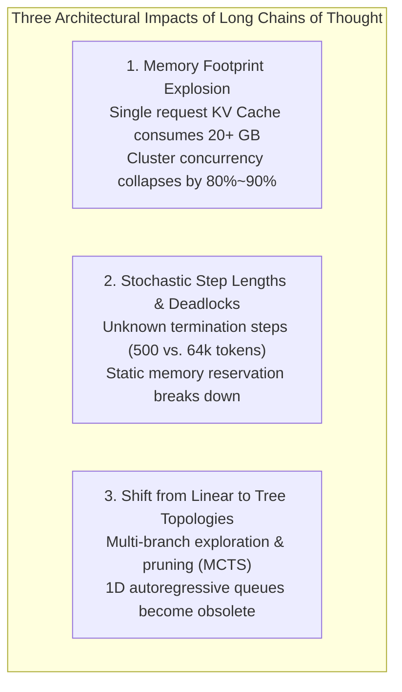
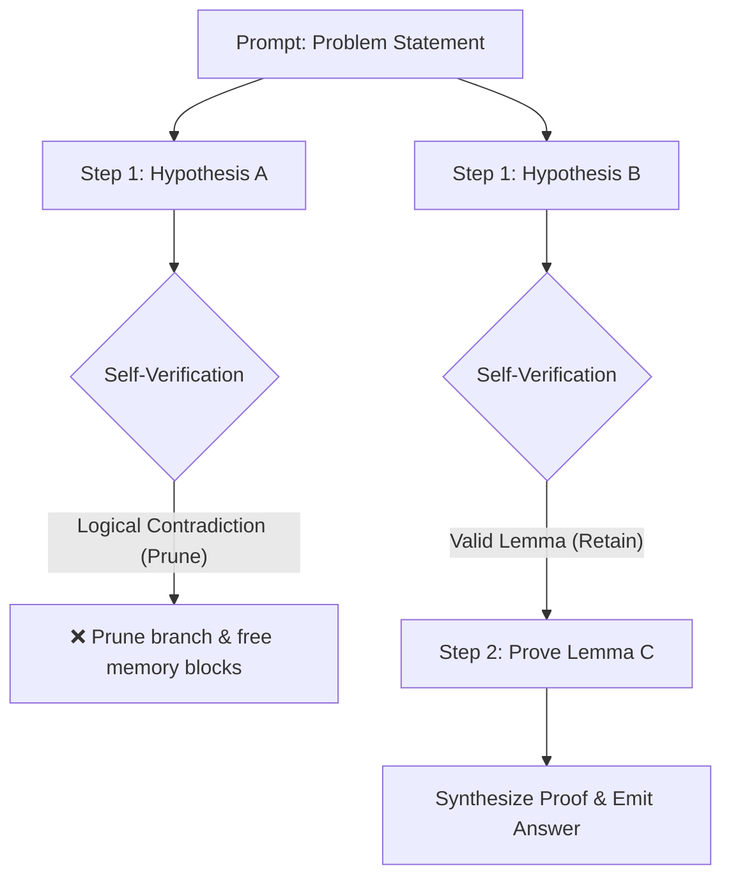
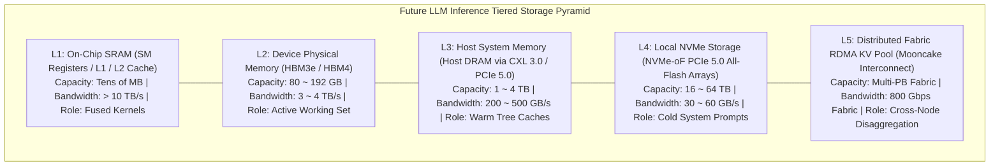
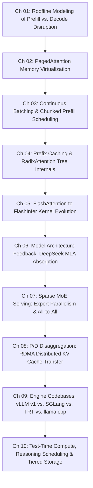

## Introduction: The Epochal Turning Point of Autoregressive Serving

Prior to 2024, the architecture of virtually every LLM serving system was constructed around an implicit assumption: **"Large input, short output."**

In traditional chatbots, search summaries, document QA, and code auto-completion, user prompts routinely spanned hundreds or thousands of tokens of context ($80\% \sim 95\%$ of aggregate sequence length), while generated answers rarely exceeded a few hundred tokens. Consequently, inference optimization gravitated heavily toward two engineering vectors: **"maximally saturating Tensor Cores during prefill (peak MFU)"** and **"streaming lightweight decode tokens smoothly."**

The emergence of extended reasoning models — spearheaded by **OpenAI o1/o3/o-series, DeepSeek-R1, and Moonshot Kimi K3** — permanently shattered this architectural foundation.

AI development has officially entered the era of **Test-Time Compute Scaling**:

```
The Dual Scaling Laws of Modern AI:
┌─────────────────────────────────────────────────────────────┐
│ 1. Pre-training Scaling Law:                                │
│    Scaling parameters, pretraining tokens & cluster FLOPs    │
│    -> Approaching physical data walls and power limits      │
├─────────────────────────────────────────────────────────────┤
│ 2. Test-Time Compute Scaling Law:                           │
│    Reinforcement learning, self-correction & search trees   │
│    -> Unlimited reasoning extrapolation at inference time   │
└─────────────────────────────────────────────────────────────┘
```

To solve complex competitive programming, advanced mathematical proofs, and intricate system designs, models no longer rush to emit immediate answers. Instead, they produce extensive explicit chains of thought (Thinking Processes). The model iteratively hypothesizes, tests steps, critiques its own logic, backtracks, and verifies conclusions:

- **Input Prompt**: Frequently a concise question of merely 200 tokens;
- **Autoregressive Generation (Thinking Tokens + Output)**: Surging to **$16,384 \sim 131,072$ (16k ~ 128k) tokens**!

**Generated outputs now exceed inputs by orders of magnitude!**
This complete inversion of traffic patterns undermines the fundamental design assumptions of PagedAttention and Continuous Batching runtimes.

In this tenth and final chapter of the **Production LLM Inference Engines** series, we analyze the physical impact of long-chain reasoning on systems infrastructure, derive emerging search-oriented schedulers, and construct the blueprint for cross-medium tiered storage across future inference clusters.

---

## 1. The Three Structural Pressures of Long Reasoning Chains



### 1.1 Memory Footprint Explosion: The KV Cache Avalanche

In [Chapter 01](/en/articles/inference-roofline-prefill-decode/) and [Chapter 02](/en/articles/pagedattention-memory-virtualization/), we established a foundational law: **Decode memory footprint scales strictly linearly with generated sequence length**.

Consider the memory footprint when a single request generates **64k (65,536) thinking tokens**:

Using **LLaMA-3-70B** (80 layers, 8 KV heads, 128 head dim, FP16 precision), the per-token KV footprint across all layers is $320 \text{ KB}$.
For a single request reasoning across 64k steps:
$$\text{VRAM}_{\text{req}} = 320 \text{ KB} \times 65,536 \approx 20.97 \text{ GB}!$$

**A single user session monopolizes nearly 21 GB of dedicated GPU HBM!**
On an 8x H100 node (640 GB total HBM, with ~500 GB remaining after weights), the cluster historically accommodated hundreds of concurrent streams. Under long reasoning workloads, **just 20 concurrent thinking sessions completely exhaust the memory pool.**

Serving concurrency drops by an entire order of magnitude, driving inference Total Cost of Ownership (TCO) upward exponentially.

### 1.2 Stochastic Step Lengths and Memory Deadlocks

Traditional summarization workloads exhibit predictable token distributions, allowing schedulers to forecast sequence lifespans reliably.

Reasoning models, however, display **stochastic termination steps**:
- Straightforward queries: The model concludes in 500 steps and emits `[EOS]`;
- Complex edge cases: The model encounters self-contradictions at step 15,000, triggering iterative self-corrections that expand execution out to the 64k or 128k ceiling.

Schedulers face an acute dilemma:
- **Aggressive Scheduling**: Admitting new queries when memory utilization reaches $90\%$. If several active sessions concurrently dive into deep reasoning, the memory pool exhausts within steps, forcing costly **preemptions and disk/CPU swaps**, cratering throughput;
- **Conservative Scheduling**: Reserving 64k tokens of memory headroom per active request. Average memory utilization hovers at a wasteful $15\% \sim 25\%$, leaving hardware severely underutilized.

### 1.3 Transitioning from Linear Sequences to High-Dimensional Tree Search

Advanced test-time compute scaling relies on search: Best-of-N sampling, Monte Carlo Tree Search (MCTS), beam expansion, and multi-agent debate. The inference runtime no longer evaluates an isolated 1D token sequence, but rather an evolving **reasoning tree**:



Treating each search path as an independent query duplicates shared prefix KV blocks redundantly across the cluster. Without native engine support for **dynamic branching, instant backtracking, and microsecond pruning garbage collection**, running search algorithms at scale remains computationally intractable.

---

## 2. Emerging System Paradigms for Reasoning Workloads

Serving reasoning models requires fundamental runtime innovations:

### 2.1 Speculative Decoding for Chains of Thought

Extended reasoning traces do not consist entirely of unpredictable leaps of intuition. Much of the token volume is dominated by structural derivations, mathematical transformations, code scaffolding, and standard self-reflection phrasing (e.g., *"Wait, let me review the previous step..."*). These transitional sequences exhibit low local token entropy.

Consequently, [Speculative Decoding](/en/articles/speculative-decoding-eagle-guide/) experiences a powerful resurgence:
1. **Domain-Specific Draft Models**: Using lightweight 1B~3B models fine-tuned on reasoning steps, or draft heads like **EAGLE-3** operating on the base model's internal hidden states;
2. **Multi-Token Acceptance**: High prediction agreement enables accepting 3~5 tokens per forward pass on deterministic reasoning steps, **compressing lengthy multi-minute thinking latencies by $3\times \sim 4\times$**.

```
Standard Autoregressive Reasoning:
[Decode 1] -> [Decode 2] -> [Decode 3] -> ... -> [Decode 64000] (High Latency)

Speculative Accelerated Reasoning:
[Draft Tree Proposes 5 Tokens] -> [Base Model Accepts 4 Tokens] (3x~4x Faster)
```

### 2.2 Branch-and-Prune Tree Schedulers

To support search algorithms natively, schedulers build directly on [RadixAttention state machines](/en/articles/prefix-caching-radix-attention-internals/), evolving into **Branch-and-Prune Tree Schedulers**:

- **Reference-Counted Tree Sharing**: Child exploration branches share parent PagedAttention memory blocks via shared reference counters;
- **Instant Garbage Collection on Pruning**: When a verification step detects a dead end, the scheduler decrements reference counts across that sub-tree within microseconds, immediately returning blocks to the active pool;
- **Copy-on-Write (CoW)**: Physical blocks diverge only when child paths sample distinct tokens.

### 2.3 Dynamic Thinking Budget Governors

In multi-tenant production clouds, engines must maintain service predictability.
Next-generation schedulers integrate **Dynamic Thinking Budget Governors**:
- Lightweight internal value-head probes evaluate entropy and convergence rates after each reasoning step;
- If the governor detects circular logic loops, it forces early termination signals into the sampling process, landing the query cleanly and preserving cluster capacity.

---

## 3. The Future Cluster Architecture: Tiered Memory Hierarchies

Long reasoning chains expose an inescapable economic reality: **relying exclusively on premium, capacity-constrained GPU HBM to retain entire context windows is economically and physically unsustainable.**

Inference infrastructure is shifting fundamentally — **from compute-centric clusters to unified, cross-medium tiered memory fabrics.**



### 3.1 The Five-Tier Storage Hierarchy

In this architecture, KV Caches transition from ephemeral tensors to managed data assets:

1. **L1 (On-Chip SRAM)**: Tiny capacity (tens of MB) dedicated to intermediate attention calculations via fused FlashInfer operators;
2. **L2 (Device HBM)**: Retains solely the **active decoding working set** (e.g., the most recent thousands of tokens);
3. **L3 (Host DRAM via CXL 3.0)**: Compute Express Link (CXL) expands host memory transparently to terabytes per server at hundreds of gigabytes per second, serving as an intermediate warm cache for tree branches;
4. **L4 (NVMe-oF All-Flash Arrays)**: Retains widely shared enterprise system prompt prefixes;
5. **L5 (Global Distributed RDMA KV Fabric)**: The high-speed fabric introduced in [Chapter 08 on P/D Disaggregation](/en/articles/pd-disaggregation-distributed-kv-cache/). Prefixes computed on any P-Worker transfer across the fabric in milliseconds to any available D-Worker.

### 3.2 Total Decoupling of Compute, Memory, and Fabric

Data center designs are moving away from monolithic server units:
- **Compute Slices**: High-density Tensor Core accelerators containing minimal onboard memory, dedicated to dense matrix arithmetic;
- **Memory Slices**: High-density memory pools consisting of pooled HBM and CXL memory, purpose-built to retain concurrent KV states;
- **Optical Interconnect Fabric**: Hybrid optical-electronic switches orchestrating dynamic pairings between compute units and memory pools within microseconds.

**The ultimate destination of LLM serving infrastructure is a global, distributed memory operating system.**

---

## 4. Closing the Circle: Ten Chapters of Systems Engineering

With this tenth chapter, the **Production LLM Inference Engines** handbook reaches its architectural completion:



Reflecting on the engineering journey across all ten chapters:
- We started from the unyielding physical realities of hardware (**Chapter 01** Roofline models and execution bottlenecks);
- Witnessed how software abstraction conquered physical memory fragmentation (**Chapter 02** PagedAttention);
- Explored the shift from coarse static slicing to iteration-level elasticity (**Chapter 03** Continuous Batching and **Chapter 04** Radix Trees);
- Examined microarchitectural SRAM tiling and customized GPU operators (**Chapter 05** FlashAttention and FlashInfer);
- Traced how algorithmic design evolved to accommodate system limits (**Chapter 06** MLA Latent Absorption and **Chapter 07** MoE Expert Parallelism);
- Escaped single-node hardware boundaries through line-rate networking and engine codebase optimizations (**Chapter 08** P/D Disaggregation and **Chapter 09** Engine Teardowns);
- Arriving finally at the horizon of Test-Time Compute and tiered memory fabrics (**Chapter 10**).

Regardless of how model architectures evolve in the decade ahead — from Transformers to state-space hybrids, from dense to sparse — **the fundamental engineering objective of pushing past physical hardware limits through hardware-software co-design remains the ultimate constant of AI systems engineering.**

May this handbook serve as an enduring foundation in your work building large-scale LLM infrastructure.

---

## Frequently Asked Questions (FAQ)

### Q1: Does Chunked Prefill become obsolete under extended reasoning models?
**No, but its operational role shifts.**
In traditional serving, Chunked Prefill prevents long prompts from blocking short decodes. In reasoning models where inputs are relatively short (e.g., 500~2,000 tokens), prompt-induced latency spikes are less severe. However, Chunked Prefill remains critical:
1. **Agent Tool Executions**: When a reasoning model executes external tools (e.g., running code, querying databases), large execution outputs (e.g., stack traces, database dumps) re-enter the model as large prefill chunks, requiring chunking to prevent HOL blocking;
2. **P-Worker Multi-Tenant Fairness**: Within disaggregated prefill tiers, chunking guarantees sub-second responsiveness for concurrent queries.

### Q2: Why does Speculative Decoding yield significantly higher speedups in reasoning workloads compared to standard text generation?
This divergence stems from the **local token entropy characteristics** of reasoning traces:
In creative writing or conversational tasks, token distributions are diverse (high entropy), resulting in lower draft acceptance rates ($50\% \sim 70\%$).
In reasoning tasks, the model engages in rigorous deductive logic, code generation, and formula derivations. These sequences contain predictable syntax structures, logical connectives, and LaTeX syntax. Specialized draft models predict these transitional structures with high fidelity ($80\% \sim 90\%+$ acceptance rates), enabling speculative trees to advance by multiple tokens per step and yielding dramatic $3\times \sim 5\times$ speedups.

### Q3: Does the adoption of CXL 3.0 memory pooling eliminate the need for expensive GPU HBM?
**No. CXL expands memory capacity; it does not replace HBM.**
The physical functions of both tiers remain distinct:
- **HBM remains indispensable**: HBM3e/HBM4 delivers **$3 \sim 4 \text{ TB/s}$** of memory bandwidth, which is essential to saturate high-throughput decode GEMV operations;
- **CXL 3.0 provides scalable capacity**: Over PCIe fabrics, CXL offers hundreds of gigabytes per second of bandwidth with low latency. While insufficient for active inner-loop attention execution, it provides an ideal tier for warm historical prefix blocks and dormant search branches.
Moving data dynamically between HBM and CXL enables serving massive concurrent long-context queries at manageable hardware costs.
