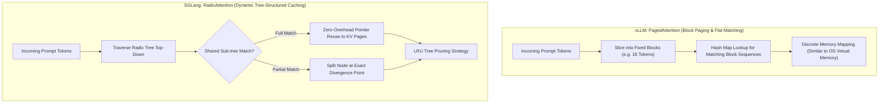
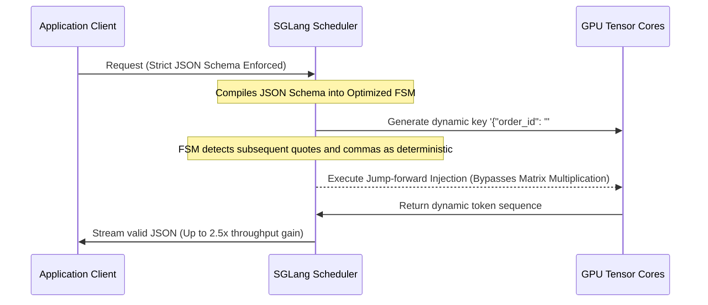
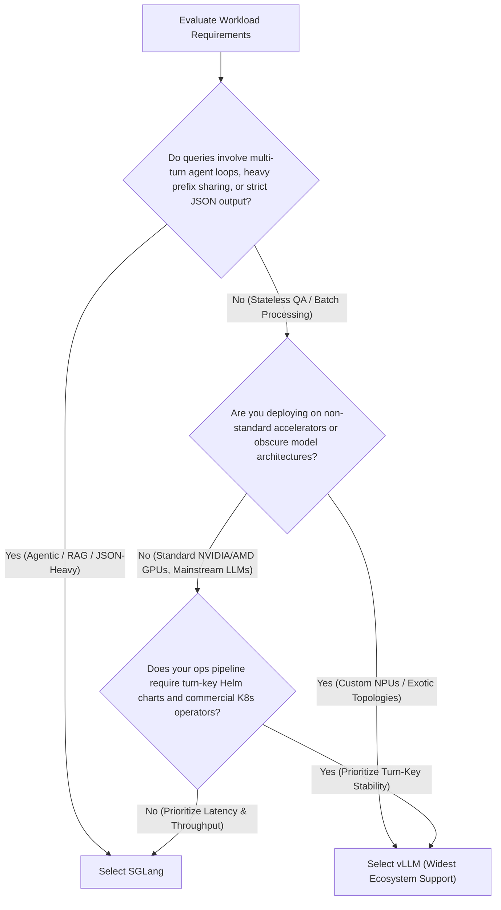

## Introduction: The Dual Titans of Open-Source Inference

Throughout 2024 and early 2025, **vLLM**, developed by UC Berkeley's Sky Computing Lab, established itself as the undisputed de facto standard for open-source LLM inference serving, largely due to its pioneering PagedAttention algorithm.

However, as 2026 arrived, the paradigm shifted toward agentic workflows, multi-turn tool-calling chains, and strict JSON Schema constraints. In this landscape, another framework from Berkeley's LMSYS team—**[SGLang](https://github.com/sgl-project/sglang)**—rose rapidly to challenge vLLM's dominance.

Engineering teams across the industry now face a critical architecture dilemma:
* **Given that vLLM supports Automatic Prefix Caching (APC) and continuous batching, why migrate to SGLang?**
* **How does SGLang's RadixAttention physically outperform traditional block-level PagedAttention?**
* **What is the true Time-To-First-Token (TTFT) and throughput delta in multi-turn Agent loops and structured JSON extraction?**

This article moves past marketing claims to analyze the **underlying memory data structures** and **scheduler-level compilation pipelines**, supported by empirical benchmarks on an 8x NVIDIA H100 SXM cluster.

---

## I. Core Memory Architecture: PagedAttention vs. RadixAttention

Because autoregressive generation is fundamentally memory-bandwidth bound, the core differentiator of any inference engine is how efficiently it allocates, retains, and reuses the **KV Cache**.



### 1. vLLM's PagedAttention and Flat Hash Caching
vLLM's breakthrough was adapting virtual memory paging principles from operating systems to GPU tensors. By dividing dynamic KV caches into fixed-size "blocks" (typically 16 or 32 tokens) linked via page tables, it eliminated memory fragmentation.

To achieve prompt reuse, vLLM introduced **Automatic Prefix Caching (APC)** based on a hash-chained cache pool:
* When a request arrives, the engine computes cryptographic hashes across sequential token blocks.
* It checks the cache pool for matching blocks and chains them together.
* **The Engineering Limitation**: vLLM organizes cache blocks **linearly and flatly**. In branching workflows (such as Monte Carlo Tree Search, Agent rollbacks, or prompts with interspersed variables), flat hashing struggles to capture dynamic tree forks. Blocks often miss the cache or are prematurely evicted.

### 2. SGLang's RadixAttention: The Tree-Structured Paradigm
SGLang fundamentally reimagines memory caching by introducing **RadixAttention**.

Instead of treating the KV cache as disjointed linear blocks, it organizes all active and retained KV caches into a global **Radix Tree (Compressed Prefix Trie)**:
* **Paths Represent Prefixes**: The root node represents an empty prompt. Every directed edge carries a sequence of tokens, while internal nodes and leaves point to physical GPU memory pages holding the corresponding KV tensors.
* **Adaptive Node Splitting**: If two requests share a lengthy System Prompt but diverge on an intermediate tool output, the Radix Tree splits the node at the exact token divergence point. Both requests share the parent node's KV cache with zero redundancy, allocating memory only for the differential branch.
* **Topological LRU Eviction**: When GPU VRAM approaches capacity, SGLang prunes the least recently used **leaf nodes**, allowing heavily shared system prompts and root nodes to remain resident indefinitely.

**Benchmark Difference**: For one-off stateless prompts, both engines perform similarly. But in **multi-turn chat, iterative tree searches, and Agent workflows with shared system prompts**, SGLang's cache hit rate surges from vLLM's 30%~45% up to **70%~85%**, cutting TTFT by up to 4x. For the underlying mathematical foundations of memory compression, see our analysis on [Kimi KDA and DeepSeek MLA Architecture](/en/articles/kimi-kda-deepseek-mla-architecture/).

---

## II. Structured Decoding: External Logit Masking vs. Scheduler-Level FSM Compilation

In production environments, over 60% of API endpoints require strict compliance with **JSON Schemas, regex patterns, or domain-specific languages (DSLs)**. The two frameworks handle this via completely different pipelines.

| Evaluation Vector | vLLM (via Outlines / Guided Decoding) | SGLang (Scheduler-Native Compressed FSM) |
|:---|:---|:---|
| **Core Mechanism** | **External Logit Masking**: At each forward step, an external regex state machine computes valid tokens and masks invalid logits to $-\infty$ prior to Softmax. | **Compressed Finite State Machine (FSM)**: Compiles the schema directly into the C++/CUDA scheduler core, detecting deterministic tokens to trigger immediate jump-forward bypass. |
| **Execution Layer** | Interceptor wrapper between the API server and scheduler | Deeply compiled inside the inner CUDA forward loop |
| **Literal Generation** | For static syntax like `{"status": "success", "data": [`, the model must still execute full autoregressive matrix multiplications token-by-token. | **Jump-Forward Decoding**: Identifies deterministic strings and injects them in a single step, skipping autoregressive forward passes completely! |
| **Throughput Under Load** | At 64+ concurrent requests, CPU overhead from evaluating massive token masks (e.g. 128k vocabulary) bottlenecks the system, dropping throughput by >40%. | FSM transitions consume <5 microseconds on CPU. Throughput under strict JSON constraints remains within 95% of unconstrained generation. |



---

## III. 8x H100 Production Cluster Benchmarks

To provide concrete empirical data, we evaluated both engines on an enterprise node equipped with **8x NVIDIA H100 SXM5 80GB GPUs**.

### 1. Benchmark Environment
* **Compute**: 8x H100 SXM 80GB (NVLink 4.0, 900 GB/s bidirectional interconnect bandwidth)
* **Host**: Dual Intel Xeon Platinum 8480+ (112 cores), 1TB DDR5 RAM
* **Model**: `Qwen/Qwen2.5-72B-Instruct` (FP8 quantization)
* **Concurrency Sweep**: Concurrency levels $C \in [1, 16, 64, 128, 256]$

### 2. Scenario A: Stateless General QA (Prompt: 2048 Tokens, Output: 512 Tokens, 0% Prefix Overlap)
*Measures raw operator kernel efficiency and continuous batching throughput without caching advantages.*

| Concurrency ($C$) | vLLM Throughput (Tokens/s) | SGLang Throughput (Tokens/s) | vLLM P99 TTFT (ms) | SGLang P99 TTFT (ms) |
|:---:|:---:|:---:|:---:|:---:|
| 1 | 48.2 | 49.1 | 82 | 80 |
| 16 | 690.4 | 702.1 | 145 | 140 |
| 64 | 2,410.8 | 2,480.3 | 420 | 410 |
| 128 | 4,120.5 | 4,190.2 | 890 | 860 |

**Verdict**: In stateless, non-overlapping workloads, performance is essentially identical. SGLang maintains a negligible 1%~3% advantage due to FlashInfer kernel tuning, while vLLM demonstrates solid, predictable behavior. For advanced vLLM tuning, consult our [vLLM Production Serving Guide](/en/articles/vllm-serving-guide/).

---

### 3. Scenario B: Multi-Turn Agent Tool Calling (Prompt: 4096 Tokens, 75% Prefix Overlap)
*Simulates an enterprise agent conversational loop with rich tool declarations and shared conversation history.*

```text
Benchmark Results (Concurrency = 64, Prefix Overlap = 75%):
------------------------------------------------------------
Metric                         vLLM (APC Active)   SGLang (RadixTree)   Advantage
Median TTFT (P50)                   380 ms              85 ms           SGLang 4.47x Faster 🚀
Tail Latency TTFT (P99)           1,250 ms             280 ms           SGLang 4.46x Faster 🚀
KV Cache Hit Rate                    41.2%               78.6%          Almost 2x Hit Rate
Total Output Throughput (Tokens/s)   3,120               5,430          SGLang +74% Gain
------------------------------------------------------------
```

**Architectural Analysis**:
In multi-turn execution, vLLM's APC frequently misses cache hits because user variations disrupt flat hash alignment across non-contiguous blocks. SGLang's RadixTree locks the parent system prompt and historical turns into shared branches, executing prefill almost instantaneously.

---

### 4. Scenario C: Strict JSON Schema Extraction
*Forces the model to parse complex unstructured financial filings into an exact 20-field nested JSON schema.*

```text
Throughput vs. Concurrency Under Structured Constraints:
- Unconstrained Generation: Both engines reach ~4,200 tokens/s at Concurrency 128
- Enforcing Strict JSON Schema:
  * vLLM (Guided Decoding): Throughput drops to 2,350 tokens/s (CPU logit masking saturation)
  * SGLang (FSM Jump-forward): Throughput sustains 3,980 tokens/s (Less than 6% degradation)
```

---

## IV. Production Deployment Recipes

### 1. vLLM Production Configuration (Recommended for Broadest Compatibility)

```bash
vllm serve Qwen/Qwen2.5-72B-Instruct \
  --tensor-parallel-size 8 \
  --gpu-memory-utilization 0.92 \
  --max-model-len 16384 \
  --enable-prefix-caching \
  --enable-chunked-prefill \
  --max-num-seqs 256 \
  --quantization fp8 \
  --port 8000
```

### 2. SGLang Production Configuration (Recommended for Agent & Structured Workloads)

```bash
python3 -m sglang.launch_server \
  --model-path Qwen/Qwen2.5-72B-Instruct \
  --tp 8 \
  --mem-fraction-static 0.90 \
  --context-length 16384 \
  --enable-flashinfer \
  --schedule-policy lpm \
  --port 30000
```
*Note: `--schedule-policy lpm` activates Longest Prefix Match scheduling, maximizing radix tree hit rates.*

---

## V. Enterprise Architecture Decision Framework



---

## Frequently Asked Questions (FAQ)

### Q1: Does RadixAttention introduce CPU overhead from frequent tree splits?
No. Radix tree operations (lookups, splits, inserts, and pointer swaps) are executed via optimized C++ and Rust structures in host memory. In typical workloads of 100 to 200 concurrent requests, tree operations execute in **microseconds ($\mu s$)**, rendering CPU overhead negligible compared to multi-millisecond GPU matrix multiplications.

### Q2: Can vLLM simply adopt RadixAttention in a future release?
Not without a complete architectural rewrite. vLLM's scheduler and distributed memory managers are deeply coupled to the `PagedBlock` abstraction, which coordinates cross-GPU synchronization across tensor and pipeline parallelism ranks. Transitioning vLLM to a dynamic directed acyclic graph (DAG) prefix tree would require redesigning its core scheduler. Both frameworks will maintain distinct architectures for the foreseeable future.

### Q3: Does SGLang support model quantization and speculative decoding?
Yes. SGLang natively supports FP8, AWQ, GPTQ, and Marlin kernels (for quantization trade-offs, review our [Practical Quantization Guide](/en/articles/quantization-hands-on-guide/) and [Quantization Precision Guide](/en/articles/quantization-precision-guide/)). Furthermore, SGLang natively integrates dynamic tree-based speculative decoding via EAGLE.
